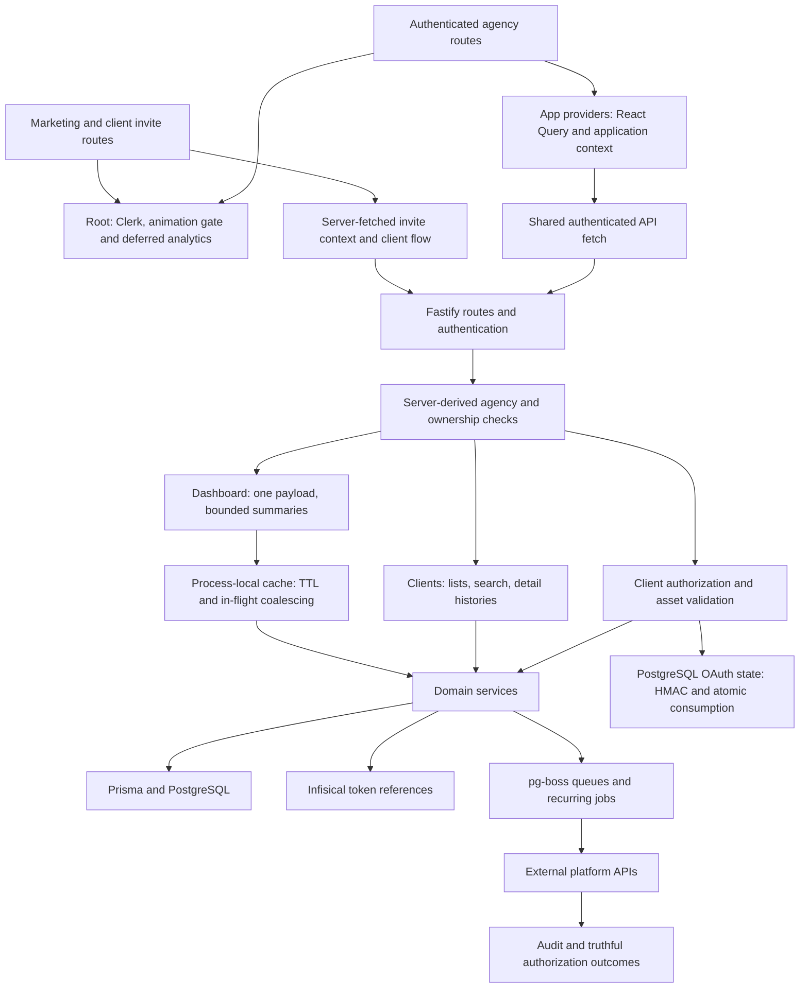

# AuthHub performance and codebase audit

Inspected October 1, 2026. Checkout: `codex/authhub-polish`, starting commit `144e70f966f5ed5cd6e48c54c5ff189c2fbc68e0`. This is a local code/measurement audit, not a production performance certification.

## Live first-login finding — October 1

The business Render account confirms the production `agency-access` service uses one **free** instance. Two real owner login sessions coincided with API startup. First startup listened at 21:07:34 UTC; the second at 21:32:29 UTC, following migration checks. The second browser sample remained loading beyond 50 seconds before these requests reached the server. Both startup windows show a Dashboard 401 followed by a successful retry. The 401 cause has not been established.

Warm authenticated browser reloads took approximately **1.0–1.5 seconds** in three samples. Warm Dashboard server processing took **3.3–97.2 milliseconds**. These are different measurements; server processing excludes waiting for a sleeping service. The evidence strongly identifies cold hosting as the first intervention, while exact cold-login p95 and the full before/after benefit remain unproven.

Render documents free-service sleep after 15 idle minutes and approximately one-minute wakeup: https://render.com/docs/free. The rendered pricing table lists the lowest paid compute plan `0.5c-512mb` at **$7/month**: https://render.com/pricing. Proposal: upgrade only this API's compute, then repeat an idle first-login test. No hosting change or spending has occurred. A workspace subscription upgrade is unnecessary for this proposal.

A targeted local repair reuses the existing bounded authenticated fetch, adds cancellation and stage-specific failure measurements, and reads existing Server-Timing values. It prevents indefinite unbounded request waits; it does not remove cold-start latency. It remains undeployed.

**Release boundary:** deployed main is `2a789c6`, substantially newer than the original `144e70f` checkout. Current main uses Node 24 and newer telemetry dependency alignment. Earlier local Node 22/dependency changes are superseded and must not be published over main. The Dashboard repair is isolated at `/Users/jon.high/.codex/worktrees/dashboard-first-login/agency-access` to preserve current production changes.

Evidence: `dashboard-first-login-live.json`, `dashboard-server-observations.json`, `dashboard-second-cold-login.json`, and `dashboard-live-ready.jpg`. Browser samples include driver/observation overhead. No customer identifiers or credentials were persisted in log evidence.

## Executive finding

The strongest immediate opportunity is less work, not a replacement architecture. AuthHub already consolidates dashboard requests, shares agency queries, dynamically loads some settings/connection dialogs, defers analytics, and uses PostgreSQL for durable jobs and OAuth state. Preserve these strengths and extend existing patterns.

The investigation found specific redundant work, unreliable checks, incorrect queue setup, and maintenance risks. It did not establish that every route is slow or that a framework/database rewrite would help. Current production p95, field Core Web Vitals, customer-scale query plans, remain incompletely measured; the live first-login evidence above supersedes the original browser gap. Fresh matched production builds now establish the route-entry JavaScript byte changes below.

One controlled workload improves by 20 times in source-call count: 20 simultaneous cold reads of one cache key now invoke the source once rather than 20 times. That is 95% less source work. The timer samples do not establish a latency speedup.

## Architecture and cost map



Primary authority: `apps/api/src/index.ts`, `apps/api/src/lib/authorization.ts`, `apps/api/src/services/oauth-state.service.ts`, `apps/api/src/lib/pg-boss.ts`, `apps/api/prisma/schema.prisma`, `apps/web/src/app/layout.tsx`, and `apps/web/DESIGN_SYSTEM.md`. Shared contracts live in `packages/shared/src`. `apps/docs` and `tools/authhub-cli` are separate workspace surfaces.

The workspace context named Redis/BullMQ despite the current PostgreSQL implementations. This audit corrected those two statements. Historical roadmap/status files do not establish current product priorities.

## Ranked findings

Confidence concerns the mechanism, not an unmeasured production benefit. Priority is the recommended engineering order for this request.

| Priority | Finding and evidence | Cost or risk | Decision |
| --- | --- | --- | --- |
| P0 | `scripts/perf/benchmark-api.mjs` previously accepted error responses without validating HTTP or payload success | Fast 401/500 or error envelope could falsely satisfy a speed budget | Fixed validation, argument checks and bounded fetches; pure fixtures pass |
| P0 | `scripts/perf/benchmark-browser.mjs` persisted the bootstrap URL carrying a session token | Reports/traces could expose usable session credentials | Fixed URL stripping and token redaction before report/trace/error output |
| P0 | `.githooks/pre-push` ran Entire before a second gate without preserving stdin; the second gate also ran Entire | A consuming first hook could hide the pushed main reference from the build check | Fixed one direct delegation; consuming-hook regression proves forwarding and failure propagation |
| P1 | `apps/api/src/lib/cache.ts` launched each cold same-key source read separately | Concurrent dashboard/agency reads multiply downstream work; invalidated old reads could repopulate cache | Fixed shared in-flight work with identity-based invalidation; no permanent generation map |
| P1 | `apps/api/src/lib/job-handlers.ts` bypassed existing refresh helper; structured `REFRESH_RETRYABLE` returned successfully | Jobs had no retry policy and transient upstream failure could wait for a later 12-hour scan | Fixed helper reuse and throwing retryable outcomes after one audit |
| P1 | `apps/api/src/lib/pg-boss.ts` omitted `cleanup-agent-operations` from ensured queues | Retention worker/schedule depends on a queue that startup did not ensure | Added missing queue; focused registration check passes |
| P1 | Marketing layout mounted an animation gate already present in root layout | Duplicate timers, frames and global lifecycle events on marketing routes | Removed duplicate mount and obsolete alias |
| P1 | Clients/Dashboard/New Request eagerly imported dialogs absent from initial view | Dialog code enters the initial route dependency graph | Deferred imports; behavior/typechecks pass; Matched production builds show 1.49–7.34% fewer estimated gzip bytes for the three affected route entries |
| P2 | `client.service.ts` client list uses tenant-filtered case-insensitive substring search, nested relations and exact count; `schema.prisma` lacks a corresponding search index | Larger tenants can incur scans, sorts, count and relation costs | Measure selectivity and SQL plans before any index/schema or contract change |
| P2 | Client detail retrieves all related request/connection history | Query/payload/render work grows with lifetime history | Measured up to 1,000 synthetic requests; moved tenant filtering before history load. Further pagination needs an explicit contract |
| P2 | Dashboard cache remains process-local | One instance cannot invalidate another instance's entry | Confirm deployed instance count and freshness requirements before adding coordination |
| P2 | Refresh scan loads all eligible authorizations and uses concurrent enqueue operations | Large scans can saturate database/queue resources | Measure scan/enqueue volume; batch only when justified |
| P2 | Non-dashboard layout starts agency lookup, then onboarding lookup, with subscription in parallel | Extra background requests and redirect delay; layout does not block rendering | Trace actual cold navigation before changing auth/onboarding contracts |
| P2 | Root Clerk/provider startup and immediate lazy-auth-button imports span public routes | Potential shared JavaScript/third-party overhead | Isolated public startup loads 24 local scripts; real middleware/auth cost remains unverified. No provider relocation justified |
| P2 | Baseline had no general PR workflow running full tests/typechecks/builds | Narrow performance/functional smoke checks leave broad regressions uncovered | Deterministic aggregate and general CI workflow added locally; remote GitHub execution remains unverified |
| P3 | Four very large source files and repeated cross-layer contracts | More change coordination and harder debugging; no proven runtime penalty | Extract responsibilities during related work, not arbitrary line-count refactoring |

Large-file snapshot: shared `types.ts` 3,159 lines; client-auth `assets.routes.ts` 2,854; `access-request.service.ts` 2,423; `PlatformAuthWizard.tsx` 1,983. The first read-only inventory found 974 TS/TSX files across API (319), web (628), shared (11), and CLI (16), including tests. These counts describe this checkout and drift with edits; they are not quality scores.

## First implementation and measured result

The controlled cache workload calls the real `getCached` function with 20 concurrent cold reads, one key and a simulated 10 ms asynchronous source. Before modification: 20 source calls, 13 ms elapsed. After: one source call, 20 ms elapsed. Scheduling/noise and concurrent source execution make elapsed samples unsuitable for a speedup claim. The source-call ratio is deterministic and independently covered by a test.

Run it without Clerk, platform APIs, a database, or credentials:

```sh
npx tsx scripts/perf/benchmark-cache.ts
```

Coalescing remains per key and per process. Successful data caches as before; joiners remain cache MISS responses. Errors/rejections do not poison future retries. Exact/prefix invalidation detaches pending work. Old callers may finish with their original result, but their result cannot overwrite a newer cache entry.

Refresh jobs retain existing singleton keys, three retries and backoff. Provider reconnect outcomes remain terminal. A transient result now fails the job after recording one audit event, allowing pg-boss to retry it. The retention queue fix does not change its schedule or sanitization policy.

Frontend changes defer closed dialogs through existing `next/dynamic`, retain accessible loading status, and preserve the Save Template exit animation by retaining its module after first opening. The root animation gate remains unchanged.

## Browser build measurements

Matched fresh production builds keep dependencies and all other source constant, changing only the three clean route files from their original HEAD versions to the deferred-dialog versions. Metrics deduplicate each route's `entryJSFiles` from Next's client-reference manifest and sum raw/gzip sizes of the emitted static chunks. Gzip uses deterministic per-chunk compression. This estimates initial route-entry transfer, not actual wire bytes, parse time, navigation speed, or field Core Web Vitals. Both builds use Node 20.20.2, Next 16.3.6 and the corrected dependency graph; final application validation separately uses supported Node 22.

| Route | Raw bytes before / after | Gzip bytes before / after | Gzip reduction |
| --- | --- | --- | --- |
| Clients | 599,395 / 584,964 | 179,770 / 175,592 | 2.32% |
| Dashboard | 614,170 / 605,235 | 184,372 / 181,634 | 1.49% |
| New Access Request | 708,799 / 654,864 | 209,097 / 193,755 | 7.34% |

Artifacts: `route-bundles-before.json` and `route-bundles-after.json`. Reproduce the route-entry size inventory after a fresh build with `python3 scripts/perf/measure-route-bundles.py apps/web/.next`. Shared startup cost dominates these routes; that supports measuring root providers/third-party work next. Small measured gains are retained without calling them a tenfold browser speedup.

## Validation record

The detailed machine-readable record is in `validation.json`. The final aggregate command passed: 4,104 tests (21 intentional skips), all five workspace typechecks, application lint (0 errors; 184 existing warnings), shared/API/web/CLI builds, clean install, YAML parsing and diff checks. Remote GitHub execution and production behavior remain unverified.

Checks use the current checkout, including pre-existing dirty work; they do not certify a clean published commit. Baseline tests started while isolated work proceeded, so the first API run picked up a new queue assertion before its implementation. Final focused and full runs distinguish that expected red result from pre-existing failures.

Two broad test issues required investigation:

- API asset fixture expected catalog results but did not request the `catalog` kind. The fixture now requests all expected kinds; existing ownership/pagination assertions remain.
- Web Settings paid-plan count check timed out waiting for a cold lazy import under suite load. Its functional wait now allows five seconds; all count/assertion semantics remain. The real Meta asset-error regression also reproduced alone: the chooser stayed collapsed after an error. One added setter reopens it, preserving all pre-existing wizard edits; its 42-test suite passes.

The first web build failed before compiling routes because the installed Sentry graph could not resolve `@opentelemetry/instrumentation`. A clean `npm ci` and Node 20 build reproduced the same missing module. The repair adds a direct declaration of the already locked instrumentation version and its root lock entry; Sentry/Next versions do not change. Clean install, dependency resolution and production build then pass. The lock places instrumentation inside `@sentry/node`, but the hoisted `@sentry/node-core` peer cannot resolve it. This is a reproducible dependency-tree defect, not evidence against lazy imports. The direct peer/lock correction preserves all prior lock changes and monitoring behavior.

## Second local iteration

Twelve source-contract test suites read files or pure data but previously initialized jsdom. Per-file Node annotations remove that browser environment without changing assertions or the default environment for component tests. The matched 40-test workload took 3.87–5.34 seconds before and 1.92–2.07 seconds after, at four workers. All affected tests and a separate 13-test jsdom smoke suite pass. This does not establish a full-suite or two-worker CI speedup. Details: [web-test-environment.md](web-test-environment.md).

The isolated public-home browser probe loaded 24 local scripts in each of five fresh desktop contexts: 388,141 transferred bytes, 380,941 encoded-body bytes and 1,266,134 decoded bytes. Every sample rendered the expected heading with no page error. Median FCP/LCP was 204 ms, but the first sample took 1,172 ms. The test fulfilled prerendered HTML because the local middleware path did not return the document within its timeout; it blocked all external browser requests. These are preliminary simulated client measurements, excluding middleware, real auth, external scripts and production network costs. They do not verify CTA interaction, hydrated auth, actual route latency, or field Web Vitals. No provider relocation follows from this evidence. Artifact: [public-home-startup-local.json](public-home-startup-local.json). The owned server on port 3310 stopped after measurement.

The second iteration also seeded a private PostgreSQL fixture with 50, 500 and 5,000 clients, plus 101- and 1,000-request histories. Thirty service-call samples per case exposed one avoidable cost: foreign-agency detail queries loaded history before checking ownership. Adding the existing agency predicate to the first Prisma query reduced both foreign-history cases from five SQL queries to one while retaining the `null` response. All 51 focused service/route/security tests and API typecheck pass. Unchanged list/search timings shifted between passes, so the stable gain is query-count reduction, not a claimed latency ratio.

The authorized 1,000-history case still retrieves all history; its second-pass local p95 was 34.83 ms, excluding HTTP, authentication, providers and rendering. Equivalent ID-only search predicates scan the synthetic client table. These measurements support further representative monitoring rather than an immediate index or pagination change. Details and raw plans: [client-query-measurements.md](client-query-measurements.md). The private database stopped after measurement; no production schema changed.

## Public read observations

Two ordinary, unauthenticated endpoint checks supplemented the local audit. `authhub.co` returned HTTP 200 with a single 3.41 s TTFB / 3.62 s total sample. The known Render health URL timed out once at 15 s, then returned HTTP 200 in 0.95 s. The local frontend points at localhost; marketing scripts exposed no current backend origin. These samples do not establish a production outage, a representative latency distribution, or the currently configured authenticated API host. Confirm hosting/runtime and collect repeated controlled journey samples before release or infrastructure conclusions. JSON observations remain alongside this report.

## Safety and scope

No production database, provider consent, live performance load, deployment, paid service, or git publication occurred. No OAuth/token/auth/tenant/audit protection was removed. Existing dirty Meta UI, API environment/configuration, and lockfile changes remain separate from this work.

The baseline local runtime is Node 22.22.3. The initial repository/CI declared Node 20.x, but locked pg-boss 12.14.0 requires Node ≥22.12.0. Repository engine/lock metadata and all five CI Node setups now use Node 22, preserving job triggers and steps. README and production checklist agree. A clean Node 20 web build proved the dependency correction, not supported API runtime behavior. The final local application builds/checks use Node 22. Live hosting runtime/overrides remain unknown; no deployment occurred.

## Follow-on plan and stopping rule

[The implementation plan](../../plans/2026-10-01-authhub-performance-codebase-plan.md) defines five waves: proven local repairs; representative journey baselines; measured data work; measured browser startup work; and maintainability/CI improvements. Each wave has acceptance checks and explicit limits.

Stop speculative edits when no measured workload or behavior check justifies them. Do not replace the queue/cache/provider architecture or silently change pagination/search merely to claim breadth. First establish representative data and browser measurements, then choose the highest-cost path.

For external benchmarks, use the [Web Vitals](https://web.dev/articles/vitals) field guidance. For the browser and database hypotheses, follow [Next.js lazy-loading guidance](https://nextjs.org/docs/app/guides/lazy-loading) and [PostgreSQL EXPLAIN](https://www.postgresql.org/docs/current/using-explain.html). These sources support measurement methods; they do not prove AuthHub's current performance.
