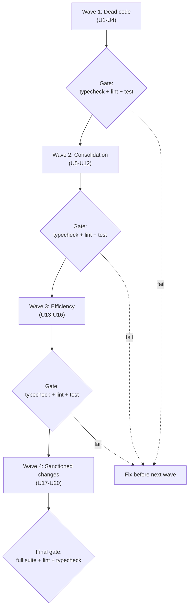

# Codebase Simplification Pass - Plan

## Goal Capsule

- **Objective:** Apply the findings of a full-codebase review pass (12 review agents, ~155 verified findings across `apps/api`, `apps/web`, `packages/shared`, `tools/authhub-cli`) as a behavior-preserving simplification program, executed in four risk-tiered waves.
- **Product authority:** The entire production codebase is in scope. The Google client offboarding plan (`docs/plans/2026-07-30-001-feat-google-client-offboarding-plan.md`) is separate work and is not touched by this pass except where findings overlap its files.
- **Stop conditions:** Stop a wave at its verification gate if typecheck, lint, or tests fail; fix before continuing. Surface (do not guess) any finding that contradicts live code or an institutional learning (Appendix B).
- **Execution profile:** Sequential waves, each ending at a verification gate. One theme per atomic commit. New behavior (U17, U18, U20) lands test-first per repo TDD rule.
- **Open blockers:** None. All product decisions were resolved during the review triage (see Key Decisions); all three deferred planning questions are resolved into KTDs.

---

## Product Contract

Product Contract preservation: changed: R4 (Pinterest clause) — planning research verified `pinterest.ts` is a live OAuth connector paired with a stub registry entry, not a manual flow; making the registry truthful now repairs the entry instead of converting the class. No other scope change.

### Summary

A four-wave simplification pass: delete dead code first, then consolidate duplicated logic onto existing helpers, then fix efficiency waste, then land a short sanctioned list of intentional behavior changes. Behavior is preserved everywhere except the sanctioned list (Waves 3–4: R13 token-health verification window, R14 write-frequency, R15 debounce/timing, R17, R18, R20). Each wave ends at a verification gate (typecheck, lint, tests).

### Problem Frame

A 12-agent review (3 lenses × 4 areas) surfaced ~155 findings: roughly 2,000+ lines of dead or duplicated modules, three verbatim copies of core auth helpers, five copies of a route guard, a Google connector family that never migrated to the existing `BaseConnector` + registry pattern, per-request hot paths doing duplicate or unbounded work, and a handful of latent defects hiding behind unsafe casts. The duplication has already drifted: three divergent platform→group maps disagree on edge platforms, and a copy-pasted tier array could silently diverge from the shared Zod schema. Left alone, every future change pays interest on these copies.

### Requirements

Requirements are grouped by wave. Waves execute in order; each wave's gate must pass before the next starts.

**Wave 1 — Dead code removal**

- R1. Delete modules verified to have zero non-test importers: `apps/web/src/lib/api-client.ts`, `apps/web/src/lib/api/billing.ts`, `apps/web/src/components/usage-widget.tsx` (plus its test), `apps/web/src/components/meta-connection-settings.tsx`, `apps/web/src/components/pinterest-connection-flow.tsx`, `apps/web/src/components/platform-connection-modal.tsx`, `apps/web/src/components/ui/animated-beam.tsx`, and `apps/api/src/routes/oauth-test.ts` with its registration in `apps/api/src/index.ts`. Re-verify zero importers by repo-wide grep immediately before each deletion.
- R2. Delete unused exports, props, and state verified non-consumed repo-wide: `sendConflict`/`sendUnauthorized`/`sendForbidden` (`apps/api/src/lib/response.ts`), `hasConnector`/`getAvailablePlatforms`/`getConfiguredPlatforms`/`hasPlatformConfig` (`apps/api/src/services/connectors/factory.ts`, `registry.config.ts`), the four test-only exports in `apps/web/src/lib/transform-platforms.ts` (coordinate with `CreateRequestModal.tsx` reuse, R11), `upgrade-modal.tsx` `currentTier` prop and its five pass-sites, dead props on `platform-connection-modal.tsx`/`pricing-tier-card.tsx`/`health-badge.tsx`, `stepDurations` state in `unified-onboarding-context.tsx`, and the ESLint-confirmed unused-imports/locals cluster across `apps/web/src/components/` and `apps/web/src/lib/`.
- R3. Delete dead branches and scaffolding: the discarded `useUser()` call (`access-requests/new/page.tsx`), the unreachable `??` fallback in `PlatformAuthWizard.renderStepContent`, the four `AssetSelectorDisabled` guards made unreachable by the case-2 early return, the always-false cross-agency guard in `client-offboarding.service.ts` (the `GoogleNativeGrant` model has no `agencyId` column), the duplicate `getGroupSelectAllState` callback in `hierarchical-platform-selector.tsx`, the dead `||` fallbacks on `env.FRONTEND_URL` (env schema already defaults it), and narrating/comment-cataloging comments flagged by the review.
- R4. Make the connector registry truthful: type the platform config map as `Partial<Record<Platform, PlatformOAuthConfig>>`, delete the empty-placeholder `kit`/`beehiiv` entries and the unreachable `zapier` entry, and repair the `pinterest` entry to carry the real OAuth URLs its connector already implements (per KTD3 — the connector is live OAuth, not a manual flow).

**Wave 2 — Consolidation onto existing helpers**

- R5. Consolidate API auth/claims plumbing into `apps/api/src/lib/authorization.ts`: export one `resolveUserEmail` (replacing three verbatim copies in `internal-admin-auth.ts`, `affiliate-partner-auth.ts`, and the variant in `webhooks.ts`), one `requirePrincipalAgency` preHandler (replacing five copies across route files), and one route-agency guard (replacing three copies). Import the `InternalAdminAllowlist` type in `middleware/internal-admin.ts` instead of re-declaring it.
- R6. Adopt `sendError`/`sendValidationError` from `apps/api/src/lib/response.ts` at the ~69 hand-rolled error-send sites across route files, including `sendError`'s `details` parameter where payloads carry `parsed.error.flatten()`.
- R7. Migrate the Google connector family onto `BaseConnector` + `registry.config.ts`: the OAuth `getAuthUrl`/`exchangeCode`/`refreshToken` triplication across `connectors/google.ts`, `ga4.ts`, `google-ads.ts`; the `getUserInfo` triplication; the Ads header builder (3 copies incl. `google-offboarding.ts`); and the customer-ID normalizer (4 copies incl. `access-request.service.ts`). Extract one `fetchDebugToken` inside `connectors/meta.ts` for the two identical `debug_token` calls. Replace the hand-rolled `AbortController` timeout wrapper in `webhook-delivery.service.ts` with `AbortSignal.timeout`. Per-product asset discovery and additive-union scope resolution stay per-product (KTD5).
- R8. Consolidate shared types onto `@agency-platform/shared` and one shared module: `ServiceError`/`ServiceResult` (10 identical declarations → one), hand-rolled tier arrays → `SubscriptionTierSchema.options` (4 sites), inline `'admin' | 'member' | 'viewer'` → `AgencyRole` (`agency.service.ts`), local `PLATFORM_NAMES` → shared constant (`platforms/callback/page.tsx`), `IntakeField` → shared type (removing the lib→context import cycle in `access-request-context.tsx`/`lib/api/access-requests.ts`), `FROZEN_ITEM_STATUSES` (2 copies → export from the state-machine owner), and one `platformGroupOf` helper derived from `PLATFORM_HIERARCHY` replacing the five hand-rolled product→group maps (`access-request.service.ts`, `client.service.ts`, `agent-access-operations.service.ts`, the two route-file copies) per KTD2.
- R9. Route web data access through the existing fetch layer: `authorizedApiFetch` for the quota/billing query hooks, `clients` page, `token-health` page, and the authenticated layout's agency checks; one extracted `useUserAgency` hook replacing the copy-pasted `user-agency` query (`access-requests/new` and `connections`); `parseJsonResponse` for the six client-auth asset selectors and the nine internal-admin mutation hooks; `resolveApiUrl` for every raw `process.env.NEXT_PUBLIC_API_URL` site (~11 across components and pages). The existing guard test `apps/web/src/lib/api/__tests__/api-url-usage.test.ts` must stay green.
- R10. De-duplicate copy-paste pages and handlers: the seven manual-invite pages under `apps/web/src/app/invite/[token]/*/manual/` (~300–400 lines each) become one parameterized component plus per-platform configs — the pages are structurally divergent, not byte-identical (Shopify runs 3 steps with `shopDomain`/`collaboratorCode` form fields and validators; Klaviyo/Kit run 4 steps), so the config carries per-platform step count and form-field definitions, and current per-platform behavior is locked in tests before consolidation; the two byte-identical OAuth exchange endpoints in `client-auth/oauth-exchange.routes.ts` (~160 lines) become one handler with an options flag; the eight admin-affiliate action handlers share one `runAdminAction` wrapper; the six Google product sections in `onboarding/platforms/page.tsx` render from one config array; the duplicated create-request button in `dashboard/page.tsx` extracts to one element; `client-invite-page.tsx`'s completion paths share one `finalizeCompletion` and its hero header nesting flattens to a per-phase config.
- R11. Consolidate small helpers: one `formatShortDate` (5 inline copies), one `formatUsdFromCents`/`formatDate` pair for the partners/affiliates/admin pages, `formatRelativeTime` verbose option replacing `ActivityTab`'s private copy, `MANUAL_INVITE_PLATFORMS` constant (3 drifted copies), dev-bypass token helper exported from `lib/dev-auth.ts` (3 copies), `computeEtag` helper (2 copies), and delete `quota.middleware.ts`'s private `omit` in favor of destructuring.
- R12. Fix abstraction-layer breaks flagged as safe: `quota.routes.ts` uses the shared `verifyAuthToken` instead of re-implementing Clerk JWT verification; `client-offboarding.routes.ts` reads `env.OFFBOARDING_CAPABILITY_SECRET` instead of a raw `process.env` copy; `sentry-webhooks.ts` raw-env reads route through `env`.

**Wave 3 — Efficiency**

- R13. Fix per-request backend waste: `getAgencyTokenHealth` live-verifies only tokens near expiry, batches audit rows, and caps fan-out concurrency (today: one Infisical read + one audit insert + one platform HTTP call per authorization, unbounded, per dashboard load); `quota.service.getUsage` parallelizes its independent counts and de-duplicates the double member count and double Clerk fetch; `quota-enforcement` returns the tier from `checkQuota` instead of re-fetching it on the 402 path; the three `token-health` routes fetch the connection row once instead of twice; `webhooks.ts` drops the pre-insert duplicate check in favor of the existing P2002 idempotency path; sequential `enqueueJob`/update loops (`lib/job-handlers.ts`, `jobs/check-expired-requests.ts`) batch or parallelize.
- R14. Fix client-authorization-path waste: the meta asset-list GET stops writing unchanged metadata rows on every poll (compare before write); the meta/TikTok grant+verify loops run with bounded concurrency; independent audit writes stop blocking asset fetches; `google-offboarding-executor.ts` hoists the constant token fetch out of its per-item loop; `meta-obo.service.ts` stops re-reading the same authorization row up to five times per flow.
- R15. Fix web waste: debounced search query keys (`clients/page.tsx`) and debounced, stale-guarded search fetches (`client-selector.tsx`); `token-health` bulk refresh parallelizes and refetches the list once; the authenticated layout resolves the onboarding-redirect decision once per session (the cached decision is invalidated when onboarding completes — cleared on navigation away from `/onboarding` routes) and reuses the shared agency query instead of double-fetching; `useBreakpoints` skips no-op state updates; the two context providers memoize their value objects; `blog-data.ts` memoizes its filesystem reads; `platform-connections-table.tsx` renders one responsive variant instead of three; transient-message timers get a shared hook with cleanup (~12 sites); `schedule-demo-modal` cleans its init timeout; `multi-select-combobox` memoizes filtered options; `pain-section` drops its no-op rAF throttle; `Intl.NumberFormat` formatters hoist to module scope; `dashboard` drops the module-level ETag string cache duplicating the TanStack cache. Stale-response guards in asset selectors are correctness code and stay (Learning 3, Appendix B).
- R16. Fix infra-level waste: `cache.ts` unrefs its cleanup interval; `access-request.service` TOCTOU pre-check on `uniqueToken` replaced by create-and-retry-on-P2002; the subdomain uniqueness check stops loading every agency request row (single filtered query); `tools/authhub-cli` reads credentials once per invocation instead of three times, and drops its `fs.existsSync` pre-check; `revokeConnection`/`deleteClient` secret deletions parallelize with `Promise.allSettled`.

**Wave 4 — Sanctioned behavior changes**

- R17. Unify quota enforcement on the 402-with-upgrade-URL contract: `quota-enforcement.ts` survives, `quota.middleware.ts`'s routes migrate to it, and the duplicate middleware is deleted. Quota-blocked requests on clients/templates/agencies/access-requests change from 429 to 402. Registration preserves the old skip-GET semantics (KTD4).
- R18. Fix API-contract defects: `clients.ts` error responses include `data: null` per the documented envelope; `subscriptions.ts` stops requiring `body.agencyId` fields it discards; `CacheStats` drops its always-zero `errors` field.
- R19. Restore the token-health page to navigation: re-enable the nav link in `apps/web/src/app/(authenticated)/layout.tsx`, delete the commented-out block and TODO.
- R20. Fix the latent bug surfaced by review: `google-offboarding-executor.ts` widens its Prisma select to include the five fields the google_ads path reads through unsafe casts (today every google_ads item falls through to `terminal_failure` "No revocation target found"), types the grant parameter, and deletes the casts. This is a bug fix, not a behavior-preserving simplification; it lands last and is verified by new tests (the executor has none today).

### Key Decisions

- **Apply all risk classes, including intentional behavior changes.** (session-settled: user-directed — chosen over A+B only: the Class C fixes include real defects worth landing.)
- **Risk-tier waves, deletion first.** (session-settled: user-directed — chosen over area batches and theme batches: verification gates match blast radius, and deletion shrinks every later wave.)
- **Quota unifies on 402 + upgrade URL.** (session-settled: user-directed — chosen over plain 429: monetization-aligned.) Governs R17.
- **Delete `oauth-test.ts` outright.** (session-settled: user-directed — chosen over dev-gating: zero repo callers, and its dev flow leaks Infisical secrets.) Governs R1.
- **Restore the token-health nav link.** (session-settled: user-directed — chosen over deleting the page.) Governs R19.
- **Tests are edited only to follow moved or deleted code.** No assertion weakening; tests of deleted behavior are deleted with the behavior.
- **Every dead-code claim is re-verified by repo-wide grep at deletion time.** Review-time verification is necessary but not sufficient; the tree may have changed.

### Success Criteria

- `npm run typecheck`, `npm run lint`, and `npm run test` pass at every wave gate; the full suite passes at the end of Wave 4. Baselines were green before any change.
- Behavior is unchanged everywhere except the sanctioned list: R13 (token-health live-verifies only near-expiry tokens — trade-off: a remotely revoked far-from-expiry token goes undetected until it nears expiry), R17 (429→402 on migrated routes), R18 (envelope/validation fixes), R20 (bug fix), the debounce/timing changes in R15, and the reduced DB-write frequency from R14's meta-asset compare-before-write.
- Each wave lands as a series of atomic commits, one theme per commit, per repo convention.

### Scope Boundaries

- No Prisma schema migrations; nothing that requires `db:push`.
- No new features, no new dependencies, no API surface additions.
- Marketing/SEO content pages and the `hero-copy-rewrite` experiment files are untouched (content bugs noted by review, e.g. the Leadsie pricing self-contradiction in `comparison-data.ts`, are flagged to the owner, not fixed here).
- The known limitations in CLAUDE.md (subdomain white-label, Zapier/Beehiiv manual flows) are not "fixed."
- The separate Google client offboarding plan's in-flight work is not preempted; overlapping files coordinate at execution time.

### Deferred to Follow-Up Work

- Meta Graph API upgrade beyond v21.0: v21.0 expires 2027-01-21. Schedule a deliberate version bump (current latest at execution time) with regression testing before that date; this pass only consolidates the existing pin (KTD1).
- `comparison-data.ts` Leadsie pricing self-contradiction — content decision for the owner.
- `agency-platform.service`/`token-lifecycle.service` short-TTL memoization of still-valid tokens — accepted cost for now; revisit if token-health load stays hot after R13.

Open items carried from the document review:

- Pinterest OAuth app credentials in production: KTD3's registry repair assumes the Pinterest OAuth app is provisioned in production env. Confirm before relying on the connector end-to-end (owner decision, not needed for the config repair itself).
- `useUserAgency` and `computeEtag` each replace exactly two copies — below the ≥3-copy bar the design sets for new shared helpers. Accepted for this pass; revisit if a third consumer never appears.
- R15 debounce delay value and `useTransientMessage` per-site durations are chosen at execution and locked by tests; durations are parameterized per site, not normalized.
- StatusBadge/PlatformIcon swap in `platform-connections-table.tsx` (U11): component styling differs from the hand-rolled pill/name, and PlatformIcon sources some icons from the Brandfetch CDN (existing dependency, unchanged). Tests assert visible text and icon parity, not pixel styling.

### Dependencies / Assumptions

- Assumption: review findings cite `main` at `5833084`; findings against files changed after that commit are re-verified before being applied.
- Assumption: no external consumers exist for the deleted `oauth-test` dev routes (user-confirmed) or for any zero-importer module (verified by grep, re-verified at deletion).

---

## Planning Contract

### Key Technical Decisions

- KTD1. **Meta Graph version unifies on v21.0 via one module constant.** (Resolves deferred question 2.) Add `META_GRAPH_VERSION = 'v21.0'` to one apps/api module; all call sites (`meta.ts` ~20 URL literals, `client-assets.service.ts`, `meta-obo.service.ts`, `meta-system-user.service.ts`, `meta-partner.service.ts`) import it; registry meta entries update to v21.0 URLs. Evidence: the registry's `version` field is never read anywhere — every runtime call site already pins v21.0, so this is behavior-preserving consolidation of the pin, not a version change. v20.0 (the registry value) expires 2026-09-24; v21.0 expires 2027-01-21. The bump past v21.0 is deferred (Scope Boundaries).
- KTD2. **`platformGroupOf` inverts `PLATFORM_HIERARCHY` at module load; ghost keys die.** (Resolves deferred question 1.) Build one derived product→group map from `packages/shared` `PLATFORM_HIERARCHY` (`packages/shared/src/types.ts:1154-1259`), with identity fallback for standalone platforms and group keys. `youtube_studio`, `display_video_360`, `whatsapp_business` are not in `PlatformSchema` — `packages/shared/src/__tests__/types.test.ts:214` asserts their absence — so their entries in four of the five hand-rolled maps are unreachable and are deleted, not ported.
- KTD3. **Pinterest stays OAuth; its registry entry is repaired.** (Resolves the R4 contradiction; supersedes the review's manual-flow suggestion.) Research verified `apps/api/src/services/connectors/pinterest.ts:14` implements a full live `BaseConnector` OAuth class with token normalization, while its registry entry is an empty stub mislabeled "manual partnership flow." Converting the connector to manual would be an unsanctioned behavior change; repairing the entry is behavior-preserving and still makes the registry truthful. The connector itself declares no OAuth URLs — `BaseConnector.getAuthUrl` (`base.connector.ts`) builds them from the registry config — so the URLs come from the Pinterest API v5 documentation: authUrl `https://www.pinterest.com/oauth/`, tokenUrl `https://api.pinterest.com/v5/oauth/token`. The live manual-connect route for Pinterest (`manual.routes.ts:229`, authMethod `manual_partnership`) is untouched; the repair only fills the connector config. The dead web component `pinterest-connection-flow.tsx` is still deleted per R1 — it has zero importers.
- KTD4. **Quota migration registers enforcement per mutating route.** Instantiates the settled 402 decision for R17; inherits its label (session-settled: user-directed — chosen over plain 429: monetization-aligned). The old middleware skips GET internally (`quota.middleware.ts:60`); `quotaEnforcementMiddleware` does not. To preserve effective behavior, migrate each of the five registrations (`clients.ts:86`, `templates.ts:86`, `agencies.ts:284/309`, `access-requests.ts:124`) by attaching `quotaEnforcementMiddleware` to the POST/PATCH/PUT/DELETE handlers, not the route group; the middleware first gains the old per-site `getAgencyId`/`requestedAmount` extraction options (U17 approach). Delete `quota.middleware.ts` and its colliding `quotaMiddleware` export (`quota-enforcement.ts:191` exports the same name — live footgun).
- KTD5. **Google connector consolidation preserves per-product semantics.** The grouped-OAuth learning (`docs/solutions/grouped-oauth-product-expansion-with-truthful-fulfillment.md`) binds R7: scope resolution is product-aware additive-union; vendor asset discovery is intentionally per-product; platform-level OAuth success never fulfills a product needing asset selection. Consolidate the OAuth transport (`getAuthUrl`/`exchangeCode`/`refreshToken`/`getUserInfo`), never the per-product discovery paths or the `fulfilledProducts`/`unresolvedProducts`/`availableAssetCount` fulfillment contract.
- KTD6. **Manual-invite pages parameterize behind existing tests.** The three existing invite test suites (`page.test.tsx`, `page-route.test.tsx`, `manual-flows.test.tsx` under `apps/web/src/app/invite/[token]/`) are the behavior lock for the seven-page parameterization; they run unmodified against the single component except where they import page modules directly.
- KTD7. **New behavior lands test-first.** U17 (402 contract), U18 (envelope/validation fixes), and U20 (executor bug) write the failing test before the fix, per repo TDD rules. U10's oauth-exchange merge writes characterization tests first because the route has zero coverage today.
- KTD8. **Commit granularity: one theme per commit inside each unit.** (Resolves deferred question 3.) Each unit lands as one or a few atomic commits (`git add <paths> && git commit`), matching the repo's checkpoint convention. Wave boundaries, not commits, are the verification gates. File-by-file order inside Wave 2 is executor's choice; only U7→U4 and U15→U9 dependencies are fixed.

### High-Level Technical Design

Consolidation is one-directional: call sites move onto existing helpers (`authorization.ts`, `response.ts`, `BaseConnector`/registry, `authorizedApiFetch`/`parseJsonResponse`/`resolveApiUrl`, `@agency-platform/shared` types). No new abstraction layers except four small shared helpers (`platformGroupOf`, `useUserAgency`, `useTransientMessage`, `computeEtag`) and one parameterized invite-page component — each replaces ≥3 existing copies.

### Assumptions

- Inferred bets made by planning (not user-confirmed): Pinterest OAuth connector is kept rather than converted (KTD3); quota enforcement attaches per mutating route (KTD4); the Meta version constant lives in apps/api, not shared (no web consumer exists); commit-per-theme inside units (KTD8).
- The OAuth-state production fail-closed contract (`docs/solutions/security-issues/oauth-state-postgres-fail-closed.md`) and the authenticated layout's fail-open agency check are deliberate behavior boundaries. This pass does not weaken them; any finding that appears to do so is skipped and surfaced.
- `tools/authhub-cli` treats non-2xx responses as errors today; U17 verifies CLI behavior against the 402 body shape before the middleware switch.

### Sequencing

Waves execute strictly in order (gate before next wave). Within Wave 2, U7 depends on U4 (registry shape). Within Wave 3, U15 depends on U9 (pages adopt the shared fetch layer first). Everything else in a wave is parallelizable. U20 lands last in Wave 4.

---

## Implementation Units

### Unit Index

| U-ID | Title | Wave | Depends on |
|---|---|---|---|
| U1 | Delete dead web modules | 1 | — |
| U2 | Delete dead API exports and oauth-test route | 1 | — |
| U3 | Delete dead web props, state, branches, imports | 1 | U1 |
| U4 | Truthful connector registry | 1 | U2 |
| U5 | Consolidate API auth/claims helpers | 2 | — |
| U6 | Adopt sendError/sendValidationError | 2 | U5 |
| U7 | Google connector family onto BaseConnector | 2 | U4 |
| U8 | Shared constants and one platformGroupOf | 2 | — |
| U9 | Web fetch layer adoption | 2 | — |
| U10 | De-duplicate pages and handlers | 2 | — |
| U11 | Small shared helpers (web + api) | 2 | U9 |
| U12 | Layer fixes: auth middleware + env reads | 2 | U5 |
| U13 | API request-path efficiency | 3 | — |
| U14 | Client-authorization path efficiency | 3 | — |
| U15 | Web efficiency | 3 | U9 |
| U16 | Infra efficiency | 3 | — |
| U17 | Quota 402 unification | 4 | — |
| U18 | API contract fixes | 4 | U6 |
| U19 | Restore token-health nav | 4 | — |
| U20 | Fix google-offboarding-executor select bug | 4 | — |

### U1. Delete dead web modules

- **Goal:** Remove zero-importer web modules and their orphaned tests.
- **Requirements:** R1 (web half)
- **Dependencies:** —
- **Files:** `apps/web/src/lib/api-client.ts`, `apps/web/src/lib/api/billing.ts`, `apps/web/src/components/usage-widget.tsx` (+ test), `apps/web/src/components/meta-connection-settings.tsx`, `apps/web/src/components/pinterest-connection-flow.tsx` (+ `__tests__/pinterest-connection-flow.test.tsx`), `apps/web/src/components/platform-connection-modal.tsx`, `apps/web/src/components/ui/animated-beam.tsx`, `apps/web/src/components/settings/billing-card.tsx` (zero importers; duplicate billing hooks + `(window as any).Clerk` hack)
- **Approach:**
  1. Repo-wide grep each module name and each exported symbol; any live importer skips that file and gets surfaced.
  2. Delete module + colocated test in one commit per module group.
- **Test expectation:** none — deletion unit; typecheck plus the existing suite prove no importer existed.

### U2. Delete dead API exports and the oauth-test route

- **Goal:** Remove the pre-release oauth-test scaffolding and verified-dead exports from response/factory/registry.
- **Requirements:** R1 (api half), R2 (api half)
- **Dependencies:** —
- **Files:** `apps/api/src/routes/oauth-test.ts`, `apps/api/src/index.ts` (registration), `apps/api/src/lib/response.ts`, `apps/api/src/services/connectors/factory.ts`, `apps/api/src/services/connectors/registry.config.ts`
- **Approach:**
  1. Delete `oauth-test.ts` and its registration line in `index.ts`.
  2. Grep-verify then delete `sendConflict`/`sendUnauthorized`/`sendForbidden` (response.ts) and `hasConnector`/`getAvailablePlatforms`/`getConfiguredPlatforms`/`hasPlatformConfig` (factory/registry — only re-exported, never called).
- **Test expectation:** none — deletion unit; typecheck plus suite prove it.

### U3. Delete dead web props, state, branches, and unused imports

- **Goal:** Remove dead props, dead state, unreachable branches, and the ESLint-confirmed unused-imports cluster.
- **Requirements:** R2 (web half), R3 (web half)
- **Dependencies:** U1 (deleted components' props go with them)
- **Files:** `apps/web/src/components/upgrade-modal.tsx` (+ 5 call sites), `pricing-tier-card.tsx`, `health-badge.tsx`, `hierarchical-platform-selector.tsx`, `PlatformAuthWizard.tsx`, `CreateRequestModal.tsx`, `google-unified-settings.tsx`, `lib/transform-platforms.ts`, `contexts/unified-onboarding-context.tsx`, `connections/page.tsx`, plus the ~15 ESLint-flagged files in Appendix
- **Approach:**
  1. Remove dead props and update pass-sites (`currentTier`, `onUpgradeClick`, `ExpirationCountdown`'s `health`).
  2. Delete dead state (`stepDurations`) and its effect; derive `success` in `CreateRequestModal` from `createdRequest`; derive `agencyId` in `connections/page.tsx`.
  3. Delete unreachable branches (Wizard fallback, AssetSelectorDisabled guards, duplicate callback) and narrating comments.
  4. Run lint; remove every confirmed unused import/local in one sweep commit.
- **Test scenarios:**
  - `CreateRequestModal` renders success state when `createdRequest` is set; no success-state visual change.
  - `connections` page still scopes API calls to the derived agency id.
- **Verification:** lint clean; existing component tests green.

### U4. Truthful connector registry

- **Goal:** Registry type stops forcing placeholder configs; entries match reality.
- **Requirements:** R4
- **Dependencies:** U2 (dead registry exports already gone)
- **Files:** `apps/api/src/services/connectors/registry.config.ts`, `apps/api/src/services/connectors/pinterest.ts`, `apps/api/src/services/connectors/factory.ts`
- **Approach:**
  1. Change `PLATFORM_CONFIGS` to `Partial<Record<Platform, PlatformOAuthConfig>>`.
  2. Delete `kit`/`beehiiv` placeholder entries and the unreachable `zapier` entry (factory comment says manual flow; the config is dead weight).
  3. Repair the `pinterest` entry with the documented v5 OAuth URLs — the connector declares none (KTD3): authUrl `https://www.pinterest.com/oauth/`, tokenUrl `https://api.pinterest.com/v5/oauth/token`.
  4. Audit `getPlatformConfig` callers for missing-key handling; ensure a typed not-configured error path exists.
- **Test scenarios:**
  - `getPlatformConfig('pinterest')` returns the documented v5 endpoints (authUrl `https://www.pinterest.com/oauth/`, tokenUrl `https://api.pinterest.com/v5/oauth/token`) — there are no connector constants to match.
  - `getPlatformConfig('kit')` throws a typed not-configured error.
  - Every platform with a registered connector still resolves config (factory smoke).
- **Verification:** connector tests green; typecheck proves coverage no longer forced.

### U5. Consolidate API auth/claims helpers

- **Goal:** One `resolveUserEmail`, one `requirePrincipalAgency` preHandler, one route-agency guard, one allowlist type.
- **Requirements:** R5
- **Dependencies:** —
- **Files:** `apps/api/src/lib/authorization.ts`, `lib/internal-admin-auth.ts`, `lib/affiliate-partartner-auth.ts` (as found), `routes/webhooks.ts`, `routes/templates.ts`, `routes/agent-grants.ts`, `routes/client-offboarding.routes.ts`, `routes/agent-operations.ts`, `middleware/internal-admin.ts`
- **Approach:**
  1. Export `resolveUserEmail` and `requirePrincipalAgency` from `authorization.ts` (its claims logic is the surviving copy; the other three are verbatim or near-verbatim).
  2. Replace the five preHandler copies and three guard copies with imports; preserve each site's error status codes exactly.
  3. Import `InternalAdminAllowlist` in `middleware/internal-admin.ts`.
- **Patterns to follow:** existing `authorization.ts` exports; the Fastify preHandler signature used by `webhooks.ts`.
- **Test scenarios:**
  - Existing security tests (`client-offboarding.security.test.ts` and siblings) stay green without modification — they are the behavior lock.
  - Request with valid Clerk token but no agency membership still returns the same status each site returns today.
- **Verification:** all API route test suites green; grep shows one definition per helper.

### U6. Adopt sendError/sendValidationError

- **Goal:** Replace ~69 hand-rolled error sends with the response helpers.
- **Requirements:** R6
- **Dependencies:** U5 (same files; sequence after helper consolidation to avoid double-touching)
- **Files:** `apps/api/src/routes/**` (clients, templates, agencies, subscriptions, access-requests, webhooks, agency-platforms/*, client-auth/*, others per Appendix), `apps/api/src/lib/response.ts`
- **Approach:**
  1. Mechanical pass per file: replace inline `reply.code(x).send({ data: null, error: {...} })` with `sendError`/`sendValidationError`, passing `details` where the payload carried `parsed.error.flatten()`.
  2. Preserve status codes and error codes exactly. `clients.ts:96` currently sends `error` with no `data: null` — keep its current shape here; fixed deliberately in U18, not silently.
- **Test scenarios:**
  - One representative route per file: validation error body shape unchanged (`{ data: null, error: { code, message } }`).
  - A `details`-carrying route still serializes `parsed.error.flatten()` identically.
- **Verification:** route tests green; grep count of hand-rolled `error: {` sends in routes/ drops to the helper file itself.

### U7. Google connector family onto BaseConnector

- **Goal:** Google OAuth transport lives once; Meta gets `fetchDebugToken`; webhook delivery uses `AbortSignal.timeout`.
- **Requirements:** R7
- **Dependencies:** U4 (registry shape settled first)
- **Files:** `apps/api/src/services/connectors/google.ts`, `ga4.ts`, `google-ads.ts`, `meta.ts`, `google-offboarding.ts`, `apps/api/src/services/webhook-delivery.service.ts`, `apps/api/src/services/access-request.service.ts` (normalizeCustomerId), `apps/api/src/services/meta-asset-creation.service.ts`, `client-assets.service.ts` (deprecated fetchers)
- **Approach:**
  1. Move `getAuthUrl`/`exchangeCode`/`refreshToken` onto the shared Google config in `registry.config.ts` + `BaseConnector`; `ga4.ts`/`google-ads.ts` drop their hand-rolled copies.
  2. Export one `getUserInfo` (from `google.ts`), one `buildAdsHeaders`, one `normalizeCustomerId`; replace the 3+3+4 call sites. Consolidate the duplicate Ads error extractors and Graph error parsers noted in the Appendix.
  3. Extract `fetchDebugToken` in `meta.ts`; replace the two identical `debug_token` calls.
  4. Swap the `AbortController` wrapper for `AbortSignal.timeout` (same timeout value).
  5. Preserve per-product discovery and additive-union scopes verbatim (KTD5). Do not touch `NEXT_PUBLIC_META_*` frontend env names (Meta rollout learning, Appendix B).
- **Patterns to follow:** how `meta` aliases share one connector via `factory.ts`; `google.ts` as the surviving transport.
- **Test scenarios:**
  - Google OAuth: auth URL for `ga4` and `google_ads` unchanged (same client id, scopes, redirect) — assert against recorded values.
  - Token exchange error mapping unchanged (error codes preserved).
  - `buildAdsHeaders` output identical for a fixed token + developer token + customer id.
  - `fetchDebugToken` returns the same parsed metadata as the inline code for a mocked Graph response.
  - Webhook delivery still aborts at the same timeout (assert the fetch signal aborts at the deadline).
  - Regression lock: per-product asset discovery for `ga4` vs `google_ads` still calls their own endpoints (KTD5).
- **Verification:** connector test suites green; parity tests above added next to existing connector tests.

### U8. Shared constants and one platformGroupOf

- **Goal:** Types/constants live once in shared or one owning module; five product→group maps become one.
- **Requirements:** R8 (plus KTD1, KTD2)
- **Dependencies:** —
- **Files:** `packages/shared/src/types.ts` + `index.ts` (add `platformGroupOf` export), `apps/api/src/services/access-request.service.ts`, `client.service.ts`, `agent-access-operations.service.ts`, `routes/client-auth/assets.routes.ts` (×2 copies), `routes/access-requests.ts`, new `apps/api/src/lib/service-result.ts`, `apps/api/src/lib/effective-subscription-tier.ts`, `routes/subscriptions.ts`, `routes/internal-admin.routes.ts`, `services/agency.service.ts`, `services/client-offboarding.service.ts` + `google-offboarding-executor.ts` (FROZEN_ITEM_STATUSES), `apps/web/src/app/.../platforms/callback/page.tsx`, `apps/web/src/contexts/access-request-context.tsx`, `apps/web/src/lib/api/access-requests.ts`, one new apps/api meta-constants module (KTD1), `apps/api/src/services/token-lifecycle.service.ts` (alias cleanup), frontend-base-URL fallback sites (`access-request-notification.service.ts`, `agent-access-operations.service.ts`, `mcp/onboarding-tools.ts`)
- **Approach:**
  1. Derive `platformGroupOf` by inverting `PLATFORM_HIERARCHY` in shared; replace all five maps and their ghost keys (KTD2).
  2. Create `lib/service-result.ts` with one `ServiceError`/`ServiceResult`; update the 10 declaring files.
  3. Replace tier arrays with `SubscriptionTierSchema.options` (4 sites), role unions with `AgencyRole`, local `PLATFORM_NAMES` with the shared import, local `IntakeField` with the shared type (breaks the context↔lib cycle; delete the dynamic-import workaround).
  4. Export `FROZEN_ITEM_STATUSES` from the offboarding state-machine owner; import in the second file.
  5. Add `META_GRAPH_VERSION` constant and replace the ~25 per-file pins/literals (KTD1); update registry meta URLs to v21.0.
  6. One `frontendBaseUrl()` helper replacing the four dead `|| 'http://localhost:3000'` fallbacks (env schema defaults FRONTEND_URL).
- **Test scenarios:**
  - `platformGroupOf('ga4')` → `google`; `platformGroupOf('google_ads')` → `google`; `platformGroupOf('google')` → `google` (identity for group keys); `platformGroupOf('kit')` → `kit`.
  - Shared `types.test.ts` negative assertions (ghost keys absent) still pass.
  - Access-request flow: a request containing `google_tag_manager` + `meta_ads` groups exactly as before.
  - `IntakeField` consumers typecheck; the access-request-context import cycle is gone (no dynamic import remains).
  - Meta: one exported constant equals `v21.0`; grep finds zero other `v2[01].0` literals in apps/api outside the constant and registry.
- **Verification:** shared + api + web tests green; typecheck green.

### U9. Web fetch layer adoption

- **Goal:** All authenticated web data access goes through `authorizedApiFetch`/`parseJsonResponse`/`resolveApiUrl`; one `useUserAgency` hook.
- **Requirements:** R9
- **Dependencies:** —
- **Files:** `apps/web/src/lib/query/quota.ts`, `billing.ts`, `internal-admin.ts`, `affiliate.ts`, new `apps/web/src/hooks/use-user-agency.ts`, `apps/web/src/app/clients/page.tsx`, `token-health/page.tsx`, `(authenticated)/layout.tsx`, `access-requests/new/page.tsx`, `access-requests/[id]/edit/page.tsx`, `connections/page.tsx`, six client-auth asset selectors, `CreateRequestModal.tsx`, `MetaAssetCreator.tsx`, `apps/web/src/lib/dev-auth.ts` (new token export)
- **Approach:**
  1. Migrate hooks/pages to `authorizedApiFetch`; preserve fail-open degradation in the layout and missing-token degradation in token-health (Learning 1, Appendix B — graceful degradation is deliberate).
  2. Extract `useUserAgency`; replace both copy-pasted queries and the platform-connections fetch/normalize duplication between `access-requests/new` and `[id]/edit`.
  3. Swap the six selectors' hand-rolled parsing for `parseJsonResponse`; extend the internal-admin fetch helper to mutations (method/body) and collapse the nine parse/throw blocks.
  4. Replace all raw `NEXT_PUBLIC_API_URL` reads with `resolveApiUrl`; export the dev-bypass token from `dev-auth.ts` and replace the 3 hardcoded copies.
- **Patterns to follow:** `apps/web/src/lib/query/onboarding.ts` (positive example per review).
- **Test scenarios:**
  - Guard test `apps/web/src/lib/api/__tests__/api-url-usage.test.ts` stays green (coverage grows as sites migrate).
  - `useUserAgency` returns the same agency payload as the two inline queries did (query key `['user-agency']` preserved so cache dedupe works).
  - token-health page with no auth token still renders the signed-out state, not an error boundary.
  - Authenticated layout on fetch failure still renders children (fail-open preserved).
  - internal-admin mutation: same error propagation as the nine inline blocks.
- **Verification:** web test suite green; grep shows zero raw `NEXT_PUBLIC_API_URL` outside the api-env module.

### U10. De-duplicate pages and handlers

- **Goal:** Seven manual-invite pages, two oauth-exchange endpoints, and five other copy-paste clusters become single implementations.
- **Requirements:** R10
- **Dependencies:** —
- **Files:** `apps/web/src/app/invite/[token]/{kit,klaviyo,mailchimp,beehiiv,snapchat,pinterest,shopify}/manual/page.tsx` → one shared component + config, `apps/api/src/routes/client-auth/oauth-exchange.routes.ts`, `apps/web/src/app/admin/affiliates/page.tsx`, `apps/web/src/components/client-invite-page.tsx`, `apps/web/src/app/onboarding/platforms/page.tsx`, `apps/web/src/app/dashboard/page.tsx`
- **Approach:**
  1. Characterization tests first for `oauth-exchange.routes.ts` (zero coverage today — KTD7): both endpoints' success and error bodies recorded, then merge into one handler with an options flag; parallelize the sequential independent lookups while there.
  2. Parameterize the manual-invite pages behind a config module; per-platform differences become config fields: copy, asset list, verification flow, step count, and an optional form slot — field definitions, validators, and prefill mapping from the manual-invite payload (Shopify's `shopDomain` regex and 4-digit `collaboratorCode` validators are the exercising case).
  3. Extract `runAdminAction` for the eight affiliate handlers; config-array the six Google sections; extract the dashboard create-request button (deduplicate the testid); `finalizeCompletion` + per-phase header config in client-invite-page.
- **Test scenarios:**
  - Invite: all three existing suites green (KTD6); each platform's page renders its own copy, step count, and verification steps from config.
  - Shopify config: invalid `shopDomain` and invalid `collaboratorCode` inputs render the same validation states as today's page.
  - oauth-exchange: both routes' request/response contracts identical pre/post merge (characterization asserts).
  - Affiliates: each of the eight actions still fires its mutation with the same payload and shows the same success/error feedback.
  - Dashboard: one element, one `data-testid`.
  - Client invite: each completion phase renders the same header/CTA as before.
- **Verification:** suites above green; LOC delta on the seven pages strongly negative.

### U11. Small shared helpers

- **Goal:** Formatters, constants, and micro-helpers exist once.
- **Requirements:** R11
- **Dependencies:** U9 (dev-auth export lands there; remaining helpers independent)
- **Files:** one `apps/web/src/lib/format.ts` (or extension of an existing format module), `apps/web/src/components/ui/format-relative-time.tsx`, `client-detail/{ActivityTab,OverviewTab,RequestedAccessBoard}.tsx`, partners/affiliates/internal-admin pages, `apps/web/src/lib/transform-platforms.ts` + `CreateRequestModal.tsx`, `connections/page.tsx` + `onboarding/platforms/page.tsx` + `ui/platform-card.tsx` (MANUAL_INVITE_PLATFORMS), `access-requests/[id]/edit/page.tsx` (normalize fn), `access-requests/new/page.tsx` (ACCESS_LEVEL_DESCRIPTIONS lookup), `apps/api/src/routes/dashboard.ts` + `agency-platforms/list.routes.ts` (computeEtag), copy-to-clipboard sites, `unified-onboarding-context.tsx` (getApiErrorMessage), `google-unified-settings.tsx` (shape normalizer)
- **Approach:** One commit per helper family: date/currency formatters; MANUAL_INVITE_PLATFORMS; computeEtag; shared clipboard hook; ACCESS_LEVEL_DESCRIPTIONS lookup; transform-platforms export reconciliation with CreateRequestModal; StatusBadge/PlatformIcon swap in platform-connections-table.
- **Test scenarios:**
  - `formatShortDate`/`formatUsdFromCents` outputs identical to the replaced inline formatters for representative inputs (locale-stable).
  - `MANUAL_INVITE_PLATFORMS` includes `zapier` (the onboarding copy omitted it — drift case).
  - `computeEtag` produces the same digest as both inline implementations for a fixed payload.
- **Verification:** web suite green; grep shows single definitions.

### U12. Layer fixes: auth middleware and env reads

- **Goal:** No route re-implements JWT verification or reads raw `process.env` for schema-validated vars.
- **Requirements:** R12
- **Dependencies:** U5 (quota.routes sits behind the consolidated auth surface)
- **Files:** `apps/api/src/routes/quota.routes.ts`, `middleware/auth.ts`, `routes/client-offboarding.routes.ts`, `routes/sentry-webhooks.ts`, `lib/env.ts`, `apps/api/.env.example`
- **Approach:**
  1. Replace quota.routes' inline Clerk `verifyToken` with the shared `verifyAuthToken`; preserve the exact 401 body.
  2. Swap the two raw env reads for validated `env.*` access; confirm both vars exist in the `env.ts` schema (add if missing, update `.env.example`).
- **Test scenarios:**
  - Quota routes: invalid token → same 401 error body as before; valid token → same behavior.
  - Offboarding capability secret: request signed with wrong secret still rejected identically.
- **Verification:** route security tests green.

### U13. API request-path efficiency

- **Goal:** Kill duplicate fetches, unbounded fan-out, and sequential-independent awaits on request paths.
- **Requirements:** R13
- **Dependencies:** —
- **Files:** `apps/api/src/services/connection.service.ts`, `services/quota.service.ts`, `middleware/quota-enforcement.ts`, `routes/usage.ts`, `routes/token-health.ts`, `routes/webhooks.ts`, `lib/job-handlers.ts`, `jobs/check-expired-requests.ts`
- **Approach:**
  1. `getAgencyTokenHealth`: verify live only tokens within a near-expiry window (constant, documented); batch audit inserts into one `createMany`; cap concurrency with a small in-file chunking helper — no new dependency.
  2. `getUsage`: `Promise.all` the independent counts; fetch member count and Clerk user once.
  3. `checkQuota` returns tier; the 402 handler stops re-fetching.
  4. token-health routes: single connection fetch shared by the guard and handler.
  5. webhooks duplicate pre-check → direct create relying on P2002 handling; sequential writes → `Promise.all`; `enqueueJob` loop → `Promise.all`; expired-requests N+1 → `updateMany` + bounded webhook fan-out.
- **Test scenarios:**
  - `getAgencyTokenHealth`: token beyond window → no platform HTTP call, no per-item audit row (assert call counts); token near expiry → verified once; audit rows written in one batch.
  - `getUsage`: same numbers as before for a fixed agency (parity test).
  - Quota 402 path: one Clerk call total (mock asserts single fetch).
  - Webhook idempotency: duplicate event id → single row, no error (P2002 path exercised).
  - `check-expired-requests`: same set of requests expired; webhooks still sent.
- **Verification:** api suite green; new call-count assertions pass; token-health dashboard load makes zero platform calls when nothing is near expiry.

### U14. Client-authorization path efficiency

- **Goal:** Asset flows stop doing redundant writes, sequential loops, and repeated row reads.
- **Requirements:** R14
- **Dependencies:** —
- **Files:** `apps/api/src/routes/client-auth/assets.routes.ts`, `apps/api/src/services/google-offboarding-executor.ts`, `meta-obo.service.ts`, `meta-partner.service.ts`, `tiktok-partner.service.ts`
- **Approach:**
  1. Meta asset GET: compare fetched metadata with stored; write only on diff.
  2. Grant+verify loops: bounded-concurrency `Promise.all` chunks (match TikTok's existing parallel pattern).
  3. Audit writes concurrent with asset fetch.
  4. Executor: hoist the constant-connectionId token fetch above the loop.
  5. `meta-obo`: pass the fetched authorization record through the flow instead of re-reading.
- **Test scenarios:**
  - Meta assets: two consecutive GETs with unchanged assets → exactly one metadata write (first), none on second.
  - Grant loop: N assets granted → all succeed as before (assert all grants applied).
  - Executor: N items → token fetched once (mock count).
  - meta-obo: one flow → single findUnique for the authorization row (mock count).
- **Verification:** api suite green; call-count tests pass.

### U15. Web efficiency

- **Goal:** Debounced search, memoized context values, one responsive table, cleaned timers.
- **Requirements:** R15
- **Dependencies:** U9 (pages already on the shared fetch layer)
- **Files:** `apps/web/src/app/clients/page.tsx`, `components/client-selector.tsx`, `app/token-health/page.tsx`, `app/(authenticated)/layout.tsx`, `hooks/use-mobile.ts`, `contexts/unified-onboarding-context.tsx`, `contexts/access-request-context.tsx`, `lib/blog-data.ts`, `components/platform-connections-table.tsx`, new `apps/web/src/hooks/use-transient-message.ts`, `components/marketing/schedule-demo-modal.tsx`, `marketing/pain-section.tsx`, `components/ui/multi-select-combobox.tsx`, `app/dashboard/page.tsx`, partners/affiliates pages, `onboarding/platforms/page.tsx` (agency lookup dedupe), `connections/page.tsx` (timers)
- **Approach:** One commit per theme: (1) search debounce + AbortController + stale guard; (2) layout once-per-session onboarding decision + shared agency query (cached decision cleared on navigation away from `/onboarding` routes); (3) context value `useMemo`; (4) two-band responsive table via `use-mobile` — desktop 4-column table at ≥768px (768–1023px renders the desktop table; the tablet 3-column variant is deleted) and mobile card list below 768px, with labeled full-width action buttons under 768px and icon-only actions with ≥40px hit areas plus title tooltips above; the pre-hydration desktop flash from `use-mobile`'s client-only state is an accepted known trade-off; (5) `useTransientMessage` hook replacing ~12 timer sites; (6) memo/blog-data/formatter/combobox/rAF cleanups; (7) drop dashboard ETag module cache; (8) unified-onboarding single agency resolution. Asset-selector stale-response guards stay (Learning 3).
- **Test scenarios:**
  - `clients` search: typing 5 chars quickly → one fetch (fake timers assert debounce); results match final query (stale response dropped).
  - Layout: navigating between authenticated routes issues no additional agency/onboarding fetches after first resolution.
  - Context: re-render with unchanged callbacks → consumers do not re-render (render-count assert on a child).
  - Table: mobile and desktop viewports render exactly one table DOM.
  - Transient message: message clears after timeout; unmount before timeout → no setState warning.
- **Verification:** web suite green; React StrictMode dev console clean of update warnings.

### U16. Infra efficiency

- **Goal:** TOCTOU removals, single CLI credential read, unref'd interval, parallel secret deletion.
- **Requirements:** R16
- **Dependencies:** —
- **Files:** `apps/api/src/lib/cache.ts`, `services/access-request.service.ts`, `services/connection.service.ts`, `services/client.service.ts`, `tools/authhub-cli/src/config.ts`, `tools/authhub-cli/src/api-client.ts`
- **Approach:**
  1. `cache.ts` cleanup interval `.unref()`.
  2. uniqueToken: drop pre-check; create and retry on P2002. Subdomain uniqueness: single filtered `findFirst`.
  3. CLI: read credential file once, pass value; drop `existsSync` (open/read handles ENOENT).
  4. Secret deletions → `Promise.allSettled`, then inspect rejections: `deleteClient` aborts on any secret-deletion failure (fail-closed, as today); `revokeConnection` proceeds but writes an AuditLog row (`TOKEN_DELETION_FAILED` with `secretId` and platform) and sets a `partialFailure` flag in the result.
- **Test scenarios:**
  - uniqueToken: two concurrent creates with same token → exactly one succeeds; retry yields a distinct token.
  - Subdomain check: existing subdomain detected (same outcome as the load-all filter).
  - CLI: missing credential file → same friendly error as the existsSync path.
  - Connection revoke: two secrets deleted; one Infisical failure does not block the other, is surfaced via the `partialFailure` flag, and writes the `TOKEN_DELETION_FAILED` audit row.
  - Client delete: one Infisical secret-deletion failure aborts the delete (fail-closed) with the same error as today.
- **Verification:** api + cli tests green.

### U17. Quota 402 unification

- **Goal:** One quota middleware; quota-blocked mutating requests return 402 + upgrade URL everywhere.
- **Requirements:** R17
- **Dependencies:** — (test-first; lands in Wave 4)
- **Files:** `apps/api/src/middleware/quota.middleware.ts` (delete), `middleware/quota-enforcement.ts`, `routes/clients.ts`, `routes/templates.ts`, `routes/agencies.ts`, `routes/access-requests.ts`, `tools/authhub-cli/src/api-client.ts` (verify only), `apps/web/src/lib/query/quota.ts` (verify only)
- **Approach:**
  1. Failing tests first (KTD7): for each of the five registrations, a quota-exceeded POST asserts 402 + `QUOTA_EXCEEDED` + `upgradeUrl`, and a GET stays unchecked (KTD4).
  2. Before migrating, extend `quotaEnforcementMiddleware` to accept optional `getAgencyId: (request) => string` and `requestedAmount` options, falling back to today's body/params extraction. Each registration passes its extractor, mirroring the old middleware's callbacks: body/params `agencyId` for clients/templates/access-requests, the route param for the agencies member routes, `requestedAmount` = member count for the bulk member add. This preserves the old middleware's `MISSING_AGENCY_ID` 400 behavior; its distinct 401 body retires with the file.
  3. Attach `quotaEnforcementMiddleware` with the matching metric to each mutating handler.
  4. Delete `quota.middleware.ts`; resolve the `quotaMiddleware` name collision by removing or renaming `quota-enforcement.ts`'s aggregate export.
  5. Verify consumers: web quota hooks and authhub-cli treat 402 correctly; adjust consumer status-code checks if they special-cased 429. The web quota hook's 429 branch becomes dead code — remove it. authhub-cli (`tools/authhub-cli/src/api-client.ts`) is the only consumer outside this repo; verified before the switch.
- **Execution note:** Test-first; the 402 contract tests are the spec.
- **Test scenarios:**
  - Each migrated route POST under quota limit → succeeds (no behavior change below limit).
  - POST over limit → 402 with `{ data: null, error: { code: 'QUOTA_EXCEEDED', metric, limit, used, resetsAt, upgradeUrl, currentTier, suggestedTier } }` (match the existing `quota-enforcement.ts` body shape exactly).
  - GET on the same routes over limit → 200 (skip-GET semantics preserved).
  - Enforcement service failure → 503 fail-closed (existing quota-enforcement behavior).
  - Web/CLI consumers: 402 surfaces the upgrade message, not a generic error.
- **Verification:** new tests green; grep shows one quota middleware, every previously-enforced mutating route still registers enforcement, and no GET route gained it; existing `quota.service.test.ts` untouched and green.

### U18. API contract fixes

- **Goal:** Error envelope and validation match the documented API contract.
- **Requirements:** R18
- **Dependencies:** U6 (sendError adoption makes the envelope fix one line)
- **Files:** `apps/api/src/routes/clients.ts`, `routes/subscriptions.ts`, `lib/cache.ts`
- **Approach:**
  1. Failing test: clients error response includes `data: null`. Fix via `sendError`.
  2. Failing test: subscriptions create/update accepts a request without the discarded `agencyId` body field. Drop the dead validation.
  3. Drop the `CacheStats.errors` field (never incremented).
- **Test scenarios:**
  - clients validation error → body matches `{ data: null, error: {...} }` exactly.
  - subscriptions POST without `agencyId` in body → same success result; with it → same result (field ignored).
- **Verification:** route tests green.

### U19. Restore token-health navigation

- **Goal:** Token-health page reachable from the app nav.
- **Requirements:** R19
- **Dependencies:** —
- **Files:** `apps/web/src/app/(authenticated)/layout.tsx`
- **Approach:** Re-enable the nav item from the commented block; delete the commented code and TODO. The page is live (333 lines, tested).
- **Test scenarios:**
  - Nav renders the token-health link; href correct.
  - Layout test/snapshot passes.
- **Verification:** layout tests green; page loads in dev.

### U20. Fix google-offboarding-executor select bug

- **Goal:** google_ads offboarding items stop falling to `terminal_failure` "No revocation target found."
- **Requirements:** R20
- **Dependencies:** — (lands last in Wave 4)
- **Files:** `apps/api/src/services/google-offboarding-executor.ts`, new `apps/api/src/services/__tests__/google-offboarding-executor.test.ts`
- **Approach:**
  1. Write failing tests first (KTD7; the executor has zero coverage today): a grant row containing `grantMode`, `managerCustomerId`, `recipientEmail`, `providerExternalId`, `providerResourceName` drives the google_ads path to a revocation attempt, not `terminal_failure`.
  2. Widen the Prisma select to include those five fields; type the grant parameter as the selected model type; delete the `as Record<string, unknown>` casts.
  3. While in the file (sanctioned Wave 4): merge the blocked/failed duplicate branches, swap the six-way string OR for a startable-status Set, drop the dead FRONTEND_URL fallback — all previously reviewed.
- **Execution note:** Test-first. This is a live-behavior change: previously short-circuited items will now attempt real Google revocation calls. After landing, watch the next real offboarding run's audit output; coordinate with the separate offboarding plan if it has touched the executor by then.
- **Test scenarios:**
  - google_ads item with complete grant → revocation attempted with the selected fields (mock asserts call args).
  - google_ads item with genuinely absent target fields → `terminal_failure` with the same reason string as today (failure path preserved for real absence).
  - Non-google items unaffected.
  - Status transitions: startable Set matches the old six-way OR for every status value (table-driven test).
- **Verification:** new tests green; typecheck shows no casts remaining.

---

## Verification Contract

| Gate | Command | Applies |
|---|---|---|
| Wave gate (after each wave) | `npm run typecheck && npm run lint && npm run test` (root) | U1–U4, U5–U12, U13–U16, U17–U20 |
| Per-workspace scoping during a unit | `npm run test --workspace=apps/api` / `apps/web` / `packages/shared` | While working |
| URL hygiene guard | `apps/web/src/lib/api/__tests__/api-url-usage.test.ts` | Must stay green from U9 onward |
| Baseline reference | Suites green at `5833084` before any change | Comparing failures |

Behavior preservation is proven by the existing suites staying green without assertion edits (except tests of deleted code, deleted with it, and the new sanctioned-change tests in U17/U18/U20). New behavior is test-first per KTD7.

---

## Definition of Done

- All 20 units landed; all four wave gates and the final gate (typecheck + lint + full test suite) green.
- Behavior changed only on the sanctioned list (R17, R18, R20, R15 timing/debounce, R14 write-frequency); each documented in its commit message.
- No dead code from the review inventory remains; every deletion grep-re-verified at deletion time.
- No abandoned-attempt or scaffolding code left in the diff.
- `docs/SESSION-LOG.md` appended and significant technical choices recorded in `docs/DECISIONS.md` (repo session protocol).
- Follow-up items in Scope Boundaries (Meta version bump before 2027-01-21, comparison-data content fix) surfaced to the owner.

---

## Appendix A: Findings Inventory

Condensed from the 12 review reports. Each line: location — finding — fix. Lens tags: [R]euse, [Q]uality, [E]fficiency.

### apps/api/src/services (incl. connectors)

- connectors/ga4.ts:53-145, google-ads.ts:233-325 [R] — hand-rolled Google OAuth duplicates BaseConnector + registry. Migrate. → U7
- connectors/ga4.ts:276-298, google-ads.ts:769-791, google.ts:292-316 [R] — `getUserInfo` ×3 identical. Share one. → U7
- connectors/google-offboarding.ts:86-103, google.ts:134-150, google-ads.ts:139-151 [R/Q] — Ads header builder ×3. Export one. → U7
- connectors/google-offboarding.ts:105-107 and 3 more sites [R] — customer-ID normalizer ×4. Share one. → U7
- meta-asset-creation.service.ts:83-139, 273-338 [R] — token-fetch preamble duplicated; `connection.service.getPlatformTokens` exists. Reuse/guard. → U7
- client-assets.service.ts:462-502, 668-700 [R] — deprecated/duplicate Google account fetchers; connector methods exist. Migrate with shape verification. → U7
- webhook-delivery.service.ts:28-36 [R] — hand-rolled timeout signal; `AbortSignal.timeout` available. Swap. → U7
- access-request-notification.service.ts:22, agent-access-operations.service.ts:40, mcp/onboarding-tools.ts:30,45 [R/Q] — dead `|| 'http://localhost:3000'` fallbacks ×4. One `frontendBaseUrl()` helper. → U8
- Meta Graph version pinned per-file (meta.ts ×~20 literals, client-assets, meta-obo ×3, meta-system-user, meta-partner) vs registry v20.0 (never read) [R] — drift. Unify on v21.0 constant (KTD1). → U8
- meta-system-user.service.ts:32-55 vs meta-obo.service.ts:42-65 [R] — duplicate Graph error parsers. Consolidate (error-code format differs). → U7
- connectors/google.ts:168-185 vs google-ads.ts:161-188 [R] — duplicate Ads error extractors. Share one. → U7
- token-lifecycle.service.ts:321 [R] — backward-compat alias `retrieveOAuthTokens`; use `getOAuthTokens`. → U8
- connectors/registry.config.ts:85,237-259,331-338,378-386 [Q] — placeholder configs + unreachable zapier entry. `Partial<Record<...>>`, delete placeholders, repair pinterest (KTD3). → U4
- connectors/factory.ts:178,187; registry.config.ts:409,419 [Q] — dead exports (`hasConnector`, `getAvailablePlatforms`, `getConfiguredPlatforms`, `hasPlatformConfig`). Delete. → U2
- ServiceError/ServiceResult re-declared in 10 service files [R/Q]. One shared type (`lib/service-result.ts`). → U8
- google-offboarding-executor.ts:85-110, 267, 301 [Q] — unsafe casts hide unselected Prisma fields; google_ads items always `terminal_failure`. BUG. → U20
- google-offboarding-executor.ts:282 [E] — token refetched inside constant-connectionId loop. Hoist. → U14
- google-offboarding-executor.ts:225-226 [Q] — six-way string OR. Invert to startable-status Set. → U20
- google-offboarding-executor.ts:463-466 [Q] — identical `blocked`/`failed` branches. Merge. → U20
- client-offboarding.service.ts:94-99 [Q] — always-false `agencyId` guard (column doesn't exist). Delete loop + casts. → U3
- client-offboarding.service.ts:372-383 [Q] — redundant double status write under always-true guard. Single write. → U3
- client-offboarding.service.ts:348-370 [Q] — `recordAttemptUpdate` (throws only) + `cancelRun` production-dead, kept by self-referential tests. Delete with test edits. → U3
- client-offboarding.service.ts:10-15 vs executor:35-40 [Q] — `FROZEN_ITEM_STATUSES` duplicated. Export from owner. → U8
- access-request.service.ts:107, client.service.ts:416, agent-access-operations.service.ts:123, assets.routes.ts:405+2297, access-requests.ts:25 [Q/R] — five divergent product→group maps (4 carry ghost keys; verified absent from shared types). One shared `platformGroupOf` (KTD2). → U8
- access-request.service.ts:180-193 [E] — subdomain uniqueness loads all agency requests. Filtered single query. → U16
- access-request.service.ts:211-231 [E] — uniqueToken TOCTOU pre-check + retry loop. Create, retry on P2002. → U16
- agency.service.ts:707-716, 836, 1086 [Q] — inline role unions + redundant runtime re-validation. `AgencyRole`. → U8
- connection.service.ts:479-505 [E] — token-health fan-out: unbounded live verify + per-item audit + secret reads per dashboard load. Near-expiry verify, batch audit, cap concurrency. → U13
- connection.service.ts:361-377 [E]; client.service.ts:260-268 [E] — sequential secret deletions. `Promise.allSettled`. → U16
- quota.service.ts:494-530 [E] — 7 sequential counts, member count ×2, Clerk fetch ×2, agency fetch ×3. Parallelize + dedup. → U13
- meta-partner.service.ts:157-206 [E]; tiktok-partner.service.ts:62-85 [E] — sequential per-asset Graph calls. Bounded concurrency. → U14
- meta-obo.service.ts:151-176 + 4 call sites [E] — same row re-read up to 5×/flow, read-modify-write races. Pass record through. → U14
- agency-platform.service.ts / token-lifecycle.service.ts:336 [E] — no short-TTL memo of still-valid tokens. Deferred (Scope Boundaries).

### apps/api/src (routes, middleware, jobs, lib) + packages/shared + tools

- lib/internal-admin-auth.ts:18-45, affiliate-partner-auth.ts:16-38, authorization.ts:19-43; webhooks.ts:85-95 [R/Q] — user-claims/email resolver ×4. One export. → U5
- webhooks.ts:98-112, templates.ts:15-30, agent-grants.ts:22-33, client-offboarding.routes.ts:115-125, agent-operations.ts:16-24 (+ inlined variants in subscriptions.ts, agencies.ts, access-requests.ts) [R/Q] — `requirePrincipalAgency` ×5+. One shared preHandler. → U5
- agent-grants.ts:41-49, client-offboarding.routes.ts:127-135, agent-operations.ts:26-33 [R] — route-agency guard ×3. One helper. → U5
- ~69 hand-rolled `{data:null, error:{...}}` sends vs 48 helper uses [R]; clients.ts:96-103 sends `error` with no `data:null` (broken envelope) [R]. `sendError`/`sendValidationError`; envelope fix in U18. → U6, U18
- quota.routes.ts:12,35,92 [R] — inline Clerk JWT verify re-implementation. Use `verifyAuthToken`. → U12
- webhooks.ts:359 [R] — hand-rolled user-agent extraction; `extractUserAgent` exists. Swap; leave IP chain (deliberate anti-spoof divergence) with a comment. → U6
- client-offboarding.routes.ts:28 [R] — raw `process.env.OFFBOARDING_CAPABILITY_SECRET`; env schema owns it. Use `env.` → U12
- sentry-webhooks.ts:359 [R] — raw env read bypassing validation. Route through `env`. → U12
- dashboard.ts:161-163, agency-platforms/list.routes.ts:159-161 [R] — MD5 ETag computation ×2. `computeEtag` helper. → U11
- middleware/internal-admin.ts:4-8 [R] — re-declared allowlist interface. Import type. → U5
- oauth-exchange.routes.ts:14-344 [Q/E] — two endpoints, ~160 lines verbatim (+ `void token` dead lines at 15-16). One handler + flag. → U10
- subscriptions.ts:68,406, internal-admin.routes.ts:243, lib/effective-subscription-tier.ts:12 [Q] — hand-rolled tier arrays ×4. `SubscriptionTierSchema.options`. → U8
- middleware/quota.middleware.ts vs quota-enforcement.ts [Q] — parallel quota middlewares (429 vs 402+upgrade), same-name export collision (verified both export `quotaMiddleware`). Unify on 402 per KTD4. → U17
- oauth-test.ts:8-30 [Q] — pre-release scaffolding in prod bundle, dev flow leaks Infisical secrets. DELETE (user-settled). → U2
- subscriptions.ts:59,127 [Q] — required `body.agencyId` validation on discarded inputs. Drop. → U18
- webhooks.ts:470-481 [Q] — pointless `agencyWithSubscription` alias. Rename. → U3
- assets.routes.ts:405-424 (+ duplicate at 2297), access-requests.ts:25-42 [Q/R] — product→group map copies. → U8
- lib/response.ts:86-113 [Q] — unused `sendConflict`/`sendUnauthorized`/`sendForbidden`. Delete. → U2
- quota.middleware.ts:99-108 [Q] — private `omit` for one use. Destructure. (File deleted in U17.)
- webhooks.ts:425, 468-469 [Q] — narrating/dead comments. Delete. → U3
- lib/cache.ts:317 [Q/E] — `CacheStats.recordError` never called, `errors` always 0. Drop. → U18; cache.ts:29 [E] cleanup interval never unref'd. `unref()`. → U16
- middleware/quota-enforcement.ts:123-127 [E] — duplicate Clerk tier fetch on 402 path. Return tier from `checkQuota`. → U13
- routes/usage.ts:39-56 [E] — sequential independent awaits. `Promise.all`. → U13
- routes/token-health.ts:126-203 [E] — connection row fetched twice ×3 routes. Fetch once. → U13
- routes/client-auth/assets.routes.ts:2456-2464 [E] — DB metadata write on every GET of meta assets. Compare-before-write. → U14
- assets.routes.ts:779-878, 1984-2210 [E] — sequential grant/verify loops (TikTok path already parallel). Bounded `Promise.all`. → U14
- assets.routes.ts:2362-2421 [E] — awaited audit write blocks asset fetch. Concurrent. → U14
- webhooks.ts:397-423 [E] — duplicate pre-check before insert with P2002 handling. Direct create. → U13
- webhooks.ts:512-545 [E] — sequential independent writes. `Promise.all`. → U13
- lib/job-handlers.ts:47-62 [E] — sequential `enqueueJob` per expiring auth. `Promise.all`. → U13
- jobs/check-expired-requests.ts:34-47 [E] — N+1 status updates. `updateMany` + bounded webhooks. → U13
- oauth-exchange.routes.ts:67-83, 237-253 [E] — sequential independent lookups. `Promise.all`. → U10
- tools/authhub-cli config.ts:24, api-client.ts:32,40 [E] — TOCTOU exists-check + triple credential file read. Read once. → U16

### apps/web/src/components + lib

- lib/query/quota.ts, billing.ts hooks [R] — hand-rolled authorized fetch; `authorizedApiFetch` exists. Migrate. → U9
- settings/billing-card.tsx:56-105 [R] — duplicate billing hooks + `(window as any).Clerk` hack; zero importers. Delete (Wave 1 re-verify). → U1
- lib/api-client.ts [R]; lib/api/billing.ts [R]; usage-widget.tsx [R/E]; meta-connection-settings.tsx, pinterest-connection-flow.tsx, platform-connection-modal.tsx [R] — dead modules. Delete. → U1
- 6 client-auth asset selectors [R] — hand-rolled JSON error parse; `parseJsonResponse` exists. Swap. → U9
- client-detail/ActivityTab.tsx:38-56 [R] — private relative-time formatter. Shared verbose option. → U11
- platform-connections-table.tsx:111,123-133 [R] — hand-rolled status pill + platform name; `StatusBadge`/`PlatformIcon` exist. Swap. → U11
- CreateRequestModal.tsx:64,67,174; MetaAssetCreator.tsx:124; meta-connection-settings.tsx:40,63 [R] — raw API URL env. `resolveApiUrl`. → U9
- 6 copy-to-clipboard implementations [R]. One shared component/hook. → U11
- lib/query/affiliate.ts:21-24, internal-admin.ts:30-32 [R] — duplicate dev-bypass check. Export from `lib/dev-auth.ts`. → U9/U11
- lib/query/internal-admin.ts:36-59, 363-389 [R/Q] — `fetchInternalAdmin` re-implements `parseJsonResponse`; 9 mutations copy the parse/throw block. Extend helper to mutations. → U9
- client-detail/OverviewTab.tsx:65-71 + 4 more sites [R] — inline date formatters. One `formatShortDate`. → U11
- client-detail/RequestedAccessBoard.tsx:41 [R] — hand-rolled platform-name fallback. Shared formatter. → U11
- lib/query/onboarding.ts — positive example (uses `authorizedApiFetch`); pattern target for U9.
- client-selector.tsx:53-88 [E] — per-keystroke fetch, no debounce/abort/stale guard. Fix. → U15
- lib/blog-data.ts:130-169 [E] — FS re-read per call ×2-3 per page render. Memoize. → U15
- platform-connections-table.tsx:60-253 [E] — three full table copies in DOM. One responsive variant. → U15
- platform-connection-modal.tsx:60-79,151-155 [E] — double fetch on open. Moot if deleted in U1.
- marketing/schedule-demo-modal.tsx:73-75 [E] — uncleaned 100ms init timeout. Cleanup. → U15
- ui/multi-select-combobox.tsx:122-202 [E] — unmemoized filter, double toLowerCase per option. `useMemo`. → U15
- ~12 uncleaned message-clear timers [E]. One `useTransientMessage` hook. → U15
- marketing/pain-section.tsx:99-103, 67-84 [E] — no-op rAF throttle; observer effect over-deps. Fix. → U15
- ui/animated-beam.tsx [E/Q] — unused component, hydration-risk random default. Delete. → U1
- lib/transform-platforms.ts:61-118 [Q] — test-only exports; `CreateRequestModal` re-implements one inline. Extend + reuse or delete. → U3/U11
- upgrade-modal.tsx:28 [Q] — dead `currentTier` prop ×6 sites. Remove. → U3
- hierarchical-platform-selector.tsx:194-202 [Q] — dead duplicate callback. Delete. → U3
- PlatformAuthWizard.tsx:890-903, 1387-1400 [Q] — 14-entry name map ×2 in render loops. Hoist module constant. → U8
- PlatformAuthWizard.tsx:931-976 [Q] — unreachable guards ×4. Delete. → U3
- PlatformAuthWizard.tsx:639-667, 1007-1009 [Q] — triple recomputation + empty branch. Derived consts. → U3
- PlatformAuthWizard.tsx:1497-1512 [Q] — unreachable fallback JSX. Delete. → U3
- CreateRequestModal.tsx:51 [Q] — `success` state derivable. Derived const. → U3
- google-unified-settings.tsx:236-251 vs 37-60 [Q] — copy-paste shape rebuild (inviteEmail variation). Shared normalizer, preserve variation. → U11
- google-unified-settings.tsx:488-491 [Q] — change-history comment. Delete. → U3
- platform-connection-modal.tsx:35,42; pricing-tier-card.tsx:48; health-badge.tsx:78 [Q] — dead props. Remove + pass-sites. → U3
- PlatformAuthWizard.tsx:296-328 [Q] — clamp duplicated in state init + sync effects. One clamp helper. → U3
- ESLint-confirmed unused imports/locals cluster (client-selector, meta-connection-settings, GuidedRedirectModal, MetaAssetCreator, manual-invitation-modal, PlatformAuthWizard catch, theme-provider, meta-page-permissions-modal, platform-selection-screen, manage-subscription-card, schema-generators) [Q]. Delete. → U3
- Noted, owner decision: `comparison-data.ts` Leadsie pricing self-contradiction (content bug); `getRelatedComparisons` zero callers.

### apps/web/src/app + hooks + contexts

- invite/[token]/{kit,klaviyo,mailchimp,beehiiv,snapchat,pinterest,shopify}/manual — seven ~310-line copy-paste pages [R/Q]. One parameterized component. → U10
- access-requests/new:81,117; [id]/edit:194 [R] — raw API URL env. `resolveApiUrl`. → U9
- access-requests/new:71-96 vs connections:70-96 [R] — copy-pasted `user-agency` query. One hook. → U9
- platforms/callback:30-34 [R] — local `PLATFORM_NAMES` subset. Shared constant. → U8
- connections:30,57-68; [id]:30-38; query/internal-admin:30-33 [R] — hardcoded `'dev-bypass-token'` + token fallback ×3. Export from `dev-auth`. → U9
- token-health/page.tsx:53-105 [R] — hand-rolled auth fetch. `authorizedApiFetch` (preserve missing-token degradation). → U9
- clients/page.tsx:66-82 [R] — same. → U9
- (authenticated)/layout.tsx:132-165 [R] — hand-rolled agency + onboarding-status fetches. `authorizedApiFetch`; keep dedup + fail-open semantics. → U9
- partners:33-43 vs admin/affiliates:41-56 vs admin:7-11 [R] — identical currency/date formatters ×3. Shared pair. → U11
- access-requests/new:117-145 + [id]/edit:186-215 [R] — duplicate platform-connections fetch + normalize. One hook. → U9
- clients/page.tsx:66+171 [E] — search keystrokes in query key, no debounce. Debounce. → U15
- token-health/page.tsx:116-121 [E] — sequential refresh + N list refetches. `Promise.all` + one refetch. → U15
- (authenticated)/layout.tsx:100-219 [E] — two authenticated fetches per navigation, forever. Once-per-session decision + shared query. → U15
- access-requests/new:46 [E/Q] — discarded `useUser()` subscription. Delete. → U3
- hooks/use-mobile.ts:71-86 [E] — resize state always new object. No-op guard. → U15
- unified-onboarding-context.tsx:1123-1145; access-request-context.tsx:426-441 [E] — unmemoized context values defeating memoized callbacks. `useMemo`. → U15
- unified-onboarding-context.tsx:561-638, 1053-1056 [E] — same agency lookup fetched 3× during onboarding. Single resolution. → U15
- connections/page.tsx 6 sites [E] — uncleaned message timers. → U15
- dashboard/page.tsx:40-193 [E] — module ETag string cache duplicating query cache. Drop. → U15
- admin/affiliates:51-56; partners:33-38 [E] — `Intl.NumberFormat` per cell per render. Hoist. → U15
- access-request-context.tsx:21-28 [Q] — local `IntakeField` + lib→context import cycle + dynamic-import workaround. Shared type, static imports. → U8
- connections/page.tsx:44,101-105 [Q] — `agencyId` state mirror + sync effect. Derived value. → U3
- connections:316, onboarding/platforms:259, ui/platform-card:46 [Q] — `manualPlatforms` ×3, drifted (onboarding omits `zapier`). Shared constant. → U11
- access-requests/[id]/edit:36-67 [Q] — verbatim duplicate of selector's normalize fn. Shared export. → U11
- dashboard/page.tsx:437-455 vs 539-556 [Q] — duplicate button incl. duplicate testid. Extract. → U10
- unified-onboarding-context.tsx:72,293 [Q] — dead `stepDurations`. Remove. → U3; :364-384 observer duplicating `nextStep`. Merge. → U15
- unified-onboarding-context.tsx ×5 sites [Q] — repeated error-message chain. `getApiErrorMessage`. → U11
- (authenticated)/layout.tsx:9,249-256 [Q] — commented nav block vs live 333-line token-health page. Restore link. → U19
- admin/affiliates:147-443 [Q] — 8 handlers with identical catch/validation. `runAdminAction`. → U10
- client-invite-page.tsx:413-476 [Q] — 3-4 level header ternaries. Config object. → U10
- client-invite-page.tsx:278-338 [Q] — duplicate completion POST paths. `finalizeCompletion`. → U10
- access-requests/new:772-788 [Q] — twin 4-deep ternary chains; shared `ACCESS_LEVEL_DESCRIPTIONS` exists. Lookup record. → U11
- onboarding/platforms:417-518 [Q] — six copy-paste Google sections. Config loop; :282-288 identical skip/continue. Keep one. → U10

---

## Appendix B: Institutional Learning Constraints

From `docs/solutions/` — binding on this pass:

1. **OAuth state is durable and fail-closed in production** (`security-issues/oauth-state-postgres-fail-closed.md`): production state must remain durable and single-use; a stateless token is permitted only outside production. Do not consolidate into a production stateless fallback.
2. **Grouped OAuth is six-surface and per-product** (`grouped-oauth-product-expansion-with-truthful-fulfillment.md`): scope resolution is product-aware additive-union; vendor discovery is intentionally per-product; platform-level OAuth success never fulfills a product needing asset selection. Binding on U7 (KTD5).
3. **Google fulfillment truthfulness** (`google-authorization-fulfillment-truthfulness.md`, `google-selector-stale-response-guard.md`): `fulfilledProducts`/`unresolvedProducts`/persisted `availableAssetCount` distinguish `selection_required` from `no_assets`; selector stale-response guards are correctness code, not UX noise. Do not delete during U7/U15.
4. **Meta Business Login env contract** (`meta-business-login-production-rollout.md`): frontend strictly `NEXT_PUBLIC_META_APP_ID` + `NEXT_PUBLIC_META_LOGIN_FOR_BUSINESS_CONFIG_ID`; `MetaConnector.getTokenMetadata()` is a live dependency. Do not rename during U7.
5. **URL hygiene guard** (`browser-api-reliability-hardening.md`): `apps/web/src/lib/api/__tests__/api-url-usage.test.ts` enforces no raw `NEXT_PUBLIC_API_URL` reads — U9's ally; must stay green.
