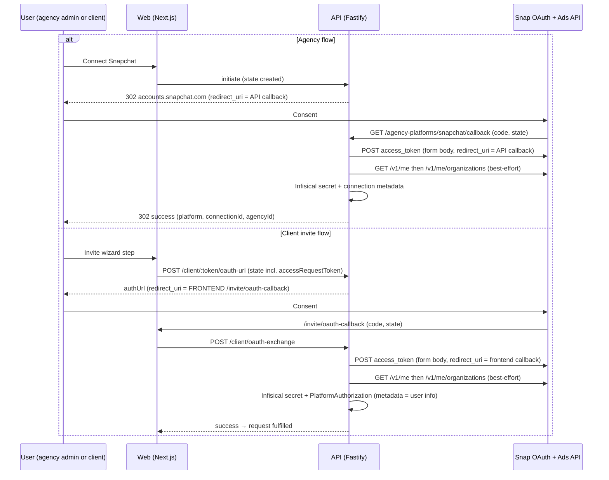
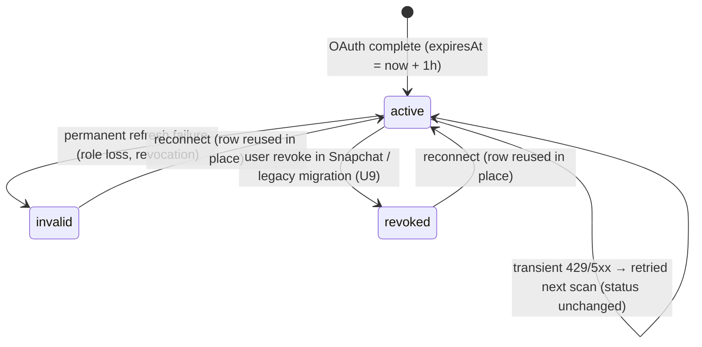

# Snapchat Ads OAuth Connector - Plan

## Goal Capsule

- **Objective:** When an agency or a client connects Snapchat Ads, the connection is a real OAuth grant — tokens stored in Infisical, auto-refreshed, health-verified — and the manual checklist path no longer exists anywhere in the product.
- **Means:** Capability flip plus a minimal `BaseConnector` subclass on the existing registry (KTD1, KTD5); manual-path removal; a gated legacy-data migration (KTD4).
- **Authority:** Requirements (R-IDs) govern product behavior. Key Technical Decisions (KTD-IDs) govern mechanism within those constraints. Units cite owners; they never restate them.
- **Stop conditions:** U9 runs against production only after explicit user approval. Public marketing/blog rewrites wait for the production gate (deferred).
- **Execution profile:** TDD per project rules — failing test first for every feature-bearing unit. One scoped diff; all units land together (U1, U5, U6, U7 are behaviorally coupled).
- **Tail ownership:** `ce-work` executes units. Staging and production gates are operator-run checklists (Verification Contract).

---

## Product Contract

### Summary

This plan replaces Snapchat's manual-invitation checklist with a real OAuth connector. It flips the shared capability model, adds a Snapchat connector on the existing `BaseConnector` pattern, removes every manual Snapchat surface, and deactivates legacy manual-only rows behind an explicit approval gate. `snapchat_ads` stays a non-selecting product: OAuth completion fulfills it.

### Problem Frame

The app advertises Snapchat support, but the backend treats Snapchat as a manual checklist platform. A "connected" manual row holds no token, no refresh, and no health truth — the marketing claim is not backed by a working connector. Agencies follow instructions outside the product, which is exactly the 2–3 day pain this product exists to remove. The shared type model and the connector registry already contain half-built Snapchat config (endpoints, scope, platform IDs); this plan finishes it.

### Requirements

**OAuth connection**

- R1. `snapchat` and `snapchat_ads` capabilities become connectionMethod `oauth`, tokenKind `oauth`, refreshStrategy `automatic`, healthStrategy `live_verify`, expiryBehavior `expiring`.
- R2. A single SnapchatConnector serves both `snapchat` and `snapchat_ads` through the connector factory and the agency `PLATFORM_CONNECTORS` registry (KTD1).
- R3. `SNAPCHAT_CLIENT_ID` and `SNAPCHAT_CLIENT_SECRET` exist in the backend env schema and `.env.example`. Missing credentials fail initiation with a clear 503 that names the env vars.
- R4. Authorization URLs use the registry config: Snap's authorize endpoint, a space scope separator, the single `snapchat-marketing-api` scope, and the redirect URI of the flow in progress (KTD3).
- R5. Token exchange and refresh follow Snap's form-body protocol: exchange includes `redirect_uri`, refresh excludes it, and a rotated refresh token is persisted on every refresh (KTD5).
- R6. Discovery is best-effort and never fatal. The `/v1/me` unwrap is required for identity; organization and ad-account fetch failures or empty results are recorded as connection metadata, never thrown (KTD6).
- R7. A `snapchat_ads` request product is fulfilled by an active Snapchat authorization. No asset-selection step exists for it in this MVP (KTD7).

**Lifecycle truth**

- R8. Snapchat connections auto-refresh through the existing token-lifecycle scan. Transient failures (429, 5xx) do not mark the connection invalid; the next scan retries.
- R9. When refresh fails permanently — the authorizing user lost access or revoked the app — the agency sees a connection needing reconnect, and a returning client sees a truthful needs-reconnect state, not "pending".
- R10. Token-health UI stays truthful for sub-day tokens: refresh is offered for active rows regardless of the health label, and expiry copy renders minutes for sub-hour lifetimes.

**Manual removal**

- R11. Client invites for Snapchat route to Snapchat OAuth. No manual Snapchat entry point remains in the invite wizard.
- R12. Snapchat manual invitation UI, manual API routes, and hardcoded manual platform sets are removed. The manual-connect endpoints reject Snapchat.
- R13. Snapchat copy is truthful: "Authorize with Snapchat"; access follows the Snapchat user's Business Manager and ad-account roles; revoke in Snapchat under Manage Apps.

**Legacy data**

- R14. Old manual-only Snapchat connections are set to `revoked` with `revokedAt`/`revokedBy` and an audit entry, so reconnect uses the existing reuse path. Production execution is gated on explicit user approval (KTD4).

### Key Flows

- F1. Agency connect: initiate (503 on missing credentials) → Snap consent with the API callback URI → callback consumes state, exchanges code, discovers best-effort → Infisical secret + connection metadata → 302 success. Covered by U2, U4.
- F2. Client invite: wizard `oauth-url` (frontend invite callback URI) → Snap consent → `/invite/oauth-callback` → exchange route consumes state once, exchanges, fetches user info best-effort → Infisical + PlatformAuthorization → fulfilled. Covered by U2, U5.
- F3. Lifecycle: 12-hour scan → refresh with rotation persisted and transient errors retried → live-verify health → reconnect states. Covered by U3, U8, U9.

### Acceptance Examples

- AE1. Covers R14. Given a legacy manual Snapchat row with no secretId and no expiresAt, when the migration applies, the row is `revoked` with audit history preserved, and reconnecting produces a working OAuth connection on the same row.
- AE2. Covers R9. Given a refresh that fails because the authorizing user lost access, when the scan runs, the row is invalid, the audit records the reconnect-required outcome, and the client view shows needs-reconnect rather than pending.
- AE3. Covers R7. Given an access request whose only Snapchat product is `snapchat_ads`, when the client completes OAuth, the request shows the product fulfilled with no selection step.
- AE4. Covers R6. Given a brand-new Snapchat Business account with zero ad accounts, when OAuth completes, the connection is active, discovery metadata records the empty state, and no error surfaces.

### Success Criteria

- Staging gate and production gate checklists pass (Verification Contract).
- Root typecheck, lint, and the full test suite are green.
- No OAuth token appears in PostgreSQL or logs; audit entries exist for connect and refresh events.
- The manual Snapchat path is absent from the invite wizard and rejected by the manual endpoints.

### Scope Boundaries

Outside this product's identity (non-goals for this plan):

- Campaign creation, reporting APIs, offline conversions, Snap Profile API, webhooks.
- Ad-account selection UI for Snapchat.
- Push notifications when a connection goes invalid.

#### Deferred to Follow-Up Work

- Public marketing and blog rewrites (`apps/web/content/blog/snapchat-ads-access-agencies.md` premise becomes false after launch; also `client-onboarding-checklist.md` Snapchat section). Sequence after the production gate.
- State-expiry recovery affordance in `/invite/oauth-callback` (unused `returnToken` dead code, `STATE_ALREADY_CONSUMED` handling) — pre-existing for all platforms, not Snapchat-specific.
- Per-platform scan cadence or refresh-on-use for sub-day tokens (deeper token-cadence work beyond R10).
- Documentation refresh: `docs/APP_OVERVIEW.md`, `docs/PRODUCTION_OAUTH_SETUP.md`, `docs/PRODUCTION_OAUTH_SUMMARY.md`, `docs/PRD.md`, and the stale CLAUDE.md "Redis-backed OAuth state" wording (production state is Postgres-backed and fail-closed per `docs/solutions/security-issues/oauth-state-postgres-fail-closed.md`).
- Pre-validation callback error redirect target (`env.FRONTEND_URL` root instead of the platforms page) — pre-existing for all platforms.

### Sources

- Snap Authentication: https://developers.snap.com/marketing-api/Ads-API/authentication
- Snap FAQ (refresh-token lifetime, redirect_uri immutability): https://developers.snap.com/marketing-api/Ads-API/faq
- Snap Organizations (envelope shape): https://developers.snap.com/marketing-api/Ads-API/organizations
- Snap User (`/v1/me` envelope): https://developers.snap.com/marketing-api/Ads-API/user
- Snap Roles: https://developers.snap.com/marketing-api/Ads-API/roles
- Snap Rate Limits: https://developers.snap.com/marketing-api/Ads-API/rate-limits
- Repo patterns: `apps/api/src/services/connectors/tiktok.ts` (test-rich example), `apps/api/src/services/connectors/linkedin.ts` (minimal example), `apps/api/src/routes/agency-platforms/oauth.routes.ts`, `apps/api/src/routes/client-auth/`, `apps/api/src/services/token-lifecycle.service.ts`, `apps/api/src/services/access-request.service.ts` (fulfillment evaluator)
- Learnings: `docs/solutions/grouped-oauth-product-expansion-with-truthful-fulfillment.md` (six-surface checklist), `docs/solutions/security-issues/oauth-state-postgres-fail-closed.md`, `docs/solutions/design-patterns/single-stage-client-request-flow.md`, `docs/solutions/meta-business-login-production-rollout.md` (operational staging lessons)

---

## Planning Contract

### Key Technical Decisions

- KTD1. One connector class at the platform-group level; `snapchat_ads` maps to the same instance, mirroring the TikTok alias precedent in `apps/api/src/services/connectors/factory.ts`.
- KTD2. Capability values mirror LinkedIn (`automatic` refresh, `live_verify` health). Snap refresh tokens do not expire by time; they fail on role loss or revocation, which the refresh loop and live-verify surface. This beats a reconnect-only strategy.
- KTD3. Register two redirect URIs in the Snap OAuth app: `{FRONTEND_URL}/invite/oauth-callback` (client flow, origin-derived via `apps/api/src/routes/client-auth/redirect-uri.ts`) and `{API_URL}/agency-platforms/snapchat/callback` (agency flow, BaseConnector default). (session-settled: user-approved — chosen over single-URI state-forwarding: zero new routing code and parity with every existing platform.) Conflict call-out: Snap's Marketing-API app flow documents a single redirect_uri at creation, and existing URIs cannot be edited; the portal accepts additional URIs. The forwarding fallback from the original brief is technically impossible — Snap authorization codes are single-use and the exchange `redirect_uri` must match the authorize request — so multi-URI registration is the only viable shape. The staging gate verifies both URIs register; if Snap rejects the second URI, escalate to an "API exchanges both flows, forwards outcome" design. Do not build that speculatively. Every origin in `CORS_ALLOWED_ORIGINS` that serves invites must be a registered Snap URI.
- KTD4. Legacy manual rows are set to `revoked` — `inactive` is not a legal status in `apps/api/prisma/schema.prisma`; `revoked` is the only non-active status `createConnection` reuses. (session-settled: user-approved — chosen over leaving rows active: stale rows would claim a connection that holds no token.) Execution is gated on explicit user approval, staging first.
- KTD5. BaseConnector defaults satisfy Snap's token protocol; no TikTok-style flow overrides are needed. Verified against Snap docs and three production implementations (Singer, Ingestr, Airbyte): form-body credentials (no Basic auth), `redirect_uri` on the exchange only, Bearer header for API calls, flat token envelope. The connector overrides only `normalizeResponse`, `refreshToken` (status-aware errors), and `getUserInfo` (two-phase discovery). The earlier research claim that Snap requires HTTP Basic auth is refuted by primary sources.
- KTD6. Discovery failures and empty results are expected, not exceptional: `/v1/me` unwrap is required; the organizations fetch is wrapped best-effort. Metadata contract: `organizations[]`, `adAccountCount`, `role`, `discoveryFailed`, `orgStatus`. This mirrors the agency callback's google/meta try-catch precedent and prevents burning a single-use code after a successful exchange on the client path (where `getUserInfo` runs inside the exchange `Promise.all` — a throw there would discard completed tokens).
- KTD7. `snapchat_ads` remains a non-asset-selecting product. Both `ASSET_SELECTING_PRODUCTS` sets already omit it, and `hasNonSelectingProductAccess` in `apps/api/src/services/access-request.service.ts` fulfills it from the active group authorization. The wizard's `supportsAssetSelection` omits it, so no selection step renders. Truthful Status contract holds: empty ad-account states are recorded as metadata, not hidden.
- KTD8. Reconnect reuses the row: `agencyPlatformService.createConnection` reuses non-active rows (`revoked`, `expired`, `invalid`) update-in-place instead of creating. Today only `revoked` rows are reused; any other non-active row hits the `(agencyId, platform)` unique constraint and returns a spurious INTERNAL_ERROR. Snap makes this path likely (per-user grants die on role loss), so the fix is in scope.
- KTD9. Sub-day token truth: the token-health page gates the Refresh action on row status (`active`), not the health label; expiry copy renders minutes for sub-day expiries. Without this, an hourly token shows "expired" ~92% of the time under the 12-hour scan and the refresh button is disabled exactly then.

### High-Level Technical Design

Both OAuth flows with their redirect URIs (KTD3, KTD5, KTD6):

Connection lifecycle (KTD2, KTD8, KTD9):

### Assumptions

- Separate dev and production Snap apps with separate client IDs; the dev app requires the test account registered as a Demo User. Operator setup, not code.
- Snap rate limits (20 req/s per app, 10 req/s per token) are non-binding for discovery and the current scan cadence.
- OAuth completion fulfills `snapchat_ads` even when zero ad accounts are visible; access follows the user's roles and metadata records the state.
- In-flight manual Snapchat checklists fail with a 404 at cutover; clients retry through OAuth. Accepted for this rollout.
- Snap's authorization-code token response omits `scope`; the connector records the registry default scope.

---

## Risks & Dependencies

- **Person-tied grants.** A Snap connection dies when the authorizing employee loses access. Recommend a dedicated reporting user for agency-owned connections; the agency callback now records which user connected and which org, so a departure is diagnosable (R6, KTD6).
- **Broad single scope.** `snapchat-marketing-api` is one scope; actual write ability follows the user's Business Manager role. R13 copy states this; do not imply scoped permissions the API does not grant.
- **Snap app setup fragility.** The client secret is shown once, redirect URIs are immutable after creation, and dev/prod apps have separate client IDs (dev needs the test account as a Demo User). Register both URIs correctly at creation; there is no edit path (KTD3, staging gate).
- **Deploy coupling.** The capability flip and the web manual-list removal are behaviorally linked; partial deploys route the wizard to a deleted page. Single merge, per Definition of Done.
- **Per-user grant decay is silent.** No notification exists when refresh fails; the token-health page and needs-reconnect client state are the only signals in this MVP (push notifications are a non-goal).

---

## Implementation Units

### U1. Capability flip and env vars

- **Goal:** Make the shared type model and env schema tell the truth about Snapchat.
- **Requirements:** R1, R3
- **Dependencies:** None (but must merge with U5–U7 — see Definition of Done)
- **Files:** `packages/shared/src/types.ts`; `apps/api/src/lib/env.ts`; `apps/api/.env.example`
- **Approach:**
  1. Set both Snapchat capability entries to the R1 values (LinkedIn entries are the literal precedent).
  2. Add the two optional env vars next to the TikTok block, plus the `.env.example` entries.
  3. Rebuild the shared package so api tests compile against the flip.
- **Execution note:** Config/type change — the project's TDD exception applies here; downstream units carry the behavioral tests. `MANUAL_PLATFORMS`, `SUPPORTED_PLATFORMS`, and the web flow derivation derive from this flip automatically.
- **Test scenarios:** Test expectation: none — type and config only. Verify `apps/api/src/services/connectors/__tests__/registry.config.test.ts` stays green after the shared rebuild (it already expects Snapchat as an OAuth platform).
- **Verification:** Shared package builds; api typecheck resolves `SNAPCHAT_*` on the env object.

### U2. SnapchatConnector

- **Goal:** A real Snap OAuth connector with best-effort discovery and status-aware refresh errors.
- **Requirements:** R2, R4, R5, R6
- **Dependencies:** U1
- **Files:** `apps/api/src/services/connectors/snapchat.ts` (new); `apps/api/src/services/connectors/__tests__/snapchat.connector.test.ts` (new); `apps/api/src/services/connectors/factory.ts`; `apps/api/src/services/connectors/__tests__/registry.config.test.ts`
- **Approach:**
  1. Extend `BaseConnector('snapchat')`. Do not override `getAuthUrl`, `exchangeCode`, `verifyToken`, or the redirect URI — defaults match Snap (KTD5).
  2. Override `normalizeResponse`: map the flat envelope; default `scope` to the registry default when the exchange response omits it; map the rotated refresh token.
  3. Override `refreshToken` (TikTok shape): form body with `refresh_token`, `client_id`, `client_secret`, `grant_type` — no `redirect_uri`; map 429/5xx to a retryable error code and 401/invalid-grant to a terminal code.
  4. Override `getUserInfo` as two-phase: fetch and unwrap `/v1/me` from the `me` key (required); fetch `/v1/me/organizations?with_ad_accounts=true` best-effort inside try/catch; return identity plus the KTD6 metadata contract (filter ad accounts to `status === 'ACTIVE'`; capture the user's `roles`).
  5. Register `snapchat` and `snapchat_ads` → the same singleton in the factory; add the singleton to the constructed-connectors test list.
- **Execution note:** Start with the failing connector test file; mirror `__tests__/tiktok.connector.test.ts` (`vi.mock` env, `global.fetch`, URL searchParams assertions, secret-leak assertion).
- **Test scenarios:**
  - Happy path: auth URL carries client_id, state, the single scope with space separator, and the default API callback redirect_uri.
  - Happy path: exchange normalizes the flat envelope (access token, refresh token, 3600 expiry, Bearer) and records the default scope when absent.
  - Happy path: refresh sends the exact form body without redirect_uri and maps the rotated refresh token.
  - Happy path: `/v1/me` unwraps from `me`; organizations unwrap from the double-nested envelope with ACTIVE ad accounts and user roles.
  - Edge case: exchange response without `scope` still yields normalized scope metadata.
  - Edge case: organizations response with zero ad accounts yields `adAccountCount: 0` and no error.
  - Error path: non-2xx exchange throws ConnectorError EXCHANGE_FAILED whose message does not contain the client secret.
  - Error path: refresh 429 produces the retryable code; refresh 401 produces the terminal code.
  - Error path: organizations fetch throws — identity is still returned with `discoveryFailed: true`.
  - Integration: the factory resolves `snapchat_ads` to the same instance as `snapchat`.
- **Verification:** Focused connector suite green; `getConnector('snapchat_ads')` returns the Snapchat singleton.

### U3. Lifecycle retry classification and rotation invariant

- **Goal:** Transient Snap failures never strand a connection as invalid; rotation can never be silently erased.
- **Requirements:** R5, R8
- **Dependencies:** U2
- **Files:** `apps/api/src/services/token-lifecycle.service.ts`; `apps/api/src/services/__tests__/token-lifecycle.service.test.ts`
- **Approach:**
  1. In `refreshTarget`, skip the invalid flip when the ConnectorError carries the retryable code; leave status unchanged so the next scan retries.
  2. Add the rotation invariant test: the persisted secret keeps the rotated refresh token, and a refresh response without a refresh token falls back to the stored one (the existing `|| storedTokens.refreshToken` guard is the only protection — pin it).
- **Execution note:** Failing tests first: one retryable-429 case, one rotation-persistence case.
- **Test scenarios:**
  - Happy path: refresh success persists the new access token and the rotated refresh token.
  - Edge case: refresh response without a refresh token persists the stored refresh token unchanged.
  - Error path: refresh throws retryable (429) — status stays `active`, no invalid flip, next scan retries.
  - Error path: refresh throws terminal (invalid grant) — status becomes `invalid`, audit records reconnect-required.
- **Verification:** Focused lifecycle suite green.

### U4. Agency flow: registration, discovery, row reuse

- **Goal:** Agencies connect Snapchat through OAuth; the callback records discovery truth; reconnect reuses the row.
- **Requirements:** R2, R3, R6, R8 (KTD8)
- **Dependencies:** U1, U2
- **Files:** `apps/api/src/routes/agency-platforms/constants.ts`; `apps/api/src/routes/agency-platforms/oauth.routes.ts`; `apps/api/src/services/agency-platform.service.ts`; `apps/api/src/routes/__tests__/agency-platforms.routes.test.ts`; `apps/api/src/services/__tests__/agency-platform.service.test.ts`
- **Approach:**
  1. Add `SnapchatConnector` to `PLATFORM_CONNECTORS`.
  2. Add a snap branch to the callback discovery block (google/meta precedent): try/catch, log, merge `snapchatOrganizations` metadata (organizations, adAccountCount, role, discoveryFailed).
  3. Normalize the success-redirect platform param from `stateData.platform` for consistency.
  4. In `createConnection`, reuse non-active rows (revoked, expired, invalid) update-in-place per KTD8.
- **Execution note:** Failing route tests first: initiation and callback cases mirror the existing meta/tiktok blocks at `agency-platforms.routes.test.ts` initiation and callback suites.
- **Test scenarios:**
  - Happy path: initiation returns the auth URL with the API callback redirect URI and the single scope; createState receives the expected args.
  - Happy path: callback exchanges, creates the connection with Infisical storage, and 302s with success, platform, connectionId, agencyId.
  - Happy path: callback with organizations metadata stores `snapchatOrganizations` on the connection.
  - Integration: organizations fetch failure still creates the connection and records `discoveryFailed` (state and code are already consumed — no retry is possible).
  - Error path: initiation with missing credentials returns 503 naming the env vars (new coverage — no existing test covers this path).
  - Error path: initiation/callback for an unauthorized agency is blocked with 403 (new coverage).
  - Edge case: connecting over a `revoked`, `expired`, or `invalid` row updates it in place — no unique-constraint error, no spurious INTERNAL_ERROR.
- **Verification:** Focused agency-platforms and service suites green.

### U5. Client flow enablement

- **Goal:** Client invites can start and complete Snapchat OAuth.
- **Requirements:** R2, R4, R6, R7
- **Dependencies:** U1, U2
- **Files:** `apps/api/src/routes/client-auth/schemas.ts`; `apps/api/src/routes/__tests__/client-auth.routes.test.ts`; `apps/api/src/routes/client-auth/__tests__/oauth-exchange.routes.test.ts`
- **Approach:**
  1. Add `snapchat` to both `createOAuthStateSchema` and `oauthExchangeSchema` platform enums — this is the real client-flow gate; the capability flip alone does not open it.
  2. Flip the two existing rejection tests (they assert Snapchat gets VALIDATION_ERROR on oauth-url and oauth-exchange) into positive cases.
  3. Add a snapchat exchange case to the characterization suite (`mockHappyPath({ state: { platform: 'snapchat' } })`) asserting connection creation, Infisical storage, and PlatformAuthorization metadata carrying the discovery contract.
- **Test scenarios:**
  - Happy path: oauth-url accepts snapchat and returns an auth URL whose redirect_uri is the frontend invite callback.
  - Happy path: oauth-exchange completes for snapchat — ClientConnection, Infisical secret, PlatformAuthorization with metadata, CLIENT_AUTHORIZED audit.
  - Integration: PlatformAuthorization metadata carries the discovery contract from getUserInfo (organizations, adAccountCount, role, discoveryFailed when applicable).
  - Error path: platform mismatch and state-expiry behaviors remain unchanged for snapchat.
- **Verification:** Focused client-auth suites green.

### U6. Web manual-path removal and truthful copy

- **Goal:** The invite wizard and onboarding treat Snapchat as OAuth-only; no manual Snapchat surface remains in the web app.
- **Requirements:** R11, R12, R13
- **Dependencies:** U1 (behaviorally coupled — merge together)
- **Files:** `apps/web/src/lib/client-invite-platforms.ts`; `apps/web/src/app/invite/[token]/manual-invite.config.tsx`; `apps/web/src/app/invite/[token]/snapchat/manual/page.tsx` (delete); `apps/web/src/components/manual-invitation-modal.tsx`; `apps/web/src/app/invite/[token]/client-invite-page.tsx`; `apps/web/src/app/onboarding/platforms/page.tsx`; `apps/web/src/lib/query/use-invite-request-loader.ts`; `apps/web/src/app/__tests__/client-request-flow.design.test.ts`; `apps/web/src/components/__tests__/manual-invitation-modal.snapchat.test.tsx` (delete); `apps/web/src/app/invite/[token]/__tests__/manual-flows.test.tsx`; `apps/web/src/lib/__tests__/client-invite-platforms.test.ts`; `apps/web/src/app/onboarding/platforms/__tests__/page.test.tsx`; `apps/web/src/components/ui/__tests__/platform-card.test.tsx`
- **Approach:**
  1. Read `apps/web/DESIGN_SYSTEM.md` before any UI change (project rule).
  2. Remove Snapchat from `MANUAL_INVITE_PLATFORMS`, `CLIENT_INVITE_MANUAL_ROUTE_SEGMENTS`, and `CLIENT_INVITE_MANUAL_PLATFORMS` — the hardcoded set ORs against the capability, so both must change in the same commit.
  3. Delete the Snapchat manual config, page, modal branches, and `emailPlatforms` entry; drop the `manual-snapchat` loader union member.
  4. Update the onboarding platform entry from `type: 'manual'` with manual copy to OAuth copy.
  5. Apply R13 copy lines; square controls, coral accent, no new radius, no new shadows per the design system.
  6. Do not touch marketing platform lists, `transform-platforms.ts` group mapping, or `platform-icon.tsx` — they stay.
- **Execution note:** Failing UI tests first where behavior changes: the onboarding test flips from "opens manual modal" to "initiates OAuth"; the design test's file list drops the deleted page.
- **Test scenarios:**
  - Happy path: the invite wizard initiates Snapchat OAuth (posts to oauth-url) instead of routing to a manual page.
  - Happy path: the connections page and onboarding initiate OAuth for Snapchat.
  - Edge case: `PLATFORM_TOKEN_CAPABILITIES`-driven flow derivation yields oauth for snapchat with no hardcoded-set residue (update the exact-array assertion).
  - Error path: manual invitation modal still renders for kit, mailchimp, beehiiv, klaviyo, pinterest, shopify (regression guard).
- **Verification:** Focused web suites green; `grep -ri "manual" apps/web/src --include="*.tsx" -l` shows no Snapchat manual surface.

### U7. API manual-path removal

- **Goal:** The API rejects Snapchat manual connections; remaining manual platforms are untouched.
- **Requirements:** R12
- **Dependencies:** U1 (behaviorally coupled — merge together)
- **Files:** `apps/api/src/routes/client-auth/manual.routes.ts`; `apps/api/src/routes/client-auth/__tests__/manual.routes.test.ts`; `apps/api/src/routes/agency-platforms/__tests__/manual.routes.test.ts`
- **Approach:**
  1. Remove `snapchat` from the `EmailManualPlatform` union and delete the `/client/:token/snapchat/manual-connect` registration.
  2. Delete the Snapchat blocks from both manual-route test files (the agency manual route derives its gate from the capability, so it rejects Snapchat automatically after U1).
- **Test scenarios:**
  - Happy path: kit, mailchimp, beehiiv, klaviyo manual endpoints still complete (regression guard).
  - Error path: `POST /agency-platforms/snapchat/manual-connect` returns unsupported-platform after the flip.
  - Error path: snapchat is no longer part of the client manual email-platform iteration.
- **Verification:** Focused manual-route suites green.

### U8. Health and reconnect truth

- **Goal:** The UI tells the truth about hourly tokens and lost access.
- **Requirements:** R9, R10 (KTD9)
- **Dependencies:** U3
- **Files:** `apps/web/src/app/(authenticated)/token-health/page.tsx`; `apps/web/src/lib/token-health.ts`; `apps/api/src/services/client.service.ts` (product-summary mapping); related `__tests__/` files
- **Approach:**
  1. Gate the Refresh action on row status (`active`) rather than the health label, so expired-but-refreshable rows offer one-click refresh.
  2. Render minutes-level expiry copy for sub-day expiries instead of "Expires tomorrow".
  3. Map a non-active authorization on a non-selecting product to a needs-reconnect state instead of "pending" (the client did act; Snap revoked the grant). Keep the mapping truthful per the Truthful Status concept in `CONCEPTS.md`.
- **Execution note:** Failing tests first for each of the three behaviors.
- **Test scenarios:**
  - Happy path: an active row with an expired health label shows an enabled Refresh action.
  - Edge case: expiry copy shows minutes for a token expiring in under a day, not "tomorrow".
  - Happy path: an invalidated Snapchat authorization renders needs-reconnect for `snapchat_ads`, not pending.
  - Error path: non-Snapchat platforms keep their current summary behavior (regression guard).
- **Verification:** Focused web + client.service suites green.

### U9. Legacy manual-connection migration (GATED)

- **Goal:** Old manual-only Snapchat rows stop claiming a connection and become reconnectable.
- **Requirements:** R14 (KTD4)
- **Dependencies:** U4 (row-reuse path must exist first)
- **Files:** `apps/api/scripts/deactivate-legacy-snapchat-connections.ts` (new, dry-run + apply modes); `apps/api/scripts/__tests__/deactivate-legacy-snapchat-connections.test.ts` (new)
- **Approach:**
  1. Selection: `AgencyPlatformConnection` where platform is snapchat (or snapchat_ads), status is `active`, and no `secretId` exists.
  2. Apply: set status `revoked`, `revokedAt`, `revokedBy: 'system:legacy-manual-migration'`, and write an audit entry per row; preserve all prior audit history.
  3. Dry-run prints the affected rows; apply is idempotent (second run is a no-op).
- **Execution note:** **Do not run against production without explicit user approval.** Staging first, production second, after the production gate. This unit is the approval gate the user asked for; `ce-work` must present the dry-run output and wait for approval before apply in any non-local environment.
- **Test scenarios:**
  - Happy path: apply converts legacy rows to revoked with audit entries; AE1 satisfied end to end.
  - Edge case: dry-run changes nothing and reports the same row set apply would.
  - Edge case: rows that already have a secretId are untouched.
  - Integration: reconnecting a revoked legacy row after U4 reuses the row and produces an active OAuth connection.
- **Verification:** Script test suite green; staging dry-run + apply rehearsed before the production ask.

---

## Verification Contract

| Gate | Command / checklist | Done signal |
|---|---|---|
| Types | `npm run typecheck` (root) | Clean |
| Lint | `npm run lint` (root) | 0 errors |
| Focused backend | `npm run test --workspace=apps/api` — connector, token-lifecycle, agency-platforms, client-auth, manual-routes suites | Green |
| Focused frontend | `npm run test --workspace=apps/web` — invite, onboarding, platform-card, token-health suites | Green |
| Full suite | `npm run test` (root) | Green |
| Order note | Build `packages/shared` before api tests when the capability flip is fresh | api compiles against the flip |

**Staging gate (operator-run):**
1. Create the staging Snap OAuth app in Snap Business Manager (Organization Admin; client secret shown once — store immediately).
2. Register both redirect URIs at creation (KTD3): the staging frontend invite callback and the staging API callback. Verify a second URI is accepted; escalate per KTD3 if rejected.
3. Store `SNAPCHAT_CLIENT_ID`/`SNAPCHAT_CLIENT_SECRET` in staging Infisical; set them in the staging API environment.
4. Connect a real Snapchat test organization through the agency flow: active connection, visible org/ad-account metadata, no token in the database or logs, audit entry present.
5. Force a refresh (or wait for the scan): rotation persisted, status stays active.
6. Complete a client invite with Snapchat: OAuth completion fulfills `snapchat_ads`, no selection step, truthful states.
7. Run the U9 dry-run; apply on staging; confirm rows revoked + reconnectable.

**Production gate (operator-run):**
1. Create the production Snap app separately (its own client ID/secret; URIs registered at creation).
2. Configure production credentials in Render/Infisical.
3. Repeat staging-gate checks 4–6 against production.
4. Obtain explicit approval, then run U9 dry-run + apply against production.
5. Only after the gates: hand off the deferred marketing/blog and docs rewrites.

---

## Definition of Done

**Global:**
- Typecheck, lint, and the full test suite are green.
- No OAuth token is persisted outside Infisical; audit entries exist for connect and refresh events.
- The diff is scoped to the files named in the units. Abandoned-attempt code is removed, not left in the diff.
- Work happens on a clean branch off a synced `origin/main` — the repo is currently ahead 7 / behind 25 with unrelated dirty files; sync and isolate before starting.
- U1, U5, U6, U7 land in the same merge: the capability flip routes the wizard to OAuth, and the hardcoded manual lists must be gone in the same commit or the wizard routes to a deleted page.

**Per unit:** each unit's Verification field is met, and every feature-bearing unit's test scenarios exist as failing-first tests that now pass.
