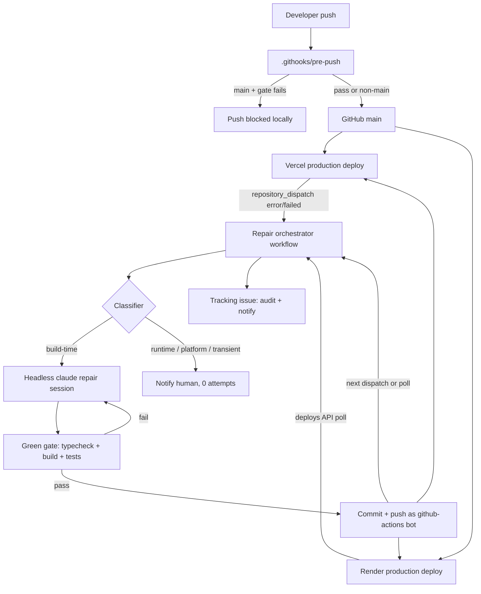
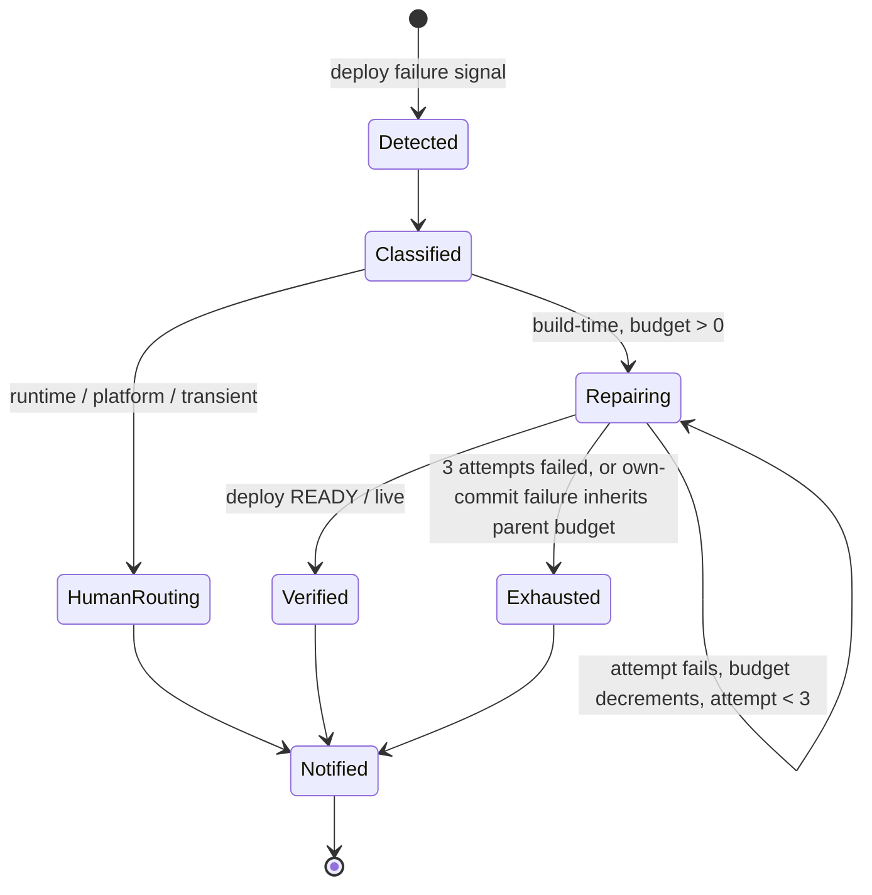

# Self-Healing Deploy Pipeline - Plan

## Goal Capsule

- **Objective:** A failed production deploy of `apps/web` (Vercel) or `apps/api` (Render) is detected automatically, a bounded autonomous agent repairs build-time failures, and the operator learns the outcome — fix landed or human needed — without watching dashboards. An operator outside the loop can verify this from the tracking issue and git history alone.
- **Means:** Three layers — a local pre-push build gate, event/poll deploy-failure detection, and a CI-hosted bounded repair loop — per KTD1–KTD10.
- **Authority hierarchy:** Product Contract Requirements govern behavior. Key Technical Decisions govern mechanism. Implementation Units carry local detail only.
- **Stop conditions:** Max 3 repair attempts per incident (R8). Non-build-time failure classification (R6). Non-fast-forward after one recovery retry (KTD8). Any of these stops the loop and notifies (R11).
- **Execution profile:** TDD for feature code (`apps/api/scripts/**` TS modules). Workflow YAML, hook shell scripts, and docs are config per repo TDD exceptions.
- **Tail ownership:** `ce-work` executes units; operators own the runbook after delivery.

---

## Product Contract

### Summary

This plan adds a self-healing deploy pipeline for the monorepo's two production targets. A pre-push gate blocks broken pushes to `main` locally. Vercel and Render failures trigger a GitHub Actions repair loop. A headless Claude session reads the failure logs, fixes the code, passes the same gate, pushes, and verifies the redeploy — at most 3 attempts per incident, then stops and notifies.

### Problem Frame

Deploys fail silently today. No uptime check, webhook, or post-deploy verification exists for either platform; a broken build surfaces only when someone opens a dashboard. The failure classes recur: untracked files, shared-type mismatches, missing Suspense boundaries, Vitest globals leaking into build typecheck, and incomplete commits that push without local changes. Past incidents also exposed coupling risks: a web deploy looked green while production 404'd against a not-yet-live API, and stale deploy docs (`CLAUDE.md` says Railway; `DEPLOYMENT.md` prescribes the `rootDirectory` misconfiguration that previously broke installs) point at the wrong targets. The operator currently absorbs all of this manually, at the moment of highest time pressure.

### Key Decisions

- KD1. All three layers ship in one plan: gate, detection, repair loop. (session-settled: user-directed — chosen over shipping the pre-push gate alone first: the user asked for the full system planned.)
  Governs R1–R13.
- KD2. The loop is bounded at 3 attempts, then stops and notifies. (session-settled: user-approved — chosen over an unbounded loop-until-success: unbounded loops burn tokens and can push churn to `main`.)
  Governs R8, R11.
- KD3. Every repair push requires a green gate pass first. (session-settled: user-approved — chosen over push-on-faith: verify before redeploy.)
  Governs R8, R1, R2.
- KD4. Repair is autonomous but authority-restricted: a headless agent with a scoped permission set, never an interactive free-for-all. (session-settled: user-approved — chosen over interactive in-session fixes: the loop must run unattended.)
  Governs R8, R9, R10.

### Requirements

**Pre-push gate**

- R1. A push to `refs/heads/main` runs `npm run typecheck` and `npm run build` before leaving the machine; failure blocks the push. Non-main pushes skip the gate.
- R2. The gate validates the pushed commit content from a clean checkout of the pushed ref, not the working tree.
- R3. The gate lives in a committed path, survives re-clone, and chains the existing Entire CLI pre-push hook without changing its behavior or exit-code propagation.

**Deploy failure detection**

- R4. Vercel production deploy failures are detected event-driven via `repository_dispatch` (`vercel.deployment.error`, `vercel.deployment.failed`), without polling.
- R5. Render deploy failures are detected by polling the deploys API. Free-plan states that are not code failures (`canceled`, `deactivated`, spin-down) never count as failures, and `/health` is never used as a failure signal.
- R6. Every detected failure is classified before repair: build-time failures are repair targets; runtime, platform, and transient failures route to a human and spend zero attempts.

**Bounded repair loop**

- R7. One failing production deploy maps to one incident keyed by the failing commit SHA. Concurrent failure signals for the same SHA dedupe to one loop.
- R8. Each attempt: the headless agent reads the failure-report artifact, edits code, passes the gate (R1), commits, and pushes. Maximum 3 attempts per incident; a failure of the agent's own commit inherits the parent incident's remaining budget.
- R9. The repair session operates under a restricted permission set. It cannot modify CI workflows, agent settings, Prisma schema or migrations, deploy configs, package manifests, or lockfiles, and it cannot force-push.
- R10. Every attempt is auditable: the tracking issue records the log excerpt, diagnosis, files changed, gate result, pushed SHA, and deploy outcome.
- R11. On budget exhaustion or a non-repairable classification, the loop stops and notifies through the tracking issue and the failed workflow run. Production keeps serving the last good deployment.

**Operation and verification**

- R12. The loop is manually replayable via `workflow_dispatch` and has a dry-run mode that emits the proposed diff without pushing.
- R13. Deploy success means Vercel `READY` / Render `live` (health-check-gated by the platform). Functional correctness stays human-reported.

### Success Criteria

- SC1. Drill: a deliberately broken commit on a `repair-drill/*` branch produces a correct diagnosis and fix diff in dry-run, without touching `main` and without spending budget.
- SC2. Replay: a stored real failure log produces a diagnosis consistent with the historical fix.
- SC3. A deliberately broken commit pushed to `main` is blocked locally by the gate.
- SC4. A simulated 3-fail incident ends in notification with no further pushes; the previous deployment still serves.
- SC5. A runner killed between commit and push leaves the system consistent: the next run or the operator recovers state from the tracking issue.

### Scope Boundaries

**In scope:** production deploys of `apps/web` (Vercel) and `apps/api` (Render); build-time failure repair; fix-forward on `main`.

**Deferred to Follow-Up Work:**

- Runtime-failure repair (needs Sentry/runtime log access and richer verification).
- Auto-rollback after budget exhaustion (no rollback runbook exists; Render free plan allows rollback to the last two deploys only — needs its own documented procedure first).
- Slack or other external notifications (no Slack precedent in the repo).
- Dependency-bump and lockfile repairs.
- Post-deploy functional smoke verification (screenshot/expected-text evidence capture).

**Outside this system's identity:**

- Autonomous fixes for runtime product bugs.
- Agent edits to secrets, database schema, or infrastructure config.
- Monitoring of preview branches or non-production environments.

---

## Planning Contract

### Key Technical Decisions

- KTD1. The repair loop is CI-native: one GitHub Actions workflow runs all attempts inside a single run. Rationale: `GITHUB_TOKEN` pushes cannot re-trigger GitHub workflows (recursion guard), so in-run looping is safe without PATs; Vercel's `repository_dispatch` gives a native trigger; runners check out clean trees, avoiding the current mid-merge dirty-tree trap; the repo already runs Claude in CI (`claude-code-review.yml`, `CLAUDE_CODE_OAUTH_TOKEN` secret exists). Chosen over a local script loop (needs the machine awake, inherits the interactive allow-all `.claude/settings.json`, sits in a dirty tree).
- KTD2. Detection wiring: Vercel via `repository_dispatch` (payload at `github.event.client_payload`, includes deployment `url`); Render via `GET /v1/services/{id}/deploys` polling in the post-push wait plus a scheduled safety poll. Rationale: Render's free plan has no outgoing webhooks (Pro+), and `/health` is unreliable as a failure signal (free instances spin down after ~15 minutes and take ~1 minute to wake; `live` is health-check-gated, so status enums carry the truth).
- KTD3. Gate placement: a committed `.githooks/pre-push` plus `core.hooksPath` set by a one-time setup script documented in the README. The hook calls the Entire CLI pre-push first, then the gate; Entire's exit code already propagates and can block pushes. Production-only by parsing stdin refs (`refs/heads/main` only). `git push --no-verify` remains the documented emergency bypass. Chosen over appending to the machine-local `.git/hooks/pre-push` (lost on re-clone) and over a `.claude/settings.json` hook (fires only for Claude-session pushes).
- KTD4. Gate verification target: build from a clean checkout of the pushed SHA (temporary `git worktree`), not the working tree. Rationale: the meta-business-login incident failed in production because the pushed commit was missing local changes.
- KTD5. Gate composition: `npm run typecheck` + `npm run build` (shared → api → web). This covers `vercel.json` `buildCommand: npm run build:web` and the Render `buildCommand` (shared build + api build). Tests are excluded from the gate (mixed runners; vitest watch-mode entry) and run in the CI gate path instead.
- KTD6. Repair session: raw `claude -p --bare` with `--output-format json`, `--permission-mode dontAsk`, an explicit `--allowedTools` allowlist, `--permission-prompts none`, `--max-turns` and `--max-budget-usd` cost caps, and `--resume "$session_id"` across attempts 2–3. `--bare` skips hooks, skills, plugins, and repo settings, so the loop cannot inherit the interactive allow-all config; the prompt file carries the needed context. Requires `ANTHROPIC_API_KEY` (bare mode never reads the OAuth token). Chosen over `claude-code-action@v1` (GitHub-event-centric; custom non-event orchestration is not its fit) and over non-bare OAuth runs (inherit interactive permissions; less deterministic).
- KTD7. Failure-report artifact: `.claude/tasks/deploy-failures/<timestamp>-<short-sha>.md`, following the existing Sentry webhook artifact contract (`apps/api/src/routes/sentry-webhooks.ts`): Issue Details, Log Excerpt, Alert Trigger, Suspected Files. Written before agent invocation; the agent reads the path (logs are too large for stdin's 10 MB pipe cap).
- KTD8. Push mechanics: `GITHUB_TOKEN` with `permissions: contents: write`, commit identity `github-actions[bot]`; never force-push; on non-fast-forward rejection, rebase, re-run the gate, retry the push once, then abort and notify. Runs serialize via `concurrency: { group: deploy-repair, cancel-in-progress: false }` (queue, not cancel). Setup must verify the Vercel project does not skip deployments for bot-authored commits (commit author access setting).
- KTD9. Incident state lives in a GitHub tracking issue keyed by the failing SHA (short SHA in the title; search-before-create dedupe). It is the audit log (R10), the dedupe key (R7), and the replay input (R12). Chosen over runner-local state files (runners are ephemeral).
- KTD10. CI gate job: `npm ci`, `prisma generate` before the API build (commit `ffe440d` lesson), shared built first, full `next build` using the existing `PERF_CLERK_SECRET_KEY` / `PERF_CLERK_PUBLISHABLE_KEY` secrets, and a validate-secrets step copied from `dashboard-perf-gate.yml` (fails fast naming any missing secret: `VERCEL_TOKEN`, `RENDER_API_KEY`, `ANTHROPIC_API_KEY`). `VERCEL_TOKEN` is project-scoped (`vcp_`, no `teamId` needed); `RENDER_API_KEY` is account-wide and non-expiring — treat as high-value; both stored as GitHub secrets.

### High-Level Technical Design

Component topology and data flow:

Incident state machine:

### Assumptions

- `main` is the production branch for both platforms (consistent with `vercel.json` git integration and Render `autoDeploy`). Branch-protection state on `main` is unverified; setup verifies the bot can push and records the finding in the runbook.
- Vercel's `repository_dispatch` integration is available on the current plan (no documented plan gate); setup verifies the first event arrives.
- CI runners use Node 20 (matches `engines` and existing workflows).

### Risks & Dependencies

| Risk | Mitigation |
|---|---|
| Build logs can echo environment values; excerpts land in a GitHub issue. | The failure-report writer redacts secret-shaped strings before publishing the artifact (U4); the tracking issue stays repo-private. |
| `RENDER_API_KEY` is account-wide and never expires; Render offers no scoped keys. | Stored only as a GitHub secret; the repair session itself has no Render API access; rotate if the secret is ever exposed. |
| Render free plan: spin-down creates false failure signals, and rollback is limited to the last two deploys. | Deploy-status enums are the only failure signal (KTD2); auto-rollback stays deferred (Scope Boundaries). |
| Vercel may skip deployments for bot-authored commits (commit author access setting). | Setup verifies and records it in the runbook before the first repair (KTD8). |
| Repair sessions consume API budget. | Per-attempt `--max-turns` and `--max-budget-usd` caps plus the 3-attempt incident cap (KTD6, KD2). |
| `repository_dispatch` proves unavailable on the current Vercel plan. | Scheduled safety poll of `GET /v7/deployments` (`state=ERROR`) is the documented fallback (KTD2). |

### Sources / Research

- `docs/solutions/meta-business-login-production-rollout.md` — incomplete-commit failure; deploy-ordering verification; pushed-ref verification commands.
- `memory-bank/memory.md` (Vercel/Next.js build fixes) — the five recurring build-failure classes this system targets.
- `docs/VERCEL_DEPLOYMENT_LESSONS_LEARNED.md`, `docs/RENDER_DEPLOYMENT.md`, `docs/DEPLOYMENT_STATUS.md` — deploy topology truth; distrust `DEPLOYMENT.md`'s `rootDirectory` instruction and `CLAUDE.md`'s Railway claim.
- `.github/workflows/dashboard-perf-gate.yml` — gate shape, validate-secrets pattern, `/health` wait loop; `apps/api/scripts/__tests__/deactivate-legacy-snapchat-connections.test.ts` — TS-script-with-tests pattern; `apps/api/src/routes/sentry-webhooks.ts` — failure-artifact contract; `ralph/ralph.sh` — bounded-loop precedent.
- Vercel REST API docs (deployments v7, events v3, access tokens), Render API docs (deploys, logs, health checks, free plan), Claude Code headless docs, GitHub Actions recursion/concurrency docs — all fetched 2026-09; endpoint versions and flag behavior verified against installed CLIs (Vercel 59.11.7, Render 2.26.0, git 2.50.1).

---

## Implementation Units

### U1. Committed pre-push gate

- **Goal:** Block broken production pushes locally, with the gate versioned in the repo.
- **Requirements:** R1, R2, R3.
- **Dependencies:** None.
- **Files:** `.githooks/pre-push` (new), `.githooks/README.md` (new), `scripts/setup/install-git-hooks.sh` (new), `README.md` (modify — setup step).
- **Approach:**
  1. Hook parses stdin refs; runs the gate only when a pushed ref is `refs/heads/main`.
  2. Calls the Entire CLI pre-push first (preserving current behavior and exit-code propagation), then the gate.
  3. Gate creates a temporary `git worktree` at the pushed SHA and runs `npm run typecheck` + `npm run build` inside it; cleans up on exit.
  4. Setup script sets `core.hooksPath` to `.githooks` and is documented in the README.
- **Patterns to follow:** Entire CLI guarded-delegate style in the existing hooks; `set -euo pipefail` shell style from `scripts/perf/web-inp-smoke.sh`.
- **Test scenarios:** `Test expectation: none -- hook and setup script are config per repo TDD exceptions; verified by the smoke checks below.`
- **Verification:** Smoke: push a deliberately broken commit to `main` on a scratch clone → push blocked with a clear gate message; push a clean commit → passes; push to a feature branch → gate skipped; Entire CLI session logging still fires. Setup script run on a fresh clone yields a working hook.

### U2. Deploy status and classification library

- **Goal:** Typed, tested access to Vercel/Render deploy state, build logs, and failure classification.
- **Requirements:** R4, R5, R6, R13.
- **Dependencies:** None.
- **Files:** `apps/api/scripts/deploy-status/vercel.ts`, `apps/api/scripts/deploy-status/render.ts`, `apps/api/scripts/deploy-status/classify.ts`, `apps/api/scripts/deploy-status/__tests__/vercel.test.ts`, `apps/api/scripts/deploy-status/__tests__/render.test.ts`, `apps/api/scripts/deploy-status/__tests__/classify.test.ts` (all new).
- **Approach:**
  1. Exported pure functions with injected `fetch`; no top-level side effects.
  2. Vercel client: list deployments (`GET /v7/deployments?projectId&target=production`), fetch build events (`GET /v3/deployments/{id}/events?limit=-1`), reduce `payload.text` to a log excerpt.
  3. Render client: list deploys (`GET /v1/services/{id}/deploys`), fetch build logs (`GET /v1/logs` with `ownerId`, `resource`, `type=build`, explicit `startTime`), follow `nextStartTime` pagination.
  4. Classifier maps status enums + error fields to `build-time | runtime | platform | transient | success`. Render `canceled`/`deactivated` and Vercel `CANCELED` map to non-failures.
- **Patterns to follow:** `apps/api/scripts/__tests__/deactivate-legacy-snapchat-connections.test.ts` (exported pure functions, in-memory fakes, vitest sibling tests); `arg(name, fallback)` + `[prefix] failed:` conventions from `apps/api/scripts/*.mjs`.
- **Execution note:** Start with failing classifier tests for the status-enum mapping before writing the clients.
- **Test scenarios:**
  - Happy path: Vercel deployment with `readyState: ERROR` + `errorCode` classifies `build-time`; `READY` classifies `success`; Render `build_failed`/`update_failed` classify `build-time`; `live` classifies `success`.
  - Edge cases: Render `canceled` and `deactivated` classify non-failure; unknown enum values classify `platform` (fail-safe to human); empty deployments list returns a defined "no deployment found" result, not a throw.
  - Error paths: Vercel/Render 401 and 429 responses surface as typed errors with the platform name and status code; Render pagination loop terminates on `hasMore: false`.
  - Integration: log-event reduction turns a streamed events array into an excerpt containing the first error line and its surrounding context.
- **Verification:** `npm run test --workspace=apps/api` passes the new suites; classifier covers every status literal in both platforms' enums found in the API docs.

### U3. Repair orchestrator workflow

- **Goal:** Receive failure signals, dedupe incidents, classify, and either dispatch repair or route to a human.
- **Requirements:** R4, R5, R6, R7, R10, R11, R12.
- **Dependencies:** U2.
- **Files:** `.github/workflows/deploy-repair.yml` (new), `apps/api/scripts/deploy-repair/incident.ts`, `apps/api/scripts/deploy-repair/__tests__/incident.test.ts` (new).
- **Approach:**
  1. Triggers: `repository_dispatch` types `vercel.deployment.error` / `vercel.deployment.failed`; `workflow_dispatch` with inputs `platform`, `deployment_url`, `mode` (`repair | dry-run | drill`).
  2. Workflow-level `concurrency: { group: deploy-repair, cancel-in-progress: false }`; `permissions: contents: write, issues: write`.
  3. Validate-secrets step fails fast naming any missing secret (KTD10 list).
  4. Incident module resolves the failing commit SHA, searches tracking issues for the SHA (dedupe, R7), and creates the tracking issue with the failure-report artifact (KTD7 path) when new.
  5. Classifier gate (U2) branches: build-time → repair job; otherwise → comment on the issue with the classification and stop (R6, R11).
- **Patterns to follow:** Trigger/permissions/concurrency shape from `blog-creation-zai.yml` and the perf gates; validate-secrets step from `dashboard-perf-gate.yml`; `gh` CLI for issue search/create.
- **Test scenarios:**
  - Incident module (vitest): same SHA twice → one issue, second run links to the first; different SHAs → separate incidents; issue body contains log excerpt, SHA, platform, and deployment URL (R10).
- **Verification:** `workflow_dispatch` with `mode: dry-run` against a real failed deployment creates the incident issue with a correct artifact; classification comment appears for a synthetic runtime failure.

### U4. Restricted repair session

- **Goal:** Run the headless agent with scoped authority and a deterministic machine-readable result.
- **Requirements:** R8, R9, R10, R12.
- **Dependencies:** U2, U3.
- **Files:** `apps/api/scripts/deploy-repair/repair-session.ts`, `apps/api/scripts/deploy-repair/prompt.ts`, `apps/api/scripts/deploy-repair/__tests__/repair-session.test.ts`, `apps/api/scripts/deploy-repair/__tests__/prompt.test.ts` (all new).
- **Approach:**
  1. Prompt builder turns the failure-report artifact path + denied-paths list + gate commands into the prompt file; lists the five known build-failure classes as diagnostic hints.
  2. Session runner invokes `claude -p --bare` per KTD6; parses `--output-format json` for `result`, `session_id`, `total_cost_usd`; persists `session_id` for `--resume` on attempts 2–3.
  3. Denied-paths enforcement is layered: `--allowedTools` allowlist at the CLI, plus a post-run `git diff --name-only` check that fails the attempt if any denied path changed (defense in depth for R9).
  4. Dry-run mode (`mode: dry-run`) stops after the gate and emits the proposed diff + commit message to the tracking issue instead of pushing (R12).
  5. Agent-turn failure (non-zero exit, budget cap, max turns) is terminal-with-notify for the attempt — never retried silently.
- **Patterns to follow:** `ralph/ralph.sh` bounded-loop shape (iteration cap, sentinel completion, per-attempt evidence); prompt-file invocation.
- **Execution note:** Start with failing tests for the JSON-result parsing and the denied-path diff check before wiring the real CLI.
- **Test scenarios:**
  - Happy path: parsed JSON result yields attempt verdict, session id, and cost; second call resumes from the stored session id.
  - Edge cases: missing `result` field → typed error; empty diff → attempt verdict "no change proposed" (counts as an attempt, per the attempt definition); denied path present in diff → attempt fails with the path named.
  - Error paths: CLI non-zero exit → terminal-with-notify result; oversized log path is passed by file reference, never piped.
- **Verification:** Unit suites pass; a local dry-run against a stored failure artifact produces a proposed diff on a scratch branch without pushing.

### U5. Green gate, attempt loop, and redeploy verification

- **Goal:** Verify each attempt, push it, and confirm the redeploy — bounded, serialized, and observable.
- **Requirements:** R1, R8, R11, R13.
- **Dependencies:** U2, U3, U4.
- **Files:** `.github/workflows/deploy-repair.yml` (modify — repair job), `apps/api/scripts/deploy-repair/attempt-loop.ts`, `apps/api/scripts/deploy-repair/wait-for-deploy.ts`, `apps/api/scripts/deploy-repair/__tests__/attempt-loop.test.ts`, `apps/api/scripts/deploy-repair/__tests__/wait-for-deploy.test.ts` (new).
- **Approach:**
  1. CI gate job per KTD10 (`npm ci` → `prisma generate` → typecheck → build shared/api/web with `PERF_CLERK_*` secrets → `vitest run` for api + web + shared).
  2. Attempt loop: max 3 iterations; each iteration = repair session (U4) → gate → commit as bot (KTD8 identity) → push → wait-for-deploy.
  3. `wait-for-deploy` polls the U2 clients until `READY`/`live` or a terminal failure, with a bounded wait window; Render failures re-enter classification with the parent incident's remaining budget (R8).
  4. Non-fast-forward push rejection: rebase on `origin/main`, re-run the gate, retry the push once, then abort and notify.
  5. Cool-down between repair pushes so the next deploy signal is attributable to this attempt.
  6. Every iteration appends the attempt record to the tracking issue (R10); exhaustion posts the give-up summary (R11).
- **Patterns to follow:** perf-gate wait loop (`curl` with bounded retries, then dump logs and exit 1) for the polling shape; `npm run build` workspace ordering from the root script.
- **Execution note:** Implement the loop as a pure state machine over injected dependencies (session runner, gate runner, pusher, deploy poller) so the budget and inheritance rules are testable without CI.
- **Test scenarios:**
  - Happy path: attempt 1 succeeds → verdict success, one attempt record, no further iterations.
  - Edge cases: agent's own commit fails the deploy on attempt 2 → budget inherited from parent (total 3, not 5); budget 0 at entry → immediate exhaustion, zero agent invocations.
  - Error paths: non-fast-forward once → recovery path runs; twice → abort with notify result; poll timeout → attempt recorded as unverifiable and loop exhausts; gate failure inside an attempt → iteration consumed, next attempt starts from the session resume.
  - Integration: two simulated failure signals for the same SHA → single loop (concurrency + dedupe contract with U3).
- **Verification:** Unit suites pass; `workflow_dispatch` drill (SC4 shape) shows the state machine transitions in the workflow log; tracking issue carries one record per attempt.

### U6. Verification harness, drill mode, and docs

- **Goal:** Prove the loop works without breaking production, and leave operators a runbook with truthful deploy docs.
- **Requirements:** R12; SC1–SC5.
- **Dependencies:** U1–U5.
- **Files:** `apps/api/scripts/deploy-repair/__tests__/replay.test.ts` (new), `.claude/tasks/deploy-failures/fixtures/known-vercel-failure.md` (new), `docs/deploy-repair-runbook.md` (new), `CLAUDE.md` (modify — correct Railway → Render), `docs/DEPLOYMENT.md` (modify — correct the `rootDirectory` instruction), `README.md` (modify — hooks setup).
- **Approach:**
  1. Replay test: feed the stored real failure log through the classifier + prompt builder; assert the diagnosis names the historical root cause (SC2).
  2. Drill mode: `workflow_dispatch` with `mode: drill` runs the full loop against a `repair-drill/*` branch preview failure with push-to-main suppressed; asserts dry-run output (SC1).
  3. Runner-death check: documented procedure + issue-state contract so a killed run leaves a consistent incident record (SC5).
  4. Runbook: setup (secrets, hooks install, Vercel/Render IDs), replay/drill commands, give-up response steps, `--no-verify` escape hatch.
  5. Doc corrections: deploy-truth fixes so no future agent or human follows the stale instructions.
- **Patterns to follow:** evidence-capture convention (`apps/web/scripts/capture-*-evidence.mjs`) for drill output location; runbook style from `docs/PRODUCTION_CHECKLIST.md`.
- **Test scenarios:**
  - Replay: stored Vercel "Module not found" fixture classifies `build-time`; prompt contains the file path from the log and the matching known-failure hint.
  - Drill: dry-run output contains the proposed diff and commit message; `main` untouched; budget untouched.
- **Verification:** Replay + drill tests pass in CI; drill executed once manually with output archived; runbook covers every secret and manual step from setup.

---

## Verification Contract

| Gate | Command / procedure | Applies to |
|---|---|---|
| Typecheck | `npm run typecheck` | All units |
| Build (monorepo order) | `npm run build` | U1 smoke, U5 gate parity |
| API unit suites | `npm run test --workspace=apps/api` | U2–U6 |
| Web + shared suites | `npm run test --workspace=apps/web`, `npm run test --workspace=packages/shared` | U5 gate parity |
| Gate smoke | Push broken commit to `main` on scratch clone → blocked; clean push → passes | U1, SC3 |
| Dry-run replay | `workflow_dispatch` (`mode: dry-run`) on a real failed deployment | U3, U4, SC2 |
| Drill | `workflow_dispatch` (`mode: drill`) with push suppressed | U6, SC1 |
| Exhaustion drill | Simulated 3-fail incident → notify, no further pushes | U5, SC4 |

No `release:validate` command exists in this repo; the CI gate job (KTD10) is the release gate. No behavioral skill evaluation applies.

---

## Definition of Done

**Global:**

- All units complete; `npm run typecheck`, `npm run build`, and all workspace suites pass.
- One full drill executed end-to-end with archived evidence (SC1); replay test green in CI (SC2).
- Runbook exists and names every secret, ID, and manual step; stale deploy docs corrected.
- Abandoned-attempt code, scratch branches, and drill artifacts are removed from the final diff; `.githooks` is installed on the operator's machine.

**Per unit:** each unit's Verification row satisfied, with U2–U6 test scenarios implemented as named suites under `apps/api/scripts/**/__tests__/`.

**Known open items at ship (non-blocking):** branch-protection state on `main` and the first real-world `repository_dispatch` event are verified during setup and recorded in the runbook, not in this plan.
