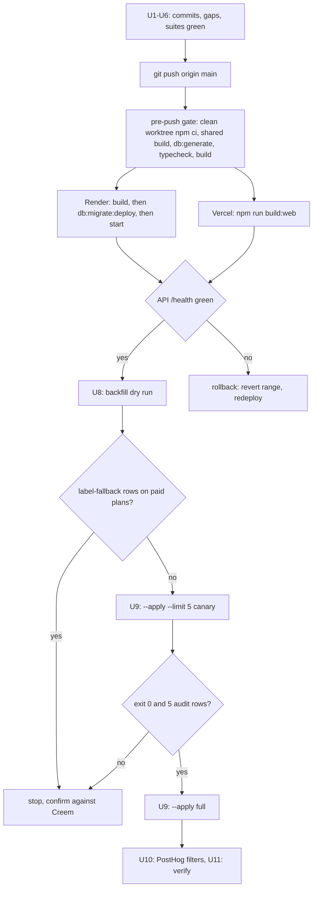

# AGENCY to SCALE Tier Rename Rollout - Plan

## Goal Capsule

- **Objective:** Every AuthHub surface names the top paid tier "Scale", and no paying agency loses quota, billing continuity, or platform access during the change. An operator can confirm this from the billing UI, the Creem dashboard, and `AuditLog` without reading application code.
- **Means:** Land the existing working tree in ordered commits, deploy web and API through the normal push-to-`main` path, then backfill Clerk out of band behind a dry-run gate — per KTD1–KTD7.
- **Authority hierarchy:** Product Contract Requirements govern behavior. Key Technical Decisions govern mechanism. Implementation Units carry local detail only.
- **Stop conditions:** Any dry-run row whose `basis` is `label-fallback` and whose agency is on a paid Creem subscription (R9). Any canary run exit code 1 (R10). Any post-deploy `TIER_LIMITS[tier] is undefined` error in Render logs (R12).
- **Execution profile:** No new feature code. U3 is the only behavior change and follows repo TDD. Content edits, migration SQL, and dashboard work are TDD exceptions.
- **Tail ownership:** `ce-work` executes U1–U6. The operator owns U7–U11 — they touch production data and third-party dashboards.

---

## Product Contract

### Summary

The rename from `AGENCY` to `SCALE` is already written across `packages/shared`, `apps/api`, `apps/web`, and the marketing content. It is uncommitted, produced by two parallel agent sessions in one working tree. This plan ships it: split the tree into reviewable commits, close the gaps the sessions left, push to `main`, let Render apply the data migration at API boot, then backfill Clerk user metadata under an operator gate. It also carries the content and correctness items the rename surfaced but did not cause.

### Problem Frame

The label `AGENCY` meant two different products. Before `20260314_rename_subscription_tiers` it was the $79 mid tier at 120 client onboards. After it, the $149 top tier at 600. That migration rewrote PostgreSQL and skipped Clerk, so Clerk still holds both eras behind one label. `SubscriptionTierSchema` no longer accepts `AGENCY`, and `TIER_LIMITS[tier]` returns `undefined` for any user still holding it, which throws on the quota path. A blind `AGENCY` → `SCALE` rewrite would silently promote pre-March users from a $79 plan's quota to a $149 plan's.

Separately, the marketing copy rewrite that rode along with the rename left claims the repo cannot support, and the blog directory has never been covered by the honesty tests that guard `apps/web/src`.

### Key Decisions

- KD1. PostgreSQL and Clerk are migrated on different schedules, not atomically. Governs R4, R7.
- KD2. The Clerk target tier comes from the quota fingerprint, not the tier label. Governs R8, R9.
- KD3. Content defects found during the audit are reported in this plan, not fixed inside the rename commits. Governs R14, R15, R16.

### Requirements

**Landing the change**

- R1. The working tree ships as ordered, reviewable commits that separate the rename from unrelated edits.
- R2. Files unrelated to the rename (`.gitignore`, untracked tool config, `pnpm-lock.yaml`, `pnpm-workspace.yaml`, `apps/web/clerk.lock`, `output/`, report markdown) stay out of the rename commits.
- R3. `npm run typecheck`, the full API vitest suite, the full web vitest suite, and the shared jest suite each complete one clean run, and their results are recorded before the push.

**Deploy**

- R4. `20260911_rename_agency_tier_to_scale` applies to Neon before the new API code serves traffic.
- R5. The Vercel build resolves `SUPPORTED_PLATFORM_COUNT` from `@agency-platform/shared` without any new build step.
- R6. Creem checkout, webhook ingestion, and the customer portal keep working across the deploy with no Creem-side change.

**Clerk backfill**

- R7. The backfill runs after the API deploy is live and healthy, never before.
- R8. Every rewritten user's target tier is decided by `privateMetadata.quotaLimits.clientOnboards.limit` (36 / 120 / 600 / -1) when that value exists.
- R9. A user resolved by `label-fallback` on a paid subscription is not written until an operator confirms the tier against Creem.
- R10. A `--limit 5` canary run completes with exit code 0 before the unlimited `--apply` run.
- R11. Every write produces an `AuditLog` row with action `AGENCY_SUBSCRIPTION_TIER_BACKFILLED` carrying `previousTier`, `newTier`, and `basis`.

**Verification and reversal**

- R12. No `TIER_LIMITS` lookup failure appears in Render logs in the hour after the backfill.
- R13. Clerk-side `quotaLimits.*.used` counters return to real values after one `syncQuotaUsage` cycle.
- R14. The `agencyaccess-alternative` page stops advertising Growth-only features at the Starter price.
- R15. `apps/web/content/blog` carries no AuthHub SOC 2 claim and no retired AuthHub tier name.
- R16. The `leadsie-vs-authhub-comparison.md` "Other Platforms" pricing column is either sourced or removed.

### Scope Boundaries

**In scope:** committing and deploying the existing rename, the Clerk backfill, the PostHog property rename, and the content items above.

**Deferred:** rewriting `apps/web/content/blog/snapchat-ads-access-agencies.md` (carried from the 2026-09-10 session); adding `apps/api/scripts/**` to the API `tsconfig.json` include set; extending the honesty claims tests to cover `apps/web/content/blog`.

**Outside this change:** renaming Creem products. The product IDs are unchanged and the webhook maps ID to tier, so Creem needs no edit (KTD4).

### Open Questions

- Q1 (blocking U8). Does Clerk currently hold any user with `subscriptionTier` of `AGENCY`, `PRO`, or `ENTERPRISE`? The dry run answers this. If the count is zero, U8 through U10 collapse to a single recorded dry run.
- Q2 (deferred). Should the honesty claims tests be widened to scan `apps/web/content/blog`? The gap is why R15's defects survived.

---

## Planning Contract

### Key Technical Decisions

- KTD1. **Ship the tree as five commits, not one.** The rename touches 60+ files across three workspaces plus docs. One commit makes review and reversal coarse. Split: shared types, API, web, content/marketing, docs. The `.gitignore` and untracked tool config are a separate commit or are left uncommitted. Governs R1, R2.
- KTD2. **The data migration rides the Render deploy; it is not run by hand.** `render.yaml` sets `startCommand: cd apps/api && npm run db:migrate:deploy && npm start`. `prisma migrate deploy` therefore runs on the new container before it serves, and `scripts/migrate-deploy.mjs` strips `-pooler` so Prisma reaches the Neon compute directly. A manual `npm run db:migrate:deploy` before the push would only widen the window in which the old API reads `SCALE` rows it cannot parse. Governs R4.
- KTD3. **API deploys before or with web; never web-first alone.** The migration and the API code move together inside one Render deploy. The web app reads tiers through the API, so a web-only deploy would render `Scale` labels against `AGENCY` data. Pushing both from one commit range to `main` gives Vercel and Render the same SHA. Governs R4, R5.
- KTD4. **Creem is not touched.** `apps/api/src/config/creem.config.ts` and `apps/web/src/lib/analytics/billing.ts` renamed only the record key; `prod_5FEs6qBlwvbMWHHun95wkk` and `prod_6w78r7ZbTUjkJl7mTkNfFr` are unchanged. `webhooks.ts:428` resolves the tier through `getTierFromProductId(subscription.price_id)` with no `AGENCY` literal anywhere in the handler. Governs R6.
- KTD5. **The quota fingerprint outranks the tier label in Clerk.** `privateMetadata.quotaLimits.clientOnboards.limit` never changed meaning across either rename, so 36 / 120 / 600 / -1 identify the real product. The label does not. `basis` is printed per user so a dry run shows which rule fired. Governs R8, R9.
- KTD6. **Clerk and PostgreSQL cannot share a transaction, so reversal is audit-driven.** The backfill writes Clerk first, then the audit row. Each row carries `resourceId` (the Clerk user ID), `previousTier`, and `newTier`, which is everything a reverse script needs. Reversal without those rows is guesswork. Governs R11.
- KTD7. **PostHog historical events are not rewritten.** The `plan` property changes from `agency` to `scale` at the source (`BillingPlanSlug`). Events already captured keep `agency` forever. Dashboards must filter on `plan IN ('agency','scale')` for any window that spans the deploy. Governs the U10 dashboard work.

### High-Level Technical Design



### Sequencing

U1 → U2 → U3 → U4 → U5 → U6 gate the push. U7 is the push. U8 → U9 run only after U7 is verified healthy. U10 and U11 close out. U4, U5, and U6 are independent of each other and can run in parallel.

### Risks and Dependencies

- The pre-push gate runs `npm ci` in a throwaway worktree and will take several minutes. Budget for it; `--no-verify` defeats the exact protection this change needs.
- Render's free plan cold-starts. The migration runs at boot, so a restart during the deploy window re-runs `prisma migrate deploy`, which is a no-op once applied.
- The backfill resets `quotaLimits.*.used` to 0. The 5-minute `syncQuotaUsage` job restores it from `AgencyUsageCounter`. A quota check landing inside that window reads 0 used — permissive, never blocking, and self-healing. Do not run the backfill during a known traffic spike.
- `apps/api/tsconfig.json` sets `include: ["src/**/*"]`, so `npm run typecheck` never type-checks `apps/api/scripts/`. The backfill script is covered by its vitest file only.

---

## Implementation Units

### U1. Separate the rename from the unrelated working-tree changes

- **Goal:** The rename commits contain only rename work.
- **Requirements:** R1, R2.
- **Files:** `.gitignore`; untracked paths listed below.
- **Approach:** The tree carries changes that predate or postdate the rename. Keep these out of the rename commits: `.gitignore` (adds a broad `.env*` rule), `.codex/hooks.json`, `.cursor/hooks.json`, `.entire/settings.json`, `.factory/settings.json`, `.opencode/`, `.pi/`, `.impeccable/critique/`, `.claude/skills/replay-vision-scanner-*`, `pnpm-lock.yaml`, `pnpm-workspace.yaml`, `apps/web/clerk.lock`, `output/`, `dream-cycle-summaries/`, `posthog-self-driving-report.md`, `CONCEPTS.md`, `scripts/verify-meta-config.ts`, `apps/web/next-env.d.ts`.
- **Note on `.gitignore`:** the new line 76 `.env*` is broader than the existing rules at lines 33–38. Already-tracked files (`apps/api/.env.example`, `apps/web/.env.local.example`, and four others) are unaffected, but any **new** `.env*.example` file will be silently ignored. `pnpm-lock.yaml` and `pnpm-workspace.yaml` are particularly worth questioning: this is an npm-workspaces repo and Vercel runs `npm install`.
- **Verification:** `git status --short` shows only rename-related paths staged.

### U2. Commit the rename in ordered commits

- **Goal:** Five commits that a reviewer can read in order.
- **Requirements:** R1.
- **Approach:** Follow the repo's conventional-commit style from `git log --oneline -15`.

| # | Paths | Message |
|---|---|---|
| 1 | `packages/shared/src/types.ts`, `packages/shared/src/__tests__/` | `feat(shared): rename AGENCY tier to SCALE, add SUPPORTED_PLATFORM_COUNT` |
| 2 | `apps/api/src/**`, `apps/api/prisma/schema.prisma`, `apps/api/prisma/migrations/20260911_rename_agency_tier_to_scale/` | `refactor(api): rename AGENCY tier to SCALE with data migration` |
| 3 | `apps/api/scripts/backfill-clerk-tier-agency-to-scale.ts` and its test | `feat(api): gated Clerk subscription-tier backfill script` |
| 4 | `apps/web/src/**` | `refactor(web): rename AGENCY tier to SCALE across billing and marketing` |
| 5 | `apps/web/content/blog/**`, `marketing/**`, `docs/**` | `docs(content): SCALE tier naming, platform count, drop SOC 2 claims` |

- **Verification:** each commit builds on its own where the workspace allows; commit 1 precedes 2 and 4 because both import from it.

### U3. Align the quota-service upgrade path with the middleware — DONE 2026-09-11

> Completed after this plan was drafted: `quota.service.ts` now uses `getNextTierForCheckout` for both `checkQuota` and the error paths, and `getUpgradeUrl` returns `/pricing` when there is no higher tier. 37/37 quota-related API tests pass.

- **Goal:** No surface tells a Scale agency to upgrade to Scale, or links to `/checkout?tier=undefined`.
- **Requirements:** R1.
- **Files:** `apps/api/src/services/quota.service.ts`, `apps/api/src/services/__tests__/quota.service.test.ts`.
- **Approach:** `quota-enforcement.ts:169` was fixed to use `getNextTierForCheckout` and returns `suggestedTier: null` with `upgradeUrl: '/pricing'` at the top tier. `quota.service.ts` was not. Two paths remain inconsistent: `checkQuota` (line ~296) leaves `suggestedTier` `undefined` at SCALE and then interpolates it into `` `/checkout?tier=${suggestedTier}` ``, producing the literal string `undefined`; and the private `getSuggestedTier` (line 225) returns `'SCALE'` for an agency already on SCALE. Replace both with `getNextTierForCheckout` from `@agency-platform/shared` and mirror the middleware's null handling.
- **Consumers to keep working:** `apps/web/src/app/(authenticated)/clients/page.tsx:99`, `apps/web/src/app/(authenticated)/dashboard/page.tsx:251`, `apps/web/src/components/upgrade-modal.tsx:56`. The modal already handles a null `suggestedTier` — `suggestedTier ? TIER_LIMITS[suggestedTier] : null`.
- **Test scenarios:** a SCALE agency over quota gets `suggestedTier` null and `upgradeUrl` `/pricing`; a GROWTH agency gets `SCALE`; a null-tier agency gets `STARTER`.
- **Verification:** `cd apps/api && npx vitest run src/services/__tests__/quota.service.test.ts`.

### U4. Decide the AgencyAccess comparison Starter tier content — DONE 2026-09-11

> `pricingComparison.authhub` now mirrors Starter $29 / Growth $79 / Scale $149 with tier-correct features; the unsupported "Save $528/year" badge is replaced by a sourced Starter-vs-Starter yearly saving ($24 vs $33). Also corrected on that page: AuthHub has intake forms, Shopify, and Klaviyo (were marked missing). U5 blog: third column is now AgencyAccess with every number sourced from comparison-data.ts.

- **Goal:** `/compare/agencyaccess-alternative` stops claiming Growth features at the Starter price.
- **Requirements:** R14.
- **Files:** `apps/web/src/lib/comparison-data.ts` (lines 768–780).
- **Approach:** `agencyAccessAlternativePage.pricingComparison.authhub.starter` is priced `29` and lists "White-label + custom domain" and "API + webhooks included". Both are Growth ($79) features per `PRICING_DISPLAY_TIER_DETAILS` and per `faq-section.tsx:21`. The sibling `leadsieAlternativePage` block at lines 295–302 is already correct and is the shape to copy. This is a content decision, not a code fix: either move those two lines to the `pro` block or reprice. Decide before shipping — the page is live and the claim is false.
- **Verification:** `cd apps/web && npx vitest run src/lib/__tests__/comparison-data.claims.test.ts`.

### U5. Audit `apps/web/content/blog` for stale claims — DONE 2026-09-11

> Fixed after drafting: `agency-security-checklist.md` 163 and 317, `flat-rate-vs-credit-pricing.md` 94, `best-client-onboarding-software-agencies-2026.md` 83. `leadsie-vs-authhub-comparison.md` rewritten: the invented "Other Platforms" column is now AgencyAccess, every competitor number sourced from `comparison-data.ts`, unsourced ROI / AES-256 / CSV claims removed.

- **Goal:** No blog post claims SOC 2 for AuthHub, names a retired AuthHub tier, or prints an unsourced competitor price.
- **Requirements:** R15, R16.
- **Approach:** The honesty tests (`src/components/marketing/__tests__/marketing-honesty.claims.test.ts`, `src/lib/__tests__/comparison-data.claims.test.ts`) scan only paths under `apps/web/src`. `apps/web/content/blog` has never been covered, which is why these survived the rewrite.

Run:

```bash
cd apps/web
grep -rniE "soc ?2" content/blog
grep -rniE "agency (tier|plan)|\\\$149" content/blog
grep -rn "platform" content/blog | grep -E "[0-9]+\+? platform"
```

Known hits to triage:

| File | Line | Issue |
|---|---|---|
| `content/blog/agency-security-checklist.md` | 163 | `\| SOC2 compliance \| Difficult \| Built-in \|` claims AuthHub is SOC 2 built-in |
| `content/blog/agency-security-checklist.md` | 317 | implies AuthHub customers can produce SOC 2 documentation |
| `content/blog/flat-rate-vs-credit-pricing.md` | 94, 152 | "Agency tier at $149/mo" / "Agency $149/mo" — retired AuthHub tier name; file untouched by this change set |
| `content/blog/best-client-onboarding-software-agencies-2026.md` | 83 | "Agency $149/mo ($124/mo billed yearly)" — file was edited, but only to append an FAQ |
| `content/blog/leadsie-vs-authhub-comparison.md` | 63, 211–213 | "Other Platforms" column ($149 / $299 / Custom) has no named source |

Distinguish carefully: SOC 2 mentions that describe a *prospect's* requirement (`linkedin-ads-access-agency.md:403`, `ga4-access-agencies.md:256`, `how-to-revoke-client-access-offboarding.md:62`) are true statements about the market and may stay. Only AuthHub-capability claims are defects.

- **Verification:** the three greps return no AuthHub-capability hit.

### U6. Run every suite end to end and record the result

- **Goal:** A recorded baseline, not an assumption, before the push.
- **Requirements:** R3.
- **Approach:** 19 web/API test files were renamed mechanically and neither full suite has been run since. Run them serially — three concurrent vitest runs on one machine cause 5000 ms timeouts that look like real failures.

```bash
npm run typecheck
cd packages/shared && npx jest
cd ../../apps/api && npx vitest run
cd ../web && npx vitest run
```

**Baseline already measured (2026-09-11, this plan's research pass):**

| Run | Result |
|---|---|
| `npm run typecheck` (5 workspaces) | clean, exit 0 |
| 13 rename-touching API test files, run in isolation | 185/185 passed |
| 22 rename-touching web test files, run in isolation | 102/102 passed |
| Full API suite, run under load | 7 files failed on one run, 13 on another — a different set each time, all 5000 ms timeouts |
| Full API suite, run alone (parent session, 2026-09-11) | 143 files, 1318 passed, 19 skipped, 0 failed |
| Full web suite (parent session, 2026-09-11) | 174 files, 912 passed, 2 skipped, 1 failed — `access-requests/[id]/success` copy-link analytics test; file untouched since 2026-09-07, unrelated to the rename |

The rename-touching set includes `scripts/__tests__/backfill-clerk-tier-agency-to-scale.test.ts` (21 tests), `marketing-honesty.claims.test.ts` (13), `comparison-data.claims.test.ts` (7), and `ComparisonPageTemplate.claims.test.ts` (8). Every test that covers the rename passes.

- **Known noise:** the full API suite's failures are load contention, not defects. The failing set is not stable between runs and includes `auth.middleware.test.ts`, `rate-limit-auth.test.ts`, and various `*.security.test.ts` files — none of which touch tiers. Five of them (`dashboard.routes`, `internal-admin.routes`, `usage`, `webhooks`, `subscriptions.checkout`) do touch the rename and all five pass when run alone. Do not run the two full suites concurrently.
- **Note:** `--reporter=basic` is not a valid reporter in this vitest version. It fails at startup and still exits 0, which silently reports a green run that never executed. Use the default reporter.
- **Remaining work for this unit:** complete one clean full-web-suite run and one clean full-API-suite run on an idle machine.
- **Verification:** all four commands recorded with their pass/fail counts.

### U7. Push to `main` and let both platforms deploy

- **Goal:** Vercel and Render serve the same SHA, with the migration applied.
- **Requirements:** R4, R5, R6.
- **Approach:**

```bash
git push origin main
```

The committed pre-push gate (`.githooks/pre-push`, active via `core.hooksPath=.githooks`) intercepts this. For a push to `refs/heads/main` it checks out the pushed SHA into a throwaway worktree and runs `npm ci`, `npm run build --workspace=packages/shared`, `npm run db:generate --workspace=apps/api`, `npm run typecheck`, and `npm run build`. This is what proves R5: the gate builds `packages/shared` from the pushed SHA before typechecking the web app, so the new `SUPPORTED_PLATFORM_COUNT` export must resolve there before the push is allowed. Nothing further is needed for Vercel — root `vercel.json` runs `npm run build:web`, which builds shared first. `packages/shared/dist` being gitignored is correct and requires no change.

Render then runs its own build and `startCommand: cd apps/api && npm run db:migrate:deploy && npm start`, so `20260911_rename_agency_tier_to_scale` applies before the new API serves.

- **Verification:** Render deploy log shows `[db:migrate:deploy] Running prisma migrate deploy using direct endpoint...` followed by the migration name, then a green `/health`. Vercel build succeeds.

### U8. Clerk backfill — dry run

- **Goal:** Know exactly which Clerk users would be rewritten, and on what basis, before anything is written.
- **Requirements:** R7, R8, R9.
- **Approach:** Run only after U7 is verified healthy. Set that environment's `CLERK_SECRET_KEY` and `DATABASE_URL` explicitly in the shell; do not rely on a local `.env`.

```bash
cd apps/api
npx tsx scripts/backfill-clerk-tier-agency-to-scale.ts
```

Read every printed row. Each carries its `basis`. Rows resolved by `quota-fingerprint` are safe. Rows resolved by `label-fallback` are the risk KTD5 exists for: a `label-fallback` row reading `AGENCY` is rewritten to `SCALE` by the name map, and if that user is a pre-March $79 customer the rewrite hands them a $149 plan's quota. Cross-check each such row against Creem before proceeding. Rows reported as `unmapped` are never guessed at and need a manual decision.

- **Gate:** zero unresolved `label-fallback` rows on paid subscriptions.
- **Verification:** dry-run output saved; nothing written.

### U9. Clerk backfill — canary, then apply

- **Goal:** Every stale Clerk user holds a live tier.
- **Requirements:** R10, R11.
- **Approach:**

```bash
cd apps/api
npx tsx scripts/backfill-clerk-tier-agency-to-scale.ts --apply --limit 5   # canary
# confirm 5 AuditLog rows, then:
npx tsx scripts/backfill-clerk-tier-agency-to-scale.ts --apply
```

Between the two, confirm in Prisma Studio that five `AuditLog` rows exist with action `AGENCY_SUBSCRIPTION_TIER_BACKFILLED`, each carrying `previousTier`, `newTier`, and `basis`, with `resourceType` `clerk_user` and `resourceId` set to the Clerk user ID. Selection is self-limiting — a rewritten user holds a live tier and is not selected again — so a repeat run is a no-op and is safe after a partial failure. Exit code 1 means at least one Clerk update or audit insert failed; read the `auditFailed` section, because a user listed there **was** moved and will not be re-selected.

- **Gate:** canary exits 0 with 5 audit rows.
- **Verification:** a second full `--apply` selects zero users.

### U10. Update PostHog filters — DRY RUN DONE 2026-09-11, nothing to apply

> Dry run executed against project 309879 with a personal key: 11 insights, 2 dashboards, 0 cohorts, 0 actions, 0 feature flags, 0 experiments scanned; 0 objects filter on `plan = agency`. The only "agency" hit is the `agency_created` event name in "Core Activity Trends". No `--apply` needed. Re-run the dry run before launch if anyone saves new insights in the meantime. The key used was pasted into a chat session and should be rotated.

- **Goal:** Billing dashboards keep working across the rename boundary.
- **Requirements:** none — dashboard-side only.
- **Approach:** The `plan` event property changes from `agency` to `scale` at the source (`apps/web/src/lib/analytics/billing.ts`, `BillingPlanSlug`). Events already captured keep `agency` permanently; no code change can alter them. Update every insight filtering on `plan = 'agency'` to `plan IN ('agency','scale')` for the seven billing events: `pricing_viewed`, `plan_selected`, `billing_checkout_started`, `subscription_started`, `billing_checkout_failed`, `trial_started`, `cap_hit`.
- **Verification:** a subscription-started breakdown by `plan` over a window spanning the deploy shows one continuous series.

#### Runbook — `apps/api/scripts/posthog-rename-plan-filters.ts`

Doing this by hand means opening every saved object in the project and reading its filter JSON. The script does it against the PostHog REST API instead. Default mode is `widen`: an `exact` match on `agency` becomes an `exact` match on `['agency','scale']`, and a HogQL `plan = 'agency'` becomes `plan IN ('agency', 'scale')`. History is kept, which is what the verification above asks for. `--mode=replace` swaps `agency` → `scale` outright and is only correct for an object that should deliberately drop pre-deploy events.

The key is never committed and never added to `apps/api/src/lib/env.ts`. Export it for the run and let the shell forget it.

```bash
cd apps/api
export POSTHOG_PERSONAL_API_KEY=...          # personal API key (phx_...), not a project key
# POSTHOG_HOST defaults to https://us.posthog.com, POSTHOG_PROJECT_ID to 309879

# 1. Dry run. Writes nothing. Prints a table and a JSON report.
npx tsx scripts/posthog-rename-plan-filters.ts --report ./posthog-plan-filter-report.json

# 2. Review the report before any write.
jq '{matched: [.matched[] | {type, id, name, paths: [.matches[].path]}], manual, unavailable}' \
  ./posthog-plan-filter-report.json

# 3. Canary: change exactly one object, then look at it in the PostHog UI.
npx tsx scripts/posthog-rename-plan-filters.ts --apply --limit 1

# 4. Full run.
npx tsx scripts/posthog-rename-plan-filters.ts --apply

# 5. Idempotence check: a second dry run must report matched = 0.
npx tsx scripts/posthog-rename-plan-filters.ts
```

The personal API key needs read **and** write scopes for `insight`, `dashboard`, `cohort`, `action`, `feature_flag` and `experiment`. A collection the key cannot read is listed under `unavailable` in the report rather than being skipped silently.

**What to check in the PostHog UI after the run**

1. Open the object the canary changed. Its filter pill should read `plan = agency or scale`, or the HogQL should read `plan IN ('agency', 'scale')`.
2. Open the `subscription_started` insight, break down by `plan`, and set the window to span the deploy date. One continuous series, no cliff at the boundary. This is U10's verification gate.
3. Re-check the other six billing events the rename touches: `pricing_viewed`, `plan_selected`, `billing_checkout_started`, `billing_checkout_failed`, `trial_started`, `cap_hit`.
4. Read the `manual` block in the report and fix those by hand. Two things land there:
   - An operator the script will not widen (`icontains`, `regex`, …), because turning it into a value list would change what the filter means.
   - A match inside a field the documented PATCH body does not accept. The main case is an **insight's legacy `filters` blob**: `GET /insights/:id/` still returns it, but the PATCH parameters are `name, derived_name, query, order, deleted, dashboards, description, tags, favorited` — no `filters`. Writing it would return 200 and change nothing, so the script refuses and reports it. Open those insights and edit them in the UI.
5. Confirm the `failed` block is empty. A verification failure there means the PATCH was accepted but the re-fetch still showed `plan = 'agency'`.

**Caveats**

- **Saved objects created after the run must use `scale`.** The script is a one-off repair, not a guard. Anything new should filter on `plan = 'scale'` alone, or on `plan IN ('agency','scale')` when the chart is meant to span the rename boundary. Nothing enforces this.
- **Historical events are never rewritten** (KTD7). This changes filters only.
- **Alerts, subscriptions, notebooks and session-recording playlists are not covered.** They are separate REST collections with their own filter shapes; if one of them filters on `plan`, fix it in the UI.
- An insight embedded in a dashboard tile is patched once, through `/insights/:id/`. The dashboard walk prunes `tiles[*].insight` so the same object is never written through two endpoints.
- Dashboards are re-read individually, because the list serializer returns neither `tiles` nor `filters`. A project with many dashboards makes proportionally more requests; PostHog's CRUD limit is 480/minute per organization.

**Tests:** `cd apps/api && npx vitest run scripts/__tests__/posthog-rename-plan-filters.test.ts`

### U11. Post-deploy verification

- **Goal:** Prove the rollout landed.
- **Requirements:** R12, R13.
- **Approach:** See the Verification Contract below.

---

## Verification Contract

| Gate | Command or check | Applies to |
|---|---|---|
| Types | `npm run typecheck` | U6 |
| Shared | `cd packages/shared && npx jest` | U6 |
| API | `cd apps/api && npx vitest run` | U3, U6 |
| Web | `cd apps/web && npx vitest run` | U4, U6 |
| Claims | `cd apps/web && npx vitest run src/lib/__tests__/comparison-data.claims.test.ts src/components/programmatic src/components/marketing` | U4, U5 |
| Blog | the three greps in U5 return no AuthHub-capability hit | U5 |
| Build gate | the pre-push hook passes without `--no-verify` | U7 |
| Migration | Render log shows `20260911_rename_agency_tier_to_scale` applied | U7 |
| Data | `SELECT tier, count(*) FROM subscriptions GROUP BY tier;` returns no `AGENCY` | U7 |
| Data | `SELECT subscription_tier, count(*) FROM agencies GROUP BY subscription_tier;` returns no `AGENCY` | U7 |
| Clerk | a second full `--apply` selects zero users | U9 |
| Audit | `AuditLog` row count for `AGENCY_SUBSCRIPTION_TIER_BACKFILLED` equals the dry-run candidate count | U9 |
| Runtime | no `TIER_LIMITS`/`undefined` tier error in Render logs for one hour after U9 | U11 |
| Quota | after one `syncQuotaUsage` cycle (5 min), a backfilled agency's Clerk `quotaLimits.clientOnboards.used` matches `AgencyUsageCounter` | U11 |
| Billing | `/settings/billing` for a SCALE agency renders "Scale", $149, and the correct limits | U11 |
| Checkout | a Creem checkout for `prod_5FEs6qBlwvbMWHHun95wkk` completes and the webhook writes `SCALE` | U11 |

### Rollback

Follow the pattern of `20260314_rename_subscription_tiers`: forward-only SQL, reversed by a new migration rather than by rewinding.

1. **Web or API broken.** `git revert` the commit range and push. Render redeploys; the migration is already applied and is not undone by the revert, so the reverted API would then read `SCALE` rows it cannot parse. Prefer a fix-forward for anything smaller than an outage.
2. **Database.** Write a new migration with `UPDATE "subscriptions" SET "tier" = 'AGENCY' WHERE "tier" = 'SCALE';` and the matching `agencies` statement. Do not edit or delete the applied migration directory — `prisma migrate deploy` checksums it.
3. **Clerk.** Reversal requires the audit rows. Each `AGENCY_SUBSCRIPTION_TIER_BACKFILLED` row carries `resourceId` (the Clerk user ID) and `metadata.previousTier`. A reverse script replays those pairs through `clerkMetadataService.setSubscriptionTier`. Without them there is no record of which users were on which tier, because Clerk keeps no history and Clerk and PostgreSQL share no transaction (KTD6). **Do not prune `AuditLog` before the change is considered settled.**
4. **PostHog.** Nothing to roll back. Historical `agency` values were never rewritten.

---

## Definition of Done

**Global**

- The working tree is clean of rename-related changes and the unrelated paths in U1 are either committed separately or consciously left alone.
- Four suites recorded green, or every failure explained and attributed to something other than the rename.
- Vercel and Render serve the same SHA; both Data gates return no `AGENCY`.
- A second full `--apply` selects zero Clerk users.
- No `TIER_LIMITS` lookup failure in Render logs for one hour after the backfill.
- No abandoned or experimental code from this rollout remains in the diff.
- `docs/SESSION-LOG.md` carries the session entry and `docs/DECISIONS.md` carries the DEC for the split-migration strategy.

**Per unit**

| Unit | Done when |
|---|---|
| U1 | `git status --short` shows only rename paths staged |
| U2 | five commits exist in the stated order |
| U3 | a SCALE agency over quota receives `suggestedTier: null` and `upgradeUrl: '/pricing'` from both the middleware and `quota.service` |
| U4 | the AgencyAccess Starter block lists no Growth-only feature |
| U5 | the three greps return no AuthHub-capability hit |
| U6 | four suite results recorded |
| U7 | migration applied, `/health` green, Vercel green |
| U8 | dry-run output saved, zero unresolved `label-fallback` rows on paid plans |
| U9 | canary exit 0 with 5 audit rows, then full apply, then a re-run selects zero |
| U10 | a `plan` breakdown spanning the deploy shows one continuous series |
| U11 | every Runtime, Quota, Billing, and Checkout gate passes |
