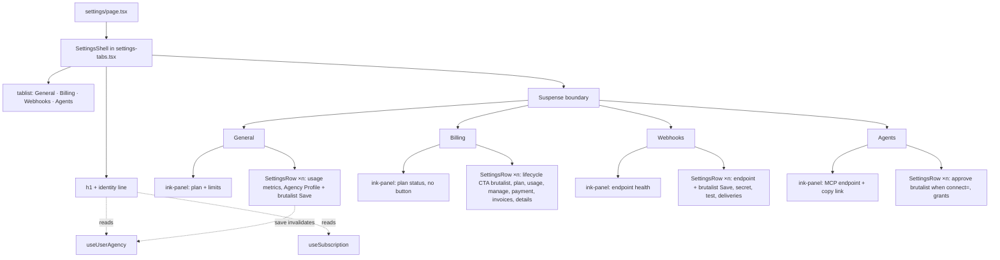

# Settings Page Revamp - Plan

## Goal Capsule

- **Objective:** An agency operator opens Settings and reads it as one calm, on-system workspace: the page states who they are and what plan they are on, each tab is a flat list of labelled rows, and the one thing to press on each tab is unmistakable. Nothing on the page claims a feature that does not exist.
- **Means:** Rebuild the visual and interaction layer of the four existing tabs on Design System v2.0 with a shared `SettingsRow` primitive, one `.ink-panel` strip per tab, and one `brutalist` button per tab (KTD1, KTD2, KTD4, KTD5). Data hooks, mutations, analytics, and checkout calls stay as they are.
- **Authority:** This plan governs scope and structure. `apps/web/DESIGN_SYSTEM.md` v2.0 governs every token, radius, shadow, and variant choice. `CLAUDE.md` governs TDD and session protocol. Where the plan and `DESIGN_SYSTEM.md` disagree, `DESIGN_SYSTEM.md` wins.
- **Stop conditions:** Stop and surface if a unit needs a new API route, a Prisma change, a change to a Creem call, or a change to a shared component's exported props (R12). Stop if a design-contract test can only pass by weakening the validator in `apps/web/src/test/utils/design-system.ts`.
- **Execution profile:** Test-first per unit. Design-contract tests go red before markup changes.
- **Tail ownership:** The implementer appends to `docs/SESSION-LOG.md`, adds DEC-008 to `docs/DECISIONS.md`, and runs the visual QA gate (U8).

---

## Product Contract

### Summary

Redesign the authenticated Settings page (`apps/web/src/app/(authenticated)/settings`) so it follows Design System v2.0 and reads as a single operational document rather than a stack of generic cards. Keep the four tabs and the `?tab=` URL contract. Replace card wrappers with hairline rows, add one dark ink-panel strip per tab, reduce shadows to the budget, and remove two placeholder cards that promise features the product does not have.

### Problem Frame

The current page ships 80+ intermediate radii, nine hard shadows, a soft-shadow `.clean-card` on every section, a gradient, `font-dela` on plan names, and 22 generic Tailwind colours. Every General card repeats the same icon-tile header. The Team Members card is a "coming soon" placeholder and the Notifications card fakes a save with a timer. The page header copy is generic. The result is off-system and could be any SaaS tool, which the design principles name as failure.

### Key Decisions

- **`apps/web/DESIGN_SYSTEM.md` v2.0 is the canonical design system; root `design.md` / `DESIGN.md` are stale.** The code and `globals.css` already implement v2.0. (session-settled: user-directed — chosen over root `design.md`: it predates v2.0 and would require re-tokenising the app.) Governs R1, R2, R3, R13.
- **Keep the four tabs and the `?tab=` URL model.** (session-settled: user-directed — chosen over routes-per-section and a full rebuild: external links and tests depend on `?tab=`, and billing/webhook logic works today.) Governs R6, R7.
- **Mood is utilitarian.** Flat regions, mono data layer, one tactile control per view. (session-settled: user-directed — chosen over editorial, brutalist, technical: matches the "Operational Signal" north star and the flat-workspace rule.) Governs R4, R5.
- **Remove the Team Members placeholder and the fake-save Notifications card.** (session-settled: user-directed — chosen over keeping them restyled or wiring Notifications to an API: both cards claim behaviour that does not exist.) Governs R10.

### Requirements

**Design-system compliance**

- R1. Every element under `apps/web/src/components/settings/**` and `settings/page.tsx` uses binary radius: `rounded-none` (default) or `rounded-full` for circles and pills. No `rounded-{sm,md,lg,xl,2xl,3xl}` and no arbitrary radius.
- R2. Each rendered tab view carries at most three elements whose class matches `shadow-brutalist`, and only on interactive elements. `Button` variants `primary`, `danger`, and `brutalist` each count as one because `apps/web/src/components/ui/button.tsx` attaches the shadow. Static containers carry a 1px border or a hairline, never a shadow.
- R3. No `gray-` classes (checked by a separate assertion; `gray` is not in the validator's list) and none of the `GENERIC_COLORS` families in `apps/web/src/test/utils/design-system.ts` (`slate`, `indigo`, `green`, `red`, and the rest). No gradients, no `font-dela`, no `.clean-card`, and no `transition-all` in settings components. Status text uses `text-success-ink`, `text-danger-ink`, `text-warning`.
- R4. Each rendered tab view contains exactly one `.ink-panel` strip and at most one `Button variant="brutalist"`. The brutalist button never renders inside the ink-panel. All other buttons use `secondary`, `ghost`, or `danger`; `primary` is allowed only where the shadow budget in R2 still holds.
- R5. Section headings use Outfit via `font-display` at title size; mono `.label-micro` carries metadata, status, and the page identity line. No icon-tile headers and no uppercase eyebrows as section scaffolding.

**Structure and navigation**

- R6. The page keeps `?tab=general|billing|webhooks|agents`. A missing or unknown value renders General without rewriting the URL. Other query params (`checkout`, `connect`) are preserved on tab change.
- R7. The tab rail uses `role="tablist"` / `role="tab"` with `aria-selected`, Left/Right/Home/End key movement, the two-ring focus classes copied from `Button` base styles (no global `button` focus rule exists), and no icons. The billing prefetch fires on both hover and focus.
- R8. Every settings section renders as a `SettingsRow`: label and description in the left column, control in the right column at `md` and above, stacked full-width below `md`. Rows are separated by `.hairline-b`. No horizontal scroll at 320, 390, 768, or 1440 px, verified by the render gate (U8).
- R9. The page header shows `Settings` as `h1` plus one mono identity line: agency name · plan name · agency id. Values that are not loaded render as `—` without layout shift.
- R9a. The settings container uses the same `max-w-7xl` width as the other authenticated pages. Only text inputs carry a narrower cap.
- R10. The General tab renders the usage strip and the Agency Profile rows only. `team-members-card.tsx` and `notifications-card.tsx` are no longer rendered.

**Behaviour preservation**

- R11. All data hooks, mutations, analytics calls, Creem checkout and portal calls, the `checkout=success` toast, the `connect=<clientId>` agent approval flow, and the legacy billing branch (`NEXT_PUBLIC_BILLING_V2_ENABLED === 'false'`) keep their current behaviour. Restructuring a component's loading or error render branch so it shares the same shell is a layout change and is allowed; changing what a hook fetches or what a handler does is not.
- R12. `WebhookDeliveryInspector`, `WebhookStatusBadge`, `AgentGrantCard`, and `UsageOverviewCard` keep their exported names and props. `settings/page.tsx` keeps the literal string `UsageOverviewCard`, and `usage-overview-card.tsx` keeps the literal `/settings?tab=billing`.
- R13. Every `useSearchParams` consumer (`settings-tabs.tsx`, `billing-tab.tsx`, `agents-settings-tab.tsx`, `checkout-success-toast.tsx`) stays inside the page's Suspense boundary so `next build` prerenders without a CSR bailout error.

### Success Criteria

- A settings-wide design-contract test that imports `validateDesignSystem` from `apps/web/src/test/utils/design-system.ts` and adds the regex assertions in KTD7 passes for every file under `apps/web/src/components/settings/**`.
- `next build` for `apps/web` succeeds locally.
- The visual QA gate returns PASS or PASS-WITH-NITS at 1440, 768, 390, and 320 px for all four tabs in the light theme.

### Scope Boundaries

- No new API routes, no Prisma changes, no Creem changes.
- No changes to the sidebar, `(authenticated)/layout.tsx`, or the trial banner.
- No changes to `apps/web/src/components/ui/stat-card.tsx` even though it carries `rounded-sm` and `shadow-sm`.

#### Deferred to Follow-Up Work

- Real team management (Clerk organization members) to replace the removed placeholder.
- Persisted notification preferences (Prisma field, API route, hook) to replace the removed fake form.
- Delete `.clean-card` from `globals.css` once no consumer remains; update the "still available for settings surfaces" line in `DESIGN_SYSTEM.md`.
- Regenerate or delete root `design.md` / `DESIGN.md` from v2.0 tokens. This plan only marks them stale (U8).
- Fix `stat-card.tsx` radius and shadow.
- Replace `window.location.href` navigation in `UsageDisplayInline` with `Link`.

### Acceptance Examples

- AE1. **Covers R6.** Given `/settings?tab=foo`, when the page renders, then the General tab is active and the URL still reads `?tab=foo`.
- AE2. **Covers R6, R11.** Given `/settings?tab=billing&checkout=success`, when the page renders, then the Billing tab is active, the success toast shows, and after the toast clears the URL keeps `tab=billing`.
- AE3. **Covers R9.** Given `useUserAgency` is loading and `useSubscription` has resolved to `tier: null`, when the header renders, then the identity line reads `— · Free · —` in mono.
- AE4. **Covers R4.** Given the Billing tab in the PAID lifecycle with the v2 layout, when it renders, then exactly one button carries the `brutalist` class set (the lifecycle action in the first row under the hero strip), exactly one element has class `ink-panel`, and the brutalist button is not a descendant of that element.
- AE5. **Covers R8.** Given the render gate at 320 px, when each tab is captured, then the page shows no horizontal scroll and each Agency Profile input spans the content width.
- AE6. **Covers R11.** Given `NEXT_PUBLIC_BILLING_V2_ENABLED=false`, when the Billing tab renders, then all seven legacy cards render as rows in the same order as today, with no ink-panel and no brutalist button.
- AE7. **Covers R4.** Given the Agents tab with `connect=abc`, when it renders, then exactly one brutalist button exists and its text is "Approve agent"; given no `connect` param, no brutalist button exists and "Copy endpoint" renders as a mono link inside the ink-panel.

---

## Planning Contract

### Key Technical Decisions

- KTD1. **A shared `SettingsRow` primitive replaces `.clean-card` sections.** One component in `apps/web/src/components/settings/settings-row.tsx` with `label`, `description`, optional `id`, and `children` for the control; `md:grid-cols-[minmax(0,2fr)_minmax(0,3fr)]` above `md`, single column below. `webhook-settings-card-shell.tsx` becomes a thin wrapper over it so the webhook tests keep their heading text. Governs R8. Chosen over per-tab layouts because one primitive makes the radius, hairline, and breakpoint rules testable in one place.
- KTD2. **One `SettingsShell` owns the header, identity line, tab rail, and Suspense.** `settings-tabs.tsx` is rewritten in place (same export name) so `settings/page.tsx` stays small. The identity line reads `useUserAgency` (`['user-agency']` key) for name and DB id and `useSubscription` for the plan. The plan name derives through `resolveBillingLifecycle` first: `FREE` lifecycle reads "Free", otherwise `SUBSCRIPTION_TIER_NAMES[tier]` (pattern: `tierName` in `current-plan-card.tsx`). `AgencyProfileCard` save invalidates `['user-agency']` so the header does not go stale; that card gains a `useQueryClient` call, so its test must render inside a `QueryClientProvider`. Governs R7, R9, R13. Chosen over Clerk `orgId` for the id because personal workspaces have no `orgId`.
- KTD3. **The `Reveal` wrapper is removed from Settings.** No other authenticated page uses it; the flat-workspace rule and the "one hero animation per page" rule both point away from it. Governs R5. The page-level skeleton stays, restyled square.
- KTD4. **Ink-panel content per tab.** Every panel keeps one shell across loading, error, and loaded states and renders `—` for unloaded values; no panel returns a different section while loading. General = plan name, status, and tier limits from `useSubscription` / `useTierDetails`, which resolve for both organisation and personal principals; the `useQuota` usage metrics render as rows below the panel with the existing "requires an active organization context" copy in that row when `orgId` is null. Billing = plan name, status, next bill or trial end from `useSubscription`. Webhooks = endpoint URL and last delivery status, or the existing "No endpoint is configured yet" copy when absent. Agents = MCP endpoint URL with a "Copy endpoint" mono link. Governs R4. The panel is the single dark surface per view and carries the `.label-micro` / `.label-nano` mono layer. Chosen over a `useQuota` strip on General because `useQuota` is `enabled: !!orgId` and would leave personal workspaces with a dead hero.
- KTD5. **Brutalist button assignment per tab.** The brutalist button always sits in the row layer, never on the ink ground, because its black border and black hard shadow vanish on `--ink` in the light theme. General = "Save changes" on Agency Profile. Billing = the lifecycle action (start trial, activate, upgrade, or open portal) in the first row under the hero strip; all other billing CTAs are `secondary`. Webhooks = the existing "Create Endpoint" / "Save Endpoint" button (labels unchanged). Agents = "Approve agent" only when `connect=` is present; with no pending approval the Agents view has no brutalist button. Governs R4. Chosen so the primary action is the one the operator came to press, not the loudest.
- KTD6. **The legacy billing branch keeps its seven cards as rows and gains no hero.** `BillingTab` keeps both branches. The legacy branch renders no ink-panel and no brutalist button; R4 and AE4 apply to the v2 branch only. Governs R11. Chosen over adding the hero because the hero carries a checkout or portal CTA the legacy layout never had.
- KTD7. **Design-contract enforcement splits into a source walker and rendered counts.** The source walker (`settings.design.test.ts`) reads every `.tsx` under `components/settings` (excluding `__tests__`) and asserts `validateDesignSystem` on the whitespace-split class tokens plus regex assertions on the raw text: no `\brounded-(sm|md|lg|xl|2xl|3xl)\b`, no `rounded-\[`, no `\bshadow-(sm|md|lg|xl|2xl|3xl)\b`, no `\bgray-\d`, no `clean-card`, no `bg-gradient`, no `font-dela`, no `transition-all`. The regexes exist because the validator's exact-token match misses classes adjacent to quotes or JSX delimiters. Per-view counts of `.ink-panel`, the brutalist class set (`uppercase` + `bg-coral` + `border-2`), and `/shadow-brutalist/` are rendered assertions: each tab renders with mocked hooks (Billing per lifecycle, Agents with and without `connect=`) and the test counts matching elements. This is the first consumer of `apps/web/src/test/utils/design-system.ts`. Governs R1, R2, R3, R4. Chosen over source-only counts because conditional variants and `Button`-carried shadows are invisible to source text.
- KTD8. **`plan-comparison.tsx` keeps its layout contract.** `lg:grid-cols-2 xl:grid-cols-3` stays; no `overflow-x-auto`, no `min-w-[280px]`, no `-top-3` / `-right-3`. Tier names and prices keep coming from `PRICING_DISPLAY_TIER_ORDER` and `PRICING_DISPLAY_TIER_DETAILS`. The seven shadows drop to one (the recommended tier's CTA), `font-dela` becomes `font-display font-semibold`, and generic greys become `text-muted-foreground` / `border-border`. Governs R1, R2, R3, R11.

### Hallmark structural fingerprint

- Genre: modern-minimal, on the project's own v2.0 system (no catalog theme; the system is locked).
- Macrostructure: **Index-First** applied to an app page. The page is a categorised list of rows with hairline dividers. No hero, no marketing rhythm.
- Nav and footer: not applicable. The app sidebar and layout own them.
- Enrichment: none. Typography and the ink-panel carry the page.
- Motion: tab underline colour change at 150 ms, button lift 2 px on hover, and the checkout toast's 450 ms opacity reveal. Nothing else. Reduced motion is handled by one scoped rule added to `globals.css` under the existing `@media (prefers-reduced-motion: reduce)` block that sets `transform: none` on hovered buttons inside the settings shell. Settings source never uses `motion-reduce:` utilities because `validateDesignSystem` substring-matches `-red` inside `motion-reduce`.
- One brutalist element per view: the `.ink-panel` strip. The `brutalist` button is the tactile control, not a second brutalist surface, and it never sits on the ink ground (KTD5).
- Copy: sentence case; verbs on buttons; existing button labels that tests assert stay verbatim ("Create Endpoint", "Save Endpoint"); no "Manage your agency settings and preferences"; the identity line replaces the subtitle.
- Stamp, two lines at the top of `settings-tabs.tsx`: `/* Hallmark · genre: modern-minimal · macrostructure: Index-First · design-system: DESIGN_SYSTEM.md v2.0 · designed-as-app */` and `/* Hallmark · pre-emit critique: P_ H_ E_ S_ R_ V_ */` where the six letters are Philosophy, Hierarchy, Execution, Specificity, Restraint, Variety scored 1–5 by the implementer. The critique line is a self-assessment, not evidence; the render gate is the evidence. `.hallmark/log.json` and `~/.claude-os/design/choices-log.json` get one entry with `"scope": "app"`.

### High-Level Technical Design

### Assumptions

- Unknown `?tab=` values render General silently. No redirect.
- The agency id on the identity line is the agency DB id from `useUserAgency`, not the Clerk `orgId`.
- The three ad-hoc `/api/agencies?clerkUserId=` queries in profile, webhooks, and agents collapse onto `useUserAgency` only where doing so does not change request shape; otherwise they stay.
- All strings currently asserted by `findByText` / `getByText` in existing tests stay verbatim.
- No role gating exists in Settings today (verified by grep); none is added.
- `checkout=cancel` keeps its current behaviour: analytics only, no visible message.
- `team-members-card.tsx` and `notifications-card.tsx` are deleted in U4. No test references them, their only importers are `page.tsx` and `general/index.tsx`, and keeping unrendered files would force the walker to restyle dead code. The Deferred section already plans their replacements.
- The visual QA gate runs in the light theme, the primary experience.

### Sequencing

U1 first (red tests). U2 and U3 next in either order. U4 through U7 depend on U2 and U3 and can run in parallel. U8 last.

### Risks

- `webhook-settings-tab.tsx` (549 lines) and `manage-subscription-card.tsx` (422 lines) are large. Restyling them risks accidental logic edits. Mitigation: the existing behaviour tests for both run after every change, and diffs are reviewed for non-className changes.
- `usage-overview-location.test.ts` reads source text. Renaming `UsageOverviewCard` or the billing link breaks the dashboard suite. Mitigation: R12.
- The AGENCY→SCALE rename touched billing files on 2026-09-11. Mitigation: KTD8 pins the shared-constant sources; no tier literals in JSX.

---

## Implementation Units

### U1. Red contract tests for the whole settings tree

- **Goal:** Encode R1–R4, R6, R7, R9, R12, R13 as failing tests before any markup changes.
- **Requirements:** R1, R2, R3, R4, R6, R7, R9, R12, R13
- **Dependencies:** none
- **Files:**
  - Create `apps/web/src/components/settings/__tests__/settings.design.test.ts`
  - Create `apps/web/src/components/settings/__tests__/settings-view-counts.test.tsx`
  - Create `apps/web/src/components/settings/__tests__/settings-tabs.test.tsx`
  - Create `apps/web/src/components/settings/__tests__/settings-row.test.tsx`
  - Modify `apps/web/src/components/settings/billing/__tests__/cancel-subscription-modal.design.test.tsx` (add `gray-` to the forbidden list)
- **Approach:**
  1. `settings.design.test.ts` walks `components/settings/**/*.tsx` (excluding `__tests__`) with `path.resolve(__dirname, …)` and applies the validator plus the regex list in KTD7 to each file.
  2. `settings-view-counts.test.tsx` renders each tab with mocked hooks (Billing in FREE, TRIALING, PAID, and legacy; Agents with and without `connect=`) and asserts the per-view counts in KTD7: one `.ink-panel`, at most one brutalist class set outside the panel, at most three `/shadow-brutalist/` matches.
  3. `settings-tabs.test.tsx` mocks `next/navigation`, `useUserAgency`, `useSubscription`, and `usePrefetchBillingData`.
  4. `settings-row.test.tsx` renders the primitive and asserts label, description, control association, and hairline class.
- **Execution note:** The behaviour-change tests must fail on the current tree; confirm red before U2. The R12 preservation assertions and the `checkout=success` scenario are guard tests and are green on both trees.
- **Patterns to follow:** `apps/web/src/app/(authenticated)/dashboard/__tests__/page.design.test.tsx`, `apps/web/src/components/ui/__tests__/stat-card.design.test.tsx`
- **Test scenarios:**
  - Every settings source file passes `validateDesignSystem` and the KTD7 regexes (currently fails on 15 of 25 files).
  - No settings file contains `clean-card`, `bg-gradient`, `font-dela`, `transition-all`, or `gray-`.
  - Covers AE4, AE6, AE7. Rendered per-view counts: General, Billing v2 (all lifecycles), Webhooks each have one `.ink-panel` and one brutalist button outside it; Billing legacy has zero of each; Agents has one panel and a brutalist button only with `connect=`.
  - Per rendered view, `/shadow-brutalist/` matches ≤ 3.
  - Covers AE1. `?tab=foo` activates General and does not call `router.replace`.
  - `?tab=billing&checkout=success` activates Billing and the tab rail keeps `checkout` when switching to General and back.
  - Tab buttons expose `role="tab"` and `aria-selected`; ArrowRight from General focuses Billing; ArrowLeft from General focuses Agents; Home focuses General; End focuses Agents.
  - Hovering or focusing the Billing tab calls the prefetch once each.
  - The shell's container element carries `max-w-7xl` and not `max-w-4xl` or `max-w-5xl`.
  - Covers AE3. Identity line renders `— · Free · —` while `useUserAgency` is loading and lifecycle is FREE; renders `Acme · Growth · ag_123` when loaded with an active GROWTH subscription; renders `Acme · Free · ag_123` when the subscription is `expired`.
  - `settings/page.tsx` source contains `UsageOverviewCard`; `usage-overview-card.tsx` source contains `/settings?tab=billing`.
  - `SettingsRow` renders `label` as a `<label>` or heading tied to the control by `id` / `htmlFor` when `controlId` is supplied.
- **Verification:** All new tests fail for the stated reasons; no existing test changes state.

### U2. `SettingsShell`: header, identity line, accessible tab rail

- **Goal:** Replace the header, subtitle, and icon tabs with the identity line and an ARIA tab rail inside one shell that owns the Suspense boundary.
- **Requirements:** R5, R6, R7, R9, R9a, R13
- **Dependencies:** U1
- **Files:**
  - Modify `apps/web/src/components/settings/settings-tabs.tsx`
  - Modify `apps/web/src/app/(authenticated)/settings/page.tsx`
  - Modify `apps/web/src/components/settings/general/agency-profile-card.tsx` (invalidate `['user-agency']` on save only)
  - Modify `apps/web/src/components/settings/general/__tests__/agency-profile-card.test.tsx` (wrap both renders in a `QueryClientProvider`; pattern: `webhooks/__tests__/webhook-settings-tab.test.tsx`)
  - Modify `apps/web/src/app/globals.css` (one scoped reduced-motion rule; see Hallmark fingerprint § Motion)
  - Test `apps/web/src/components/settings/__tests__/settings-tabs.test.tsx`
- **Approach:**
  1. Keep the `SettingsTabs` export and props. Add the two Hallmark stamp lines at the top of the file.
  2. Header: `h1` in `font-display text-2xl font-semibold`, identity line in `label-micro` with `·` separators, `—` for unloaded values (KTD2).
  3. Tab rail: text-only, `role="tablist"`, Left/Right/Home/End key handler, coral 2 px underline on the active tab. Copy the `focus-visible:*` classes from `Button` base styles in `apps/web/src/components/ui/button.tsx` onto each tab button; `globals.css` sets the two-ring only on form fields. Whitelist the four tab ids; unknown maps to `general`.
  4. Remove `Reveal` from `page.tsx` (KTD3). Keep the Suspense boundary above the shell so all four `useSearchParams` consumers stay inside it.
  5. Page width moves to `max-w-7xl` to match the dashboard, connections, and clients pages; today's `max-w-4xl` is the outlier among authenticated pages. The row grid fills the container. Text inputs inside a row control cap at `max-w-lg` so the reading measure stays sane; tables, delivery lists, and the plan comparison grid use the full width.
  6. Loading skeleton: square blocks, `bg-muted`, no `rounded`.
  7. Add the scoped reduced-motion rule to `globals.css` and use no `motion-reduce:` utilities in settings files.
- **Patterns to follow:** Dashboard header at `apps/web/src/app/(authenticated)/dashboard/page.tsx` (h1 + `label-micro`); `apps/web/src/hooks/use-user-agency.ts`.
- **Test scenarios:** Owned by U1 (`settings-tabs.test.tsx`). Additionally:
  - Rendering the page with `useAnimationOrchestrator` unmocked no longer matters because `Reveal` is gone; assert no element has class `reveal-element`.
  - Saving the agency profile with a new name updates the identity line in the same render tree (integration: `AgencyProfileCard` inside `SettingsTabs` with a mocked `queryClient`).
- **Verification:** `settings-tabs.test.tsx` green; `usage-overview-location.test.ts` green; `npm run typecheck --workspace=apps/web` clean.

### U3. `SettingsRow` primitive and webhook shell adapter

- **Goal:** Ship the one layout primitive every tab uses, and adapt `webhook-settings-card-shell.tsx` to it without changing its heading output.
- **Requirements:** R1, R3, R5, R8
- **Dependencies:** U1
- **Files:**
  - Create `apps/web/src/components/settings/settings-row.tsx`
  - Modify `apps/web/src/components/settings/webhooks/webhook-settings-card-shell.tsx`
  - Test `apps/web/src/components/settings/__tests__/settings-row.test.tsx`
- **Approach:**
  1. `SettingsRow` props: `label`, `description?`, `controlId?`, `aside?`, `children`. Layout per KTD1. `hairline-b` on every row except the last in a group (`last:border-b-0`).
  2. A `SettingsGroup` wrapper (same file) renders an `h2` in `font-display text-lg font-semibold` and a `<section aria-labelledby>`.
  3. `WebhookSettingsCardShell` keeps its props and renders `SettingsGroup` + children so `webhook-settings-tab.test.tsx` strings stay intact.
  4. Mobile: below `md`, the grid collapses to one column and controls stretch with `w-full min-w-0`.
- **Patterns to follow:** `hairline-b` usage in the dashboard Active Connections header.
- **Test scenarios:**
  - Row renders label and description text and the child control.
  - With `controlId`, the label is associated to the control (`getByLabelText` resolves).
  - Row has class `hairline-b`; the last row in a group does not paint a bottom border (class present, `last:` modifier applied).
  - Covers AE5. At 320 px (jsdom `matchMedia` mock for `(min-width: 768px)` false), the row's grid class resolves to one column and the control has `w-full`.
  - `WebhookSettingsCardShell` still renders its `title` as an `h2`.
- **Verification:** `settings-row.test.tsx` and `webhook-settings-tab.test.tsx` green; `settings.design.test.ts` passes for the two files.

### U4. General tab: plan strip, usage rows, and Agency Profile rows

- **Goal:** Rebuild General as the plan strip, the usage rows, and the Agency Profile rows; delete the two placeholder cards.
- **Requirements:** R1, R2, R3, R4, R5, R10, R12
- **Dependencies:** U2, U3
- **Files:**
  - Create `apps/web/src/components/settings/general/plan-strip.tsx`
  - Modify `apps/web/src/components/settings/usage-overview-card.tsx`
  - Modify `apps/web/src/components/settings/general/agency-profile-card.tsx`
  - Modify `apps/web/src/components/settings/general/index.tsx`
  - Delete `apps/web/src/components/settings/general/team-members-card.tsx`
  - Delete `apps/web/src/components/settings/general/notifications-card.tsx`
  - Modify `apps/web/src/app/(authenticated)/settings/page.tsx`
  - Test `apps/web/src/components/settings/general/__tests__/agency-profile-card.test.tsx`
  - Test `apps/web/src/components/settings/general/__tests__/plan-strip.test.tsx` (create)
  - Test `apps/web/src/components/settings/__tests__/usage-overview-card.test.tsx` (create)
- **Approach:**
  1. `PlanStrip` is the `.ink-panel`: plan name (KTD2 derivation), status, and tier limits from `useSubscription` / `useTierDetails`; `—` while loading (KTD4). It holds no button.
  2. `UsageOverviewCard` becomes a `SettingsGroup` of rows: one row per `UsageDisplayInline` metric, and the existing "requires an active organization context" copy as the group's only row when `orgId` is null. Keep the export name and the literal `/settings?tab=billing` link (R12). Drop `shadow-brutalist`, `rounded-lg`, and the `bg-gray-200` skeleton.
  3. Agency Profile: three `SettingsRow`s (name, website, logo) inside one `SettingsGroup`; the row supplies the `<label>` via `controlId`, so the card's own inner `<label>` elements are removed to avoid duplicate labels. "Save changes" is `variant="brutalist"` (KTD5). Replace `text-green-700` / `text-red-600` with `text-success-ink` / `text-danger-ink`. Remove the icon-tile header.
  4. Delete the two placeholder files and their exports. `GeneralTabContent` in `page.tsx` renders `PlanStrip`, `UsageOverviewCard`, then `AgencyProfileCard` (R10).
- **Patterns to follow:** Dashboard ink-panel header (`page.tsx` around the Active Connections header); `tierName` fallback in `current-plan-card.tsx`; `StatusBadge` ink-token table in `DESIGN_SYSTEM.md`.
- **Test scenarios:**
  - Plan strip renders plan name, status, and limits when `useSubscription` and `useTierDetails` resolve; renders `—` for each while loading; renders "Free" for an `expired` subscription.
  - Plan strip renders for a principal with `userId` and no `orgId`.
  - Usage rows render the four metrics when `useQuota` resolves; templates row hidden when limit is `unlimited`.
  - Usage group renders the "requires an active organization context" row when `orgId` is null.
  - Usage group renders the error copy with `text-danger-ink` on `isError`.
  - Agency Profile loads values and saves via the existing API path inside a `QueryClientProvider`; `getByLabelText` for each field resolves to exactly one control.
  - Save success renders `text-success-ink`; save failure renders `text-danger-ink`.
  - General tab renders no "Team management coming soon" and no "Save Preferences" text.
  - Covers AE3 integration: after save, `['user-agency']` is invalidated.
- **Verification:** General tab passes the per-view ink-panel and brutalist counts in `settings.design.test.ts`.

### U5. Billing tab: hero strip, rows, and `plan-comparison` debt

- **Goal:** Bring all nine billing components onto rows and tokens while keeping lifecycle layout, analytics, checkout, and the legacy branch unchanged.
- **Requirements:** R1, R2, R3, R4, R5, R11
- **Dependencies:** U2, U3
- **Files:**
  - Modify `apps/web/src/components/settings/billing/billing-tab.tsx`
  - Modify `apps/web/src/components/settings/billing/billing-hero.tsx`
  - Modify `apps/web/src/components/settings/billing/current-plan-card.tsx`
  - Modify `apps/web/src/components/settings/billing/usage-limits-card.tsx`
  - Modify `apps/web/src/components/settings/billing/plan-comparison.tsx`
  - Modify `apps/web/src/components/settings/billing/manage-subscription-card.tsx`
  - Modify `apps/web/src/components/settings/billing/cancel-subscription-modal.tsx`
  - Modify `apps/web/src/components/settings/billing/payment-methods-card.tsx`
  - Modify `apps/web/src/components/settings/billing/invoices-card.tsx`
  - Modify `apps/web/src/components/settings/billing/billing-details-card.tsx`
  - Modify `apps/web/src/components/settings/billing/checkout-success-toast.tsx`
  - Test `apps/web/src/components/settings/billing/__tests__/billing-tab.lifecycle-layout.test.tsx`
  - Test `apps/web/src/components/settings/billing/__tests__/plan-comparison-layout.test.tsx`
  - Test `apps/web/src/components/settings/billing/__tests__/plan-comparison.test.tsx`
  - Test `apps/web/src/components/settings/billing/__tests__/billing-hero.test.tsx`
  - Test `apps/web/src/components/settings/billing/__tests__/cancel-subscription-modal.design.test.tsx` (run only; U1 extends its forbidden list)
- **Approach:**
  1. `BillingHero` becomes the `.ink-panel` strip plus one row beneath it. The strip shows plan name, status, next bill or trial end in mono and holds no button. The row beneath holds the lifecycle CTA as the one `brutalist` button (KTD4, KTD5). The component keeps one shell across `isLoading`, error, and loaded states: today's spinner-only early return (`billing-hero.tsx` around lines 69–77) is replaced by the same shell with `—` values and a disabled CTA, which R11 permits as a render-branch change.
  2. `CurrentPlanCard`, `UsageLimitsCard`, `ManageSubscriptionCard`, `PaymentMethodsCard`, `InvoicesCard`, `BillingDetailsCard` each become a `SettingsGroup` of rows. Every CTA in them is `secondary` or `ghost`; "Cancel subscription" stays `danger` (counts one shadow, R2).
  3. `PlanComparison` per KTD8. The recommended tier's CTA is `primary` (one shadow); every other tier CTA is `secondary`. Tier cards use a 1 px border, the current tier a 2 px ink border.
  4. `CancelSubscriptionModal`: `gray-*` becomes `muted-foreground` / `border`, radii to zero, no shadow on the modal surface; its confirm button is `danger`.
  5. `CheckoutSuccessToast`: replace `animate-in slide-in-from-top-2` with a plain opacity transition at the 450 ms reveal easing. Reduced motion is handled by the global rule; no `motion-reduce:` utility.
  6. `BillingDetailsCard` inputs: `grid-cols-1 md:grid-cols-2` so 320 px shows one column.
  7. Legacy branch renders its seven components as rows in the same order, without `BillingHero` (KTD6).
- **Execution note:** Run the existing billing behaviour tests after each file. Diffs must show className, layout, and render-branch changes only; any hook or handler change is a stop condition.
- **Patterns to follow:** `PRICING_DISPLAY_TIER_ORDER` / `PRICING_DISPLAY_TIER_DETAILS` in `packages/shared`; `resolveBillingLifecycle` in `billing-lifecycle.ts`.
- **Test scenarios:**
  - Covers AE4. PAID lifecycle with real children and mocked queries renders one brutalist button outside the `ink-panel` and one `ink-panel` (asserted in `settings-view-counts.test.tsx`, U1).
  - FREE and TRIALING lifecycles render the comparison and usage rows and no paid-only groups (existing test, updated headings if any change).
  - PAID lifecycle hides the comparison (existing test).
  - Covers AE6. Legacy branch renders all seven groups in order with no `ink-panel` and no brutalist button.
  - `plan-comparison` source still contains `lg:grid-cols-2 xl:grid-cols-3` and none of the forbidden classes; contains no literal `shadow-brutalist`, `font-dela`, `gray-`, `indigo-`, `slate-`.
  - Plan comparison marks the current plan and sends the stored interval to checkout (existing test).
  - `BillingHero` free CTA calls checkout; trialing CTA calls checkout; past-due CTA opens the portal (existing test) and the CTA element carries the brutalist class set.
  - Billing hero renders the same title, `—` values, and a disabled CTA while `useSubscription` is loading; the `ink-panel` element is present in that state.
  - Cancel modal source contains no `gray-`, `slate-`, `indigo-`, `red-`; still contains `bg-coral` and `text-success-ink`.
  - Checkout toast renders on `checkout=success` and removes the param after the timer (existing behaviour).
- **Verification:** All billing tests green; `settings.design.test.ts` passes for the billing directory; per-view shadow count ≤ 3.

### U6. Webhooks tab: endpoint strip and rows

- **Goal:** Restyle the webhook tab onto rows and tokens; remove the gradient and the `rounded-3xl` surfaces; keep every mutation and every asserted string.
- **Requirements:** R1, R2, R3, R4, R5, R11, R12
- **Dependencies:** U2, U3
- **Files:**
  - Modify `apps/web/src/components/settings/webhooks/webhook-settings-tab.tsx`
  - Modify `apps/web/src/components/settings/webhooks/webhook-delivery-inspector.tsx`
  - Test `apps/web/src/components/settings/webhooks/__tests__/webhook-settings-tab.test.tsx`
  - Test `apps/web/src/app/(authenticated)/internal/admin/webhooks/__tests__/*` if present (run only)
- **Approach:**
  1. Ink-panel strip: endpoint URL (mono, wrapped with `overflow-wrap: anywhere`), status badge, last delivery time; the existing "No endpoint is configured yet" copy inside the panel when absent (KTD4).
  2. The three early-return branches (loading, no agency, error) render inside the same shell so the tab never loses its header.
  3. The existing "Create Endpoint" / "Save Endpoint" button is the `brutalist` button (KTD5); labels unchanged. "Rotate secret" and "Send test event" are `secondary`; "Disable endpoint" is `danger`.
  4. Delivery list rows use `hairline-b`; the one-time secret panel uses a 2 px ink border, no radius, no gradient.
  5. `WebhookDeliveryInspector` keeps props; its `lg:` two-column layout collapses below `lg`; radii to zero.
- **Patterns to follow:** `StatusBadge` families; existing `WebhookStatusBadge` wrapper.
- **Test scenarios:**
  - All eight existing scenarios (render, create + secret, update, rotate, disable, test send, empty state, failure warning) stay green with the same strings.
  - Webhooks view has one `ink-panel` and one `brutalist` button; zero `bg-gradient`, zero `rounded-3xl`.
  - Loading and error branches still render the `Settings` header and tab rail (integration with `SettingsTabs`).
  - Endpoint URL longer than the panel width does not cause horizontal overflow (class `break-all` or `[overflow-wrap:anywhere]` present).
- **Verification:** Webhook and admin webhook tests green; per-view counts pass.

### U7. Agents tab: MCP strip, approval row, grant rows

- **Goal:** Restyle the agents tab onto rows and tokens while keeping the `connect=` approval flow and the shared `AgentGrantCard` contract.
- **Requirements:** R1, R2, R3, R4, R5, R11, R12
- **Dependencies:** U2, U3
- **Files:**
  - Modify `apps/web/src/components/settings/agents/agents-settings-tab.tsx`
  - Modify `apps/web/src/components/settings/agents/agent-grant-card.tsx`
  - Test `apps/web/src/components/settings/agents/__tests__/agents-settings-tab.test.tsx`
- **Approach:**
  1. Ink-panel strip: MCP endpoint URL in mono with a "Copy endpoint" `label-micro` link (KTD4). No button on the ink ground.
  2. When `connect=` is present, the approval group renders first and "Approve agent" is the `brutalist` button; otherwise the view has no brutalist button (KTD5).
  3. Grants render as rows; `AgentGrantCard` keeps its props and inline edit form; permission checkbox grid is `grid-cols-1 sm:grid-cols-2`.
  4. Empty state: three-beat copy in a row ("No agents connected." / one line of why / one action), no dashed box.
- **Patterns to follow:** `apps/web/src/evidence/agent-native-flow-preview.tsx` as the second consumer of `AgentGrantCard`.
- **Test scenarios:**
  - Existing scenarios (endpoint, permissions, revoke confirm, name + constrain capabilities) green.
  - Covers AE7. With `connect=abc`, exactly one brutalist button and its text is "Approve agent"; without it, no brutalist button and "Copy endpoint" is a link inside the panel.
  - After approval succeeds, `connect` is removed from the URL (existing behaviour) and no brutalist button remains.
  - Clicking "Copy endpoint" writes the MCP URL to the clipboard (mock `navigator.clipboard`).
  - Empty grants list renders the three-beat copy and no `border-dashed`.
- **Verification:** Agents tests green; per-view counts pass.

### U8. Design-system docs, memory, and visual QA gate

- **Goal:** Record the decision, mark the stale root design files, log the Hallmark run, and gate the render.
- **Requirements:** R1–R13 (verification of the whole)
- **Dependencies:** U4, U5, U6, U7
- **Files:**
  - Modify `design.md` and `DESIGN.md` (prepend a stale notice pointing to `apps/web/DESIGN_SYSTEM.md`; no deletion)
  - Modify `apps/web/DESIGN_SYSTEM.md` (changelog entry: Settings adopts rows, ink-panel, brutalist button; `.clean-card` deprecated for settings)
  - Modify `docs/DECISIONS.md` (DEC-008)
  - Modify `docs/SESSION-LOG.md`
  - Create `.hallmark/log.json` (scope `app`, macrostructure Index-First, design-system `DESIGN_SYSTEM.md v2.0`)
  - Create or modify `~/.claude-os/design/choices-log.json` (same entry plus `site`)
- **Approach:**
  1. Run `next build` for `apps/web` locally (R13).
  2. Invoke the `visual-qa` skill on `/settings?tab=general|billing|webhooks|agents` at 1440, 768, 390, and 320 px in the light theme. Fix blockers; cap two taste iterations. This gate is the evidence for R8 and AE5.
  3. Fill in the Hallmark pre-emit critique line in the `settings-tabs.tsx` header (format in the Hallmark fingerprint § Stamp).
  4. Write the docs entries.
- **Test expectation:** none — documentation, memory files, and a render gate. The render gate's output (PASS / PASS-WITH-NITS with screenshots) is the evidence.
- **Verification:** `next build` succeeds; visual QA returns PASS or PASS-WITH-NITS for all four tabs at all four widths; DEC-008 and the session log entry exist.

---

## Verification Contract

| Gate | Command (from repo root unless noted) | Applies to | Done signal |
|---|---|---|---|
| Web unit and contract tests | `cd apps/web && npx vitest run` | U1–U7 | 0 failures; the one pre-existing unrelated failure noted in the 2026-09-11 session log is unchanged |
| Settings design contract | `cd apps/web && npx vitest run src/components/settings/__tests__/settings.design.test.ts src/components/settings/__tests__/settings-view-counts.test.tsx` | U3–U7 | Source walker passes for every file; rendered counts pass for every view and lifecycle |
| Typecheck | `npm run typecheck` | U2–U7 | Clean in all workspaces |
| Lint | `npm run lint` | U2–U7 | 0 errors |
| Production build | `cd apps/web && npx next build` | U2, U8 | No `useSearchParams` CSR bailout; build succeeds |
| Visual QA | `visual-qa` skill on the four tab URLs at 1440, 768, 390, and 320 (light theme) | U8 | PASS or PASS-WITH-NITS at every width |
| Dashboard coupling | `cd apps/web && npx vitest run src/app/\(authenticated\)/dashboard` | U4 | `usage-overview-location.test.ts` green |

Run vitest from `apps/web`, not the repo root; the root config is wrong for the web workspace.

---

## Definition of Done

- All gates in the Verification Contract pass.
- Every file under `apps/web/src/components/settings/**` passes `validateDesignSystem` and the KTD7 regexes; no `clean-card`, gradient, `font-dela`, `transition-all`, `gray-`, or generic colour family remains there.
- Each rendered tab view has exactly one `.ink-panel`, at most one `brutalist` button outside it, and at most three `shadow-brutalist` matches; the legacy billing branch has none of the first two.
- `team-members-card.tsx` and `notifications-card.tsx` are deleted and nothing imports them.
- No hook, mutation, analytics call, or Creem call changed. `git diff` on billing and webhook files shows className, layout, render-branch, and copy changes only.
- Shared components keep exported names and props (R12); admin webhooks and evidence preview still compile.
- Root `design.md` / `DESIGN.md` carry the stale notice; `DESIGN_SYSTEM.md`, `DECISIONS.md` (DEC-008), and `SESSION-LOG.md` are updated.
- No experimental or abandoned component code remains in the diff.
