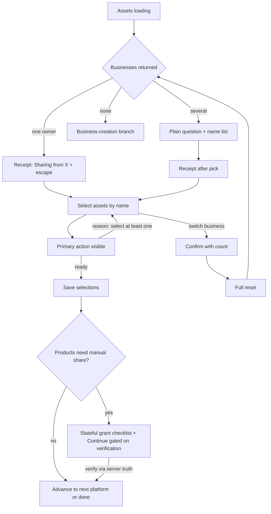

# Client Invite Flow 10X Redesign - Plan

## Goal Capsule

- **Objective:** A non-technical client can grant an agency access to their Meta assets without stalling, guessing, or losing work. The flow shows one truthful status at all times. A returning client resumes where they stopped.
- **Means:** Confirmation-style redesign of the invite flow — receipt over chooser, live reasons over hidden gating (KD1).
- **Authority:** `apps/web/DESIGN_SYSTEM.md` (Acid Brutalism v2) is the binding design authority. `CONCEPTS.md` defines the domain vocabulary. Product behavior is owned by R-IDs; implementation mechanism by KTD-IDs.
- **Stop conditions:** No changes to OAuth token storage, OAuth State, or Graph call contracts beyond what KTD1 permits. No new Meta permissions. Do not modify files owned by the in-flight `codex/meta-app-review-proof` branch before it merges (KTD8).
- **Execution profile:** TDD per repo rules — failing tests before implementation in every feature unit. All work on a fresh branch.

---

## Product Contract

### Summary

This plan rebuilds the client invite journey (setup, connect, share, done, failure endings) as a confirmation-style flow. The portfolio choice auto-resolves with a receipt when the account data shows one owner business. The primary action is always visible with a live reason when disabled. One named-platform checklist replaces the percentage bar and step counters. Copy speaks the client's language; raw platform IDs disappear. The flow conforms to Acid Brutalism v2 and reports funnel events.

### Problem Frame

A dual-agent UX critique of `https://authhub.co/invite/92190f8e1c81` scored the flow 15/40 (Poor). The client-facing share screen carries Meta-admin vocabulary ("Business Portfolio", "Admin Access"), raw 16-digit IDs as the only differentiator between choices, and four disagreeing progress signals on one screen (`Step 2 of 3`, `0% complete`, `NOW · STEP 1 OF 1`, `IN PROGRESS`). The primary button renders only after a hidden validity check passes. "Switch business" silently destroys selections. Nested hard-shadow cards violate the design system's shadow budget.

The flow analysis found two pre-existing defects the redesign must not carry into the new surface: a mid-flow refresh loses all wizard state and falls back to intake (G1), and intake answers are never submitted anywhere — the agency never receives them (G2). The product promise is "5 minutes instead of 3 days"; the current middle of the flow is where that promise breaks.

### Requirements

Trust and language

- R1. The agency's name renders display-cased, and its logo renders when `branding.logoUrl` is set, on every screen of the flow.
- R2. Choices show plain business names, never raw platform IDs. When two businesses share a name, a secondary attribute (vertical or verification status) disambiguates.

Truthful status

- R3. The flow has exactly one progress surface: a named-platform checklist driven by `authorizationProgress`. It names each platform's actual state and next action. No percentage, no completion icon before completion, no second step-count system. Expired and revoked requests are terminal states with an agency-contact path, never a retry loop.
- R4. The primary action is always rendered. When disabled it shows a live reason that is true at that moment (loading, nothing selected, selection required, grant pending, creation required). After save it becomes the advance action with a grant-progress reason.
- R7. Refreshing or revisiting mid-flow lands at the correct step with prior selections visible, driven by server truth. An unresolved `selection_required` or `sharing_required` platform resumes at the share step with saved selections prefilled.
- R8. Intake answers are submitted to the API when the client continues; advance blocks on submission failure with a visible error.

Non-destructive control

- R5. Switching business or changing a saved selection never destroys work silently. With selections present it confirms with a count. After a change, all stale state clears: selections, save state, grant flags, and verification results.

Confirmation-first selection

- R6. When exactly one business owns the requested assets, the flow shows a receipt ("Sharing from {business}") with an escape to choose a different business — never a chooser. With several businesses, the flow asks one plain-language question, then lists choices by name. With zero businesses, the flow routes to the business-creation branch.

Manual grant journey

- R9. The manual Meta grant renders as a stateful checklist: per-step check state, one-tap copy of the agency business ID, and one line of revocation reassurance ("You can remove this access anytime in Meta Business Settings → Partners").

Design and accessibility

- R10. The invite flow conforms to Acid Brutalism v2: shadow budget, binary radius, ink-token status text, one brutalist element per view. A source-walking design contract test enforces this for the invite surface.
- R11. The portfolio selector is fully keyboard operable: arrow keys, Enter/Space to open and select, Escape to close, typeahead.
- R13. On a 390 px viewport the share screen keeps the primary action reachable, and truncation never leaves an ID fragment as the only visible differentiator.

Measurement

- R12. PostHog ingest works for anonymous invite visitors, and the redesigned flow emits funnel events at each step transition.

### Key Decisions

- KD1. Confirmation-style 10X redesign, not in-place repair. (session-settled: user-directed — chosen over structural fixes in place and polish-only: fixes the three P1 stall points at the root.) Governs R3, R4, R5, R6, R9.
- KD2. Whole-flow scope: setup, connect, share, done, and failure endings, including mobile behavior. (session-settled: user-directed — chosen over Connect-step-only and Setup+Connect: the P2 trust defects live outside the Connect step.) Governs R1, R7, R9, R13.
- KD3. Gates for this pass: plain language and trust, visible CTA with honest status, design-system conformance. Accessibility and mobile polish sequence after the gates, inside the same plan. (session-settled: user-directed — chosen over making a11y+mobile co-equal gates.) Governs R10, R11, R13.
- KD4. Auto-select with receipt on a single owner business; one plain-language question when ambiguous. (session-settled: user-directed — chosen over always showing the improved explicit list: removes the decision most clients cannot make.) Governs R6.
- KD5. Measurement is in scope: fix ingest, add funnel events. (session-settled: user-directed — chosen over design-only: "10X" must be provable.) Governs R12.

### Acceptance Examples

- AE1. Covers R6. Given the API returns exactly one business with assets, when assets load, then the screen shows the receipt with the business name and no dropdown and no IDs, plus a visible "choose a different business" escape.
- AE2. Covers R6. Given three businesses, when the share step opens, then one plain-language question shows with a name-only list; choosing one loads that business's assets.
- AE3. Covers R4. Given zero ad accounts are selected, the primary action shows disabled with "Select at least one ad account to continue". Given the selected business has no ad accounts, the reason names the creation action instead.
- AE4. Covers R5. Given a saved selection of 3 accounts, when the client switches business, then a confirm names the count; confirming clears selections, save state, and stale verification badges.
- AE5. Covers R7. Given the client saved selections and is mid-sharing, when they refresh, then they land at the sharing step with selections intact and the checklist reads "Meta — action needed", not the intake screen.
- AE6. Covers R3. Given an expired request, any save or landing shows the terminal card with agency contact and no retry affordance.

### Success Criteria

- A re-run of the heuristic critique on the redesigned flow scores at least 28/40 (from 15/40), with all three P1 stall points resolved in the walkthrough.
- The new design contract test passes on the invite surface; all existing suites stay green.
- PostHog receives events from a logged-out visit to an invite link.

### Scope Boundaries

Outside this plan:

- Agency dashboard UI, Meta's own OAuth screens, dark mode, the subdomain white-label feature, new Meta permissions, and non-Meta platforms' specific screens (they inherit the improved shell and checklist only where shared). Exception: `apps/web/src/app/platforms/callback` is a shared OAuth return surface that agency onboarding and connections also use — its selector swap is in scope (U5); the rest of those agency pages stay out.
- Root `DESIGN.md` and the 2026-03 sprint docs are superseded sources; they are not design guidance for this work.

#### Deferred to Follow-Up Work

- Activating es/nl copy: requires adding `client.language` to the client payload. New copy stays in the `lib/content` module pattern so activation is one field plus wiring.
- Consuming `branding.primaryColor` for template theming.
- Cross-business ownership map (N extra Graph fetches to answer "which business owns asset X" across all businesses) — the plain-language question (R6) removes the need.
- Accessibility beyond R11 (screen-reader announcement polish, focus trap audits).

### Open Questions

- U7 resume prefill (R7): derive Meta share-step prefill from the payload's fulfillment rows — accepting no prefill for other platforms — or add one sanctioned payload field exposing saved selections per product. Decide before U7 lands; both satisfy R7 for Meta.

---

## Planning Contract

### Key Technical Decisions

- KTD1. The confirmation core needs zero backend change. `evaluateAuthorizationProgress` already returns `fulfilledProducts`/`unresolvedProducts` with reasons (`apps/api/src/services/access-request.service.ts:938`), and `fetchMetaAssets` already auto-selects a single business (`apps/api/src/services/client-assets.service.ts:185-189`). The checklist, receipt, and question fallback render from the existing `ClientAccessRequestPayload` and assets responses. No new scopes or endpoints.
- KTD2. The primary action is driven by a pure reason-resolver function with an exhaustive state input: assets loading, businesses pending, assets-fetch error, per-product selection counts, saved state, save-in-flight, grant flags, businessId error, zero available assets, request expired or revoked. Each state maps to one truthful reason or a neutral one ("Preparing your accounts"). Unit-tested before any UI wiring.
- KTD3. Full-reset semantics: switching business or changing a saved selection performs the same reset `handleProductSelectionChange` already performs (`apps/web/src/components/client-auth/PlatformAuthWizard.tsx:495`) plus `assetsSaved=false`, all grant flags, Instagram verification, and creation-review sets, with a confirm dialog when selections exist. This fixes the bricked-wizard path where the save CTA can never return (G3).
- KTD4. Extend `components/ui/single-select.tsx` with keyboard support rather than building a new component. It already has the ARIA skeleton (`role="combobox"`, listbox, `aria-activedescendant`); add arrow navigation, Enter/Space, Escape, typeahead, and active-option tracking.
- KTD5. One consolidated client-side portfolio selector replaces both implementations. The invite wizard consumes it with the token-auth fetcher; `apps/web/src/app/platforms/callback/page.tsx` consumes it with the Clerk fetcher (agency onboarding and connections route through this shared surface). The `onSelectionChange` blob keys (`selectedBusinessId`, `manualAdAccountShareStatus`, `verificationResults`) are preserved unchanged — the grant step and `evaluateMetaProductFulfillment` read them back. The blob is client-controlled input: save and verification validate the selected business and every asset ID against the invite's scope and requested products server-side. `AgencyMetaAssetSelector.tsx` has no dependency on `MetaAssetSelector` and needs no change. (session-settled: user-directed — chosen over rebuilding only the invite side: one pattern for one decision.)
- KTD6. The checklist is display-only plus one resume rule. `buildInvitePlatformQueue` gains a per-platform status derived from `unresolvedProducts` (`selection_required`, `sharing_required`, and every other `UnresolvedProductReason` mapped through a reason-to-copy map with a generic fallback). The stage's hardcoded `status="active"` moves to derived state. (session-settled: user-approved — chosen over repairing the percentage computation: phase-index progress cannot be made truthful.)
- KTD7. "Check again" refetches `GET /client/:token` before rendering results. Expired and revoked are terminal: terminal card with `InviteSupportCard`, no retry loop (G8).
- KTD8. Sequencing: land on a fresh branch after `codex/meta-app-review-proof` merges. That branch owns ~2,000 changed lines across exactly these files. The redesign preserves `MetaAssetSelector`'s fetch/selection contract for grant-verification work in flight.
- KTD9. New client-facing copy lives in `apps/web/src/lib/content/` modules with `en` keys, matching `meta-ad-account-instructions.ts`. es/nl activation is deferred.
- KTD10. Zero-asset Meta state: the reason names the create action ("Create an ad account in {business} to continue"); `save-assets` keeps rejecting zero assets. No API change.
- KTD11. A new display formatter normalizes the agency name for H1 and checklist rendering (title-case words, preserve existing all-caps tokens). Display-only; no data migration. The business list shows vertical or verification status only on name collision.
- KTD12. Manual platforms keep the auto-redirect from the wizard; the queue item copy says it "opens the {platform} checklist". The pinned shell contract (one stage, one progress surface, queue list) is preserved and re-pinned by updated `invite-flow-shell.test.tsx`.
- KTD13. Invite-token security contract: the flow is anonymous bearer-token by design. Server-side scope, expiry, and revocation govern every token route (`GET /client/:token`, intake, asset save, verification). Tokens are non-guessable, never logged, and never leaked to analytics (U11 scrubs them from URLs, referrers, and capture payloads; invite pages set a restrictive referrer policy). Resume params stay bound to the invite token and OAuth state. Negative tests cover expired, revoked, cross-token, replayed, and brute-force requests.

### High-Level Technical Design

Share-step state machine (directional):

Checklist data flow (directional): the shell renders the checklist from the payload's `authorizationProgress` (`completedPlatforms` + per-platform `unresolvedProducts` reasons); the stage derives its status chip from the same reducer; "Check again" refetches the payload and re-runs the reducer. The wizard's resume start state derives from the same reasons.

### Assumptions

- Two tabs on one invite: last write wins; server truth wins on next load. No polling.
- The server's single-business auto-select is trusted as the default owner; the receipt's escape hatch (KTD5, R6) covers the wrong-owner case (G7).
- Intake submission keeps the existing request/response shape; the backend gains persistence (U8).

### Sequencing

U1 is independent of the selection core and lands first, on the fresh branch, after `codex/meta-app-review-proof` merges (KTD8). U6 is a dependency-free parallel track; U7 and U9 follow U6; U8 is independent; U11 follows U5 and U6. One valid full ordering: U1 → U2 → U3 → U4 → U5 → U6 → U7 → U8 → U9 → U10 → U11.

---

## Implementation Units

| U-ID | Title | Primary files | Depends on |
|---|---|---|---|
| U1 | Unblock analytics ingest | `apps/web/src/proxy.ts` | — |
| U2 | Non-destructive reset semantics | `MetaAssetSelector.tsx`, `PlatformAuthWizard.tsx` | — |
| U3 | CTA reason resolver + always-visible action | new resolver lib, `PlatformAuthWizard.tsx` | U2 |
| U4 | Consolidated portfolio selector | new selector component, `single-select.tsx` | U2 |
| U5 | Adopt selector; remove legacy paths | `MetaAssetSelector.tsx`, `platforms/callback/page.tsx` | U3, U4 |
| U6 | Named-platform checklist + status reducer | `invite-flow-shell.tsx`, new status lib, queue, stage | — |
| U7 | Landing-state mapper (resume + terminal) | `client-invite-page.tsx` | U6 |
| U8 | Submit intake answers | `client-invite-page.tsx` | — |
| U9 | Stateful manual-grant checklist | `AdAccountSharingInstructions.tsx` | U6 |
| U10 | Design conformance sweep + contract test | invite surfaces, new design test, name formatter | U2–U9 |
| U11 | Funnel events for the redesigned flow | `lib/analytics/invite-events.ts`, call sites | U5, U6, U9 |

### U1. Unblock analytics ingest

- **Goal:** PostHog ingest reaches its proxy for anonymous invite visitors.
- **Requirements:** R12.
- **Files:** `apps/web/src/proxy.ts`; test beside it following existing middleware test patterns.
- **Approach:** Add `/ingest` to the matcher exclusion (or `isPublicRoute`) so Clerk's `auth.protect` never intercepts PostHog beacons; keep every other route's protection identical.
- **Test scenarios:**
  - A request path under `/ingest/` from an unauthenticated session is not redirected or 403'd by the middleware.
  - A protected app route from an unauthenticated session still redirects to sign-in.
  - `/ingest` matching does not over-match app paths (e.g. no route outside `/ingest` becomes public).
- **Verification:** On a preview deployment, a logged-out `curl` of an ingest endpoint returns a non-404 proxy response, and the PostHog debugger receives events from an incognito invite visit.

### U2. Non-destructive reset semantics

- **Goal:** Switching business or changing a saved selection resets exactly the right state, so the wizard can never brick (G3).
- **Requirements:** R5; KTD3.
- **Dependencies:** none.
- **Files:** `apps/web/src/components/client-auth/MetaAssetSelector.tsx`; `apps/web/src/components/client-auth/PlatformAuthWizard.tsx`; `apps/web/src/components/client-auth/__tests__/MetaAssetSelector.interaction.test.tsx`; `apps/web/src/components/client-auth/__tests__/PlatformAuthWizard.test.tsx`.
- **Approach:** Extract one reset function covering: selections per product, `assetsSaved`, grant flags (`pagesGranted`, `catalogsGranted`, `metaAdAccountShareStatus`), Instagram verification, creation-review sets, and the grant-checklist storage keys (or key them per business). Use it from switch-business and the new change-selection path. Add a confirm step that names the selection count when count > 0.
- **Execution note:** Write the failing switch-after-save test first; it pins the bug (save CTA never returns, stale verification shown).
- **Test scenarios:**
  - Switch business after save: save CTA returns; selection counts reset to zero; no stale grant badges render.
  - Switch business after partial verification: Instagram verification state clears; verify affordance re-arms.
  - Switch business with zero selections: no confirm appears; reset still runs.
  - Switch business with 3 selections: confirm names "3"; declining changes nothing.
  - Switch business after checking grant-checklist steps: all checklist rows render unchecked.
  - Save → switch → reselect → save again completes the full pipeline.
- **Verification:** The bricked-wizard reproduction no longer reproduces; suite green.

### U3. CTA reason resolver + always-visible action

- **Goal:** The primary action is always rendered with a live truthful reason (G4, G5).
- **Requirements:** R4; KTD2, KTD10.
- **Dependencies:** U2.
- **Files:** new `apps/web/src/lib/invite/cta-reason.ts` (or beside the wizard per convention); `apps/web/src/components/client-auth/PlatformAuthWizard.tsx`; tests beside both.
- **Approach:** Pure resolver: input = assets-loading state, businesses state, assets-fetch error, per-product selection counts, saved flag, save-in-flight, grant flags, zero-assets flag, businessId error, request expired or revoked; output = `{ kind: ready | disabled | advance, reason? }`. Loading state yields a neutral reason, never a selection demand. Fetch error yields an error reason with retry. Zero available assets yields the creation reason (KTD10). Post-save the resolver emits the advance action gated on grant verification (KTD3 semantics; default label "Continue"). Remove the conditional footer render; render the footer always, outside the stage card's `overflow-hidden` container (or as a shell-level sticky bar) so it stays reachable at 390 px; wire disabled state and reason line.
- **Execution note:** Build and unit-test the resolver before touching the wizard.
- **Test scenarios:**
  - Loading: reason is neutral; button disabled; no "select at least one" text.
  - Business chosen, zero selections: disabled with the select-at-least-one reason.
  - Zero available ad accounts: disabled with the create-account reason naming the business.
  - Assets fetch failed: disabled with an error reason and retry; never a selection demand.
  - Save or intake POST in flight: disabled with a neutral saving reason; a second click does nothing.
  - All asset-selecting products satisfied: ready.
  - Saved with grant pending: advance action disabled with grant-progress reason.
  - Saved with grants verified: advance action ready.
  - Toggle a selection after grant verification: reason reflects the reset from U2, never a stale "done".
- **Verification:** Resolver has exhaustive-state coverage; wizard renders the footer in every state fixture.

### U4. Consolidated portfolio selector

- **Goal:** One portfolio selection component: receipt-first, names-only, plain-question fallback, keyboard operable (G7 + R2, R6, R11).
- **Requirements:** R2, R6, R11; KTD4, KTD5, KTD11.
- **Dependencies:** U2.
- **Files:** new selector component under `apps/web/src/components/client-auth/`; `apps/web/src/components/ui/single-select.tsx`; tests beside both.
- **Approach:** Props: businesses, selected business, data-source fetcher, selection-required flag. Single business → receipt with escape; the escape fetches the full business list before rendering the question list. Several → one question + name list (IDs never rendered; collision tiebreaker per KTD11). Zero → existing business-creation branch stays reachable through the same component. SingleSelect gains arrow/Enter/Space/Escape/typeahead with active-option tracking.
- **Execution note:** Add the keyboard tests to SingleSelect first (failing), then the selector tests.
- **Test scenarios:**
  - Single business: receipt renders; no listbox; escape affordance present.
  - Escape clicked: business list fetches, question list renders; returning to the original business reuses the loaded list without a second fetch.
  - Choosing an alternate business from the question list: that business's assets load.
  - Several businesses: question copy renders; options show names only.
  - Duplicate names: tiebreaker attribute renders on the colliding pair only.
  - Keyboard: ArrowDown moves active option; Enter selects; Escape closes; typeahead jumps to "Shaka…".
  - Fetch failure after auto-select: error state with retry, no blank receipt.
- **Verification:** New component passes its suite; SingleSelect keyboard suite green.

### U5. Adopt selector; remove legacy paths

- **Goal:** Both portfolio surfaces use the consolidated component; legacy implementations are gone (KTD5).
- **Requirements:** R2, R6; KTD5, KTD8.
- **Dependencies:** U3, U4.
- **Files:** `apps/web/src/components/client-auth/MetaAssetSelector.tsx`; `apps/web/src/app/platforms/callback/page.tsx`; `apps/web/src/components/meta-business-portfolio-selector.tsx` (delete, with its test file); tests for both consumers plus API save/verify authorization tests.
- **Approach:** Invite wizard swaps its portfolio branch for the new component, passing the token-auth fetcher and preserving the `onSelectionChange` blob keys. Callback page swaps with a Clerk fetcher — agency onboarding and connections route through this page, so their paths get explicit coverage. Save and verification validate business and asset IDs against the invite scope (KTD5). Delete `meta-business-portfolio-selector.tsx` and its test file once unreferenced.
- **Test scenarios:**
  - Invite flow: select business → assets load → selection blob carries the same keys the grant step reads.
  - Callback flow: pick-and-save path works against the Clerk fetcher, including zero-business and multi-business agency cases.
  - Agency onboarding and connections paths through the callback page: receipt, escape, question list, and save all work.
  - Tampered save: a `selectedBusinessId` or asset ID outside the invite scope is rejected server-side.
  - No references remain to the deleted component or its test file.
- **Verification:** Typecheck and full web suite green; the deleted file has zero importers.

### U6. Named-platform checklist + status reducer

- **Goal:** One truthful progress surface replacing percentage, premature ✓, and step-count noise (G6, R3).
- **Requirements:** R3; KTD6, KTD7, KTD12.
- **Dependencies:** none (parallel track to U2–U5).
- **Files:** `apps/web/src/components/flow/invite-flow-shell.tsx`; new status-reducer lib under `apps/web/src/lib/invite/`; `apps/web/src/lib/invite-platform-queue.ts`; `apps/web/src/components/flow/invite-platform-stage.tsx`; `apps/web/src/components/flow/__tests__/invite-flow-shell.test.tsx`; new reducer tests.
- **Approach:** Reducer maps requested platforms to one status each — connect-first for requested-but-not-yet-connected, done, action-needed with copy, waiting-on-agency, attention — from `completedPlatforms` plus per-platform `unresolvedProducts` reasons, via a reason-to-copy map with a generic fallback. The reason vocabulary is wider than the four named reasons (`access-request.service.ts:415-431`); share-pending reasons read as client action (per AE5), agency-actor reasons (e.g. `assignee_selection_required`) as waiting-on-agency. The same map drives the landing mapper's phases (U7). Shell renders the checklist in place of the percentage line; stage chip status becomes derived; no legacy step counter, percentage, or premature check icon renders at any platform count. "Check again" refetches the payload (KTD7). Omit "step 1 of 1" labels for single-platform requests.
- **Test scenarios:**
  - Two platforms, one complete: checklist shows done + action-needed with the mapped copy.
  - Every documented `UnresolvedProductReason` maps to copy; an unknown reason falls back to generic copy, never a raw enum.
  - `sharing_required` renders as client action-needed copy (consistent with AE5), distinct from `selection_required`; `assignee_selection_required` renders waiting-on-agency wording.
  - Requested platform with no OAuth yet renders the connect-first status (pre-OAuth fixture).
  - Multi-platform request: no percentage, legacy step counter, or premature check icon renders beside the checklist.
  - Check-again: payload refetch happens before results render; stale state never shows.
  - Single-platform request: no "step 1 of 1" text anywhere; no percentage; no check icon before completion.
- **Verification:** Shell test pins one progress surface; reducer has total reason coverage.

### U7. Landing-state mapper (resume + terminal)

- **Goal:** Refresh and revisit land at the right step; expired/revoked are terminal (G1, G8, R3, R7).
- **Requirements:** R3, R7; KTD7, KTD12.
- **Dependencies:** U6.
- **Files:** `apps/web/src/app/invite/[token]/client-invite-page.tsx`; the invite payload loader modules (surface the API error code alongside the message so expired and revoked are distinguishable from network errors); new mapper lib beside the page; `apps/web/src/app/invite/[token]/__tests__/page.test.tsx`; new mapper tests.
- **Approach:** Mapper input: `completedPlatforms`, `unresolvedProducts` reasons via the shared reason-to-phase map (U6), terminal error codes, existing `initialStep`/`initialConnectionId` params. Output: phase + wizard start state. Rule: OAuth-complete but `selection_required`/`sharing_required` platform → start at the share step; prefill data source is an Open Question (Meta via fulfillment rows is the default). Save and verify responses carrying `REQUEST_EXPIRED`/`REQUEST_REVOKED` route through the same terminal mapper. Expired/revoked → terminal card with `InviteSupportCard`, no retry.
- **Execution note:** Write the refresh-point test matrix first (pre-OAuth, post-OAuth, post-save, mid-sharing) × platform count.
- **Test scenarios:**
  - Refresh post-OAuth pre-save: lands at share step, prior OAuth intact, no second connection created.
  - Refresh post-save mid-sharing: lands at share step, selections visible (matches AE5).
  - Fresh visit, nothing done: intake phase.
  - Completed request revisited: done screen.
  - Expired: terminal card renders; no "Check again"; save attempts surface the terminal card, not "not found".
  - Revoked: terminal card renders; no retry affordance.
  - Save on an expired request mid-flow: terminal card, not a generic failure.
- **Verification:** Matrix green; the G1 fallback-to-intake reproduction is dead.

### U8. Submit intake answers

- **Goal:** Intake answers reach the agency (G2, R8).
- **Requirements:** R8.
- **Dependencies:** none.
- **Files:** `apps/web/src/app/invite/[token]/client-invite-page.tsx`; `apps/web/src/app/invite/[token]/__tests__/page.test.tsx`; `apps/api/src/routes/client-auth/intake.routes.ts`; `apps/api/src/routes/client-auth/schemas.ts`; `apps/api/prisma/schema.prisma` (migration + regenerate).
- **Approach:** Frontend: `handleIntakeSubmit` POSTs to the intake endpoint via the page's standard fetch helpers; advance only on success; failure renders an inline error and keeps answers. Backend: the endpoint currently validates and discards (a stored TODO) — extend it to persist the validated answers on the AccessRequest (new Prisma field, migration, regenerate) and expose them to the agency payload. Tighten the intake schema: allowlist answer keys against the template's intake fields with per-field type and length caps (KTD13: answers are client-controlled text).
- **Test scenarios:**
  - Submit with answers: POST fires with the answers; phase advances on success.
  - Submit failure: error renders; answers remain; retry works.
  - No intake fields configured: no POST; direct advance.
  - Persisted answers are retrievable through the agency-facing payload, not just a 200 response.
  - Unknown-key or oversized answers are rejected by the tightened schema.
- **Verification:** Wire-level test proves the request body; suite green.

### U9. Stateful manual-grant checklist

- **Goal:** The manual Meta journey renders as a checklist with copy affordance and revocation reassurance (R9).
- **Requirements:** R9; KTD9.
- **Dependencies:** U6 (status patterns).
- **Files:** `apps/web/src/components/client-auth/AdAccountSharingInstructions.tsx`; its instruction content module in `apps/web/src/lib/content/`; tests beside the component.
- **Approach:** Numbered sub-steps become checkable rows with persisted check state (sessionStorage at minimum); agency business ID gets a one-tap copy card; add the revocation line; status text uses ink tokens per KTD6 conventions.
- **Test scenarios:**
  - Steps render numbered with unchecked state; clicking toggles and persists across remount.
  - Copy button writes the business ID; confirmation feedback is announced (not color-only).
  - Revocation line renders once near the steps.
  - Verify action still posts and surfaces server truth (existing contract unchanged).
- **Verification:** Checklist suite green; ink-token usage matches the design test.

### U10. Design conformance sweep + contract test

- **Goal:** The invite surface passes Acid Brutalism v2 enforcement (R1, R10).
- **Requirements:** R1, R10, R13; KD3.
- **Dependencies:** U2–U9 (sweep after shape stabilizes).
- **Files:** `apps/web/src/app/invite/[token]/client-invite-page.tsx`; `apps/web/src/components/flow/*`; `apps/web/src/components/client-auth/*` (invite-reachable files); new `apps/web/src/app/invite/[token]/__tests__/invite.design.test.ts`; new display-name formatter in `apps/web/src/lib/` + test.
- **Approach:** Copy the source-walker pattern from `components/settings/__tests__/settings.design.test.ts`; scope it to the invite surface; forbidden: raw coral/teal as text, `rounded-xl`/`rounded-2xl`, resting `shadow-brutalist` on nested static cards beyond budget, emoji tiles. Flatten the nested shadow stacks: stage card keeps the single brutalist emphasis; inner panels use 1px borders and hairlines. Fix each violation the test finds. Add the display-name formatter and use it at H1 and checklist. Render the formatted name and conditional logo across intake, connect, share, done, and terminal screens (cross-phase branding check, including the endings that render outside the shared shell header).
- **Test scenarios:**
  - Design walker passes on the invite surface (forbidden patterns each covered by a fixture test).
  - Formatter: "jon high" → "Jon High"; "IBM Studio" keeps caps; empty string falls back safely.
  - 390 px: primary action reachable; truncation never leaves an ID fragment as the only visible differentiator.
  - Agency logo renders when `branding.logoUrl` is set, with a clean fallback when absent; formatted name present on every flow screen.
  - Shadow budget: the invite view renders at most the budgeted brutalist shadows.
- **Verification:** New design test green; visual pass at 1440 and 390 widths against `/design-system` tokens.

### U11. Funnel events for the redesigned flow

- **Goal:** The funnel is measurable end to end (R12, KD5).
- **Requirements:** R12; KD5.
- **Dependencies:** U5, U6, U9.
- **Files:** `apps/web/src/lib/analytics/invite-events.ts`; capture call sites in the selector, wizard, shell, checklist; tests beside the analytics lib.
- **Approach:** Extend the existing invite event module following `omitSensitiveTokenProperties` conventions. Events: receipt shown, question shown, business chosen, assets loaded, CTA blocked (with reason kind, no free-text), save, grant checklist step, verify result. No PII or tokens in payloads — and scrub the invite token from page URLs, referrers, and capture data (KTD13); invite pages set a restrictive referrer policy.
- **Test scenarios:**
  - Each step transition fires exactly once per occurrence; repeats are not double-fired.
  - Blocked-CTA event carries the reason kind only.
  - Payloads contain no token, email, or asset names.
- **Verification:** Analytics lib tests green; PostHog debugger on preview shows the event sequence from a logged-out walkthrough.

---

## Verification Contract

| Gate | Command | Applies to |
|---|---|---|
| Web unit + design tests | `npm run test --workspace=apps/web` | All units |
| Type check | `npm run typecheck` | All units |
| Lint | `npm run lint` | All units |
| API regression | `npm run test --workspace=apps/api` | U5 (contract preservation), U8 (new intake persistence tests) |
| Ingest smoke | logged-out `curl` of an `/ingest` endpoint on preview returns non-404 | U1 |
| Heuristic re-score | re-run the critique flow on the redesigned invite | Done gate |

Behavioral walkthrough for the done gate: Jordan path (first-timer, single business, receipt → select → save), multi-business question path, refresh-at-every-point matrix (AE5), switch-after-save confirm path (AE4), expired-link terminal path (AE6), keyboard-only share step (R11), 390 px pass (R13).

---

## Definition of Done

- Every unit's Verification line holds; full web + API suites and typecheck green.
- All six Acceptance Examples demonstrated in the walkthrough.
- Design contract test green on the invite surface; no console errors on the flow; analytics events visible from a logged-out session.
- Critique re-score ≥ 28/40 with the three P1 stall points gone.
- Cleanup: the replaced portfolio implementations, dead `disabled` prop paths, and any abandoned-attempt code are deleted, not left in the diff. Session wrap-up appended per repo protocol (`docs/SESSION-LOG.md`).
