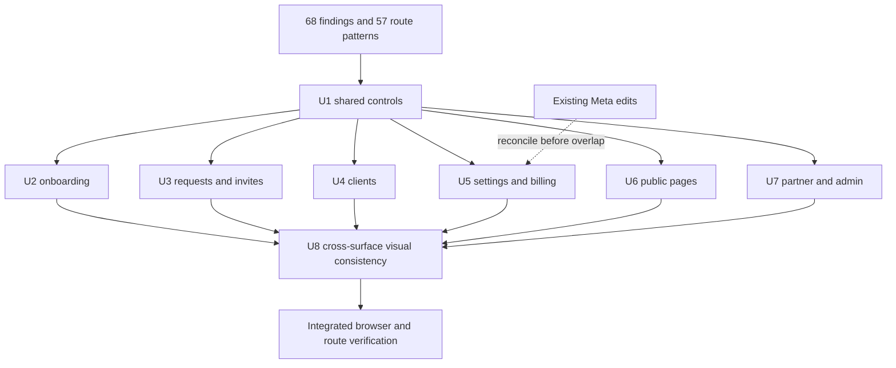

# AuthHub Product Polish - Plan

## Goal Capsule

- **Objective:** Agencies and their clients can complete the audited AuthHub tasks across public, authenticated, partner, and admin surfaces without broken actions, misleading status, lost work, or unreadable layouts.
- **Means:** Resolve the 68 findings in the AuthHub polish inventory through the ordered implementation units below, preserving the app's current contracts and design system.
- **Authority:** Current user instructions; current source, API contracts, and tests; `apps/web/DESIGN_SYSTEM.md`; this plan; inventory evidence and prior plans. Reconfirm current branch and dirty edits before touching code.
- **Execution profile:** CE Work coordinates isolated, bounded units; use Sol for cross-cutting judgments and Terra/Luna for routine owned work according to repository instructions. The parent integrates, reviews, and verifies. No worker commits or deploys.
- **Stop conditions:** Stop only the affected unit if source evidence contradicts an R/KTD, an API/security boundary requires a product decision, or the existing dirty Meta changes cannot be protected. Continue independent units and report the exact blocker.
- **Completion owner:** The coordinating agent completes integration, browser evidence, and the Definition of Done after all active units land.

---

## Product Contract

### Summary

Polish AuthHub across the full audited surface: correct workflow behavior, clear system status, accessible shared controls, responsive layouts, and finished public, settings, partner, and admin pages. Treat the audit as a repair inventory, not authorization for new integrations, plan entitlements, role changes, or visual rebranding.

### Problem Frame

The audit found broken navigation and task actions alongside inconsistent status, error recovery, accessibility, and layout. These failures make the app feel unreliable even where its underlying data and flows work.

### Requirements

**Shared interface and accessibility**

- R1. Shared buttons, provider marks, navigation, landmarks, motion, focus behavior, and hit targets must follow the documented design and accessibility contracts across their consumers.
- R2. Shared settings/provider dialogs must keep keyboard focus inside while open, close by the established keyboard action, and return focus to the opener.
- R3. Surface-level labels, empty states, and errors must identify the action or data they describe and support the next useful action.

**Onboarding and access request lifecycle**

- R4. Completing agency setup must navigate to a usable dashboard without repeating agency creation or update, and must not claim that a client has authorized access.
- R5. Onboarding resume and completion must use persisted, recoverable state; progress and completion controls must reflect successful persistence and prevent duplicate submission.
- R6. Access request, platform connection, and requested-product fulfillment remain separate states; each route renders valid states and truthful next steps from current data.
- R7. Request creation, editing, cancellation, invitations, and manual authorization provide field-specific validation, recoverable failures, and accurate terminal states without discarding user work.
- R8. Client listing and detail surfaces expose the intended records, counts, filters, and actions across pagination and narrow viewports.

**Settings, billing, and operations**

- R9. Settings, connection management, token health, and billing show server-confirmed outcomes, useful recovery, accessible controls, and complete mobile content.
- R10. Partner and admin screens distinguish authorization outcomes from service/data failures and retain accessible search and validation.

**Public content and cross-surface finish**

- R11. Public navigation, article actions, guide access, billing claims, and article rendering behave consistently with established routes and verified service contracts.
- R12. Every audited page follows the current design system for hierarchy, typography, color, elevation, motion, content density, and responsive behavior without introducing new product capabilities.

### Actors

- A1. Agency operator: creates an agency, client, and access request; manages connections, settings, and follow-up.
- A2. Client: receives a request and authorizes or manually configures the requested products.
- A3. Signed-out visitor: uses public marketing, guides, articles, comparisons, pricing, and contact routes.
- A4. Partner or internal administrator: uses their separate portal and authorization boundary.
- A5. AuthHub web/API: persists setup, requests, invitations, connections, product fulfillment, billing, and role-gated data.

### Key Flows

- F1. **Agency onboarding to dashboard:** A1 enters unified onboarding, creates the setup/request link, may invite teammates, then completes setup. The terminal route is the dashboard; the client request remains pending until the client fulfills requested products. Covers R4-R5.
- F2. **Agency access request lifecycle:** A1 creates or edits a request; A2 follows an invite, completes OAuth or a manual flow, and receives a truthful receipt. Request status, platform connection, and product fulfillment can progress independently. Covers R6-R8.
- F3. **Settings and billing:** A1 loads settings, manages provider assets/tokens, or changes billing. UI confirmation follows saved/server-confirmed state; transient errors retain a retry path. Covers R2-R3, R9.
- F4. **Public visit:** A3 navigates through public routes, opens a guide/article, starts the existing demo path, and sees billing status grounded in persisted subscription data. Covers R11-R12.
- F5. **Partner/admin visit:** A4 opens a protected portal and sees the result authorized by the API, with load failure distinguished from denied or empty states. Covers R3, R10.

### Acceptance Examples

- AE1. **Onboarding idempotency:** Given agency and request IDs already exist, when the user activates the final dashboard action, then onboarding completion persists once and dashboard loads without another agency create/update. Covers R4-R5.
- AE2. **Resume after refresh:** Given a saved onboarding step whose form data is not durably reloadable, when the user returns, then the app routes to a stable saved request/dashboard destination instead of showing an incomplete step or recreating records. Covers R5.
- AE3. **Fulfillment truth:** Given a successful OAuth callback but one requested product remains unfulfilled, when request status is rendered, then the product remains outstanding and the request is not labeled complete. Covers R6.
- AE4. **Pagination and count:** Given a client has requests beyond the first page, when the agency opens Clients and paginates, then all pages are reachable and the request count derives from request records rather than connection records. Covers R8.
- AE5. **Transient versus terminal error:** Given a service failure or an expired/revoked invite, when the user opens the route, then only the transient case offers retry and both retain a clear destination or next step. Covers R3, R7, R9-R10.
- AE6. **Billing return:** Given checkout redirects back before the server confirms a subscription, when the result page renders, then it shows a pending/processing outcome and does not announce activation. Covers R9, R11.
- AE7. **Small screen and keyboard:** Given a 320px viewport or keyboard-only input, when a representative route/dialog is used, then content is not obstructed, controls remain reachable, and focus stays within the open dialog. Covers R1-R3, R8-R12.

### Success Criteria

- All 68 inventory findings have an explicit completed disposition backed by test, rendered-screen, browser, or documented source evidence; no finding is silently dropped.
- The route matrix's 57 route patterns are covered by route-level evidence or explicitly marked as not runtime-tested; representative captures alone are not described as exhaustive state coverage.
- Every behavior change has a regression check at its approved seam, and every visual change has integrated browser evidence at desktop and 390px/320px.
- No test, screenshot, or local preview is described as proof of a live production mutation or role-policy outcome.

### Scope Boundaries

**Included:** All findings S01-S15, O01-O11, R01-R11, C01-C08, T01-T12, M01-M08, and A01-A03 from `docs/audits/2026-09-30-authhub-polish/inventory.md`.

**Not included:** New newsletter or calendar integrations; new plan features or entitlements; provider consent/grants; OAuth-state redesign; role/permission policy changes; schema/data migration; production mutations; deploy, commit, push, or PR. The existing Schedule Demo modal is reused. If no subscription endpoint exists, do not invent one or continue promising signup; keep the unsupported form/claim out of the shipped UI pending a separately authorized service decision.

**Deferred to follow-up:** Any finding whose correct behavior depends on an external service/provider change or new policy; unobserved production mutations; role-specific browser coverage where no approved test identity exists. Record the evidence and exact remaining gap rather than claiming completion.

### Product Key Decisions

- D1. **Setup completion is independent of client authorization.** The supplied final screen explicitly says client authorization is pending; a setup success must not imply request fulfillment. Governs R4-R6.
- D2. **Domain states stay distinct.** Request lifecycle, platform connection, and requested-product fulfillment have different typed sources and meanings. Governs R6-R7.
- D3. **No invented integrations or entitlements.** Existing capabilities are reused; unsupported newsletter promises are removed/withheld until an existing endpoint is evidenced. Governs R11-R12.
- D4. **Current API authorization remains authoritative.** UI polish does not grant access or change roles. Governs R10.

---

## Planning Contract

### Key Technical Decisions

- KTD1. **Use one shared-control repair layer before surface-specific polish.** Correct shared button/icon/navigation/dialog contracts so downstream screens inherit reliable behavior; follow `apps/web/DESIGN_SYSTEM.md` and its existing primitives.
- KTD2. **Use public rendered behavior as the workflow test seam.** Test through rendered pages, contexts, or user-visible components for onboarding, request, settings, billing, and public actions; directly test pure domain evaluators only for status rules. (session-settled: user-approved — chosen over testing private implementation details: the user approved the recommended rendered-screen and domain-function boundaries.)
- KTD3. **Use browser screenshots for visual evidence.** Capture integrated native Next pages at desktop and 390px/320px, with keyboard and reduced-motion probes where applicable. A Vite prototype or isolated component screenshot is not final evidence. (session-settled: user-approved — chosen over source-only visual checks: the user approved browser screenshots as the visual-check boundary.)
- KTD4. **Keep the existing dirty Meta work isolated.** Before any worker edits `meta-unified-settings.tsx`, `MetaAssetSelector.tsx`, `PlatformAuthWizard.tsx`, related tests, or API env/DREX paths, review `git diff` and establish whether those edits are in scope. Preserve them; do not reset, overwrite, or fold them into unrelated units. Sequence overlapping Meta findings after the current work is reconciled.
- KTD5. **Keep final-state writes idempotent and evidence-led.** Trace actual onboarding and API request contracts before changing writes; persist using known IDs, and do not add compatibility paths or speculative abstractions.
- KTD6. **Use installed primitives and dependencies only.** Inspect current installed UI primitives for modal focus containment; prefer native platform behavior or the existing dependency. Do not add a dialog package for this work without evidence the installed/native options cannot satisfy R2.

### High-Level Technical Design

### Sequencing and Ownership

- Phase 1: U1 establishes shared behavior. U2-U7 can proceed independently after current files and dirty diffs are checked; U3 owns status vocabulary shared by request-facing routes.
- Phase 2: U8 applies full-view consistency across the integrated surfaces, then the coordinator runs end-to-end visual and route verification.
- File ownership in each unit is exclusive. Any additional file discovered during execution must be added to the unit's owned scope before another worker edits it.
- No unit owns deployment or production mutation. CE Work must keep the existing dirty edits and audit evidence intact.

### Assumptions and Deferred Implementation Details

- `apps/web/DESIGN_SYSTEM.md` is the visual authority. The older root design document is superseded.
- User-approved behavior test seams are rendered screens/workflows, direct domain functions for status rules, and browser screenshots for visual checks.
- The inventory was audited against baseline `main` `c80037d57841fff2155911461e99702838ffb6d5` plus dirty files. Verify all paths, current branch, and diffs before execution; inventory line references are not implementation authority.
- Confirm `/guides/*` content is static/public before changing proxy access. The published canonical URLs and public cross-links support public access, but proxy policy and API authorization must still be checked; stop that route-only change if private content or data is present.
- Confirm client request-count denominator and pagination response from the current web/API contract before modifying the displayed count. Do not substitute connection count.
- Use available role fixtures for UI/API authorization checks. If no approved partner/admin identities exist, preserve policy and report that coverage gap; do not create or alter accounts.
- Native Next startup previously failed because an installed Sentry/OpenTelemetry dependency was missing. First establish whether the implementation checkout starts cleanly; do not modify dependencies as part of visual tickets without a separate root-cause justification.

### Risks and Dependencies

| Risk | Mitigation |
| --- | --- |
| Onboarding fix masks a persisted request failure or repeats an agency write | Trace full create/link/finalize path and assert one agency write and persisted IDs through the rendered flow. |
| Concurrent Meta changes are overwritten | KTD4 is a pre-dispatch gate; keep overlapping Meta work serial and owner-confirmed. |
| Status polish collapses distinct states or falsely reports fulfillment | KTD2 and R6 require source-typed mappings and separate UI labels. |
| Billing return is mistaken for persisted subscription | Render activation only from the authoritative subscription read. |
| UI/API route evidence overstates production authorization | No policy changes; use test identities and report live authenticated coverage precisely. |
| Native preview failure is worked around with untracked app/dependency changes | Diagnose environment first; preserve missing-dependency limitation if outside scope. |

### Research Sources

- `docs/audits/2026-09-30-authhub-polish/inventory.md` and its `findings.json`, `route-coverage.json`, and `evidence/` — finding IDs, severity, route matrix, and evidence limits.
- `apps/web/DESIGN_SYSTEM.md` — current Acid Brutalism v2.3 and visual/accessibility contracts.
- `CONCEPTS.md` — request completion, platform group, requested product, and truthful status vocabulary.
- `docs/solutions/design-patterns/design-system-authority-acid-brutalism-v2.md` — system authority and control rules.
- `docs/solutions/design-patterns/single-stage-client-request-flow.md`, `docs/solutions/design-patterns/grouped-oauth-product-expansion-with-truthful-fulfillment.md`, and `docs/solutions/design-patterns/google-authorization-fulfillment-truthfulness.md` — one active incomplete group and separate OAuth return from product fulfillment.
- `docs/solutions/google-selector-stale-response-guard.md` and `docs/solutions/browser-api-reliability-hardening.md` — stale-response protection and user-visible API recovery.
- `docs/plans/2026-09-13-001-feat-app-craft-polish-plan.md`, `docs/plans/2026-09-26-0931-feat-client-invite-flow-10x-redesign-plan.md`, and `docs/plans/2026-09-12-1912-feat-settings-page-revamp-plan.md` — existing craft, invite-flow, and settings contracts to preserve; they do not supersede the current audit scope.

---

## Implementation Units

### U1. Repair shared controls, navigation, and dialog behavior

**Goal:** Establish accessible, predictable primitives for controls and shared shells.

**Requirements:** R1-R2, R12. Findings S01-S08, S12-S13.

**Dependencies:** None.

**Files:** `apps/web/src/components/ui/button.tsx`, `apps/web/src/components/ui/platform-icon.tsx`, `apps/web/src/components/ui/sidebar.tsx`, `apps/web/src/components/manage-assets-modal-shell.tsx`, `apps/web/src/app/(authenticated)/layout.tsx`, `apps/web/src/app/(marketing)/layout.tsx`, `apps/web/src/app/globals.css`, `apps/web/src/components/client-auth/AutomaticPagesGrant.tsx`, `apps/web/src/components/ui/__tests__/button.design.test.tsx`, `apps/web/src/components/ui/__tests__/platform-icon.test.tsx`, `apps/web/src/components/ui/__tests__/sidebar.test.tsx`, `apps/web/src/components/__tests__/manage-assets-modal-shell.test.tsx`, `apps/web/src/app/__tests__/button-contract.design.test.ts`.

**Approach:**

Follow KTD1-KTD3.

1. Use the intended Facebook product asset in the shared mapping and preserve the Meta corporate mark separately.
2. Correct the Button `asChild` interactive child and accessible coral foreground pairing; update the documented contract and check contrast on enabled/hover states.
3. Make mobile navigation closed on initial load, add one main landmark/heading ownership and a working skip link, and size icon hit areas to the design contract.
4. Apply the existing strict LazyMotion primitives where required.
5. Give the shared dialog shell native/installed focus containment, Escape dismissal, and return focus; do not replace provider bodies.

**Patterns to follow:** Existing Button variants, Radix Slot already installed, `ManageAssetsModalShell`, shared `PlatformIcon`, and `apps/web/src/test/utils/design-system.ts`.

**Test scenarios:**

- Rendering `<Button asChild>` with an anchor produces one styled focusable link whose full hit area navigates.
- Every enabled primary button pairing meets WCAG contrast for its text size in resting and hover states.
- Facebook Pages, Meta corporate, and other mapped platforms render their intended marks at small and large icon sizes.
- At 320px/390px a protected route loads with content visible and mobile navigation closed; activating its trigger opens and closes navigation.
- First keyboard Tab reveals Skip to content and activation focuses the unique main region.
- Open a provider dialog, cycle Tab and Shift+Tab, press Escape, and verify focus returns to the opener without reaching background controls.
- Strict LazyMotion onboarding/error consumers render without a development exception and honor reduced motion.

**Verification:** Focused component tests and rendered browser checks establish the shared contract before downstream unit integration.

### U2. Make onboarding completion and recovery truthful

**Goal:** Let an agency finish setup and reach its dashboard without duplicate agency mutation or lost onboarding state.

**Requirements:** R4-R5. Findings O01-O11.

**Dependencies:** U1.

**Files:** `apps/web/src/contexts/__tests__/unified-onboarding-context.test.tsx`, `apps/web/src/hooks/__tests__/use-user-agency.test.tsx`, `apps/web/src/components/onboarding/screens/__tests__/final-success-screen.test.tsx`, `apps/web/src/components/onboarding/__tests__/unified-wizard.keyboard.test.tsx`, `apps/web/src/app/onboarding/unified/__tests__/page.test.tsx`, and the current onboarding context, wizard, final screen, agency hook, and unified onboarding route source files confirmed at execution time.

**Approach:**

Follow KTD2 and KTD5.

1. Trace agency lookup, create/update, request/link creation, persistence, and final navigation to the actual production failure branch; reproduce the submitted screenshot's duplicate-name condition in a rendered flow test.
2. Finalize with already-resolved agency/request IDs; do not repeat agency create/update. Completion and progress advance only after the completion write succeeds.
3. Resume only from state the route can reconstruct; otherwise route to the durable request/dashboard destination without recreating records.
4. Keep one final action, pending-client copy independent of selected provider, visible busy/error outcomes, and duplicate prevention.
5. Validate agency fields before moving forward; deduplicate invite addresses and display only confirmed API invite results.

**Patterns to follow:** Existing unified onboarding context, persistence and resume APIs, `useUserAgency`, current access-request link creation and API error handling. Do not change OAuth-state or request authorization contracts.

**Test scenarios:**

- With an agency and request already created, final dashboard action performs no second agency POST/PATCH and routes to the authenticated dashboard.
- A failed completion persistence does not show 100% or navigate as complete; retry keeps known IDs and does not recreate the request.
- Refreshing a step with complete saved data restores it; refreshing without required request/link data routes to the saved destination without displaying a broken step.
- The final screen exposes one primary action, a pending-client message that matches the request's providers, and a busy state that ignores a second activation.
- Agency validation errors are announced at the fields and block progression until valid.
- Repeated/case-varied invite addresses are submitted once, and displayed sent counts match confirmed server results.
- Copy feedback matches the actual clipboard result or degrades to a truthful manual-copy instruction.
- An established agency that has not yet loaded is not treated as a confirmed new agency; transient lookup failure offers recovery rather than entering first-time setup.

**Execution note:** Keep the screenshot-backed Go to Dashboard fix in this unit. The exact duplicate-name branch is not yet proven; if the trace identifies another owner, update the packet before assigning the file.

**Verification:** Rendered onboarding flow tests prove the single-write terminal path, recovery branch, error behavior, and pending authorization truth.

### U3. Unify request, invite, and fulfillment behavior

**Goal:** Make agency and client request workflows show accurate status, preserve work, and recover from real failure states.

**Requirements:** R3, R6-R7. Findings R01-R11 and S15.

**Dependencies:** U1; U2 only for shared lifecycle API decisions.

**Files:** `apps/web/src/contexts/__tests__/access-request-context.test.tsx`, `apps/web/src/app/(authenticated)/access-requests/new/__tests__/page.test.tsx`, colocated access-request detail/edit/success route tests, `apps/web/src/app/invite/[token]/__tests__/manual-flows.test.tsx`, `apps/web/src/components/access-request-detail/__tests__/cancel-request-modal.test.tsx`, the corresponding current route/context components, request status evaluator/types, and request success/invite state components.

**Approach:**

Follow KTD2 and the separate state contract in R6.

1. Implement typed labels for request, platform-connection, and product-fulfillment states from their existing sources; keep the next action separate from state.
2. Distinguish not-found, unauthorized, transient service failure, expired/revoked invite, partial authorization, and completed fulfillment using existing terminal/error contracts.
3. Keep form data on submission failure; associate errors with fields and make review edit/removal actions distinct and accessible.
4. Require confirmation before discarding dirty edits; report cancellation/update outcomes.
5. Ensure success receipts are derived from persisted request status, not static pending copy or OAuth callback alone.

**Patterns to follow:** `CONCEPTS.md`, existing `AccessRequestStatus` values, single-stage client-request-flow and fulfillment learnings, existing invite terminal card, cancellation/discard dialogs, and stale selector-response guard.

**Test scenarios:**

- Direct status-domain cases map every valid pending/partial/completed/expired/revoked value and preserve separate connection/product state; no valid value becomes Unknown.
- A successful OAuth return with an unfulfilled product remains partial/pending and shows the product next action.
- Not-found and transient request failures render different outcomes; only the transient failure offers retry.
- Missing agency platform blocks submission with a visible recoverable message that remains until corrected.
- Back from a dirty edit opens discard confirmation; cancel retains edits and confirm returns without persisting them.
- Cancellation/API failure is announced and retains the current request; success updates the persisted terminal view.
- Success revisit shows current persisted status; manual expired/revoked links stop with agency-contact guidance instead of retrying authorization.
- Manual field validation is associated with its field and keeps entered data after failure.
- Request review renders product names rather than raw platform-group identifiers; removal and repeated edit controls have contextual accessible names.

**Verification:** Tests at rendered route/context seams cover create, review/edit, invite, manual recovery, and status truth; only pure status mapping is tested directly at the domain seam.

### U4. Correct Clients listing, counts, and mobile detail

**Goal:** Make the client directory navigable, informative, and complete on small screens.

**Requirements:** R3, R8, R12. Findings C01-C08.

**Dependencies:** U1; U3 for request-count and status contracts.

**Files:** `apps/web/src/app/(authenticated)/clients/__tests__/page.design.test.tsx`, `apps/web/src/components/client-detail/__tests__/overview-tab.test.tsx`, `apps/web/src/components/client-detail/__tests__/requested-access-board.test.tsx`, `apps/web/src/components/__tests__/create-client-modal.design.test.tsx`, `apps/web/src/components/__tests__/manage-assets-modal-shell.test.tsx`, Clients page/client detail/client modal source, and the API pagination/count contract tests or types owning the response.

**Approach:**

1. Wire Filters to the existing query model or remove the nonfunctional control if no filter dimension is supported; never retain decorative-only interaction.
2. Keep pagination reachable and define the displayed request count from the API/client contract, not connections.
3. Make long client identifiers inspectable without forcing the whole layout wider.
4. Rework mobile detail and tabs to fit the container and share the same keyboard model as other tabs.
5. Correct filtered-empty copy and use the shared overlay/dialog contract for client modals.

**Patterns to follow:** Existing client query and paginated API response, shared `Tabs` primitive, `ManageAssetsModalShell`, and current client detail sections.

**Test scenarios:**

- Selecting and clearing a supported filter changes rendered client rows; unsupported filters are absent rather than inert.
- Given more than one page of clients, next/previous page controls expose every record and retain the selected filter.
- The request count equals the documented request denominator for a client with multiple requests and zero connections.
- Long names, emails, and IDs remain inspectable at 320px without overlapping or horizontal page overflow.
- Mobile tab keyboard interaction matches the shared tab primitive and panels announce the selected tab.
- Filtered empty results offer clear-filters; a genuinely new client empty state may offer creation.
- Client modal opening traps focus, Escape closes, and focus returns to the opener.

**Verification:** Rendered client-list/API-contract and detail tests cover pagination, count, filtering, and narrow layout.

### U5. Repair settings, connections, token health, and billing

**Goal:** Make settings and account operations accessible, truthful, recoverable, and usable on mobile.

**Requirements:** R2-R3, R9, R12. Findings S09, S14, T01-T06, T08, and T10-T12.

**Dependencies:** U1; U3 for shared status terminology.

**Files:** `apps/web/src/app/(authenticated)/settings/__tests__/page.test.tsx`, `apps/web/src/components/settings/__tests__/settings-tabs.test.tsx`, existing Google/Meta/webhook/agent/billing settings tests, token-health route tests, current settings/connection/token-health/checkout source, and the owned current Meta source/tests only after KTD4 is cleared.

**Approach:**

1. Reconcile dirty workspace changes before touching Meta files; preserve unrelated user edits and assign any overlap to one serial owner.
2. Remove unsupported rectangular radii; keep round avatars/circular controls. Name each Meta asset toggle and verify the rendered checkbox state.
3. Make token health mobile-readable, refresh controls named, and connected-empty Google states actionable.
4. Keep server-confirmed subscription state authoritative; show processing/cancel/error when checkout returns before persisted confirmation.
5. Show save success/error and retry for transient loads; present code-loading failures in their proper dialog context.
6. Replace machine names with human-readable labels, normalize capitalization, keep plan details/actions discoverable on mobile, and avoid repeated filled Create Request CTAs on the dashboard.

**Patterns to follow:** Existing settings tab contract, `ManageAssetsModalShell`, Google asset toggle labeling, API error helper, current billing subscription read, and documented visual tokens.

**Test scenarios:**

- Settings tabs remain keyboard reachable and each loads its matching rendered panel.
- Every Meta toggle is announced with its specific asset name and checked state; toggling it retains existing save behavior.
- A 320px token-health view exposes each status/account/refresh action without clipped columns; refresh action has an accessible name.
- Checkout return with no persisted subscription shows processing, while a confirmed server record shows activation.
- A settings save failure is announced, keeps values, and a successful retry reports completion.
- Transient connection-load failure offers retry; connected-but-empty Google access explains the recovery action.
- Code-dialog loading failure stays within the dialog and supports recovery; it does not replace the page with a card.
- Mobile billing exposes existing plan details and tier actions without changing entitlements.
- Dashboard renders a single clear filled Create Request action in the view.

**Execution note:** This unit overlaps dirty Meta work and may not be dispatched for those files until the existing diffs are explicitly reviewed and protected. Other settings files can proceed independently if ownership remains disjoint.

**Verification:** Focused settings, token-health, and billing rendered tests pass; integrated browser captures show mobile and dialog states. No live provider grant or billing mutation is used as proof.

### U6. Finish public navigation, guides, articles, and pricing

**Goal:** Make public routes navigable and truthful, with stable article rendering and motion/access behavior.

**Requirements:** R3, R11-R12. Findings M01-M03 and M05-M08.

**Dependencies:** U1.

**Files:** `apps/web/src/components/marketing/__tests__/marketing-nav.test.tsx`, marketing claim tests, public route/proxy tests, pricing and blog/article source/tests, `apps/web/src/app/(marketing)/layout.tsx`, and the current guide/public-route allowlist source.

**Approach:**

1. Ensure footer section links target the intended page/anchor and article Schedule Demo opens the established modal.
2. Keep guides signed-out accessible only after confirming the guide routes expose static public content and no private payload; retain API authorization boundaries.
3. Render checkout activation only after persisted subscription confirmation (shared with U5; U5 owns billing state source).
4. Trace the actual article hydration mismatch node and make its output deterministic; do not assume locale date formatting is the cause.
5. Respect reduced motion for desktop marquee and pricing reveal without temporary horizontal overflow.
6. If source confirms there is no newsletter endpoint, remove the unsupported form and subscriber/unsubscribe promise; no provider is added.

**Patterns to follow:** Shared marketing navigation/layout, existing `ScheduleDemoModal`, public proxy matcher, server-side article content, and reduced-motion tokens.

**Test scenarios:**

- Each footer section link lands on its named route/anchor from another public page.
- Article Schedule Demo opens the existing modal and submits through its current behavior.
- A signed-out direct guide visit returns the intended public page with no protected payload; if evidence contradicts public intent, stop this route change and report it.
- Checkout return without persisted subscription does not claim activation (U5 owns the source contract).
- Article server and client render the same date/content; no hydration mismatch is emitted for the tested article.
- With reduced motion enabled, marquee/reveal content remains static and does not cause horizontal overflow.
- Newsletter UI does not offer a submit action or factual subscriber claim without an existing endpoint.

**Verification:** Public rendered route/action tests and browser captures at 1440px, 390px, and 320px verify direct links, modal, guides, and reduced-motion states.

### U7. Distinguish partner and admin data/error states

**Goal:** Make partner/admin screens legible and ensure UI errors do not misstate authorization.

**Requirements:** R3, R10, R12. Findings A01-A03.

**Dependencies:** U1.

**Files:** `apps/web/src/app/(authenticated)/internal/admin/__tests__/design.test.ts`, partner overview/query components and tests, admin agency/search inputs and tests, existing partner API query, current partner and internal admin route source.

**Approach:**

1. Distinguish confirmed awaiting approval, approved with empty data, denied, and service failure; use API authorization as authority.
2. Associate campaign field errors with controls and announce them to assistive technology.
3. Give admin searches persistent accessible labels instead of placeholders.
4. Do not alter role policy or create production test accounts.

**Patterns to follow:** Existing query-state helpers, authenticated admin API boundaries, shared form fields and semantic status colors.

**Test scenarios:**

- A confirmed pending partner sees awaiting approval; an approved partner with no history sees an empty state; a failed query sees retry/service error rather than approval status.
- Campaign invalid input shows a field-associated error announcement; valid input preserves the existing result flow.
- Admin search inputs retain accessible names when populated.
- Unauthorized API result does not reveal protected records; existing role policy is unchanged.

**Verification:** Rendered tests use existing safe fixtures for allowed, denied, empty, and error outcomes. If a role fixture is unavailable, record the uncovered case instead of inferring live permissions from visible routes.

### U8. Align full-view visual consistency and close the finding ledger

**Goal:** Remove remaining cross-surface style conflicts and produce evidence for every audit row.

**Requirements:** R1, R3, R12. Findings S10-S11, T07, T09, and M04. P3 findings remain owned by their domain units; U8 owns only the integrated cross-surface ledger review.

**Dependencies:** U1-U7.

**Files:** The specific component files linked from the mapped findings in `docs/audits/2026-09-30-authhub-polish/inventory.md`; corresponding focused tests; `docs/audits/2026-09-30-authhub-polish/findings.json` only for recording final evidence/disposition.

**Approach:**

1. Review complete page views for resting shadow budget and remove hover elevation from noninteractive cards.
2. Reserve danger colors for destructive/error meaning and align diagnostic/checkout/comparison pages to the documented token system.
3. Normalize the remaining settings labels and comparison template within the existing brand.
4. Walk all 68 inventory IDs and attach a completed test/browser/source receipt or an explicit deferred/rejected disposition with reason; do not relabel unknown routes as covered.

**Patterns to follow:** Current design system, audit evidence taxonomy, and existing tests on the owning pages. Do not duplicate a change already owned by U1-U7.

**Test scenarios:**

- Full-view desktop captures contain no more than three intentional resting shadows in the reviewed surfaces; static cards do not imply interaction.
- Routine headings, partner links, and refresh actions use neutral semantics; actual error/destructive states retain danger semantics.
- Comparison, diagnostic, and checkout page computed colors/typography/radii follow the same tokens as authenticated pages.
- Every one of S01-S15, O01-O11, R01-R11, C01-C08, T01-T12, M01-M08, and A01-A03 appears once in the final finding ledger.

**Verification:** Coordinator review of integrated screens and ledger closes cross-surface inconsistencies after functional units land.

---

## Verification Contract

| Gate | Evidence |
| --- | --- |
| Focused behavior | For each changed feature, run its existing Vitest/RTL suite with rendered public workflow behavior. Pure status mapping uses direct domain tests. |
| Workspace quality | Run `npm run typecheck`, `npm run lint`, and `npm run build` from repository root after the integrated changes; resolve regressions attributable to this work. |
| Native browser | Start the real Next app if its existing dependencies permit. Verify representative public, onboarding, request, Clients, settings/billing, partner, and admin routes. Do not treat the Vite audit preview as authoritative. |
| Responsive/visual | Capture 1440px, 390px, and 320px views for touched screens with realistic long names and populated/empty/error states; include reduced-motion screenshots for M05/M08 and onboarding motion. |
| Keyboard/accessibility | Verify first-focus skip link, landmark uniqueness, form labels/errors, 44px targets, dialog containment/Escape/return focus, and visible focus across changed journeys. |
| Route ledger | Reconcile all 57 route patterns against `route-coverage.json`; document representative versus exhaustive state coverage and any route blocked by unavailable fixtures. |
| Safety boundary | All production evidence is read-only. Do not submit invites, requests, cancellations, provider grants, payments, payouts, admin changes, or other production writes. No deploy/commit/push/PR in this plan's scope. |

Use the existing scripts and suites discovered in the implementation checkout; if native Next fails because of the previously missing instrumentation dependency, report that exact limitation and preserve the code boundary rather than editing dependency/config files opportunistically.

---

## Definition of Done

- Every in-scope R requirement is met or has a specific evidence-backed unit disposition where execution is blocked by the stated boundary.
- All 68 finding IDs are present exactly once in the closeout ledger and have a verification receipt, accepted fix, or explicit deferred/rejected reason.
- The touched shared controls pass their behavioral contract tests; feature-bearing units include rendered behavior tests at the approved seam.
- `typecheck`, `lint`, and `build` pass, or any baseline/environment failure is reproduced and clearly separated from this change.
- Integrated native-browser evidence covers each touched page family at desktop and mobile; screenshots are not represented as proof of untested API/role states.
- Keyboard, reduced-motion, error, loading, empty, pending, partial, and terminal states relevant to changed flows remain usable and truthful.
- User's pre-existing dirty changes and audit artifacts remain intact; no abandoned experiments, temporary preview patches, credentials, or generated scratch files enter the implementation diff.
- No production data change, deployment, commit, push, or PR occurs without separate authorization.

---

## Appendix

### Finding-to-unit crosswalk

| Unit | Inventory findings |
| --- | --- |
| U1 | S01-S08, S12-S13 |
| U2 | O01-O11 |
| U3 | R01-R11, S15 |
| U4 | C01-C08 |
| U5 | S09, S14, T01-T06, T08, T10-T12 |
| U6 | M01-M03, M05-M08 |
| U7 | A01-A03 |
| U8 | S10-S11, T07, T09, M04; integrated visual pass and ledger review |

P3 ownership follows the domain unit shown above. U8's ledger review is cross-surface closeout, not duplicate implementation ownership. The inventory is the detailed evidence/source register; each finding resolves to one implementation owner above.

### Related plan boundaries

- The client invite plan's product and fulfillment decisions remain authoritative for its sub-flow; this plan only addresses the new audited defects.
- The settings revamp's data/query contracts remain in place; this plan repairs defects found in current settings screens.
- The earlier craft plan's broader ideas do not expand this user's scope; the current audit IDs bound the work.
