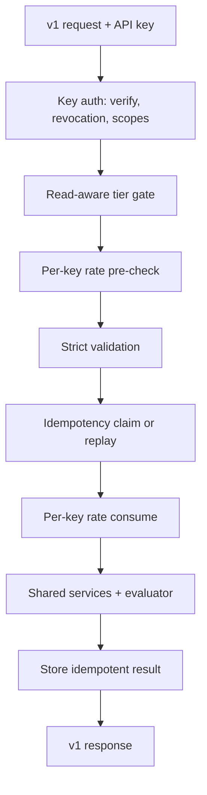
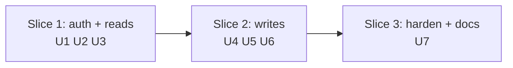

# Public API Parity Core - Plan

## Goal Capsule

- **Objective:** An agency developer can integrate their CRM or portal with AuthHub through a stable, documented public API covering keys, external IDs, safe retries, catalog discovery, level webhooks, and usage — reaching credible parity with AgencyAccess v2's core surface.
- **Means:** A separately versioned public contract with adapters over existing internal behavior, shipped read-side first and writes second (KTD1).
- **Product authority:** Parity-first, parity-core scope (embedding deferred to a follow-on plan; agent-native differentiation rides on top afterward). Success is the shipped surface, not a live pilot.
- **Open blockers:** None blocking planning. Outstanding questions below go to planning or a follow-up decision.
- **Plan preservation:** Product Contract unchanged by planning; OQ3–OQ5 (deferred to planning) resolved into KTD1, KTD5, KTD8 below.

---

## Product Contract

### Summary

AuthHub ships a versioned public API for agency developers that matches the AgencyAccess v2 core: scoped keys, external client IDs, idempotent creates, a service catalog, deeper webhooks, and usage introspection, all under one stable envelope with OpenAPI docs. The contract is designed up front, then built reads-before-writes.

### Problem Frame

AgencyAccess shipped a v2 API aimed squarely at agencies wiring onboarding into their own portals and CRMs, plus AI-agent users. AuthHub's current surface is internal-only: Clerk session auth, no agency keys, no CRM join key, retry-unsafe creates, no catalog, coarse webhooks, no public docs. No deal has been lost to this yet, so the move is proactive: close the integration gap before it costs deals, and build the contract so later differentiation (embedding, agent-native positioning) is additive rather than breaking.

### Key Decisions

- **Separate versioned public contract, not a façade over internals** (session-settled: user-directed — chosen over thin façade and over contract-first-reads-only: a clean stable promise with the challenger's sequencing inside it).
- **Reads ship before writes within the milestone** (session-settled: user-directed — chosen over single-drop delivery: smaller blast radius, contract validated before anything destructive ships).
- **Agency developers are the v1 consumer**, not external integrators or agents-first (session-settled: user-directed — chosen over external-integrator and agent-first framings: CRM/portal wiring is the contest being answered).
- **Key access follows subscription tier.** Gating API access by plan mirrors every other gated capability; open-to-all-plans would be a separate product decision.
- **Existing dashboard behavior is untouched.** The public contract is purely additive; internal quirks are normalized at the boundary, never leaked.

### Actors

- A1. Agency developer — builds against the public API from their CRM, portal, or onboarding flow.
- A2. Agency owner/admin — creates and revokes keys, manages webhook subscriptions, in the dashboard.
- A3. AuthHub platform — enforces scopes, tiers, idempotency, and the stability promise.

### Requirements

**Authentication and keys**

- R1. An agency admin can create a scoped API key from the dashboard, seeing the secret exactly once at creation.
- R2. Each key carries an explicit scope set chosen at creation; calls beyond scope fail with a stable capability error naming the missing scope.
- R3. Keys are revocable with immediate effect, and rotation is supported by creating a replacement before revoking the old one.
- R4. A key self-check endpoint returns the key's agency and scopes without requiring any scope.
- R5. API access is gated to paid tiers, with trial access included for evaluation.

**External IDs and idempotency**

- R6. Clients carry an agency-scoped immutable external ID settable at creation, usable for lookup and request filtering.
- R7. All creating endpoints require an idempotency key; a retry with the same key and body returns the original result without creating a duplicate or consuming allowance twice.
- R8. Idempotency conflicts (same key with a different body, or a still-running first call) fail with distinct stable codes.

**Catalog and reads**

- R9. Builders can list the agency's connected accounts in the form requests reference them.
- R10. Builders can list every requestable service with its roles and grant requirements.
- R11. Clients and requests list with stable filters (external ID, status) under cursor pagination.
- R12. A usage endpoint reports the current plan and this period's consumption against limits.

**Webhooks**

- R13. Agencies can manage multiple webhook endpoints through the API with per-event-type subscriptions.
- R14. Deliveries are HMAC-signed with a verifiable scheme, support secret rotation with an overlap window, and expose a deliveries log.
- R15. The event taxonomy covers per-service outcomes (granted, skipped, failed) plus request lifecycle transitions and intake completion.
- R16. Payloads carry an ordering primitive so consumers can resolve out-of-order and duplicate deliveries.

**Contract and docs**

- R17. Every response uses one envelope for success and one stable machine-readable shape for errors; unknown fields and parameters are rejected, not ignored.
- R18. Rate limits are published with standard headers and a documented retry contract.
- R19. A versioning policy guarantees additive-only change within a version, with breaking change reserved for new versions.
- R20. Public guides, a full reference, and a machine-readable OpenAPI document ship with the surface.

### Acceptance Examples

- AE1. **Covers R7.** Given a client create timed out client-side, when the caller retries with the same key and body, then the original client is returned and no second client exists.
- AE2. **Covers R6, R11.** Given a CRM deal closes, when the integrator creates a client with the CRM ID and later lists requests by that ID, then exactly that client's requests return.
- AE3. **Covers R15, R16.** Given a client skips an optional service then grants the rest, when events arrive out of order, then the consumer reconstructs the true sequence from the ordering primitive.
- AE4. **Covers R2, R5.** Given a key without webhook scope on a plan without API access, when it calls the webhook endpoints, then the failure names the missing scope or the plan gate distinctly.
- AE5. **Covers R17.** Given a caller sends an unknown field, when the request is evaluated, then it fails validation naming the field instead of ignoring it.

### Success Criteria

- The full parity-core surface (R1–R20) is implemented, documented, and reviewable as one coherent contract.
- A reviewer comparing endpoint-for-endpoint against the AgencyAccess v2 core finds no structural gap outside the explicitly deferred items.

### Scope Boundaries

#### Deferred for later

- Iframe embedding with browser events and origin controls (follow-on plan); agent-native positioning and MCP-led developer story; proactive health intelligence events; offboarding endpoints in the public contract.

#### Out of scope

- Changes to existing dashboard auth or internal route behavior beyond what adapters require; public SDKs in any language.

### Dependencies / Assumptions

- The subscription tier system remains the entitlement source for gating key access (per R5).
- Existing internal behaviors for clients, requests, webhooks delivery, and usage are sound enough to adapt behind the contract; planning confirms each mapping or raises it.
- The AgencyAccess v2 reference captured in the competitive audit stays the parity bar; material upstream changes to it reopen scope.
- Read-side contract validation rests on internal review; no external pilot integrator is lined up.

### Sources / Research

- Competitive surface: AgencyAccess public v2 docs (clients, requests, catalog, webhooks, usage, authentication, conventions, embedding and webhook guides, events catalog), captured in docs/api-competition/agencyaccess-v2-comparison-2026-10-09.html.
- Current AuthHub surface verified against code: apps/api/src/routes/clients.ts, apps/api/src/routes/access-requests.ts, apps/api/src/routes/webhooks.ts, apps/api/src/routes/quota.routes.ts, apps/api/src/routes/usage.ts, apps/api/src/routes/subscriptions.ts, apps/api/src/routes/agency-platforms/, apps/api/src/middleware/auth.ts, packages/shared/src/types.ts.
- Adjacent prior plans: docs/plans/2026-03-18-001-feat-webhook-v2-per-asset-payload-plan.md, docs/plans/2026-07-14-001-feat-agent-native-access-operations-plan.md.

---

## Planning Contract

### Key Technical Decisions

- KTD1. Public namespace `/api/v1` as one encapsulated plugin module owning the full gate chain (auth, tier, rate, adapt) with child route files registered inside its context, sharing no hooks with dashboard plugins and carrying its own error handler preserving the v1 envelope (session-settled: user-directed — chosen over thin façade: clean stable promise with challenger sequencing inside). Governs R17, R19.
- KTD2. Key auth as a parallel preHandler with a distinct key-principal shape that never touches `request.user`, resolving the agency from the key row and attaching principal fields directly while bypassing agency auto-creation; the v1 plugin registers only this handler and never Clerk `authenticate()`, and dashboard paths never accept keys, so neither credential replays on the other's path. Resolved scopes pass into the service layer and re-check at service entry. Governs R1, R2, R3.
- KTD3. Secrets stored as HMAC-SHA256 with a server-side pepper (versioned, with a recorded rotation path), prefix-indexed for lookup and compared constant-time; revocation sets `revoked_at` checked on every request with no cache in front; rotation issues a replacement in the same key family with a 24h dual-active overlap, at most two actives per family, a family-wide kill switch, and DB-enforced overlap expiry. External responses collapse key failures to one code; distinct reasons stay internal only. Governs R1, R3.
- KTD4. External client ID as a new nullable column unique per agency; the legacy per-request `externalReference` stays internal-only and never appears on the public contract. Duplicate yields a stable conflict code via DB-violation mapping; set values are immutable, rejected on mutation and forbidden in update schemas. Governs R6.
- KTD5. Generic `IdempotencyRecord` table keyed by agency, key identity, endpoint, and key value, holding a request fingerprint plus stored result with 72h retention, expiry, and state; order is strict-validate, then fingerprint, then atomic claim, and the business write plus stored result commit in one Postgres transaction while metric increments follow their own path (DB-counted metrics derive via count with no increment; Clerk-metadata increments stay outside the transaction with retry handling); same fingerprint replays after re-checking scope and tier, different fingerprint conflicts distinctly, expired keys get a distinct code, validation failures never consume the key, in-progress claims are exempt from purge. Governs R7, R8. OQ4 resolved here.
- KTD6. Opaque cursor pagination (createdAt plus ID tuple comparison, stable for any unique tiebreak) on all v1 lists through new keyset query paths, never an encoding over offset services; limit default 50 max 100 matching existing bounds; v1 envelope pins `{data, error, meta:{requestId}}` via a v1-only serializer with all three keys always present, leaving shared dashboard helpers untouched. Governs R11, R17.
- KTD7. Webhook pluralization migration turning the singleton into the first record via an expand-then-contract split, taxonomy reconciling builders with subscriptions, dual-secret rotation overlap with new-then-old verification, and ordering on a per-endpoint monotonic sequence drawn from a Postgres sequence object with documented gap tolerance, unique per endpoint, while a correlation ID set once per logical occurrence and copied to each per-endpoint event serves as the cross-endpoint dedupe key alongside the global event ID. Governs R13, R14, R15, R16.
- KTD8. Read-aware tier gate in the service layer keyed off the key's agency with fail-closed resolution and per-request re-check: v1-gate pins its own entitled-status set (trialing and past_due entitled, free and expired denied) rather than delegating to the billing helper unchanged; per-key rate limiting pre-checks before validation and consumes after it, with published limits and standard headers from v1, a cap on active idempotency records per key, the v1 prefix skipped by the global IP limiter via URL-prefix predicate, and one documented authoritative limiter. Governs R5, R18. OQ3 resolved by KTD1; OQ5 caps (10 keys, 10 endpoints per agency) recorded as adjustable defaults in U1, U6.
- KTD9. Every v1 write schema strict, unknown fields rejected with a stable code; never silently dropped. Governs R17.
- KTD10. OpenAPI generated from a single shared v1 zod schema module imported by both route validation and the spec generator, adding the OpenAPI toolchain as a dependency, with spec-snapshot tests failing on undeclared fields or codes, plus guides for auth, idempotency, webhooks, pagination, and errors. Governs R20.

### Assumptions

- Trialing and past_due subscriptions satisfy "paid plus trial"; v1-gate pins its own entitled-status set initialized from the billing helper's semantics, so future billing changes never silently move API entitlement.
- Caps of 10 keys and 10 endpoints per agency are starting defaults, adjustable without contract change.
- Rotation overlap of 24h applies equally to API keys and webhook signing secrets.
- No external pilot integrator validates the read slice; internal review plus contract tests carry validation.

### Sequencing

- Read slice first: U1 (auth usable via self-check), then U2, then U3; U3 needs the gate U2 builds.
- Write foundations U4 needs only U1 and can proceed alongside U2 and U3; U5 after U3 and U4; U6 after U4.
- U7 hardens and documents the whole surface last and depends on all units.

### High-Level Technical Design

Every v1 call passes one ordered gate chain before reaching shared services, and the milestone ships in three slices.

### Research shaping this plan

- External: peppered-HMAC storage, synchronous revocation, dual-active rotation, atomic-insert idempotency claim with fingerprint replay semantics, envelope plus cursor plus per-key rate limits from v1, raw-body capture before JSON parsing for webhook verification.
- Institutional: durable Postgres with fail-closed claims for keys and idempotency; webhooks read from the same service-layer evaluator as reads; product-aware scope unions; explicit transformation with contract tests after the silent-field outage; dual-deploy live-route verification; monotonic sequencing analog for ordering.
- No bake-off run: the consequential mechanisms were settled by converging evidence across all three tracks, and the remaining choices carry low reversal cost.

---

## Implementation Units

### U1. API key model, issuance, auth path, self-check

- **Goal:** Agency admins issue, list, rotate, and revoke scoped keys; key-bearing calls authenticate on v1.
- **Requirements:** R1, R2, R3, R4. Covers AE4 (scope denial path).
- **Dependencies:** None.
- **Files:** apps/api/prisma/schema.prisma, apps/api/src/routes/api-keys.ts (new), apps/api/src/middleware/api-key-auth.ts (new), apps/api/src/services/api-key.service.ts (new), apps/api/src/routes/__tests__/v1.api-keys.security.test.ts (new), apps/api/src/routes/__tests__/v1.api-keys.routes.test.ts (new).
- **Approach:**
  1. Add the key model with prefix, peppered hash, scopes array, family link, revocation and usage timestamps.
  2. Build the parallel preHandler per KTD2, flowing through the existing principal attachment seam.
  3. Add issuance (secret shown once), metadata-only listing, replacement rotation, and immediate revocation with audit entries, enforcing the 10-key default cap.
  4. Add the scopeless self-check returning agency, prefix, scopes, tier, and limit hints.
- **Patterns to follow:** apps/api/src/lib/agency-guard.ts attachment seam; apps/api/src/services/webhook-endpoint.service.ts secret-shown-once flow; per KTD3.
- **Test scenarios:**
  - Issue returns the secret once; listing never includes it.
  - Missing, invalid, expired, and revoked keys collapse to one external code, with distinct reasons internal only; prefix and key failures are indistinguishable externally.
  - A key lacking the route scope fails naming the missing scope; deny-by-default with empty scopes.
  - Cross-auth replay fails both directions: Clerk JWT on v1 and API key on dashboard paths.
  - Rotation keeps the old key valid through overlap, then rejects it; family links both records; family-wide revoke kills all actives; at most two actives per family.
  - Scope re-checks at service entry: a low-scope key replaying a high-scope idempotent result fails, and self-check is the only scopeless endpoint.
  - A key with valid signature but unknown agency never creates an agency row.
  - Eleventh key issuance fails with the cap code.
  - Covers AE4: out-of-scope calls fail with the stable capability code.
- **Verification:** Key lifecycle exercisable end to end on v1 with dashboard flows untouched; auth plus revocation path load-tested at 10x expected key volume with sync checks intact.

### U2. Read-aware tier gate and per-key rate limits

- **Goal:** Every v1 call, reads included, passes entitlement and per-key throttling with published headers.
- **Requirements:** R5, R18. Covers AE4 (tier denial path).
- **Dependencies:** U1.
- **Files:** apps/api/src/middleware/v1-gate.ts (new), apps/api/src/services/quota.service.ts, apps/api/src/routes/__tests__/v1.gate.test.ts (new).
- **Approach:**
  1. Gate in the service layer off the key's agency per KTD8, never reusing the GET-skipping quota middleware as-is.
  2. Apply per-key limits with standard headers on every response and Retry-After on 429; brute-force bucket stricter on auth failures.
- **Patterns to follow:** apps/api/src/services/quota.service.ts fail-closed behavior; apps/api/src/services/agent-rate-limit.service.ts per-principal precedent.
- **Test scenarios:**
  - GET under a free-tier key fails with the tier denial code; trialing and past_due pass per the gate's own pinned set.
  - Tier resolution fails closed on store or provider outage; downgrade during an active key denies the next request.
  - Over-limit key gets 429 with Retry-After and remaining headers; v1 traffic never double-counts under the global limiter.
  - Repeated bad-key attempts throttle harder than valid-key traffic, keyed by IP plus prefix.
  - Self-check discloses the minimum viable set with no plan details beyond entitlement.
- **Verification:** Headers present on success and denial paths; dashboard quota behavior unchanged; gate plus limiter load-tested at 10x expected key volume.

### U3. Read slice: catalog, cursor lists, usage

- **Goal:** Builders discover accounts and services, page stable lists, and read usage through v1.
- **Requirements:** R9, R10, R11, R12. Covers AE2 for non-external-ID lookup only.
- **Dependencies:** U1, U2.
- **Files:** apps/api/src/routes/v1-reads.ts (new), apps/api/src/services/catalog.service.ts (new), apps/api/src/routes/access-requests.ts, apps/api/src/routes/clients.ts, apps/api/src/routes/__tests__/v1.reads.test.ts (new).
- **Approach:**
  1. Project catalog reads over internal connection tables reusing the webhook V2 asset normalizer; never expose token pointers.
  2. Add v1 list handlers with opaque cursors per KTD6, additive beside offset dashboard endpoints, with strict query schemas rejecting unknown parameters.
  3. Remap the DB-backed usage internals to the stable public usage schema.
- **Patterns to follow:** apps/api/src/services/webhook-event.service.ts normalizer; apps/api/src/lib/list-pagination.ts bounds.
- **Test scenarios:**
  - Catalog omits every secret pointer and matches internal connection state.
  - Cursor pages stay stable across concurrent inserts via keyset queries, proven with identical-timestamp inserts; limit bounds enforced.
  - Email and status filters return exactly the matching sets; unknown query parameters fail naming the parameter; external-ID filtering arrives with U5.
  - Usage reflects tier, limits, used, remaining, and reset.
- **Verification:** Full read surface callable with a scoped key before any write exists.

### U4. Write foundations: external ID, idempotency store, webhook pluralization

- **Goal:** Schema carries the write contract: unique external IDs, generic idempotency claims, plural webhook endpoints.
- **Requirements:** R6, R7, R8, R13 (storage half).
- **Dependencies:** U1.
- **Files:** apps/api/prisma/schema.prisma, apps/api/prisma/migrations/ (new additive migration), apps/api/src/services/idempotency.service.ts (new).
- **Approach:**
  1. Add the nullable external-ID column unique per agency with backfill-safe additive migration; multiple nulls need no backfill.
  2. Add the idempotency record table per KTD5 with atomic-claim semantics, expiry plus state index, in-progress exemption, and an owned purge path.
  3. Migrate the webhook singleton in two steps: expand with new columns while keeping the unique guard, then backfill, verify one record per agency, and contract to plural guards with the reconciled taxonomy and per-endpoint sequence uniqueness.
- **Patterns to follow:** apps/api/prisma/manual/ additive-migration precedent; per KTD4, KTD5, KTD7.
- **Test scenarios:**
  - Duplicate external ID within an agency fails via DB-violation mapping; across agencies succeeds; a verification query counts zero duplicate non-null IDs per agency.
  - Concurrent identical claims execute once; mismatch conflicts distinctly.
  - Existing singleton webhook survives migration as the first record with subscriptions intact; rollback stays code-only after the contract step.
  - Purge never deletes in-progress claims and a verification query proves it.
- **Verification:** Migrations apply cleanly on a copy of production-shaped data with zero dashboard regression.

### U5. Idempotent creates with strict schemas

- **Goal:** Client and request creation through v1 is retry-safe and rejects unknown fields.
- **Requirements:** R6, R7, R8, R11, R17. Covers AE1, AE2, AE5.
- **Dependencies:** U3, U4.
- **Files:** apps/api/src/routes/v1-writes.ts (new), apps/api/src/services/client.service.ts, apps/api/src/services/access-request.service.ts, apps/api/src/routes/__tests__/v1.writes.test.ts (new).
- **Approach:**
  1. Require the idempotency header on v1 creates, replaying or conflicting per KTD5 without consuming allowance twice; replay re-checks scope and tier, and records isolate by agency plus key identity.
  2. Set immutable external IDs at creation; reject later mutation distinctly and keep the field out of update schemas.
  3. Add client get and list by external ID resolving the row directly, plus request filtering by it.
  4. Apply strict schemas to every v1 write per KTD9.
  5. Commit business write and stored result in one Postgres transaction; DB-counted metrics derive via count while Clerk-metadata increments stay outside with retry handling.
- **Patterns to follow:** Existing siloed idempotency precedents for claim shape only, generalized per KTD5.
- **Test scenarios:**
  - Covers AE1: timed-out create retried with same key and body returns the original, creating nothing new.
  - Same key with different body conflicts distinctly.
  - Retry storm under concurrency yields exactly-once effects with one usage increment.
  - Cross-key replay isolation: one key never reads another key's stored result.
  - Covers AE2: filter by external ID returns exactly that client's requests; client get by external ID returns exactly that row.
  - Covers AE5: unknown field fails naming the field.
  - External ID set twice or mutated fails with the immutability code.
  - Expired idempotency keys fail with the distinct expired code rather than creating anew silently.
- **Verification:** Retry storms against creates produce exactly-once effects with stable codes.

### U6. Webhook v1: multi-endpoint CRUD, taxonomy, rotation, ordering, deliveries

- **Goal:** Agencies manage many subscribed endpoints with signed, ordered, debuggable deliveries.
- **Requirements:** R13, R14, R15, R16. Covers AE3.
- **Dependencies:** U4.
- **Files:** apps/api/src/routes/v1-webhooks.ts (new), apps/api/src/services/webhook-endpoint.service.ts, apps/api/src/services/webhook-event.service.ts, apps/api/src/services/webhook-delivery.service.ts, apps/api/src/lib/webhook-signature.ts, packages/shared/src/types.ts, apps/api/src/routes/__tests__/v1.webhooks.test.ts (new).
- **Approach:**
  1. Add plural CRUD with per-event subscriptions against the reconciled taxonomy, emitting from the shared evaluator, enforcing the 10-endpoint default cap.
  2. Require the idempotency header on endpoint creates via the generic record.
  3. Validate endpoint URLs at creation and update: https-only, no private or metadata targets with re-check at delivery, same-host redirects only, timeouts enforced.
  4. Add dual-secret rotation overlap verifying new-then-old, with an immediate-revoke rotation option.
  5. Extend the deliveries log with cursor pagination, retention TTL plus owned purge, per-endpoint scoping, and minimized payload PII; document dedupe on correlation plus global event ID with order on per-endpoint sequence, incremented from a Postgres sequence with documented gap tolerance.
- **Patterns to follow:** apps/api/src/lib/webhook-signature.ts scheme; webhook-event envelope precedent; per KTD7.
- **Test scenarios:**
  - Covers AE3: out-of-order deliveries reconstruct via sequence; duplicates collapse on event ID; same correlation ID spans endpoints with distinct sequences.
  - Rotation overlap accepts both secrets, then old-only fails after the window; dual-verify order is new-then-old.
  - Unsubscribable-before events (e.g. connection status) now deliver when subscribed.
  - Tampered body fails verification; skew beyond window rejected.
  - Private, metadata, and redirect-chain URLs fail at creation; re-resolved targets re-checked at delivery.
  - Eleventh endpoint fails with the cap code; retried creates replay instead of duplicating.
  - Concurrent-emit storm yields unique sequences with no failed deliveries.
  - Retention query proves expired deliveries purge and payloads carry no token pointers.
- **Verification:** An integrator can subscribe, rotate without loss, and debug from the deliveries log alone.

### U7. Contract hardening, error registry, OpenAPI, guides

- **Goal:** The surface ships as one coherent reviewed contract with honest docs.
- **Requirements:** R17, R18, R19, R20.
- **Dependencies:** U1, U2, U3, U5, U6.
- **Files:** apps/api/src/lib/response.ts, docs/api/v1/ (new guides), apps/api/openapi/ (new generated spec), per-unit test files.
- **Approach:**
  1. Pin the v1 envelope with data, error, and meta all always present and publish the stable code registry mapping internals without leaking detail.
  2. Generate OpenAPI from the single shared v1 schema module with request and response snapshot tests per endpoint, failing on undeclared fields or codes.
  3. Write guides for auth and scopes, idempotency (including the 72h retention window), webhook verification and rotation, pagination, errors, and rate limits.
  4. Apply the redaction contract: secrets, hashes, and pepper material never appear in logs, audit, errors, or spec examples, proven by snapshot test; auth-failure headers stay uniform.
- **Patterns to follow:** Existing envelope and sanitizer conventions; per KTD6, KTD9, KTD10.
- **Test scenarios:**
  - Every v1 success carries data, error, and meta; every denial carries a registered code.
  - Snapshot tests fail on undeclared field or code changes.
  - Generated spec validates and matches live responses on the read slice.
  - Redaction snapshot finds no secret material in logs, audit rows, error bodies, or spec examples.
- **Verification:** A cold reviewer reaches parity confidence from docs plus spec without reading implementation.

---

## System-Wide Impact

- **Auth boundary:** v1 introduces a second credential plane beside Clerk JWT with mutual exclusion enforced both directions; the agency-guard attachment seam is shared but never the credential verification itself.
- **Middleware order:** global IP limiter, key preHandler, tier gate, validation, idempotency claim, per-key consumption — v1 prefix exempt from double-counting, with one authoritative limiter documented.
- **Data lifecycle:** three additive migrations plus the singleton-to-plural contract step; idempotency and sequence state carry TTL and purge ownership from day one.
- **Shared surfaces:** webhook evaluator, usage internals, and catalog projections are read-shared, never forked; dashboard routes, helpers, and error shapes stay byte-identical.
- **Agent plane:** MCP and agent operations are untouched and out of scope; the key plane neither grants nor bypasses agent approvals.

---

## Risks & Dependencies

- **Credential-plane confusion (mitigated):** distinct principal shape, mutual exclusion, and cross-auth replay tests per KTD2 and U1.
- **Brute-force oracle (mitigated):** collapsed external codes, bounded prefix entropy, IP-plus-prefix buckets, indistinguishability tests per KTD3, U2, U7.
- **Migration irreversibility (mitigated):** expand-then-contract split with rollback code-only after contract, plus verification queries per U4.
- **Exactly-once under crash (mitigated):** single-transaction write plus result plus usage increment with retry-storm tests per KTD5 and U5.
- **Silent-field recurrence (mitigated):** strict schemas plus snapshot tests per KTD9 and U7, after the prior revenue outage.
- **Webhook SSRF (mitigated):** URL validation with delivery-time re-check, redirect policy, and timeouts per U6.
- **Upstream drift (accepted):** the AgencyAccess v2 reference is a point-in-time bar; material upstream changes reopen scope per Dependencies.

---

## Verification Contract

- API suite: `npm run test:run --workspace=apps/api`, plus targeted single-file runs per unit.
- Static gates: `npm run typecheck --workspace=apps/api` and `npm run lint --workspace=apps/api`.
- Migration safety: additive migration rehearsed against production-shaped data; dashboard suites green before and after.
- Contract proof: snapshot tests per v1 endpoint, security tests per v1 route (missing, invalid, expired, and revoked keys; cross-agency access; tier denial), and idempotency concurrency tests.
- Dual-deploy: rollout gated on live-route verification per environment; tier gate verified in the service layer, not the route alone.

---

## Definition of Done

- All of U1–U7 land with their test scenarios green and static gates passing.
- An endpoint-for-endpoint review against the AgencyAccess v2 core finds no structural gap outside deferred embedding.
- OpenAPI plus guides let a new agency developer integrate without reading implementation.
- Abandoned-attempt code is removed from the final diff; only the planned surface ships.
