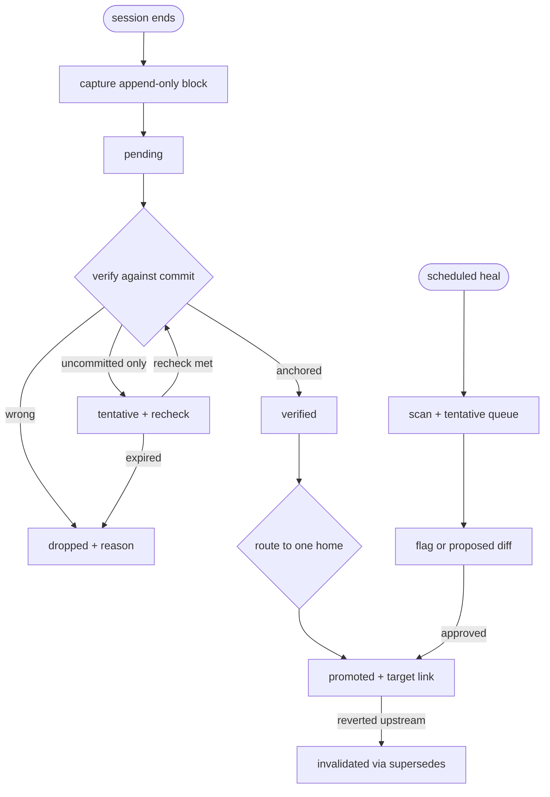

# Agent Memory Loop

## Goal Capsule

- **Objective:** Coding agents start every session with true, bounded project context, and every session's durable learnings survive verification into promoted memory instead of rotting in scattered logs.
- **Means:** A file-first capture, verify, promote, heal, retrieve loop owned by one loop contract (KTD1).
- **Authority:** User instruction, then live code and tests, then promoted memory notes, then raw logs. Loop output never outranks code.
- **Stop conditions:** Stop if capture fires unreliably for two consecutive sessions, if verification cannot anchor claims to a commit, or if retrieval exceeds budget on three straight session starts.
- **Execution profile:** Single implementer with review; units land as atomic commits in dependency order.
- **Who finishes and ships:** The implementing agent builds units U1 through U8; the user approves heal repairs and the graphify adoption call before they land.

---

## Product Contract

### Summary

This plan builds a self-healing project memory loop for the agents working in this repo: every session ends with a capture that also serves as the session-log entry, captured claims carry verifiable state markers, a verify gate anchors them to commits before promotion, durable learnings promote into the solutions corpus and vocab files under a mandatory schema, a scheduled heal pass flags staleness as proposed diffs, and session start assembles context within a fixed budget.

### Problem Frame

Project memory today is five overlapping stores with no loop between them: a stale memory bank file, gitignored daily logs written by hooks, a hand-maintained session log, a curated solutions corpus with an inconsistent schema, and vocab files with no update triggers. Research for this plan confirmed the failure modes are already biting: the bank file names the wrong deploy host, the workspace status misdated the session log, two plan folders both looked active, and parallel sessions routinely share single-slot log files. Each session therefore pays a re-discovery tax and risks trusting dead docs. Past attempts added stores without connecting them; this plan connects them with a lifecycle instead of adding another store.

### Requirements

**Capture**

- R1. Every session ends with a capture that fires without a commit gate, so uncommitted learnings are kept.
- R2. The capture output doubles as the session-log entry, so one write serves both and no third stream appears.
- R3. Concurrent sessions capture without loss or interleaving, keyed by session identity.

**Verify and promote**

- R4. A captured claim is promotable only after verification anchored to a specific commit; claims verified against uncommitted state alone stay tentative.
- R5. Every claim carries a visible terminal state, so retrieval can tell pending from verified, promoted, dropped, and tentative.
- R6. Promotion routes each learning to exactly one home (solutions corpus, glossary, concepts, or decisions) under a mandatory schema, with duplicates merged rather than multiplied.

**Heal and retrieve**

- R7. A scheduled heal pass detects contradicted, superseded, and dead-reference memory and proposes repairs as diffs for approval; autonomous runs never write repairs directly.
- R8. Tentative claims carry a recheck condition and an owner, so they cannot sit in limbo forever.
- R9. Session start assembles context within a fixed budget in priority order, preferring promoted notes over the raw claims they supersede.

### Key Decisions

- **Capture fires unconditionally at session end** (session-settled: user-directed — chosen over manual discipline and checkpoint-command-only: unfired manual steps starve the loop). Governs R1.
- **Capture output doubles as the session-log entry, retiring the separate manual mandate** (session-settled: user-directed — chosen over keeping separate streams: triple-write guarantees drift). Governs R2.
- **Heal runs on an external schedule outside the repo** (session-settled: user-directed — chosen over on-demand invocation and CI-scheduling: the repo has no recurrence host and CI is PR-gated). Governs R7.
- **Loop output ranks below code and live state**, so a promoted note that contradicts current code loses. Governs R4, R5.

### Actors

- A1. Coding agent: writes captures, verifies claims, proposes promotions and heal repairs, reads assembled context.
- A2. User: approves heal repairs and the structural-graph adoption call; owns the external heal schedule.

### Key Flows

- F1. Session end: hook fires capture unconditionally, agent distills durable claims into the dated log with session identity, and the same content lands as the session-log entry.
- F2. Verify: each claim is checked against the verifying commit and tests, then marked verified, tentative with a recheck condition, or dropped with a reason.
- F3. Promote: verified claims route to one home under the mandatory schema; duplicates merge; the source entry is marked with the promotion target.
- F4. Heal: scheduled run scans memory docs, flags staleness, owns the tentative queue, and emits proposed diffs; the user approves before anything lands.
- F5. Retrieve: session start assembles workspace docs, matching promoted notes, then recent logs within budget, skipping raw claims already promoted or dropped.

### Acceptance Examples

- Covers R4. Given a claim verified only against uncommitted code, when promotion is attempted, then the claim stays tentative with its recheck condition intact.
- Covers R5, R9. Given a learning promoted into the solutions corpus, when the next session starts, then retrieval surfaces the promoted note and skips the raw log claim it supersedes.
- Covers R7. Given a heal run finding a contradicted note, when no user has approved a repair, then the note is flagged and unchanged.

### Success Criteria

- A new session reaches accurate working context without re-reading raw history files by hand.
- No promoted note contradicts current code for longer than one heal cycle.
- The stale-bank failure class (wrong host, wrong phase, dead references) is caught by the heal pass rather than by accident.

### Scope Boundaries

- The loop covers this repo's working memory only; the global cross-project brain stays out of scope.
- No external memory service is adopted in this plan; the structural graph is a pilot with an explicit adopt-or-drop call.
- Healing repairs are proposed diffs, never autonomous writes.
- Memory-bank history is archived, not deleted, and the archive stays readable.

#### Deferred to Follow-Up Work

- Feeding distilled learnings into the global brain.
- Token-cost instrumentation of session-start assembly.
- Extending claim markers to non-memory docs.

---

## Planning Contract

### Key Technical Decisions

- KTD1. File-first loop with five named flows (capture, verify, promote, heal, retrieve) as the architecture, because the repo's conventions, approval gates, and portability all assume files, and the failure to heal is a lifecycle gap rather than a storage gap.
- KTD2. Unconditional session-end hook plus session-identity-prefixed append-only blocks for capture (session-settled: user-directed — chosen over commit-gated hooks and single-slot files: commit gates miss exactly the uncommitted learnings, and parallel sessions routinely collide), instantiating the capture-timing Key Decision and governing R1, R3.
- KTD3. Inline claim-state markers appended to the source entry (`verified <sha>`, `promoted <path>`, `dropped <reason>`, `tentative <recheck>`, `invalidated <superseding-ref>`), because a sidecar index drifts from the logs it describes while markers travel with their claim, governing R5.
- KTD4. Verification anchored to the verifying commit SHA with a tentative cap for uncommitted-only evidence and revert invalidation through the existing `supersedes` precedent, because the tree is routinely dirty and plans cite promoted notes as binding, governing R4.
- KTD5. Mandatory solutions frontmatter generalized from the one complete note plus a destination checklist (behavior or bug to solutions, settled name to glossary, meaning to concepts, technical choice to decisions), because the corpus schema is inconsistent today and promotion without a router scatters, governing R6.
- KTD6. Heal as an externally scheduled run emitting proposed diffs and owning the tentative queue with expiry (session-settled: user-directed — chosen over on-demand invocation and CI scheduling: no in-repo scheduler exists and CI is PR-gated), because autonomous edits to gitignored files are unrecoverable and approval-gated, governing R7, R8.
- KTD7. Fixed session-start budget with priority workspace docs, then matching promoted notes, then recent logs, excluding superseded raw claims, because unbounded injection is the bloat failure already fought in this repo, governing R9.
- KTD8. Graphify evaluated as a read-only structural layer in a time-boxed pilot with an adopt-or-drop call, because its memory overlay (recency-weighted lessons with re-verify flags on changed code) matches the heal need while its graph is a regenerable derived artifact that must never become authority.

### High-Level Technical Design

The loop is a claim lifecycle, not a pipeline: claims enter at capture, rest in exactly one state, and leave through promotion, expiry, or approved repair.

Directional guidance, not implementation specification: states are marker suffixes on the source entry; transitions are agent actions gated by the rules above.

### Assumptions

- The hook host exposes a session identifier and a stop or session-end event the capture can attach to unconditionally.
- The external heal schedule runs on the user's machine or scheduler with repo access; its exact host is set at implementation time.
- Graphify's pilot runs read-only against this repo with code-only extraction available offline.

---

## Implementation Units

### U1. Claim markers and lifecycle convention

- **Goal:** Every memory claim carries a visible terminal state the loop can act on.
- **Requirements:** R5.
- **Dependencies:** None.
- **Files:** `docs/workspace/memory-loop.md` (new loop contract), `docs/solutions/` (one exemplar marker backfill).
- **Approach:** Define the marker vocabulary and the `.done.md` rule (a day is done when every claim on it has a terminal marker). Markers append to source entries; no sidecar index. Cite KTD3 rather than restating the taxonomy.
- **Test scenarios:**
  - A fixture log with pending, verified, tentative, dropped, promoted, and invalidated claims parses to six distinct states with zero unclassified.
  - A `.done.md` rename with one unmarked claim is rejected by the convention check.
  - A promoted claim without a target link is rejected by the convention check.
- **Verification:** A reviewer can state every claim's status in the exemplar file without opening another file.

### U2. Unconditional capture path

- **Goal:** Session end always captures, concurrent sessions never collide, and the capture doubles as the session-log entry.
- **Requirements:** R1, R2, R3.
- **Dependencies:** U1.
- **Files:** hook configuration and capture script, `CLAUDE.md` (retire separate manual mandate), `docs/SESSION-LOG.md` (doubled entry target), `.remember/` convention note.
- **Approach:** Fire capture on session end without a commit gate per KTD2. Session-identity-prefixed append-only blocks; retire the single-slot `now.md` pattern. One write serves the daily log and the session-log entry per the settled doubling decision.
- **Execution note:** Prefer runtime smoke verification over unit coverage; this unit is hooks and conventions.
- **Test scenarios:**
  - A session ending with zero commits still produces a capture block.
  - Two sessions ending against the same date produce two intact blocks with no interleaving.
  - A session with no durable content produces an explicit skipped marker rather than silence.
  - The session-log entry and the daily block carry identical claim text.
- **Verification:** End two parallel scratch sessions and show both captures intact plus one session-log entry each.

### U3. Verify gate with commit anchoring

- **Goal:** Only commit-anchored claims become promotable; everything else is tentative or dropped with a trace.
- **Requirements:** R4.
- **Dependencies:** U1.
- **Files:** `docs/workspace/memory-loop.md` (verify section), solutions schema doc (anchor field).
- **Approach:** Verification records the verifying commit SHA per KTD4. Claims evidenced only by uncommitted state cap at tentative with a recheck condition. Reverts invalidate dependents through `supersedes`.
- **Test scenarios:**
  - A claim checked against a clean-checkout commit records verified with the SHA.
  - A claim evidenced only by uncommitted edits records tentative, never verified.
  - A revert of a verifying commit flips dependent notes to invalidated with the superseding reference.
  - A wrong claim records dropped with a reason and never resurfaces as pending.
- **Verification:** The gate's worked example cites a real recent commit for one verified claim.

### U4. Promotion router and mandatory schema

- **Goal:** Verified learnings land in exactly one home under one schema, duplicates merge.
- **Requirements:** R6.
- **Dependencies:** U1, U3.
- **Files:** solutions schema doc, `CONCEPTS.md`, `GLOSSARY.md`, `docs/DECISIONS.md` (routing targets only, minimal edits), one merged exemplar note.
- **Approach:** Enforce the full frontmatter schema per KTD5 with the destination checklist. Generalize the one complete note's schema including `supersedes`. Backfill or merge one real learning as the exemplar.
- **Test scenarios:**
  - A schema checker accepts the complete exemplar and rejects a note missing required fields.
  - A learning matching an existing note merges into it instead of creating a second file.
  - A settled platform name routes to the glossary while its meaning routes to concepts, with no duplication.
  - A source entry gains the promotion target link on promote.
- **Verification:** The checker passes across the whole solutions corpus or lists every violator explicitly.

### U5. Scheduled heal pass with proposed diffs

- **Goal:** Staleness is found on a schedule and repaired only by approval.
- **Requirements:** R7, R8.
- **Dependencies:** U1, U3.
- **Files:** heal runbook in `docs/`, tentative-queue section of the loop contract, heal verdict log format.
- **Approach:** External schedule per the settled hosting decision and KTD6. Runs default to flags; repairs ship as proposed diffs. The pass owns the tentative queue and expires stale tentative claims with recorded reasons. Past verdicts are logged so re-flagging loops are visible.
- **Execution note:** This is mostly procedure plus a verdict log; prefer a dry-run demonstration over unit coverage.
- **Test scenarios:**
  - A dry run against a fixture containing a contradicted note, a superseded note, and a dead reference emits three flags and zero file writes.
  - A tentative claim past its recheck condition without new evidence expires with its reason recorded.
  - A second run over unchanged fixtures emits no duplicate verdicts.
  - A repair lands only with an approval record attached.
- **Verification:** Dry-run output on fixtures plus one real flagged finding in the working tree.

### U6. Bounded session-start retrieval

- **Goal:** Session start assembles ranked context inside a fixed budget.
- **Requirements:** R9.
- **Dependencies:** U1, U4.
- **Files:** session-start script, loop contract (budget section).
- **Approach:** Fixed budget with priority workspace docs, then matching promoted notes, then recent logs per KTD7. Raw claims already promoted or dropped are skipped. Replace unbounded whole-file injection with ranked assembly.
- **Test scenarios:**
  - Assembly over fixtures exceeding the budget drops raw logs before promoted notes and workspace docs before nothing.
  - A promoted learning suppresses its raw source claim from the assembled set.
  - A dropped claim never appears in assembled context.
  - Assembly with an empty recent log still delivers workspace docs plus matching notes.
- **Verification:** Show assembled output for a sample task with token counts inside budget and the drop order observed.

### U7. Graphify structural-layer pilot

- **Goal:** An adopt-or-drop verdict on graphify as a read-only structural layer, on evidence.
- **Requirements:** R9.
- **Dependencies:** U6.
- **Files:** pilot notes in `docs/`, `AGENTS.md` (pointer only if adopted), `graphify-out/` (derived, gitignored).
- **Approach:** Time-boxed pilot per KTD8: build the code graph, trial query-first lookups on real questions, trial the reflect overlay for lesson hints with re-verify flags. Adopt only on measured retrieval wins; the graph stays derived and below code in authority either way.
- **Execution note:** This is an evaluation with a verdict, not a build-out; keep the pilot small enough to abandon.
- **Test scenarios:**
  - Five real codebase questions are answered from the graph with fewer file reads than the grep baseline.
  - A lesson hint attached to changed code carries the re-verify flag.
  - Regenerating the graph from scratch reproduces the verdict inputs.
  - The adopt-or-drop record names the measured costs and the decision.
- **Verification:** The verdict names measured reads, costs, and the final call with evidence linked.

### U8. End-to-end pilot and own eval

- **Goal:** Prove the loop on one real week of memory before declaring it operational.
- **Requirements:** R1 through R9.
- **Dependencies:** U2, U3, U4, U5, U6.
- **Files:** backfilled markers on one week of logs, pilot report in `docs/`.
- **Approach:** Backfill claim markers across one week of daily logs plus the session log, run capture, verify, promote, heal, and retrieve once end to end, and record precision and effort. Vendor benchmarks are not trusted; this pilot is the benchmark.
- **Test scenarios:**
  - Every claim in the pilot week reaches a terminal marker with zero unclassified remainder.
  - At least one tentative claim and one dropped claim appear with reasons, proving the gates engage.
  - Retrieval for a sample task stays inside budget with the drop order observed.
  - The pilot report lists what the loop caught that ad-hoc memory missed.
- **Verification:** Pilot report plus reviewer walkthrough of the marked week.

---

## Verification Contract

| Command | Applies to | Proves |
|---|---|---|
| `npm run typecheck` | U2, U6 (any script or hook touching code) | Touched code still typechecks |
| Focused test run for the touched workspace (e.g. web or api suite for hook-adjacent code) | U2, U4 (checker), U6 | Behavior covered at the narrowest scope |
| `git diff --check` | Every unit | No whitespace or conflict-marker defects |
| Schema and marker checker against fixtures plus the live corpus | U1, U3, U4 | Conventions hold on real files, not just fixtures |
| Dry-run heal with zero-write assertion | U5 | Autonomous runs cannot mutate |
| Budgeted assembly demonstration with counts | U6, U8 | Retrieval stays inside budget with the drop order observed |

Quality gates follow the repo's established workflow: approval before production, destructive, or credential-adjacent actions; unrelated dirty-tree changes are preserved, never absorbed.

---

## Definition of Done

- All eight units land in dependency order with their verifications shown.
- Every claim in the pilot week carries a terminal marker; zero unclassified remainder.
- The solutions corpus passes the schema checker or lists every violator explicitly.
- One dry-run heal demonstrates flags with zero writes; one real finding is flagged in the tree.
- Session-start assembly demonstrates bounded output with the drop order observed.
- The graphify verdict is recorded with measured evidence either way.
- Abandoned pilot code and fixture scaffolding are removed from the final diff.

---

## Risks & Dependencies

- The hook host may not expose a reliable session identity or unconditional stop event; fallback is an explicit checkpoint command with the same block format.
- Entire owns today's auto-logs; capture must compose with its hook lifecycle rather than fight it, or double-capture follows.
- The tree is routinely dirty with parallel sessions; verification and heal procedures assume contention, never a clean tree.
- The external heal schedule lives outside the repo, so its setup is documented but not versioned; a missed run degrades to flags, never silent staleness.
- Graphify's semantic pass needs a model backend for docs; the pilot can run code-only fully offline if that is unavailable.

---

## Alternatives Considered

- Adopt Graphiti, Mem0, or Cognee as the memory store: rejected for now because each adds database infrastructure and per-write model cost to solve retrieval the repo has not measured as broken, while file memory stays portable, reviewable, and approval-compatible. Revisit only on measured retrieval failure.
- Pair graphify with a temporal service for session history: deferred to follow-up; the file loop covers temporal needs until the pilot proves otherwise.
- Keep manual capture discipline with no hooks: rejected by the settled capture decision; unfired manual steps starve the loop under time pressure.

---

## System-Wide Impact

- Agents gain a bounded, ranked context at session start and a capture duty at session end; per-session tax is one distillation write.
- The user approves heal repairs and owns the external schedule; no autonomous mutation path exists.
- Promoted notes become binding constraints on future plans, so the verify gate guards plan quality directly.
- Prompt context changes from unbounded file injection to budgeted assembly; over-budget behavior is defined instead of accidental.

---

## Sources & Research

- Repo evidence: `.remember/` hook-written daily logs (gitignored), `docs/SESSION-LOG.md` manual mandate, `docs/solutions/` corpus with inconsistent frontmatter and one `supersedes` precedent, `docs/workspace/workflow.md` approval gate and status-maintenance rule, session-start unbounded injection precedent.
- Product framing: `PRODUCT.md` (truthful status, obvious next action), `CONCEPTS.md` shared vocabulary.
- External landscape shaped KTD1, KTD6, KTD7, KTD8 and Alternatives: temporal knowledge graphs with validity windows (Graphiti) show time must be explicit but need no graph database here; single-pass extraction with hybrid retrieval (Mem0 v2) shows retrieval can stay simple until measured otherwise; sleep-time background consolidation (Letta) maps to the external heal schedule; embedded-zero-infra stores (Cognee defaults) confirm starting without infrastructure; graphify's local AST graph with confidence-tagged edges and its reflect overlay with re-verify flags matches the structural plus lessons need; vendor benchmarks were treated as untrusted, so U8 runs the project's own eval.
- Research dossiers: learnings, agent-native assessment, and flow analysis in the plan scratch directory.
