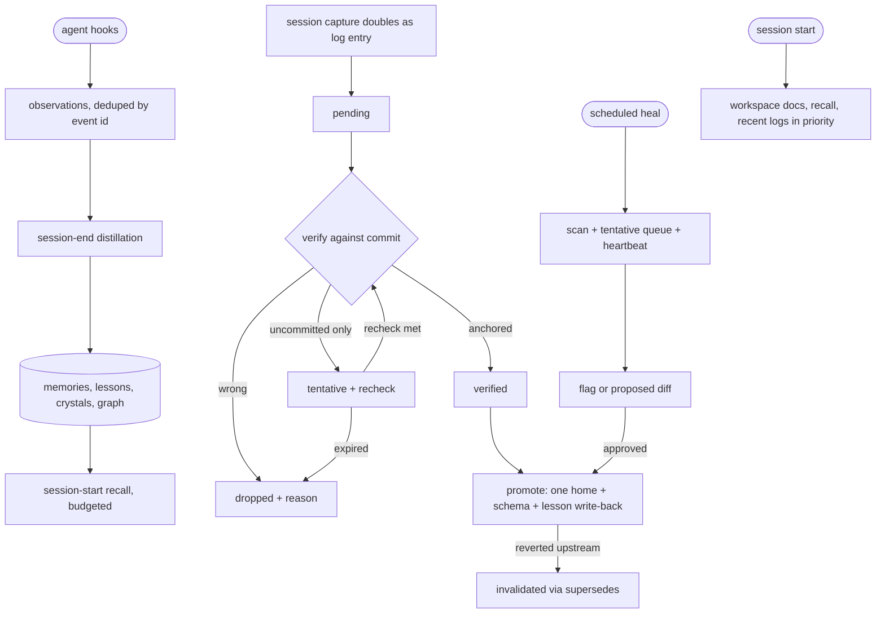

# agentmemory Memory Loop

## Goal Capsule

- **Objective:** Coding agents start every session with true, bounded project context drawn from prior sessions, and durable learnings survive verification into promoted memory instead of rotting in scattered logs.
- **Means:** agentmemory as the capture, recall, and consolidation substrate with a repo-owned verify, promote, and heal layer on top (KTD1).
- **Authority:** User instruction, then live code and tests, then promoted repo notes, then agentmemory recall, then raw logs. No memory layer outranks code.
- **Stop conditions:** Stop if hook capture duplicates or drops events for two straight sessions, if consolidation quality stays unusable without a provider key nobody approves, or if retrieval exceeds budget on three straight session starts.
- **Execution profile:** Single implementer with review; units land as atomic commits in dependency order.
- **Who finishes and ships:** The implementing agent builds units U1 through U9; the user approves the provider-key call, heal repairs, and the final adopt verdict before they land.

---
## Product Contract

### Summary

This plan adopts agentmemory (Apache-2.0, local-first) as the working memory substrate — hooks capture every session into observations, session-end distillation consolidates them into memories, lessons, and crystals, and session start injects ranked context within a token budget — and builds the repo-owned layer it does not provide: commit-anchored verification, promotion into the solutions corpus and vocab files under a mandatory schema, a scheduled heal pass with approval-gated repairs, and retrieval composition between agentmemory recall and workspace docs. It supersedes the file-only loop plan, whose review findings are carried forward below.

### Problem Frame

Project memory today is five overlapping stores with no loop between them: a stale memory bank file, gitignored daily logs, a hand-maintained session log, a curated solutions corpus with an inconsistent schema, and vocab files with no update triggers. The failure modes are already biting: the bank file named the wrong deploy host, the workspace status misdated the session log, two plan folders both looked active, and parallel sessions share single-slot log files. The prior plan proposed a fully custom loop; review plus landscape evidence redirected it: automatic capture, consolidation, and recall are solved off the shelf and local-first, while verification against code, promotion into a reviewable corpus, and doc healing are repo-specific and stay custom. Building all five flows by hand would spend the budget re-solving capture and recall.

### Requirements

**Substrate**

- R1. Every session is captured through agentmemory hooks without a commit gate, exactly once per event, surviving restarts through its inbox and spool.
- R2. Hook ownership is explicit per event: agentmemory owns working-memory capture, Entire keeps the raw transcript, and no session maintains a third raw stream.
- R3. Session start receives agentmemory recall within its token budget before any repo assembly is added.

**Verify and promote**

- R4. A captured claim is promotable only after verification anchored to a specific commit; claims verified against uncommitted state alone stay tentative.
- R5. Every claim carries a visible terminal state (pending, verified, tentative, dropped, promoted, invalidated), so retrieval can tell what is authoritative.
- R6. Promotion routes each learning to exactly one home (solutions corpus, glossary, concepts, or decisions) under a mandatory schema, writes it back into agentmemory as a high-confidence lesson, and links the source entry to its target.

**Heal and retrieve**

- R7. A scheduled heal pass detects contradicted, superseded, and dead-reference memory and proposes repairs as diffs for approval; autonomous runs never write repairs directly.
- R8. Tentative claims carry a recheck condition and an owner, so they cannot sit in limbo forever.
- R9. Retrieval composes agentmemory recall with workspace docs in a fixed priority within one overall budget, skipping raw claims already promoted or dropped.

### Key Decisions

- **agentmemory is the capture, recall, and consolidation substrate** (session-settled: user-directed — chosen over a fully custom loop and over Graphiti, Mem0, and Cognee: automatic capture plus local-first recall with no database to operate). Governs R1, R3.
- **Capture fires unconditionally at session end through agentmemory hooks** (session-settled: user-directed — chosen over manual discipline and checkpoint-command-only: unfired manual steps starve the loop). Governs R1.
- **Capture output doubles as the session-log entry, retiring the separate manual mandate** (session-settled: user-directed — chosen over keeping separate streams: triple-write guarantees drift). Governs R2.
- **Heal runs on an external schedule outside the repo** (session-settled: user-directed — chosen over on-demand invocation and CI-scheduling: the repo has no recurrence host and CI is PR-gated). Governs R7.
- **Loop output ranks below code and live state**, so recalled or promoted memory that contradicts current code loses. Governs R4, R5.

### Actors

- A1. Coding agent: works with recalled context, writes captures implicitly through hooks, verifies claims, proposes promotions and heal repairs.
- A2. User: approves the provider-key call, heal repairs, and the adopt verdict; owns the external heal schedule.

### Key Flows

- F1. Session activity: hooks post every prompt and tool call as observations with restart-safe identity; duplicates replay as duplicates, never double-stored.
- F2. Session end: distillation summarizes, consolidates into memories and lessons, extracts graph entities, crystallizes one digest, and sweeps decay over unreinforced records.
- F3. Verify and promote: durable claims are checked against the verifying commit, marked with terminal states, routed to one home under the schema, and written back as high-confidence lessons.
- F4. Heal: scheduled run scans repo memory docs, owns the tentative queue, and emits flags plus proposed diffs; the user approves before anything lands.
- F5. Retrieve: session start assembles agentmemory recall with workspace docs in priority order within one budget, skipping superseded raw claims.

### Acceptance Examples

- Covers R1. Given a session whose work never commits, when the session ends, then its observations are captured and consolidated with no commit gate involved.
- Covers R4. Given a claim verified only against uncommitted code, when promotion is attempted, then the claim stays tentative with its recheck condition intact.
- Covers R6, R9. Given a learning promoted into the solutions corpus and written back as a lesson, when the next session starts, then retrieval surfaces the promoted note and skips the raw claims it supersedes.
- Covers R7. Given a heal run finding a contradicted note, when no user has approved a repair, then the note is flagged and unchanged.

### Success Criteria

- Session-start assembly stays within 2,500 tokens total while carrying workspace docs plus recalled context.
- Recall precision on the pilot's sampled questions reaches 8 of 10 answered from memory without re-reading raw files.
- No promoted note contradicts current code for longer than 7 days.
- The heal pass catches at least one real staleness finding per month on the pilot window.

### Scope Boundaries

- The loop covers this repo's working memory; the global cross-project brain stays out of scope.
- The structural code graph is deferred, not piloted here; revisit only on measured retrieval failure.
- Healing repairs are proposed diffs, never autonomous writes.
- Memory-bank history is archived, not deleted, and the archive stays readable.
- The agentmemory store lives per-machine outside git; the repo corpus is the portable layer, and the plan documents that split rather than fixing it.

#### Deferred to Follow-Up Work

- Feeding distilled learnings into the global brain.
- Token-cost instrumentation of session-start assembly.
- A structural code-graph layer.

### Open Questions

- Resolved 2026-10-09: procedural learnings ARE promotable under a decision-record anchor (decision record, date, owner) — user-directed over capping at tentative.

---
## Planning Contract

### Key Technical Decisions

- KTD1. agentmemory substrate plus a repo-owned verify, promote, and heal layer, because automatic capture, consolidation, and recall are solved local-first off the shelf while code-anchored verification and approval-gated promotion are repo-specific.
- KTD2. One capture owner per event: agentmemory hooks own working-memory capture and Entire keeps the raw transcript (session-settled: user-directed — chosen over parallel hook systems: two writers interleave and triple-write guarantees drift), instantiating the hook-composition decision and governing R2.
- KTD3. Inline claim-state markers on the session-log entry (`pending`, `verified <sha>`, `promoted <path>`, `dropped <reason>`, `tentative <recheck>`, `invalidated <superseding-ref>`), because markers travel with their claim while the agentmemory store stays per-machine and unreviewable, governing R5.
- KTD4. Verification anchored to the verifying commit SHA with a tentative cap for uncommitted-only evidence and revert invalidation through the existing `supersedes` precedent, because the tree is routinely dirty and promoted notes become binding on future plans, governing R4.
- KTD5. Mandatory solutions frontmatter generalized from the one complete note plus a destination checklist (behavior or bug to solutions, settled name to glossary, meaning to concepts, technical choice to decisions), with promotion writing back a high-confidence lesson, because the corpus schema is inconsistent today and write-back closes the recall loop, governing R6.
- KTD6. Heal as an externally scheduled run emitting proposed diffs, owning the tentative queue with expiry, and recording a last-run heartbeat the retrieve path surfaces as overdue (session-settled: user-directed — chosen over on-demand invocation and CI scheduling: no in-repo scheduler exists and CI is PR-gated), because autonomous edits to gitignored files are unrecoverable and a missed run must be visible rather than silent, governing R7, R8.
- KTD7. One overall retrieval budget with priority workspace docs, then agentmemory recall, then recent logs, excluding superseded raw claims; the substrate injection cap nests inside the overall cap with overall-wins on conflict, and both values live in the loop-contract budget section, because unbounded injection is the bloat failure already fought in this repo, governing R3, R9.
- KTD8. Consolidation quality gated on a provider key with a keyless fallback bar: full distillation needs a model backend (local model acceptable), while capture, recall, deterministic graph extraction, and synthetic compression run keyless, because the substrate's slow path is key-gated and the plan must hold either way.

### High-Level Technical Design

Claims flow through substrate automation into repo-owned gates; authority descends from code to promoted notes to recall to raw logs.

Directional guidance, not implementation specification: boxes are agent actions and substrate calls; the plan's units own the repo-side behavior.

### Assumptions

- The OpenCode capture plugin exposes the hook events the plan needs on this repo's hosts; gaps surface in U1 and fall back to explicit checkpoint capture for the missing host.
- A provider key or local model backend is approvable for consolidation; until then the keyless path (synthetic compression, deterministic graph extraction) is the bar.
- The agentmemory store path and server ports do not conflict with existing local services; conflicts resolve to documented overrides in U1.

---
## Implementation Units

### U9. Premise tally spike

- **Goal:** Prove the pilot week holds enough durable claims to justify operating the loop before marker, router, and heal work is built.
- **Requirements:** None — this unit gates U3, U4, U5, U6.
- **Dependencies:** None.
- **Files:** pilot week log sample, tally sheet in `docs/`.
- **Approach:** Count terminal-worthy claims in one past week against the marker taxonomy. Record the numeric proceed bar before counting, then tally; a below-bar result halts U3-U6 with the miss recorded.
- **Test scenarios:**
  - Two independent tallies of the same week agree within a small margin.
  - The proceed bar is recorded before counting begins.
  - A below-bar tally halts U3, U4, U5, U6 with the miss recorded.
- **Verification:** Tally sheet plus proceed or halt record.

### U1. Install, connect, and prove keyless baseline

- **Goal:** agentmemory captures and recalls on this repo with no keys and no duplicate events.
- **Requirements:** R1, R3.
- **Dependencies:** None.
- **Files:** agent connection config, `docs/workspace/memory-loop.md` (new loop contract, substrate section).
- **Approach:** Install locally, connect the coding agent, enable context injection, and record the store path, ports, and token budget in the loop contract per KTD8. Capture and recall must work keyless before anything else is built on top.
- **Execution note:** Prefer runtime smoke verification over unit coverage; this unit is wiring plus conventions.
- **Test scenarios:**
  - A scratch session's tool calls appear as observations exactly once each, including a replayed event id.
  - With the server down, events spool locally and arrive on restart with no duplicates.
  - Session start injects a recall block within the configured budget on a fixture project.
  - Ports and paths from the loop contract match the running server.
- **Verification:** A two-session scratch demo shows capture, restart survival, and budgeted recall.

### U2. Hook composition with Entire

- **Goal:** One capture owner per event across agentmemory hooks and Entire auto-logs.
- **Requirements:** R2.
- **Dependencies:** U1.
- **Files:** hook configuration, `.remember/` convention note, `docs/workspace/memory-loop.md` (ownership table).
- **Approach:** Assign working-memory capture to agentmemory hooks and the raw transcript to Entire per KTD2, with session-identity-prefixed blocks and a date-plus-identity dedup key. Retire the single-slot `now.md` pattern.
- **Execution note:** Prefer runtime smoke verification over unit coverage; this unit is hooks and conventions.
- **Test scenarios:**
  - A session ending with zero commits still produces observations plus one transcript entry.
  - Two sessions ending against the same date produce intact, attributable blocks in both stores.
  - No event appears twice across the two stores as the same record type.
  - A session with no durable content leaves an explicit skipped marker rather than silence.
- **Verification:** End two parallel scratch sessions and show intact captures in both stores with no double-write.

### U3. Claim markers and session-log doubling

- **Goal:** Every memory claim carries a visible terminal state and one write serves log and journal.
- **Requirements:** R2, R5.
- **Dependencies:** U1, U9.
- **Files:** `docs/workspace/memory-loop.md` (marker taxonomy), `CLAUDE.md` (retire separate manual mandate), `docs/SESSION-LOG.md` (doubled entry target), `docs/solutions/` (one exemplar backfill), marker checker script (new, proposed path set at implementation).
- **Approach:** Define the six-state marker vocabulary per KTD3 and the `.done.md` rule (a day is done when every claim on it has a terminal marker; a daily-log rename to `.done.md` is allowed only when the marker checker reports zero unmarked claims). The capture distillation doubles as the session-log entry per the settled doubling decision, and session-log writes go through the coordinator's serialization, never direct hook appends.
- **Test scenarios:**
  - A fixture log with pending, verified, tentative, dropped, promoted, and invalidated claims parses to six distinct states with zero unclassified.
  - A `.done.md` rename with one unmarked claim is rejected by the marker checker.
  - The session-log entry and the daily distillation carry identical claim text.
  - A promoted claim without a target link is rejected by the marker checker.
  - Parallel hook writes to the session log serialize through the coordinator with no merge conflicts.
- **Verification:** A reviewer can state every claim's status in the exemplar file without opening another file.

### U4. Verify gate, promotion router, and lesson write-back

- **Goal:** Only anchored claims promote, each to exactly one home, and promotion feeds recall.
- **Requirements:** R4, R6.
- **Dependencies:** U3, U9.
- **Files:** solutions schema doc, frontmatter checker script (new, proposed path set at implementation), `CONCEPTS.md`, `GLOSSARY.md`, `docs/DECISIONS.md` (routing targets only, minimal edits), one merged exemplar note.
- **Approach:** Enforce verification anchored to the verifying commit SHA with the tentative cap per KTD4, route by the destination checklist and mandatory schema per KTD5, and write promoted learnings back as high-confidence lessons so recall improves. Blocked on the procedural-anchor open question only for non-commit claims.
- **Test scenarios:**
  - A claim checked against a clean-checkout commit records verified with the SHA.
  - A claim evidenced only by uncommitted edits records tentative, never verified.
  - A revert of a verifying commit flips dependent notes to invalidated with the superseding reference.
  - A promoted learning appears as a lesson in recall and links its source entry to its target.
  - A schema checker accepts the exemplar and rejects a note missing required fields.
- **Verification:** The checker passes across the whole solutions corpus or lists every violator explicitly.

### U5. Scheduled heal pass with heartbeat

- **Goal:** Staleness is found on a schedule, missed runs are visible, and repairs land only by approval.
- **Requirements:** R7, R8.
- **Dependencies:** U3, U9.
- **Files:** heal runbook in `docs/`, tentative-queue section of the loop contract, heal verdict log format.
- **Approach:** External schedule per the settled hosting decision and KTD6. Runs default to flags; repairs ship as proposed diffs. The pass owns the tentative queue with expiry and records a last-run heartbeat in the U5 format the retrieve path reads.
- **Execution note:** This is mostly procedure plus a verdict log; prefer a dry-run demonstration over unit coverage.
- **Test scenarios:**
  - A dry run against a fixture containing a contradicted note, a superseded note, and a dead reference emits three flags and zero file writes.
  - A tentative claim past its recheck condition without new evidence expires with its reason recorded as a flag.
  - A second run over unchanged fixtures emits no duplicate verdicts.
  - A repair lands only with an approval record attached.
- **Verification:** Dry-run output on fixtures plus one real flagged finding in the working tree.

### U6. Retrieval composition within one budget

- **Goal:** Session start assembles workspace docs plus recall inside a fixed budget with a defined drop order.
- **Requirements:** R3, R9.
- **Dependencies:** U1, U4, U5, U9.
- **Files:** session-start script, loop contract (budget section).
- **Approach:** Fixed overall budget with priority workspace docs, then agentmemory recall, then recent logs per KTD7, with the substrate cap nested inside and overall-wins on conflict. Raw claims already promoted or dropped are skipped. Both budgets (substrate injection and repo assembly) are set in one place.
- **Test scenarios:**
  - Assembly over fixtures exceeding the budget drops raw logs before recall and recall before workspace docs.
  - When the substrate injection cap binds first, repo assembly still respects the overall cap and the drop order holds.
  - A missing heartbeat in the U5 format surfaces an overdue warning at session start.
  - A promoted learning suppresses its raw source claim from the assembled set.
  - A dropped claim never appears in assembled context.
  - Assembly with an empty recent log still delivers workspace docs plus recall.
- **Verification:** Show assembled output for a sample task with token counts inside budget and the drop order observed.

### U7. Consolidation quality gate

- **Goal:** A verdict on consolidation depth: provider-backed, local-model, or keyless baseline.
- **Requirements:** R1.
- **Dependencies:** U1.
- **Files:** consolidation eval notes in `docs/`, loop contract (quality bar section).
- **Approach:** Compare consolidation output on past sessions across backends per KTD8: keyless synthetic compression versus provider-backed distillation. Adopt the cheapest backend that clears the quality bar (lessons an agent can act on without re-reading raw observations). Record the verdict with measured evidence.
- **Execution note:** This is an evaluation with a verdict, not a build-out; keep it small enough to abandon.
- **Test scenarios:**
  - Five past sessions distill into lessons under each backend with quality scored blind.
  - The verdict names the measured quality gap and cost per session.
  - The adopted backend reproduces its verdict inputs on re-run.
  - Keyless-only operation still meets the minimum bar or is recorded as below it.
- **Verification:** The verdict names the backend, the measured gap, and the final call with evidence linked.

### U8. End-to-end pilot and own eval

- **Goal:** Prove the loop on one real week of memory before declaring it operational.
- **Requirements:** R1 through R9.
- **Dependencies:** U2, U3, U4, U5, U6, U9.
- **Files:** backfilled markers on one week of logs, pilot report in `docs/`.
- **Approach:** Backfill claim markers across one week of daily logs plus the session log, run the full loop once end to end, and record recall precision, token cost, and what the loop caught that ad-hoc memory missed. Vendor benchmarks are not trusted; this pilot is the benchmark. The U9 premise tally has already cleared before build-out.
- **Test scenarios:**
  - Every claim in the pilot week reaches a terminal marker with zero unclassified remainder.
  - At least one tentative claim and one dropped claim appear with reasons, proving the gates engage.
  - Recall precision on ten sampled questions matches the success-criteria bar.
  - The pilot report lists what the loop caught that ad-hoc memory missed.
- **Verification:** Pilot report plus reviewer walkthrough of the marked week.

---
## Verification Contract

| Command | Applies to | Proves |
|---|---|---|
| `npm run typecheck` | U1, U2, U6 (any script or hook touching code) | Touched code still typechecks |
| Focused test run for the touched workspace | U4 (checker), U6 | Behavior covered at the narrowest scope |
| `git diff --check` | Every unit | No whitespace or conflict-marker defects |
| Schema and marker checker against fixtures plus the live corpus | U3, U4 | Conventions hold on real files, not just fixtures |
| Dry-run heal with zero-write assertion | U5 | Autonomous runs cannot mutate |
| Budgeted assembly demonstration with counts | U6, U8 | Retrieval stays inside budget with the drop order observed |
| Scratch-session capture and recall demo | U1, U2, U7 | Substrate behavior verified live, not assumed |

Quality gates follow the repo's established workflow: approval before production, destructive, or credential-adjacent actions; unrelated dirty-tree changes are preserved, never absorbed.

---
## Definition of Done

- All nine units land in dependency order with their verifications shown.
- The provider-key call and the adopt verdict carry explicit user approval records.
- Every claim in the pilot week carries a terminal marker; zero unclassified remainder.
- The solutions corpus passes the schema checker or lists every violator explicitly.
- One dry-run heal demonstrates flags with zero writes; one real finding is flagged in the tree.
- Session-start assembly demonstrates bounded output with the drop order observed.
- Recall precision meets the success-criteria bar on the pilot's sampled questions.
- Abandoned pilot code and fixture scaffolding are removed from the final diff.

---
## Risks & Dependencies

- The OpenCode plugin may not expose every hook event the plan assumes; gaps fall back to explicit checkpoint capture for the missing host.
- agentmemory owns today's capture path only after U2; until then Entire auto-logs and hook writes must not be mistaken for loop capture.
- The tree is routinely dirty with parallel sessions; verification and heal procedures assume contention, never a clean tree.
- The external heal schedule lives outside the repo, so its setup is documented but not versioned; the heartbeat makes a missed run visible.
- The per-machine store does not travel with a fresh clone; the repo corpus is the portable layer and onboarding must note the split.
- Consolidation depth depends on an approvable model backend; without one the loop runs keyless at the recorded minimum bar.

---
## Alternatives Considered

- A fully custom file loop with no substrate: retired by the settled substrate decision; it re-solves automatic capture and recall the substrate provides keyless.
- Graphiti, Mem0, or Cognee as the store: rejected because each adds database infrastructure and per-write model cost while file reviewability and approval compatibility are lost; revisit only on measured retrieval failure.
- A structural code graph as a second pilot: deferred to follow-up; revisit when recall precision implicates structural gaps.
- Keep manual capture discipline with no hooks: rejected by the settled capture decision; unfired manual steps starve the loop under time pressure.

---
## System-Wide Impact

- Agents gain budgeted recall at session start and implicit capture during sessions; per-session tax is verifying and marking claims, not writing raw logs.
- The user approves the provider backend, heal repairs, and the adopt verdict; no autonomous mutation path exists.
- Promoted notes become binding constraints on future plans, so the verify gate guards plan quality directly.
- Prompt context changes from unbounded file injection to composed budgeted assembly; over-budget behavior is defined instead of accidental.
- A new local service enters the developer environment; its ports, paths, and key posture are recorded in the loop contract.

---
## Sources & Research

- Repo evidence: `.remember/` hook-written daily logs (gitignored), `docs/SESSION-LOG.md` manual mandate, `docs/solutions/` corpus with inconsistent frontmatter and one `supersedes` precedent, `docs/workspace/workflow.md` approval gate and status-maintenance rule.
- Product framing: `PRODUCT.md` (truthful status, obvious next action), `CONCEPTS.md` shared vocabulary.
- Substrate evidence shaped KTD1, KTD2, KTD7, KTD8 and Alternatives: hook-posted observations with restart-safe identity and offline spool; session-end distillation into memories, lessons, crystals, and graph entities; deterministic keyless graph extraction with an optional model-backed pass; hybrid recall fusing keyword, vector, and graph streams with version-chain currency; budgeted session-start assembly of pinned slots, project profile, ranked lessons, and recent summaries; key-gated consolidation with synthetic keyless fallback.
- Prior review findings carried forward: six-state marker vocabulary, session-log file target, expiry-as-flag semantics, committed-log marker authority, Entire composition rule, recheck ownership, measurable criteria, premise gate, and missed-run heartbeat.
- The file-only predecessor plan is superseded by this artifact; its open procedural-anchor question is preserved above.
