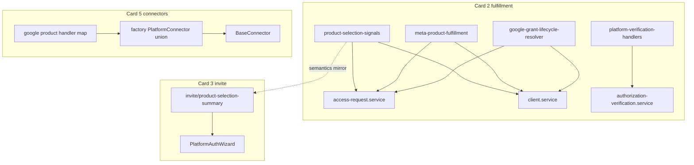

# Architecture review cards 2 / 3 / 5 — Plan

## Goal Capsule

- **Objective:** Close the three deepening cards left after the PLATFORMS registry (DEC-015): fulfillment helpers stop drifting, the invite wizard stops owning platform-id switches, and the connector factory stops lying about beehiiv / loose types — with the platform-id walker allowlist shrinking as proof.
- **Means:** Layered extracts using the same unquoted-key / lib-module pattern as `apps/api/src/lib/product-selection-signals.ts`; sequence card 2 remainder → card 3 → card 5; TDD + walker prune in the same PR as each extract.
- **Product authority:** Architecture / maintainability work only. No invite UX change, no new platforms, no public-API scope (that is `docs/plans/2026-10-09-0821-feat-public-api-parity-core-plan.md`).
- **Already shipped:** Card 2 slice 1 on `main` (`471614c3`) — selection signals, Instagram count drift closed, `LegacyPlatformSchema` ← `LEGACY_PAYLOAD_IDS`, walker pruned for `access-request.service.ts` / `client.service.ts`.
- **Open blockers:** None.
- **Plan preservation:** Product Contract created in this bootstrap (no prior brainstorm); session-settled KTDs recorded below.

---

## Product Contract

### Summary

Finish architecture-review cards 2 (fulfillment), 3 (invite session / wizard dispatch), and 5 (connector interface) in that order, each unit leaving the walker allowlist smaller or unchanged, without changing invite UX or request completion semantics.

### Problem Frame

Post-registry, the worst remaining drift is not “where are platform ids listed” but “who decides a grant is done / which connector to call / how the wizard summarizes assets.” Meta evaluation still lives inside the access-request service while Google’s evaluator is shared; client detail imports the big service for one pure function; the wizard re-implements selection counting; `PlatformConnector` still `as any`s beehiiv.

### Key Decisions

- **KTD1.** One plan, three cards, fixed order: **2 → 3 → 5**. Card 3 consumes card 2’s selection substrate; card 5 is independent but last so factory typing does not collide with parallel public-API work on `access-request.service.ts`. (session-settled: user-directed)
- **KTD2.** Prefer **API `lib/` extracts** over moving Meta into `packages/shared` in this plan. Google’s pure evaluator already lives in shared; Meta stays API-side beside selection signals (Meta grants are API-shaped). Revisit shared only if a second non-API consumer appears. (session-settled: planning default from card-2 brief)
- **KTD3.** **Defer** unifying `ClientAuthorizationProgress` / `UnresolvedProductReason` with `ClientDetailProductStatus` — separate later unit (out of scope here). This plan stops the duplicated *branching*; it does not merge the two vocabularies. (session-settled: planning default)
- **KTD4.** Walker allowlist entries pruned **in the same PR** that removes the violation (SESSION-LOG / DEC-015). Partial extracts that leave ≥3 `case '<id>'` branches keep the allowlist until the last case is gone. (session-settled: DEC-015)
- **KTD5.** Web selection counting **mirrors** API `product-selection-signals` semantics (Instagram = `instagramAccounts` only) via a web `lib/invite` module; no cross-package import from `apps/api` into web. (session-settled: planning default)
- **KTD6.** Do not delete `apps/web/src/evidence/` in this plan (still harness-wired). (session-settled: verified in session)

### Actors

- A1. Implementer (agent or human) executing units via worktrees off `main`
- A2. Agency client / agency user — unchanged behavior except Instagram progress truth already fixed in slice 1

### Requirements

- R1. Client detail does not import `access-request.service` solely for Meta fulfillment.
- R2. Google default mode (including MCC → `manager_link`) is resolved by one API helper used by both progress and client detail.
- R3. `authorization-verification.service.ts` has no ≥3 platform `case` dispatch; walker entry removed.
- R4. `PlatformAuthWizard.tsx` has no ≥3 platform `case` dispatch; walker entry removed; selection counts match API Instagram semantics.
- R5. Factory beehiiv registration needs no `as any`; connector interface distinguishes OAuth vs api_key.
- R6. `connectors/google.ts` asset-product dispatch no longer walker-flagged (or allowlist pruned with table refactor).
- R7. Every feature-bearing unit ships characterization/unit tests before call-site rewires (repo TDD).

### Success Criteria

- Walker green with fewer allowlist keys (at least: verification, wizard, google connector).
- Named suites green: access-request, client.service, evaluate-meta (migrated), authorization-verification (new), PlatformAuthWizard (+ tiktok), factory-completeness, google-native-fulfillment, platform-id-walker.
- No intentional change to invite checklist UX or request `completed` / `partial` semantics.

### Scope Boundaries

**In**

- Card 2 remainder: Meta fulfillment extract; Google lifecycle wrapper parity; verification dispatch table + walker prune; optional shared product-fulfillment core if U1+U2 land cleanly
- Card 3: extract wizard platform switches; prune `PlatformAuthWizard.tsx` allowlist; keep session/UI in the wizard
- Card 5: type-unify `PlatformConnector` / beehiiv; prune `google.ts` allowlist; delete dead `TEMPLATE.ts`

**Out**

- Vocabulary enum merge (KTD3)
- Identity / token-lifecycle / `assets.routes.ts` allowlist entries (not these cards)
- `google-offboarding-executor.ts` allowlist (defer)
- Meta connector → `BaseConnector` inheritance (too large)
- Public API parity plan work
- Entire pre-push wrapper fix (separate chore)
- Deleting `apps/web/src/evidence/` (KTD6)

---

## Architecture (target)

---

## Implementation Units

### U1 — Meta fulfillment extract (card 2)

- **Covers:** R1, R7
- **Files:**
  - new `apps/api/src/lib/meta-product-fulfillment.ts`
  - migrate `apps/api/src/lib/__tests__/meta-product-fulfillment.test.ts` from `apps/api/src/services/__tests__/evaluate-meta-product-fulfillment.test.ts`
  - rewire `apps/api/src/services/access-request.service.ts`
  - rewire `apps/api/src/services/client.service.ts`
- **Approach:** Move `evaluateMetaProductFulfillment` + `getSelectedMetaAssets` + `getVerifiedMetaGrantProblem` unchanged; delete client’s import from access-request service.
- **Tests:** migrated Meta unit suite; smoke existing meta cases in `access-request.service.test.ts` / `client.service.test.ts`.
- **Verification:** those suites green; no new walker allowlist entries.
- **Execution direction:** test-first — move tests with the module, green before deleting the old path.

### U2 — Google grant lifecycle wrapper parity (card 2)

- **Covers:** R2, R7
- **Files:**
  - new `apps/api/src/lib/google-grant-lifecycle-resolver.ts`
  - new `apps/api/src/lib/__tests__/google-grant-lifecycle-resolver.test.ts`
  - thin wrappers in `access-request.service.ts` and `client.service.ts`
  - collapse duplicate `GOOGLE_DEFAULT_FULFILLMENT_MODE` / `GOOGLE_PRODUCT_ID_SET`
- **Approach:** One helper owns manager_link promotion from agency connection metadata + lifecycle merge from grantedAssets/auth metadata; both services call it before `evaluateGoogleProductFulfillment` (shared).
- **Tests:** characterization for manager_link default, stored lifecycle, metadata fallback; keep `packages/shared/src/__tests__/google-native-fulfillment.test.ts` untouched for the pure evaluator.
- **Risk:** client detail may change Google status when MCC manager_link was previously invisible — pin expected status in `client.service.test.ts`.
- **Execution direction:** characterization-first for the drift cases, then rewire.

### U3 — Verification dispatch table + walker prune (card 2)

- **Covers:** R3, R7
- **Files:**
  - new `apps/api/src/lib/platform-verification-handlers.ts`
  - thin `apps/api/src/services/authorization-verification.service.ts`
  - new `apps/api/src/services/__tests__/authorization-verification.service.test.ts`
  - prune entry in `scripts/tests/platform-id-walker.test.mjs`
- **Approach:** Unquoted-key map `meta_ads` / `meta_pages` / `google_ads` / `ga4` → connector verify; default unsupported path preserved.
- **Tests:** mock connectors; per-platform dispatch + default; `node --test scripts/tests/platform-id-walker.test.mjs`.
- **Verification:** walker green with `authorization-verification.service.ts` allowlist key removed in the same PR.

### U4 — Optional shared product-fulfillment core (card 2, only after U1–U2)

- **Covers:** R7 (drift reduction)
- **Files:**
  - new `apps/api/src/lib/product-fulfillment.ts` (+ tests)
  - slim `evaluateAuthorizationProgress` / `resolveProductSummary` to call it
  - unify `extractSelectedAssets` instagram→`meta_ads` remap vs client’s per-product key (pick **access-request remap** as truth — matches Meta grant rows — and fix client call sites)
- **Skip** if U1–U2 already remove the worst drift and PR size is large; do not block card 3.

### U5 — Wizard selection/summary extract + walker prune (card 3)

- **Covers:** R4, R7
- **Files:**
  - new `apps/web/src/lib/invite/product-selection-summary.ts`
  - new `apps/web/src/lib/invite/__tests__/product-selection-summary.test.ts`
  - rewire `apps/web/src/components/client-auth/PlatformAuthWizard.tsx`
  - prune walker entry for that file in `scripts/tests/platform-id-walker.test.mjs`
- **Approach:** Move `getSelectedAssetCount`, `getProductSummaryLines`, and related helpers (`hasNoAssetsFollowUp`, `getMetaFollowUpLines`, `getProductCtaState`, `getMetaZeroSelectionMode`) into unquoted-key tables. Refactor `shouldPersistMetaProductSave` off a 3-case switch (record or if-chain) so the wizard file drops below the walker threshold. Align Instagram counting with API signals (KTD5).
- **Tests:** pure unit tests for count/summary; keep `PlatformAuthWizard.test.tsx` + tiktok suite as integration.
- **Note:** Extracting only the two large switches does **not** prune the allowlist while `shouldPersistMetaProductSave` still has three platform `case` labels — finish that in the same PR (KTD4).

### U6 — Wizard session locality (card 3, non-walker)

- **Files:** optional extract of resume/prefill + checklist overlay hooks into `apps/web/src/lib/invite/` or colocated hooks — **only if** U5 leaves the component still >~1.5k lines of mixed session logic worth splitting.
- **Does not** change walker; success = clearer seam for invite session, not allowlist.

### U7 — Connector interface + beehiiv typing (card 5)

- **Covers:** R5, R7
- **Files:**
  - `apps/api/src/services/connectors/factory.ts`
  - `apps/api/src/services/connectors/base.connector.ts`
  - beehiiv connector
  - `apps/api/src/services/connectors/__tests__/factory-completeness.test.ts`
- **Approach:** Replace `Promise<any>` with `NormalizedTokenResponse` where applicable; introduce `ApiKeyConnector` (or tagged union) so beehiiv drops `as any`; keep sixteen-key pin to `connectorPlatformIds`.
- **Out:** Meta extending `BaseConnector`.

### U8 — Google connector product map + walker prune (card 5)

- **Covers:** R6, R7
- **Files:**
  - `apps/api/src/services/connectors/google.ts` (`getAccountsForProduct`)
  - walker allowlist
  - existing google connector tests
- **Approach:** Unquoted-key handler map; prune `google.ts` allowlist entry same PR.
- **Defer:** `google-offboarding-executor.ts` allowlist.

### U9 — Delete dead `TEMPLATE.ts` (card 5 chore)

- **Files:** delete `apps/api/src/services/connectors/TEMPLATE.ts`; drop excludes in `tsconfig` / eslint if only present for TEMPLATE.
- **Verification:** api typecheck + connector tests.

---

## Sequencing and parallelism

| Order | Unit | Card | Walker prune |
|-------|------|------|----------------|
| 1 | U1 | 2 | — |
| 2 | U2 | 2 | — |
| 3 | U3 | 2 | `authorization-verification.service.ts` |
| 4 | U4 | 2 optional | — |
| 5 | U5 | 3 | `PlatformAuthWizard.tsx` |
| 6 | U6 | 3 optional | — |
| 7 | U7 | 5 | — |
| 8 | U8 | 5 | `google.ts` |
| 9 | U9 | 5 | — |

Execute from clean worktrees off `origin/main`. Avoid editing `access-request.service.ts` in parallel with the public-API parity branch.

## Patterns to follow

- `apps/api/src/lib/product-selection-signals.ts` — unquoted-key tables
- `apps/api/src/routes/client-auth/schemas.ts` — registry → zod tuple
- `apps/api/src/services/connectors/__tests__/factory-completeness.test.ts` — factory pin
- DEC-015, `GLOSSARY.md`, SESSION-LOG next-steps for cards 2/3/5

## Risks

- **Instagram blob key drift** (U4): invite remaps to `meta_ads`; client detail may use `instagram` key — resolve with characterization before merge.
- **manager_link surfacing on client detail** (U2): intentional parity; pin tests.
- **Wizard CTA regressions** (U5): heavy suite; extract behind characterization of summary/count first.
- **Public-API branch conflict** on access-request / webhooks — sequence, do not parallelize those files.

## Assumptions

- Slice 1 Instagram semantics remain the product truth.
- Vocabulary unification stays deferred until a dedicated plan.
- `TEMPLATE.ts` deleted in U9 (no longer excluded from compile).

## Verification Contract

- Gate for platform-id debt: `node --test scripts/tests/platform-id-walker.test.mjs` (must fail on stale allowlist / new unallowlisted switches — already proven).
- Per-unit: named vitest files above; root `npm run test:run` before merge to main when touching walker or shared.

## Sources

- DEC-015 (`docs/DECISIONS.md`), `GLOSSARY.md`, SESSION-LOG 2026-10-08/09
- Thread architecture review + card 2 brief after `471614c3`
- ce-plan bootstrap with ce-extras settled-scope intake (Jon approved writing the plan for cards 2 and 3/5)
