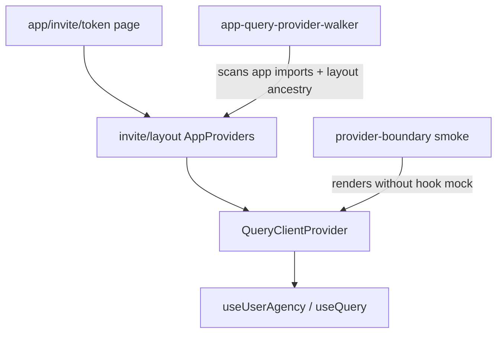

# QueryClient provider-boundary gates — Plan

## Goal Capsule

- **Objective:** Make the “No QueryClient set” invite crash structurally impossible to reintroduce: tests that exercise the real hook, plus a static ancestry check that every App Router consumer of React Query sits under `AppProviders` (or an explicit local `QueryClientProvider`).
- **Means:** One invite provider-boundary smoke (TDD) + a platform-id-walker-style static gate wired into root `test:run` + a short web AGENTS rule so page-level hook mocks cannot quietly replace the smoke.
- **Product authority:** Prevention / test infrastructure only. No invite UX change. Production fix already on `main` (`bc8ddb23` — invite layout wraps `AppProviders`).
- **Already shipped:** Invite layout `AppProviders` wrap; Sentry digest `2761025392` addressed.
- **Open blockers:** None.
- **Plan preservation:** Product Contract from session analysis of #155 + March provider split; KTDs below.

---

## Product Contract

### Summary

Close the gap that let #155 ship `useUserAgency()` on `/invite` while unit tests mocked the hook and never rendered the layout’s provider tree — by adding a smoke that fails without `AppProviders`, a static check across `apps/web/src/app`, and a documented mock rule.

### Problem Frame

After the March 2026 split, `QueryClientProvider` lives in route-level `AppProviders`, not the root layout. Authenticated / onboarding / platforms layouts wrap it; invite did not until `bc8ddb23`. Invite page tests mock `@/hooks/use-user-agency`, so React Query never runs and CI stays green while production SSR/client render throws.

### Key Decisions

- **KTD1.** Prevention scope is **App Router pages under `apps/web/src/app`**, not every component that calls `useQuery`. Components are always mounted under a page; the missing provider is a **layout ancestry** problem. (session-settled: prior recommendation)
- **KTD2.** Prefer a **dedicated smoke file** that does **not** mock `useUserAgency`, over rewriting the large `page.test.tsx` suite in the first unit. Existing suites may keep the hook mock for analytics branching; the smoke is the provider contract. (session-settled)
- **KTD3.** Static gate mirrors the platform-id walker pattern: `node --test` script, fail on new violations, allowlist only for intentional self-providers (e.g. `visual-qa` pages that construct their own `QueryClientProvider`). Wire into root `npm run test:run`. (session-settled)
- **KTD4.** Mock **one layer down** (network / `authorizedApiFetch` / Clerk auth) when a test needs controlled agency data; do not mock `useUserAgency` in the provider-boundary smoke. (session-settled)
- **KTD5.** No invite UX or analytics behavior change in this plan. (session-settled)

### Actors

- A1. Implementer executing units via `ce-work`
- A2. Agency clients opening `/invite/[token]` — unchanged once gates hold

### Requirements

- R1. A vitest smoke renders the real invite page client (or minimal page surface that calls `useUserAgency`) under `AppProviders` **without** mocking `@/hooks/use-user-agency`, and fails with a clear assertion if the provider is absent.
- R2. Removing `AppProviders` from `apps/web/src/app/invite/layout.tsx` makes the static gate and/or smoke fail (characterization of the regression).
- R3. A static scan of `apps/web/src/app/**/*.{ts,tsx}` flags files that import React Query hooks / `useUserAgency` / `@tanstack/react-query` without an ancestor `layout.tsx` that imports `AppProviders` or that file itself providing `QueryClientProvider` (allowlisted exceptions only).
- R4. Root `test:run` includes the static gate.
- R5. `apps/web` agent/docs guidance states: page-level mocks of RQ hooks require a companion provider-boundary smoke; mock fetchers, not the provider-bound hook, for layout contracts.
- R6. TDD: failing smoke / failing walker characterization before green implementation where applicable.

### Success Criteria

- Smoke red when invite layout lacks `AppProviders`; green on current `main`.
- Static gate green on current tree; intentionally deleting the invite layout wrap produces a violation naming `invite`.
- `node --test scripts/tests/…` (new file) listed in root `test:run`.
- No intentional change to invite UX or analytics payloads.

### Scope Boundaries

**In**

- Invite provider-boundary smoke
- Static App Router provider ancestry gate + `test:run` wiring
- Short AGENTS / lessons note for mock discipline
- Optional: thin characterization that layout file contains `AppProviders` (belt for R2)

**Out**

- Rewriting all invite `page.test.tsx` / `meta-pending.test.tsx` mocks (keep unless a later unit needs them for flakiness)
- Moving `QueryClientProvider` back to the root layout (product/architecture choice not in scope)
- E2E Playwright invite flow (nice follow-on; not required for the gate)
- Fixing unrelated suites that mock `@tanstack/react-query` wholesale under authenticated routes

---

## Architecture (target)

---

## Implementation Units

### U1 — Invite provider-boundary smoke (TDD)

- **Covers:** R1, R2 (partial), R6
- **Files:**
  - new `apps/web/src/app/invite/[token]/__tests__/provider-boundary.test.tsx` (name flexible)
  - may import `AppProviders` and the invite page client module
  - mocks: Clerk/`useAuthOrBypass`, `authorizedApiFetch` (or agency fetch), heavy children (`PlatformAuthWizard`) as needed — **not** `useUserAgency`
- **Approach:**
  1. Red: render page under a fragment **without** `AppProviders` → expect throw matching `/No QueryClient set/i` (or React Query’s error text).
  2. Green: same render wrapped in `AppProviders` → no throw; optional assert loading/settled agency path with mocked fetch returning `null`.
  3. Keep suite isolated so it does not depend on the global `useUserAgency` mock from `page.test.tsx` (separate file = separate vitest module graph).
- **Verification:** `npm test --workspace=apps/web -- provider-boundary` (or exact path) red→green.
- **Execution direction:** test-first.

### U2 — Static App Router query-provider ancestry gate

- **Covers:** R2, R3, R4, R6
- **Files:**
  - new `scripts/tests/app-query-provider-walker.test.mjs` (or `.ts` if repo prefers; follow platform-id walker as `node --test`)
  - update root `package.json` `test:run` to include the new script alongside `platform-id-walker.test.mjs`
- **Approach:**
  - Scan `apps/web/src/app` for `.ts`/`.tsx` excluding `__tests__`, `*.test.*`, and `app-providers.tsx`.
  - Consumer signal: import of `useUserAgency` from `@/hooks/use-user-agency`, or named imports `useQuery` / `useMutation` / `useInfiniteQuery` / `useQueries` from `@tanstack/react-query`, or any `@tanstack/react-query` import that is not type-only (keep the detector boring and over-inclusive rather than under).
  - For each consumer file, walk parent dirs until `apps/web/src/app` and look for `layout.tsx` / `layout.ts` whose source imports `AppProviders` from the app-providers module (string match on `app-providers` / `AppProviders` is enough).
  - **Self-provider escape:** file contains `QueryClientProvider` → OK (covers `visual-qa/08-…`).
  - **Allowlist:** empty by default on current green tree; if a true exception appears, ratcheted allowlist with stale-entry failure (same discipline as platform-id walker).
  - Characterization: temporarily assert invite layout is in the satisfied set; document that deleting the wrap fails the scan.
- **Verification:** `node --test scripts/tests/app-query-provider-walker.test.mjs` green; root `test:run` lists it.
- **Out:** ESLint custom rule (walker is enough for CI; ESLint can be a later optional unit).

### U3 — Docs / mock discipline

- **Covers:** R5
- **Files:**
  - `apps/web/AGENTS.md` and/or `apps/web/CLAUDE.md` (whichever is the live web agent entry — prefer the file already used for web conventions)
  - optional one-line pointer in root `CLAUDE.md` Testing section
  - optional `docs/solutions/` or SESSION-LOG note linking Sentry digest + this plan
- **Approach:** Short rule:
  - Adding React Query / `useUserAgency` under `app/**` requires an ancestor layout with `AppProviders` (or local `QueryClientProvider`).
  - Page tests must not mock `useUserAgency` / RQ hooks as a substitute for that contract; the provider-boundary smoke + walker own it.
  - Mock `authorizedApiFetch` / auth when controlling agency data.
- **Verification:** docs-only; no runtime check.

### U4 — Optional harden: layout source pin

- **Covers:** R2
- **Files:** small assertion inside U1 or U2 that `apps/web/src/app/invite/layout.tsx` source includes `AppProviders`
- **Skip** if U1+U2 already fail loudly when the wrap is removed.

---

## Sequencing and parallelism

| Order | Unit | Depends |
|-------|------|---------|
| 1 | U1 | — |
| 2 | U2 | can parallel with U1 after smoke path is clear |
| 3 | U3 | after U1/U2 so docs name real paths |
| 4 | U4 | optional |

Execute on a feature branch or `main` per Jon’s ce-work direction at start.

---

## Patterns to follow

- `scripts/tests/platform-id-walker.test.mjs` — scan + allowlist + stale check + `test:run` wiring
- `apps/web/src/app/platforms/layout.tsx` / `onboarding/layout.tsx` — `AppProviders` wrap precedent
- `apps/web/src/app/(authenticated)/access-requests/new/__tests__/page.test.tsx` — render with `QueryClientProvider` instead of mocking the agency hook away
- Production fix: `apps/web/src/app/invite/layout.tsx` (`bc8ddb23`)

## Risks

- **Smoke pulls Clerk / auth / fetch graph:** keep mocks at auth + `authorizedApiFetch`; stub wizard; avoid full invite integration.
- **Walker false positives:** type-only RQ imports, or test helpers under `app/` — exclude `__tests__` and prefer detecting value imports; allowlist only with stale checks.
- **Separate vitest files required:** a shared `vi.mock('use-user-agency')` in `page.test.tsx` must not leak into the smoke file (Vitest isolates by file when mocks are file-local — verify; if not, use a subdirectory or explicit unmock).

## Assumptions

- Current `main` already has invite `AppProviders` (`bc8ddb23`); gates start green.
- Root `test:run` remains the CI/pre-push style gate for walkers.
- Playwright invite E2E stays out of scope for this plan.

## Verification Contract

- Gate: `node --test scripts/tests/app-query-provider-walker.test.mjs` (must fail if invite layout loses `AppProviders` while the page still imports `useUserAgency`).
- Smoke: vitest provider-boundary suite green with `AppProviders`, red without.
- Named suites: existing invite `page.test.tsx` / `meta-pending.test.tsx` remain green (no required rewrite).
- Root `npm run test:run` includes the new walker (spot-check the script list).

## Sources

- Session diagnosis: March provider split + #155 `useUserAgency` on invite; tests mocked the hook
- Fix: `bc8ddb23` / Sentry digest `2761025392`
- Layout map: `invite`, `(authenticated)`, `platforms`, `onboarding`, `(partner)/partners`, `test` wrap `AppProviders`; root layout does not
