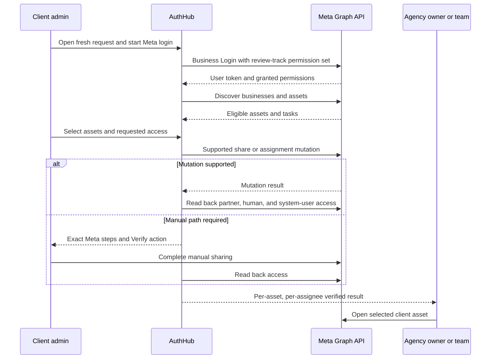
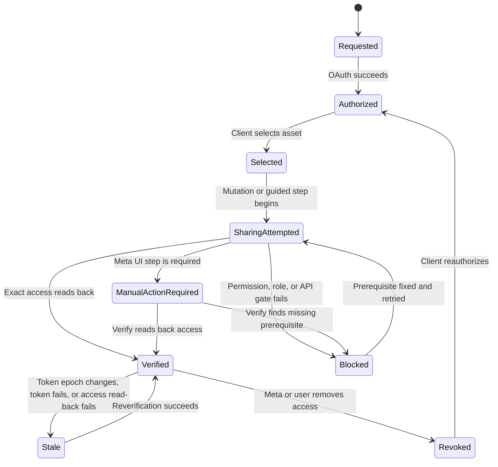

# Leadsie Meta parity and App Review - Plan

## Goal Capsule

- **Objective:** An agency owner sends one AuthHub request, a client admin grants access to selected Meta business assets, AuthHub verifies the resulting agency access, and the same flow works for ordinary production users after Meta approves the required permissions.
- **Means:** Deliver review-ready Meta core first, then close remaining Leadsie capability gaps through incremental permission reviews and production releases (KTD1).
- **Authority:** Current Meta App Dashboard and successful Graph API v25.0 receipts outrank public help, old plans, code comments, and older API examples. Current Leadsie behavior defines parity scope but does not define which Meta permissions AuthHub may request.
- **Stop conditions:** Do not request a permission without a real product operation and visible proof. Do not claim automatic sharing without a successful mutation and read-back verification. Do not record or submit while a clean-session flow fails, spins, uses mock data, or depends on pre-existing access.
- **Execution profile:** Deep, security-sensitive, external-API work. Add characterization tests before changing existing grant and completion behavior.
- **Finish and ship:** `ce-work` owns implementation and verification. Each Meta submission occurs only after its review package passes the clean-session gate. Final completion requires post-approval non-role production acceptance and every required parity review cycle.

---

## Product Contract

### Summary

AuthHub will match Leadsie's current Meta capability set without copying unsupported behavior. The product will separate OAuth authorization, asset selection, access sharing, human and system-user assignment, and verified fulfillment. Meta approval and a working non-role production flow are both required.

### Problem Frame

AuthHub can authenticate a client and discover several Meta assets, but it cannot yet prove the complete agency access lifecycle. The active automatic grant path depends on an invalid or unverified `managed_businesses` operation. Ad-account verification can miss partner-shared accounts. Selection can be mistaken for fulfillment. Current review notes, token behavior, and product behavior also disagree.

The pre-review test gap is not solved by waiting for approval. Meta App Dashboard currently shows `Jon High` as the only Administrator and shows `0` testers. The Facebook account behind `client-test-account` must be that administrator or an accepted app-role user, and it must control the client test assets. The email address alone is not the identity Meta authorizes.

### Actors

- A1. **Agency owner:** Configures the agency Business Portfolio, chooses access and assignees, sends requests, and verifies usable access.
- A2. **Agency team member:** Receives human access to selected client assets when the request asks for it.
- A3. **Agency system user:** Receives machine access for approved server-side operations.
- A4. **Client admin:** Controls the client Business Portfolio and completes OAuth, selection, automatic actions, and guided Meta steps.
- A5. **Meta reviewer:** Replays the production flow and checks each requested permission against visible behavior.
- A6. **AuthHub:** Stores authorization securely, orchestrates supported operations, verifies Meta state, and reports the next action truthfully.

### Key Decisions

- **Full Leadsie Meta parity is the program goal.** The first submission is a review-ready core release, not a claim of full parity. Governs R1-R18.
- **Keep `pages_read_engagement` only for a useful Page validation operation.** (session-settled: user-directed — chosen over removing the permission: the Meta flow requires Page validation beyond listing assets.) Governs R6, R15-R16.
- **Exclude Business Asset User Profile Access.** It concerns people who engage with business assets, not agency staff or system users. Governs R3, R11.
- **Manual work can be parity.** Leadsie uses semi-manual ad-account sharing and guided advanced sharing for direct Instagram and full Pixel/Dataset access. Governs R7-R10.
- **No review-only product behavior.** Reviewer proof must use the same production UI, Graph operations, and state model used by clients. Governs R4-R18.

### Requirements

**Identity and pre-review testing**

- R1. The Facebook account associated with `client-test-account` must complete the real Meta flow before approval using an accepted app role and real test assets it administers.
- R2. A separate agency-owner identity must verify access without relying on access that existed before the test.
- R3. The test setup must record app role, business role, asset role, 2FA state, Business Login configuration, Graph user ID, and granted permission state without storing credentials in the repository.

**Core authorization and sharing**

- R4. OAuth success must create an authorization record but must not complete a Requested Product or Access Request.
- R5. The client must see and select exact Business Portfolios, Pages, ad accounts, and connected Instagram assets with stable names and IDs.
- R6. `pages_show_list` and `pages_read_engagement` must have separate operations and separate reviewer proof.
- R7. AuthHub must automate only Meta operations proven on v25.0 and must provide a verifiable guided flow for unsupported operations.
- R8. The agency Business Portfolio, selected human assignee, and selected system user must have separate access results.

**Leadsie parity**

- R9. AuthHub must support Leadsie-equivalent access for Business Portfolios, Pages, connected Instagram accounts, ad accounts, catalogs, Pixels/Datasets, and Leads Access.
- R10. AuthHub must support automatic Business Portfolio, ad-account, and catalog creation; guided Page and Pixel/Dataset creation; and rediscovery after creation.
- R11. AuthHub must support full-control or selected Page tasks, selected team assignees, selected system users, and advanced manual sharing for direct Instagram and full Pixel/Dataset access.
- R12. Reset and offboarding must revoke grants and remove primary and derived credentials. Reauthorization must replace credentials, preserve grant history and relationships that still read back, and mark token-dependent checks stale. Expiry or Meta-side revocation must invalidate only affected credentials, checks, and grants.

**Truthful fulfillment and security**

- R13. Each selected asset and assignee must move through explicit `selected`, `sharing_attempted`, `verified`, `manual_action_required`, `blocked`, `stale`, and `revoked` outcomes.
- R14. An Access Request may become complete only when every requested capability is verified or the agency owner records an explicit audited exclusion; an exclusion is never labeled verified.
- R15. Tokens must remain server-side, use Infisical references, avoid browser or recording exposure, and follow policy text that matches actual retention and deletion behavior.

**Review and production**

- R16. Each requested Meta permission must map to one production operation, one visible result, one successful test receipt, and one screencast timestamp.
- R17. Reviewer instructions must start from a fresh reachable request and end with the agency-side verified result.
- R18. Production acceptance is not complete until a non-app-role client can complete the same production flow and the agency owner can use the granted access in Meta.

### Key Flows

- F1. **Pre-review role test**
  - **Trigger:** AuthHub needs to test permissions that do not yet have Advanced Access.
  - **Actors:** A1, A4, A6
  - **Steps:** Verify the client Facebook identity and app role; verify client asset control and 2FA; run Business Login; inspect granted scopes; perform and read back each core operation.
  - **Outcome:** The complete core flow works before approval without using pre-existing agency access.
  - **Covered by:** R1-R8, R13-R16
- F2. **Client access request**
  - **Trigger:** A1 sends a Meta request to A4.
  - **Actors:** A1-A4, A6
  - **Steps:** Authorize; discover; select; share or guide; assign; verify; show agency result.
  - **Outcome:** Every requested asset has a truthful per-assignee result and next action.
  - **Covered by:** R4-R15
- F3. **Creation recovery**
  - **Trigger:** A4 lacks a required Meta asset.
  - **Actors:** A4, A6
  - **Steps:** Create or open Meta's creation UI; return; rediscover; select; share; verify.
  - **Outcome:** Creation alone never counts as access fulfillment.
  - **Covered by:** R9-R14
- F4. **Meta review and public launch**
  - **Trigger:** Core or parity capability set passes production verification.
  - **Actors:** A1, A4-A6
  - **Steps:** Record permission-specific evidence; upload; submit; respond to review; verify a non-role user after approval.
  - **Outcome:** Approved permissions and production behavior match.
  - **Covered by:** R16-R18

### Acceptance Examples

- AE1. Covers R4, R13-R14. Given OAuth succeeds and no grant is verified, when the client returns to AuthHub, then the request remains pending or partial.
- AE2. Covers R7-R8, R13. Given a system-user assignment succeeds but human assignment does not, when AuthHub verifies the asset, then only system-user access is verified.
- AE3. Covers R7, R13-R14. Given Meta rejects an automatic partner operation, when the grant runs, then the asset becomes blocked or manual-action-required and no verified timestamp exists.
- AE4. Covers R7, R13-R14. Given the client manually shares one of two ad accounts, when AuthHub verifies access, then one account is verified and the other remains unresolved.
- AE5. Covers R10, R13-R14. Given AuthHub creates an ad account, when creation succeeds, then the account must be rediscovered, selected, shared, and verified before fulfillment.
- AE6. Covers R11, R13. Given the agency requests selected Page tasks, when Meta returns fewer tasks, then AuthHub reports the missing tasks and does not silently downgrade access.
- AE7. Covers R12, R15. Given the client reauthorizes, when a new token is stored, then prior selections and grant history remain while token-dependent checks become stale.
- AE8. Covers R16-R18. Given a reviewer or approved public user opens a fresh request, when they follow the written steps, then they see login, consent, asset identity, access action, read-back verification, and the agency-side result.

### Success Criteria

- The role-held client account can execute every core permission operation before review.
- Meta approves the core permission set with no contradiction between scope, code, notes, and recordings.
- A non-role client completes the production core flow after approval.
- Every row in the Leadsie parity matrix reaches implemented, production-verified, and review-approved status where Meta review is required.
- AuthHub never reports complete when any requested asset or assignee is selected, attempted, blocked, stale, or manual-action-required.

### Scope Boundaries

**In scope**

- Core and parity Meta OAuth, asset discovery, creation recovery, sharing, assignment, verification, token lifecycle, reviewer evidence, and production release.
- Incremental Meta reviews after core approval when a parity capability requires a new permission.

**Outside this product's identity**

- Access to personal Facebook profiles or passwords.
- Business Asset User Profile Access unless AuthHub later builds a distinct product use case for people who engage with business assets.
- Fabricated assets, mocked Graph responses, or hidden reviewer-only routes as approval evidence.

### Sources

- Live Meta submission: https://developers.facebook.com/apps/1215220247221414/app-review/submissions/?submission_id=1424442432965860&business_id=3808519629379919
- Live Meta app roles: https://developers.facebook.com/apps/1215220247221414/roles/roles/?business_id=3808519629379919
- Leadsie capability list: https://help.leadsie.com/article/20-what-can-i-get-access-to-with-leadsie
- Leadsie asset creation: https://help.leadsie.com/article/64-how-to-create-facebook-meta-assets
- Leadsie advanced sharing: https://help.leadsie.com/article/32-how-to-get-full-pixel-asset-access
- Leadsie Page access: https://help.leadsie.com/article/54-about-facebook-page-access
- Leadsie team and system-user assignment: https://help.leadsie.com/article/57-auto-assign-facebook-assets
- Leadsie connection recovery: https://help.leadsie.com/article/34-overview-of-connection-errors
- Official Meta Facebook API collection: https://www.postman.com/meta/facebook/documentation/r56bjfd/facebook-api
- Official Meta Marketing API collection: https://www.postman.com/meta/facebook-marketing-api/documentation/0zr4mes/facebook-marketing-api-mapi
- Prior recording plan: `plans/2026-09-21-meta-review-recording-and-production-acceptance.md`

---

## Planning Contract

**Product Contract preservation:** Changed. Prior core-review scope is expanded to the user's full Leadsie Meta parity goal. Existing U1-U6 IDs remain attached to their original concepts; new work uses U7-U10.

### Current Verified Baseline

| Area | Current evidence | Consequence |
|---|---|---|
| Meta app roles | `Jon High` is Administrator; tester count is `0` | Verify whether `client-test-account` maps to this Facebook account; otherwise add and accept a role before testing. |
| Review draft | Verification and app settings are complete; Allowed Usage, Data Handling, and Reviewer Instructions are incomplete | Submission package is not ready. |
| Marketing API tier | 500-call and 85% success requirements show complete | Do not generate more calls solely to satisfy this gate. |
| Permission test calls | Current core permission call counters show complete | Counters do not replace product proof or screencasts. |
| OAuth scopes | AuthHub requests `ads_management`, `ads_read`, `business_management`, `pages_read_engagement`, and `pages_show_list` in duplicated definitions | U1 must establish one contract and test whether `ads_read` has a unique required operation. |
| Leadsie OAuth observation | A live Leadsie authorization URL exposed `email`, `business_management`, `ads_management`, `pages_show_list`, `pages_manage_metadata`, `pages_read_engagement`, `catalog_management`, and `instagram_basic` | Treat this as observed competitor evidence, not permission authority. |
| Automatic grant | Active Page flow calls `/grant-meta-access`; backend depends on `/{partnerBusinessId}/managed_businesses` | Automatic sharing remains blocked until a supported v25.0 mutation is proved. |
| Ad accounts | Client discovery includes owned and client accounts; manual verification uses an owned-only helper | Partner-shared accounts can be reported as unresolved. |
| Page proof | Backend obtains a Page token and reads `/feed` | This proves Page data access, not agency access; replace decorative feed proof with useful Page validation if v25.0 permits it. |
| Token lifecycle | Long-lived user token is stored in Infisical; review copy says it is discarded; deletion is best effort | Code, policies, and reviewer notes must use one truthful retention model. |

### Leadsie Parity Matrix

| Capability | Leadsie behavior | AuthHub current state | Target |
|---|---|---|---|
| Business Portfolio sharing | Automatic partner sharing | Blocked by unverified OBO edge | Supported mutation and read-back verification, or guided fallback |
| Business Portfolio creation | Automatic | Service and client UI exist | Production-verify, rediscover, select, and grant |
| Facebook Pages | Automatic partner sharing | Selection and Page-only grant attempt exist | Verified partner, human, and system-user outcomes |
| Page creation | Guided Meta UI | Guided links exist | Return detection, rediscovery, and selection |
| Page access levels | Full control or selected tasks | Fixed task set | Least-privilege defaults and request-specific tasks |
| Instagram | Automatic through linked Page; direct full access is guided | Discovery exists; grant proof absent | Verify indirect access; add advanced manual direct sharing |
| Ad accounts | Semi-manual sharing | Manual instructions exist | Correct client-account verification and human access proof |
| Ad-account creation | Automatic | Service and UI exist | Production-verify and close the creation-to-grant loop |
| Catalogs | Automatic sharing and creation | Backend list/create exists; client flow incomplete | Select, create, share, verify, and review `catalog_management` |
| Pixels/Datasets | Indirect through ad account; full access guided | Missing end-user flow | Discover; verify indirect link; guide direct full access and creation |
| Leads Access | Automatic through Page permissions | Missing | Assign and verify the Page Leads task; request `leads_retrieval` only if AuthHub reads lead data |
| Team/system users | Auto-assign selected people and system users | System-user service exists; no human/team flow | Select assignees and verify each assignment separately |
| Reset/reauthorization | Disconnect, reset, reconnect, regrant | Token lifecycle exists but history can drift | Authorization epochs, preserved history, stale checks, and clean recovery |

### Key Technical Decisions

- KTD1. **Use staged review, not one oversized resubmission.** Core approval covers only production-ready permissions; parity permissions enter incremental reviews after their complete product flows exist. This lowers rejection risk without shrinking R9-R11.
- KTD2. **Make one permission-to-operation contract authoritative.** Shared types own the permission set; web OAuth, API state, connector registry, tests, App Dashboard, and reviewer notes consume or verify the same contract.
- KTD3. **Model partner, human, and system-user access separately.** A successful system-user assignment never proves an agency partnership or human Ads Manager access.
- KTD4. **Extend the existing durable grant models for per-asset fulfillment.** `MetaAgencyDestination` and `MetaAssetGrant` store recipient type and ID, requested tasks, authorization epoch, verification, attempts, next actor, and final state instead of one coarse request status.
- KTD5. **Use role-held real accounts for pre-review proof.** Facebook user ID, accepted app role, client asset role, agency identity, and absence of pre-existing access are explicit fixture checks.
- KTD6. **Use `pages_read_engagement` for useful Page validation.** Prefer Page identity, managed task, connected Instagram, or another useful validation field over a general feed viewer.
- KTD7. **Manual fallback is a first-class path.** When Meta does not support an automatic mutation, AuthHub provides exact steps and a Verify action; it never labels instructions as automation.
- KTD8. **Reauthorization creates a new authorization epoch.** Preserve grant history, mark token-dependent checks stale, and merge current selection metadata instead of replacing it.

### High-Level Technical Design

### Assumptions

- Meta developer documentation returned HTTP 429 during research. Live App Dashboard rules and successful v25.0 receipts are required before implementation treats any mutation as supported.
- The user can access two permitted Facebook identities: one client test admin tied to `client-test-account` and one agency owner. If the Gmail maps to current `Jon High` administrator, only asset-role and clean-separation checks remain; otherwise the account must receive and accept an app role.
- Core review retains current Page and Marketing API use cases. Parity capabilities may require later review tracks and additional Business Login configurations.
- Meta approval timing and outcome are external. This plan controls evidence quality and production correctness, not Meta's decision.

### Risks and Mitigations

| Risk | Mitigation |
|---|---|
| Old Graph edges appear in code and older official examples | Require v25.0 live mutation and read-back receipts before shipping; remove invalid paths instead of adding fallbacks. |
| App-role testing hides public-user failures | Use role accounts before approval, then require a non-role production test after approval. |
| Pre-existing agency access creates false success | Record a clean baseline and verify no partner, human, or system-user assignment exists before each proof run. |
| Broad permission request causes another rejection | Stage reviews and block any permission without a complete product operation and video. |
| Long-lived or Page token leaks | Keep tokens in Infisical or process memory, redact Graph requests, and audit recordings before upload. |
| Invite bearer token reaches logs or telemetry | Redact client-route tokens and OAuth credentials at the logger boundary; prove redaction with captured-log tests. |
| Browser retry duplicates a Meta asset | Persist one idempotency result per request and creation intent before each creation mutation. |
| Manual Meta UI changes | Keep manual instructions versioned, include a Verify action, and treat stale instructions as a support issue rather than verified access. |
| Reauthorization erases grant history | Use authorization epochs and merge metadata; cover the transition with integration tests. |
| Disconnect leaves derived tokens or grants active | Revoke provider grants and derived tokens before deleting every primary and derived Infisical secret; preserve failed-cleanup state. |
| Dirty worktree obscures ownership | Implement by U-ID, stage only unit-owned paths, and inspect every diff before commit. |

### Sequencing

1. U1 and U2 establish the permission contract and pre-review fixture.
2. U3, U4, U9, U8, and U10 make core behavior truthful and reviewable.
3. U5 and U6 produce and submit the core review package, then verify public production access.
4. U7 runs as independent permission-aligned parity tracks that extend U8 and U9, then feed each completed track through U5 and U6.

---

## Implementation Units

### Unit Index

| Unit | Title | Primary files | Depends on |
|---|---|---|---|
| U1 | Capability and permission contract | shared Meta types; OAuth scopes; connector registry | None |
| U2 | Pre-review identities and client flow | verification script; OAuth flow; client wizard | U1 |
| U3 | Supported sharing and verification | OBO, partner, connector, asset routes | U1, U2 |
| U4 | Useful Page validation proof | client asset service and Page proof UI | U1, U2 |
| U7 | Permission-aligned asset and creation parity tracks | selector, creation routes, connector | U1-U4, U8-U9 |
| U8 | Human and system-user assignment | agency Meta settings and assignment services | U3, U9 |
| U9 | Truthful fulfillment lifecycle | Prisma grant models, status types, completion evaluator | U3, U4 |
| U10 | Token epochs, reset, and revocation | finalize, token lifecycle, policies | U1, U9 |
| U5 | Review evidence and screencasts | review evidence documents and production UI | U2-U4, U8-U10 |
| U6 | Submission and production acceptance | review package and deployment receipts | U5; U7 for parity tracks |

### U1. Establish the capability and permission contract

- **Goal:** Define one review-track-specific contract from capability to permission, token class, Graph operation, UI result, and verification read.
- **Requirements:** R3, R5-R7, R9-R11, R16
- **Dependencies:** None
- **Files:**
  - `packages/shared/src/types.ts`
  - `packages/shared/src/__tests__/types.test.ts`
  - `apps/api/src/lib/meta-constants.ts`
  - `apps/api/src/lib/__tests__/meta-constants.test.ts`
  - `apps/web/src/lib/meta-business-login.ts`
  - `apps/web/src/lib/__tests__/client-invite-oauth.test.ts`
  - `apps/api/src/routes/client-auth/oauth-state.routes.ts`
  - `apps/api/src/services/connectors/registry.config.ts`
  - `apps/api/src/services/connectors/__tests__/registry.config.test.ts`
  - `apps/api/src/services/connectors/__tests__/meta.connector.test.ts`
- **Approach:** Set the shared server and web Graph version authority to v25.0 before operation testing. Validate each proposed read and mutation with a role-held test user and disposable asset. Record endpoint, token class, required permission, asset role, sanitized result, read-back result, and one recipient-side functional acceptance operation. Make shared types authoritative and remove duplicated scope lists. Remove permissions without a unique operation. Add parity permissions only when their flows are ready.
- **Patterns to follow:** Shared connector configuration and schema validation used for Requested Products.
- **Test scenarios:**
  - Core OAuth produces exactly the core permission set in web and API state.
  - A parity track adds only its approved additional permissions.
  - A permission missing from the shared contract fails validation before OAuth starts.
  - A permission is retained only after two fresh tokens for the same user, asset, role, endpoint, and otherwise identical scope set prove that the operation fails without the target permission and succeeds with it; `/me/permissions` confirms both scope sets.
  - Business Asset User Profile Access never appears in OAuth, registry, or review-track data.
- **Verification:** Code, App Dashboard configuration, live token permissions, Graph receipts, reviewer matrix, and recipient-side functional proof contain the same permission set and Graph version.

### U2. Prove pre-review identities and repair the production client flow

- **Goal:** Make `client-test-account` a reproducible client-test identity and make a fresh production invite complete the core UI flow.
- **Requirements:** R1-R5, R15-R17
- **Dependencies:** U1
- **Files:**
  - `scripts/verify-meta-config.ts`
  - `apps/web/src/lib/meta-business-login.ts`
  - `apps/web/src/components/client-auth/PlatformAuthWizard.tsx`
  - `apps/web/src/components/client-auth/MetaAssetSelector.tsx`
  - `apps/web/src/components/client-auth/__tests__/PlatformAuthWizard.test.tsx`
  - `apps/web/src/components/client-auth/__tests__/MetaAssetSelector.test.tsx`
  - `apps/api/src/routes/client-auth/meta-finalize.routes.ts`
  - `apps/api/src/routes/client-auth/oauth-exchange.routes.ts`
  - `apps/api/src/routes/client-auth/__tests__/oauth-exchange.routes.test.ts`
- **Approach:** Resolve the Gmail's Facebook user ID and accepted app role. Confirm full control of client test assets, 2FA, and no agency-side access. Confirm a separate agency owner, Business Login configuration, redirect URIs, and deployed app ID. Remove any popup path that returns a Meta access token to browser JavaScript. Use the backend authorization-code callback for redirect and popup presentation, and store equivalent granted-scope and token-debug evidence server-side. Surface permission failures instead of empty asset lists. Redact invite and OAuth bearer values from request logs and error telemetry.
- **Execution note:** Start with clean-session runtime proof, then add focused regression tests for each observed blocker.
- **Patterns to follow:** `scripts/verify-meta-config.ts`; OAuth state and finalize route tests.
- **Test scenarios:**
  - Accepted app-role client completes core OAuth before Advanced Access.
  - Non-role account receives the expected pre-approval denial instead of a false product error.
  - Role account without client asset control sees an actionable role error.
  - Missing 2FA blocks ad-account sharing with a specific next action.
  - Popup and redirect presentation use the same backend code exchange and persist the same granted-scope and token-debug evidence without exposing a Meta token to browser JavaScript.
  - Popup timeout, declined permission, expired request, and callback mismatch end in visible recoverable states.
  - Captured logs from OAuth, asset, creation, grant, and completion routes contain no raw invite or OAuth token.
- **Verification:** A sanitized fixture receipt records two Facebook user IDs, app roles, business roles, asset roles, absence of pre-existing access, deployed release, and successful core OAuth.

### U3. Replace the blocked grant path with supported sharing and verification

- **Goal:** Prove or remove every automatic grant operation and verify agency access through Meta read-back.
- **Requirements:** R7-R8, R13-R14, R18
- **Dependencies:** U1, U2
- **Files:**
  - `apps/api/src/services/meta-obo.service.ts`
  - `apps/api/src/services/meta-partner.service.ts`
  - `apps/api/src/services/meta-assets.service.ts`
  - `apps/api/src/services/connectors/meta.ts`
  - `apps/api/src/routes/client-auth/assets.routes.ts`
  - `apps/api/src/services/client-assets.service.ts`
  - `apps/api/src/services/__tests__/meta-obo.service.test.ts`
  - `apps/api/src/services/__tests__/meta-partner.service.test.ts`
  - `apps/api/src/routes/client-auth/__tests__/assets.meta.test.ts`
  - `apps/api/src/services/__tests__/client-assets.service.test.ts`
- **Approach:** Remove the invalid `managed_businesses` dependency after identifying the supported v25.0 mechanism. Split system-user assignment from partner access. Keep ad-account sharing manual unless a supported automatic partner mutation passes live proof. Verify owned and client ad accounts through correct surfaces. Make retries idempotent and preserve successful outcomes during transient failures.
- **Execution note:** Add characterization coverage around blocked and false-negative paths before changing Graph operations.
- **Patterns to follow:** Per-asset results and audit events in `assets.routes.ts`; merged owned and client account discovery in `client-assets.service.ts`.
- **Test scenarios:**
  - Unsupported automatic partner mutation returns manual-action-required, not success.
  - Successful Page assignment reads back exact recipient ID and requested tasks.
  - Partner-shared ad account appears through `client_ad_accounts` and verifies.
  - Retry after timeout creates one effective Meta assignment and one final verified outcome.
  - Partial batch success preserves successful assets and names failed assets.
  - System-user assignment cannot satisfy partner-business or human-access checks.
- **Verification:** Each automatic capability has a v25.0 mutation, assignment read-back, and recipient-side usability receipt; every other capability has a tested guided path and recorded Meta UI usability proof when no safe API check exists.

### U4. Replace decorative Page feed proof with useful Page validation

- **Goal:** Use `pages_read_engagement` for a useful Page validation result that Meta reviewers can see.
- **Requirements:** R6, R15-R16
- **Dependencies:** U1, U2
- **Files:**
  - `apps/api/src/services/client-assets.service.ts`
  - `apps/api/src/routes/client-auth/assets.routes.ts`
  - `apps/api/src/routes/client-auth/__tests__/assets.meta.test.ts`
  - `apps/web/src/components/client-auth/MetaPageEngagementProof.tsx`
  - `apps/web/src/components/client-auth/__tests__/MetaPageEngagementProof.test.tsx`
  - `packages/shared/src/types.ts`
- **Approach:** Test Page identity, managed tasks, connected Instagram, and minimal content or engagement fields with a Page token. Choose the smallest useful result that independently requires `pages_read_engagement`. Render validation for each selected Page. Add `appsecret_proof` only if live production settings require it. Keep Page tokens out of responses, logs, audit metadata, and recordings.
- **Patterns to follow:** Existing Page-token exchange and explicit denial states.
- **Test scenarios:**
  - Each selected Page renders its own validated identity and result.
  - Missing `pages_read_engagement` shows a specific denied state.
  - Expired user token and invalid Page token prompt reauthorization.
  - Empty useful result remains successful without invented content.
  - App Secret Proof enabled path succeeds without leaking the proof.
- **Verification:** A fresh production call visibly proves the retained permission and remains useful outside App Review.

### U7. Close permission-aligned asset-family and creation parity gaps

- **Goal:** Add production flows for catalogs, Pixels/Datasets, Leads Access, Instagram access, and closed-loop asset creation.
- **Requirements:** R9-R13
- **Dependencies:** U1-U4, U8-U9
- **Files:**
  - `apps/api/src/services/connectors/meta.ts`
  - `apps/api/src/services/client-assets.service.ts`
  - `apps/api/src/services/meta-asset-creation.service.ts`
  - `apps/api/src/routes/client-auth/asset-creation.routes.ts`
  - `apps/api/src/routes/client-auth/__tests__/asset-creation.routes.test.ts`
  - `apps/api/src/services/__tests__/meta-asset-creation.service.test.ts`
  - `apps/web/src/components/client-auth/MetaAssetSelector.tsx`
  - `apps/web/src/components/client-auth/MetaAssetCreator.tsx`
  - `apps/web/src/components/client-auth/MetaBusinessCreator.tsx`
  - `apps/web/src/components/client-auth/__tests__/MetaAssetSelector.business-creation.test.tsx`
  - `packages/shared/src/types.ts`
- **Approach:** Execute catalogs, Pixels/Datasets, Leads Access, Instagram, and creation recovery as independently shippable review tracks; one blocked Graph operation must not delay an unrelated ready track. Extend discovery and selection by asset family. Finish catalog selection, creation, sharing, and verification before requesting `catalog_management`. Model linked Instagram and indirect Pixel/Dataset access separately from advanced direct sharing. Represent Leads Access as a Page task; request `leads_retrieval` only if AuthHub reads lead data. Before each creation mutation, persist an idempotency record bound to the access request, authorization, parent asset, and creation intent; replay returns the stored result. After creation, rediscover ownership, require selection, and run normal sharing and verification.
- **Patterns to follow:** Existing Business Portfolio and ad-account creation services; guided links for Page and Pixel creation.
- **Test scenarios:**
  - Catalog discovery, selection, creation, and sharing preserve catalog identity.
  - Linked Instagram verifies through the selected Page or ad account without claiming direct access.
  - Advanced Instagram and Pixel/Dataset paths remain manual until Verify reads back direct access.
  - Leads task verifies independently from general Page management tasks.
  - Created asset cannot satisfy a request until rediscovered, selected, shared, and verified.
  - Concurrent duplicate creation requests produce one external asset and one stored result.
  - Keyboard and screen-reader users can complete each asset-family selector; touch targets are at least 44px; mobile layout remains single-column without horizontal scrolling.
- **Verification:** Every Leadsie parity row has a production flow, explicit automation level, read-back proof, and review-track decision.

### U8. Add agency human and system-user assignment

- **Goal:** Let the agency choose people and system users, then verify each recipient separately.
- **Requirements:** R8, R11, R13-R14
- **Dependencies:** U3, U9
- **Files:**
  - `apps/api/src/services/meta-system-user.service.ts`
  - `apps/api/src/services/meta-assets.service.ts`
  - `apps/api/src/services/meta-partner.service.ts`
  - `apps/api/src/services/__tests__/meta-system-user.service.test.ts`
  - `apps/api/src/services/__tests__/meta-assets.service.test.ts`
  - `apps/web/src/components/meta-unified-settings.tsx`
  - `apps/web/src/components/meta-business-portfolio-selector.tsx`
  - `apps/web/src/components/agency-meta/AgencyMetaAssetSelector.tsx`
  - `apps/web/src/components/__tests__/meta-unified-settings.test.tsx`
  - `packages/shared/src/types.ts`
- **Approach:** Store selected agency assignees by Meta user or system-user ID. Default to one chosen human and one configured system user; never assign the whole agency implicitly. The agency owner chooses Page tasks when creating the request. Derive a least-privilege default from requested products, allow an explicit Full control override, and show the selected tasks to the client before grant execution. Read back each recipient and task set. Keep human Ads Manager proof separate from server API proof.
- **Patterns to follow:** Existing agency Meta portfolio selection and system-user provisioning.
- **Test scenarios:**
  - Human selected and system user omitted requires only human verification.
  - System user verified and human missing leaves request partial.
  - Recipient ID from another agency is rejected before Meta mutation.
  - Meta returns a subset of requested tasks and assignment remains blocked.
  - Agency owner opens selected ad account or Page after human verification.
  - Assignee and task controls are keyboard-complete, expose names and selected states to assistive technology, and retain logical focus after Meta return.
- **Verification:** Production receipts identify partner business, recipient type, recipient ID, exact tasks, and agency-side usability without exposing tokens.

### U9. Make fulfillment and completion truthful

- **Goal:** Replace OAuth- and selection-based completion with durable per-asset, per-assignee verified fulfillment.
- **Requirements:** R4, R8-R14
- **Dependencies:** U3, U4
- **Files:**
  - `apps/api/prisma/schema.prisma`
  - `packages/shared/src/types.ts`
  - `packages/shared/src/__tests__/types.test.ts`
  - `apps/api/src/services/access-request.service.ts`
  - `apps/api/src/services/__tests__/access-request.service.test.ts`
  - `apps/api/src/routes/access-requests.ts`
  - `apps/api/src/routes/client-auth/completion.routes.ts`
  - `apps/api/src/routes/client-auth/__tests__/completion.routes.test.ts`
  - `apps/web/src/components/client-auth/PlatformAuthWizard.tsx`
  - `apps/web/src/components/client-auth/__tests__/PlatformAuthWizard.test.tsx`
- **Approach:** Extend `MetaAssetGrant` with recipient type, recipient ID, and verified authorization epoch; include recipient identity in its idempotency key and backfill existing rows as destination-business recipients before enforcing the new key. Make the fulfillment evaluator the single completion authority. A grant becomes stale only after an authorization epoch change, token expiry or revocation, failed provider read-back, or known access removal; do not add time-based age-out without a measured requirement. Present one staged flow: select Business Portfolio, select assets grouped by family, set access and assignees, review, then show per-asset and per-assignee results. For each state, show the label, explanation, responsible actor, primary action, disabled behavior, and valid next transition. Put exclusions only on an authenticated agency route: require request ownership, reason, and confirmation; reject client-token, non-owner, and cross-agency attempts; show Excluded with actor and timestamp without labeling it verified.
- **Execution note:** Write integration tests for the completion gate before changing evaluator or wizard advancement.
- **Patterns to follow:** `CONCEPTS.md` definitions of Authorization Progress and Truthful Status.
- **Test scenarios:**
  - Covers AE1. OAuth without verified assets cannot complete.
  - Selection without grant cannot complete.
  - One verified asset and one unresolved asset produces partial status.
  - System-user success does not satisfy missing human assignment.
  - Audited exclusion removes only the named requirement and remains visible.
  - Client invite holders, non-owners, and members of another agency cannot record exclusions.
  - Revoked or stale access reopens the Requested Product.
  - Concurrent retry and late success produce one final state.
  - Mixed results identify the next actor and action for every unresolved asset and assignee.
  - Verification-state changes are announced to assistive technology and restore focus to the affected result.
- **Verification:** API, client wizard, and agency dashboard derive status from the same grant records.

### U10. Align token epochs, reset, revocation, and policy

- **Goal:** Preserve access history while accurately handling token replacement, expiry, reset, provider revocation, and offboarding.
- **Requirements:** R12, R15
- **Dependencies:** U1, U9
- **Files:**
  - `apps/api/src/routes/client-auth/meta-finalize.routes.ts`
  - `apps/api/src/routes/client-auth/oauth-exchange.routes.ts`
  - `apps/api/prisma/schema.prisma`
  - `apps/api/src/services/token-lifecycle.service.ts`
  - `apps/api/src/services/connection.service.ts`
  - `apps/api/src/services/agency-platform.service.ts`
  - `apps/api/src/lib/infisical.ts`
  - `apps/api/src/lib/__tests__/infisical.test.ts`
  - `apps/api/src/routes/client-auth/__tests__/oauth-exchange.routes.test.ts`
  - `apps/api/src/services/__tests__/connection.service.test.ts`
  - `apps/api/src/services/__tests__/agency-platform.service.test.ts`
  - `apps/web/src/app/(marketing)/privacy-policy/page.tsx`
  - `apps/web/src/app/(marketing)/terms/page.tsx`
- **Approach:** Add a monotonic authorization epoch to `PlatformAuthorization` and persist the verified epoch on each Meta grant. Merge Meta metadata on reauthorization, increment the epoch, and mark earlier token-dependent checks stale in one transaction. Revoke provider grants and derived tokens before deleting every primary and derived secret. Preserve a failed-cleanup state when any step fails. Align privacy, terms, reviewer notes, and implementation.
- **Patterns to follow:** Existing Infisical token references and provider token lifecycle checks.
- **Test scenarios:**
  - Reauthorization preserves prior selection and audit history.
  - New token invalidates old token-dependent checks but not relationships that still read back.
  - Meta-side revocation blocks mutations and prompts reauthorization.
  - Disconnect removes primary and derived tokens and verifies provider-side access removal.
  - Secret deletion failure remains retryable and auditable.
- **Verification:** Reset and offboarding tests pass in a clean fixture, and no claim says tokens are discarded when retained.

### U5. Produce permission-specific review evidence

- **Goal:** Create short, reproducible production screencasts and reviewer instructions for each review track.
- **Requirements:** R3, R16-R18
- **Dependencies:** U2-U4, U8-U10; U7 for each parity track
- **Files:**
  - `docs/app-review/meta/permission-matrix.md`
  - `docs/app-review/meta/reviewer-instructions.md`
  - `docs/app-review/meta/production-acceptance.md`
  - `plans/2026-09-21-meta-review-recording-and-production-acceptance.md`
- **Approach:** Use one fresh request and clean browser state per permission video. Show product entry, Meta login and consent, exact asset identity, permission-specific operation, visible result, and agency-side verification. Caption server-side operations and token class without exposing credentials. Audit every frame for sensitive or unrelated data.
- **Test expectation:** No automated product test is added by this unit because it creates review evidence; clean-session replay and two-person review verify it.
- **Verification:** A reviewer with no session context can follow the instructions from a fresh URL and match each permission to one timestamped visible result.

### U6. Submit, deploy, and prove production acceptance

- **Goal:** Obtain core approval, verify public production access, then repeat the review cycle for parity tracks until the matrix is complete.
- **Requirements:** R9-R18
- **Dependencies:** U5; U7 before each parity review track
- **Files:**
  - `scripts/verify-meta-config.ts`
  - `render.yaml`
  - `docs/app-review/meta/production-acceptance.md`
- **Approach:** Complete Allowed Usage, Data Handling, reviewer instructions, agreements, and video uploads for the exact track. Run the Green Gate and production diagnostic against the deployment commit. Replay reviewer steps from a clean session. Submit after the package passes. Capture submission ID and requested items. After approval, run the same flow with a non-app-role client.
- **Test scenarios:**
  - Production uses intended app ID, Graph version, callback, Business Login configuration, and secret references.
  - Reviewer URL remains valid and repeatable for the review window.
  - Approved non-role client receives the same assets and results as the role-held fixture.
  - Permission denial, partial consent, and revoked access remain truthful in production.
  - Rollback removes the new review track without damaging approved core behavior.
- **Verification:** Meta approval is recorded for required permissions, and the final non-role production acceptance run passes every parity matrix row.

---

## Verification Contract

### Automated Gates

| Gate | Command | Proves |
|---|---|---|
| API Meta focus | `npm run test:run --workspace=apps/api -- src/routes/client-auth/__tests__/assets.meta.test.ts src/routes/client-auth/__tests__/asset-creation.routes.test.ts src/routes/client-auth/__tests__/completion.routes.test.ts src/services/__tests__/client-assets.service.test.ts src/services/__tests__/meta-obo.service.test.ts src/services/__tests__/meta-partner.service.test.ts src/services/__tests__/meta-system-user.service.test.ts` | Discovery, creation, grant, assignment, completion, and verification |
| Web Meta focus | `npm run test:run --workspace=apps/web -- src/components/client-auth/__tests__/PlatformAuthWizard.test.tsx src/components/client-auth/__tests__/AutomaticPagesGrant.test.tsx src/components/client-auth/__tests__/AdAccountSharingInstructions.test.tsx src/components/client-auth/__tests__/MetaAssetSelector.test.tsx src/components/client-auth/__tests__/MetaPageEngagementProof.test.tsx` | Client flow, selection, Page proof, manual and automatic states |
| Shared contract | `npm run test --workspace=packages/shared` | Permission and fulfillment schemas |
| Green Gate | `npm run typecheck && npm run build && npm run test` | Clean checkout type, build, and test health |
| Diff hygiene | `git diff --check` | No whitespace or conflict-marker damage |

### Live Graph Gates

- Test only disposable or authorized assets.
- Record Graph version, endpoint, method, token class, app role, business role, asset role, requested tasks, sanitized response, and read-back result.
- Prove `/me/accounts` Page discovery and selected Page-token usage.
- Prove or reject each proposed partner, human, system-user, catalog, Pixel/Dataset, Instagram, Leads, and creation mutation on v25.0.
- Repeat required calls with Require App Secret Proof enabled before deciding whether `appsecret_proof` is needed.
- Verify both owned and client/partner ad-account surfaces.

### Clean-Session Gates

- `client-test-account`-linked Facebook identity completes pre-review core flow as an accepted role user.
- Separate agency owner begins with no access and ends with exact requested access.
- Fresh invite loads without `Loading request`, `Loading clients`, indefinite spinner, stale callback, or expired-link failure.
- Every selected asset retains the same ID and name through selection, grant, verification, and completion.
- Reset, reauthorization, denial, partial consent, and revocation produce explicit recoverable states.
- After approval, a non-role client passes the same production flow.

### Review Package Gates

- One operation and visible result per requested permission.
- One permission-specific video with a timestamp per requested item; Meta-accepted evidence attachments may supplement but not replace the video.
- English UI, readable captions, server-side operation explanation, exact reviewer path, and working role or credential setup.
- No claim that OAuth, call counts, Page data access, or system-user assignment alone proves agency access.
- App Dashboard permission set, Business Login configuration, code, policy, notes, and videos match.

---

## Definition of Done

- U1 proves one authoritative permission-to-operation contract for every review track.
- U2 proves the `client-test-account` Facebook identity can complete pre-review testing and a fresh production invite works.
- U3 contains no unsupported `managed_businesses` fallback and verifies every automatic or manual core grant.
- U4 gives `pages_read_engagement` a useful production operation and visible result.
- U7 implements every Leadsie asset-family and creation-recovery row.
- U8 verifies selected human and system-user assignments separately.
- U9 prevents OAuth, selection, partial success, and manual instructions from completing a request.
- U10 preserves grant history and aligns reset, offboarding, token retention, policies, and reviewer claims.
- U5 produces clean, reproducible, permission-specific reviewer evidence.
- U6 records Meta approval for required permissions and a successful non-role production acceptance run.
- Every Leadsie parity matrix row is implemented, production-verified, and approved where Meta requires review.
- No token, credential, or unnecessary client identifier appears in logs, repository evidence, or recordings.
- All automated, live Graph, clean-session, and review-package gates pass against the deployment commit.
- Unsupported, duplicate, abandoned, and review-only code from failed approaches is removed before completion.
